# Ingreso con MFA, Google y GitHub

## Cómo entra un agente y dónde actúa cada control de seguridad

OAuth 2.0 + PKCE · TOTP · sesiones opacas · FastAPI + React

---
layout: blocked
bloque: "1 · Conceptos"
idea: "Primero vemos el recorrido completo; después explicamos cada palabra y cada control."
---

# Cómo entra un agente a Lead Router

1. **La cuenta ya existe.** Un asesor o administrador registra al agente dentro de su organización.
2. **El agente demuestra quién es.** Puede usar su contraseña de Lead Router o una cuenta de Google o GitHub vinculada.
3. **El sistema busca al mismo agente.** Google y GitHub sirven para reconocer una cuenta existente; no crean usuarios nuevos.
4. **MFA agrega una comprobación cuando está activo.** El agente introduce el código de su aplicación autenticadora.
5. **La aplicación abre la sesión.** Sólo después de completar las comprobaciones permite entrar a las pantallas protegidas.

Las siguientes diapositivas explican qué sucede dentro de cada paso y por qué se guardan ciertos datos de seguridad.

---
layout: blocked
bloque: "1 · Conceptos"
idea: "Google o GitHub comprueban quién es el usuario; nuestra aplicación nunca recibe la contraseña de esas cuentas."
---

# Qué ocurre al continuar con Google o GitHub

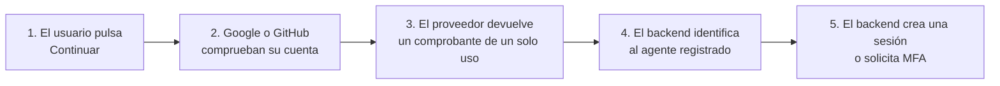

OAuth permite que otro servicio confirme la identidad. El proveedor devuelve correo, identificador y nombre después de validar al usuario. La contraseña de Google o GitHub no pasa por Lead Router.

---
layout: blocked
bloque: "1 · Conceptos"
idea: "Tres comprobaciones impiden aceptar una respuesta iniciada por otra persona o robada durante el recorrido."
---

# Las tres protecciones del recorrido OAuth

1. **`code`, el comprobante:** Google o GitHub lo entrega una sola vez. El backend lo canjea por los datos de identidad y después deja de servir.
2. **`state`, el número de seguimiento:** el backend lo crea antes de salir hacia el proveedor. Cuando el navegador regresa, debe traer el mismo valor. Así sabemos que la respuesta pertenece al login iniciado aquí.
3. **PKCE, la segunda mitad de la prueba:** el backend guarda un valor secreto temporal. Aunque alguien obtenga el `code`, no puede canjearlo sin esa segunda parte.

Estos nombres aparecen en el código porque forman parte del estándar OAuth. Los tres valores duran sólo lo necesario para completar el regreso desde el proveedor.

---
layout: blocked
bloque: "1 · Conceptos"
idea: "El teléfono y el backend calculan el mismo número a partir de un secreto compartido y el intervalo actual."
---

# Cómo funciona el código de Google Authenticator

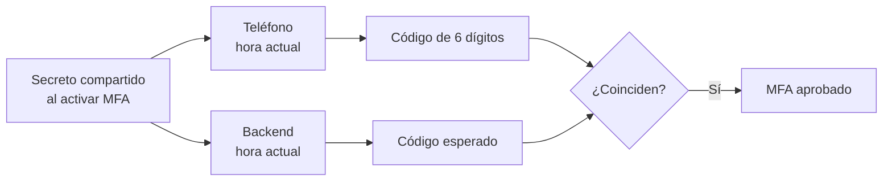

- El código cambia cada 30 segundos. El backend acepta también el intervalo anterior o siguiente para tolerar una pequeña diferencia de tiempo.
- `last_used_step` impide volver a usar un código ya aceptado. Los ocho códigos de recuperación también funcionan una sola vez.
- PostgreSQL guarda el secreto TOTP cifrado porque el backend necesita recuperarlo para repetir el cálculo.

---
layout: blocked
bloque: "1 · Conceptos"
idea: "Después del login, el navegador presenta un boleto aleatorio en cada petición; el backend decide si sigue vigente."
---

# La sesión después de autenticar

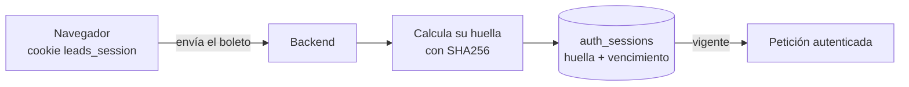

- El boleto contiene 32 bytes generados al azar. Hay tantas combinaciones posibles que adivinar uno activo resulta impracticable.
- El navegador recibe el boleto original. PostgreSQL guarda una **huella SHA256**, un resultado de una sola dirección que permite buscarlo sin almacenar una copia utilizable.
- El texto usa letras, números, `-` y `_` para viajar sin problemas dentro de una cookie. A esa representación se le llama **Base64 segura para URL**.

---
layout: blocked
bloque: "1 · Conceptos"
idea: "Un challenge guarda el estado de un login que empezó pero todavía no terminó."
---

# Dónde se guarda un challenge

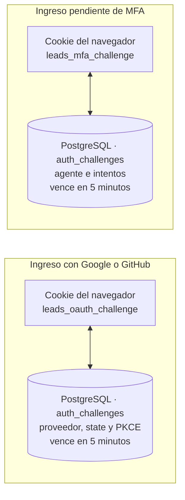

La cookie identifica el intento desde el navegador. La fila de PostgreSQL contiene los datos que el backend necesita para continuarlo. Si no coinciden, vencieron o ya se consumieron, el backend rechaza la operación. Al completar el proceso, el challenge se consume y recién entonces puede nacer la sesión.

---
layout: blocked
bloque: "1 · Conceptos"
idea: "Los atributos de una cookie indican al navegador cuándo enviarla y quién puede leerla."
---

# Qué significan las opciones de la cookie

- **`HttpOnly`:** JavaScript del frontend no puede leer la cookie. El navegador sí la envía automáticamente al backend.
- **`SameSite=Lax`:** permite el regreso normal desde Google o GitHub, pero evita que muchas peticiones iniciadas desde otros sitios incluyan la cookie.
- **`Secure`:** en producción, el navegador sólo envía la cookie por HTTPS. En el entorno local se desactiva porque usamos HTTP.
- **`Path`:** limita la cookie a una ruta. La sesión sirve para toda la API, mientras que los challenges OAuth y MFA sólo viajan a sus endpoints.

Estas opciones protegen el transporte en el navegador. El backend todavía comprueba la fila, el vencimiento y el consumo en PostgreSQL.

---
layout: blocked
bloque: "1 · Conceptos"
idea: "Hash y cifrado resuelven problemas distintos; bcrypt añade defensas específicas para contraseñas."
---

# Hash, cifrado, salt y factor de trabajo

- **Hash:** crea una huella de una sola dirección. Sirve para comprobar un dato sin guardar el original. Lo usamos con contraseñas, tokens de sesión y códigos de recuperación.
- **Cifrado:** permite recuperar el dato usando una clave. Lo usamos para el secreto TOTP porque el backend debe volver a calcular los códigos.
- **Salt:** bcrypt añade un valor aleatorio distinto a cada contraseña antes de calcular el hash. Dos personas con la misma contraseña terminan con hashes diferentes. El salt no es secreto y queda incluido en el hash.
- **Factor de trabajo:** bcrypt repite cálculos para que cada intento cueste tiempo. Esto frena la prueba masiva de contraseñas robadas. El número puede aumentarse cuando el hardware se vuelve más rápido.

PostgreSQL guarda `hashed_password`, nunca la contraseña original. La verificación vuelve a ejecutar bcrypt con el salt y el factor de trabajo incluidos en ese mismo hash.

---
layout: blocked
bloque: "1 · Conceptos"
idea: "Cada tabla responde una pregunta concreta sobre la cuenta, el acceso actual o una verificación temporal."
---

# Qué información de seguridad guarda la base

- **`agents` — quién puede entrar:** correo, organización, rol y estado de la cuenta. También conserva el hash de la contraseña, nunca la contraseña que escribió el usuario.
- **`social_identities` — qué cuentas externas están conectadas:** registra el identificador de Google o GitHub asociado al agente. Permite reconocer la misma cuenta en futuros ingresos.
- **`auth_sessions` — quién ya terminó el login:** registra sesiones vigentes, su fecha de vencimiento y si fueron cerradas. Guarda la huella del boleto del navegador.
- **`auth_challenges` — qué login sigue pendiente:** conserva durante cinco minutos lo necesario para completar el regreso de Google o GitHub, o la validación MFA. También cuenta intentos y evita reutilizar el proceso.
- **`agent_mfa` y `mfa_recovery_codes` — cómo se valida el segundo factor:** guardan el secreto TOTP cifrado, el último intervalo usado y las huellas de los códigos de recuperación.

Todas estas filas se relacionan con el mismo agente. Separarlas permite vencer, consumir o revocar cada mecanismo sin alterar los demás datos de la cuenta.

---
layout: blocked
bloque: "1 · Conceptos"
idea: "La base conserva sólo lo necesario para autenticar, revocar y auditar; no guarda contraseñas ni tokens OAuth reutilizables."
---

# Modelo de datos de identidad y seguridad

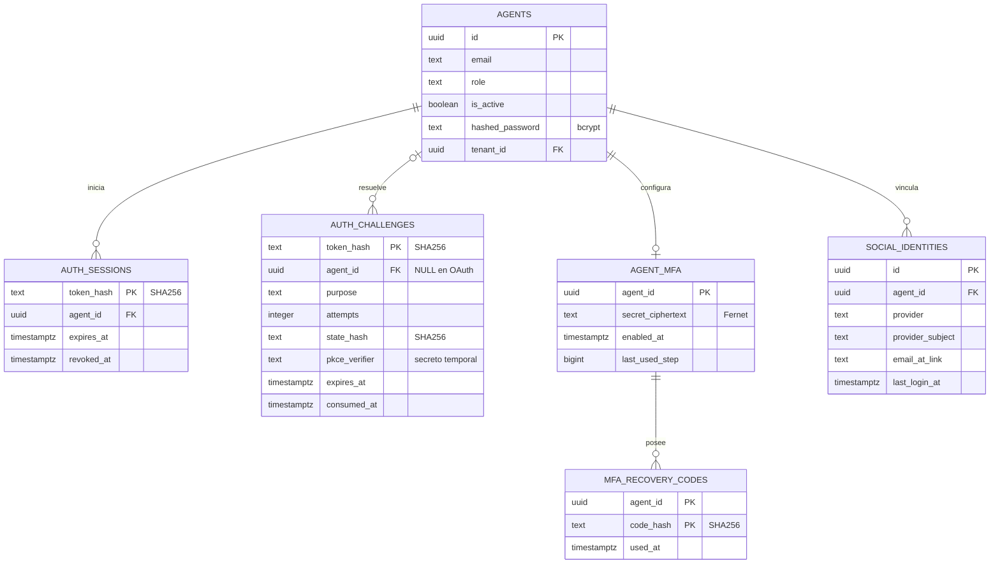

---
layout: blocked
bloque: "2 · Arquitectura"
idea: "Las decisiones están en application; FastAPI, PostgreSQL, bcrypt, Fernet y los proveedores son adaptadores reemplazables."
---

# Seguridad dentro de la arquitectura hexagonal

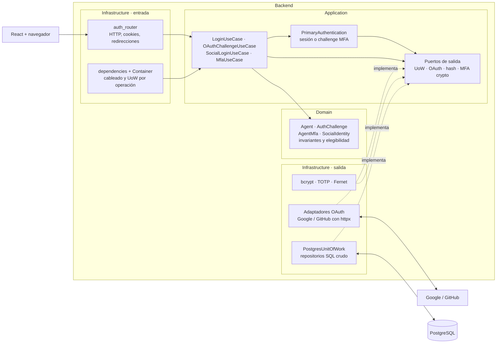

Las flechas sólidas muestran llamadas en ejecución. Las punteadas muestran adaptadores que implementan puertos definidos hacia dentro.

---
layout: blocked
bloque: "3 · OAuth"
idea: "Google y GitHub cumplen la misma función, aunque cada uno entrega la identidad mediante endpoints diferentes."
---

# Google frente a GitHub

| | Google | GitHub |
|---|---|---|
| Pantalla de acceso | Cuentas de Google | Autorización de GitHub |
| Permisos solicitados | Correo y perfil | Perfil y correos asociados |
| Identificador estable | `sub` | `id` |
| Correo aceptado | Correo marcado como verificado | Correo principal marcado como verificado |
| Nombre visible | `name` | `name` o `login` |

Los dos proveedores regresan a Lead Router después de validar al usuario. Desde ese punto comparten la misma lógica para encontrar al agente, solicitar MFA y crear la sesión.

---
layout: blocked
bloque: "3 · Google"
idea: "El nonce une la cookie con la fila; state valida el callback y PKCE protege el canje del código."
---

# Secuencia Google: inicio y autorización

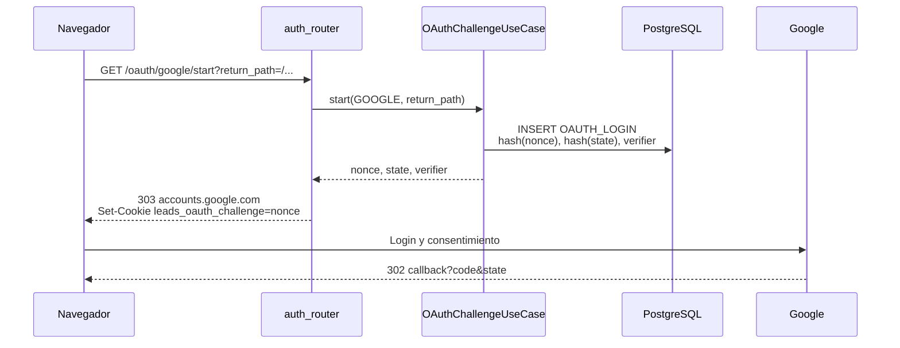

---
layout: blocked
bloque: "3 · Google"
idea: "Google entrega subject y correo en userinfo; el adaptador exige email_verified=true."
---

# Secuencia Google: callback e identidad

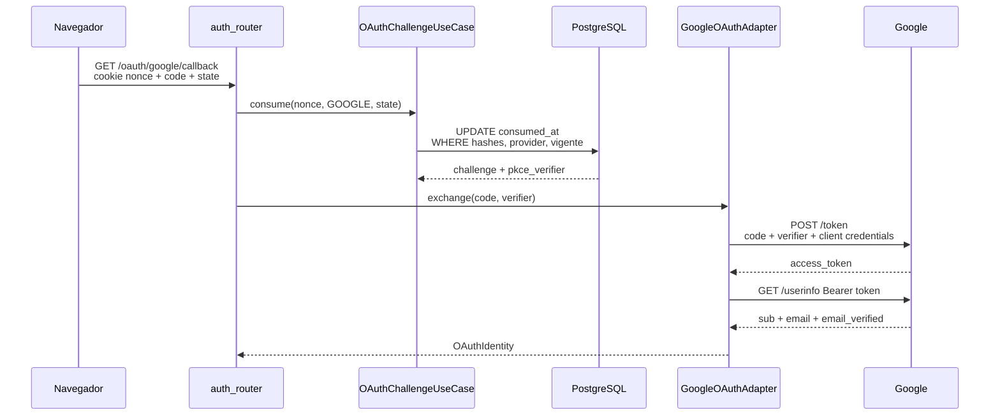

---
layout: blocked
bloque: "3 · GitHub"
idea: "El scope user:email permite consultar correos aunque el perfil público no muestre ninguno."
---

# Secuencia GitHub: inicio y autorización

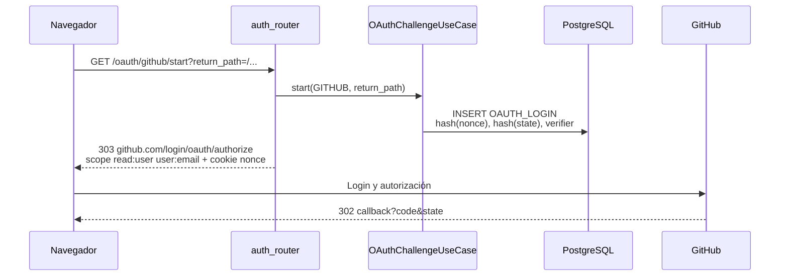

---
layout: blocked
bloque: "3 · GitHub"
idea: "Sin correo primario verificado, el adaptador falla y el navegador vuelve al login."
---

# Secuencia GitHub: callback e identidad

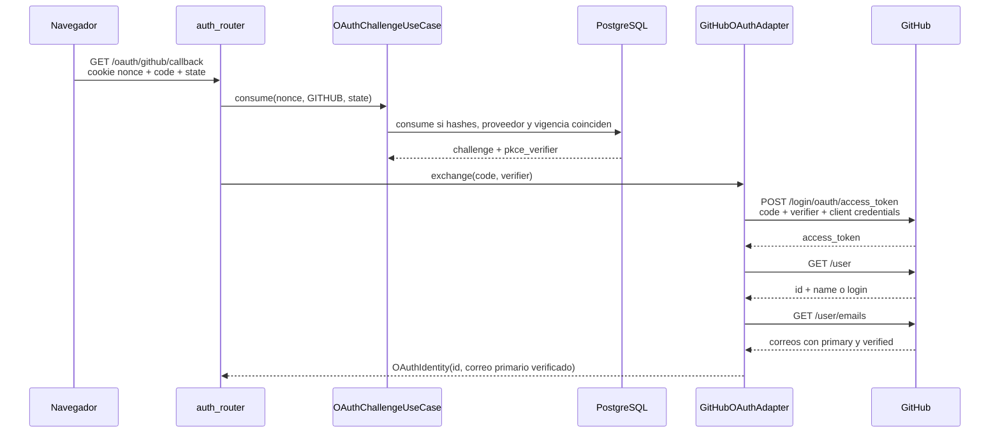

---
layout: blocked
bloque: "3 · OAuth"
idea: "OAuth no crea agentes: enlaza un proveedor sólo cuando encuentra un agente elegible por correo verificado."
---

# Secuencia común: resolución y enlace

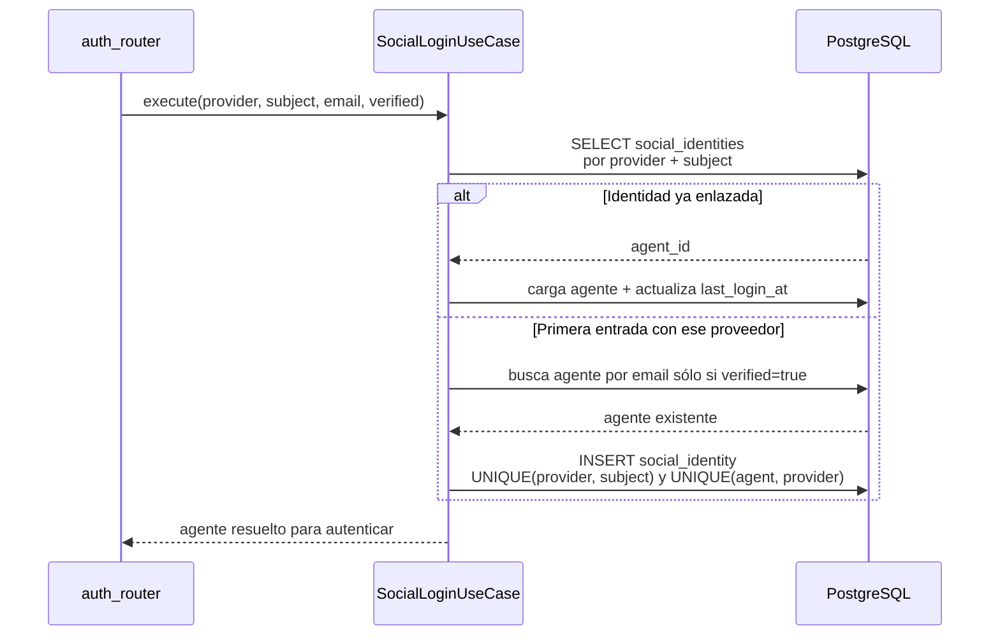

---
layout: blocked
bloque: "3 · OAuth"
idea: "El mismo PrimaryAuthentication atiende contraseña, Google y GitHub y limpia las cookies incompatibles con la rama elegida."
---

# Secuencia común: sesión o challenge MFA

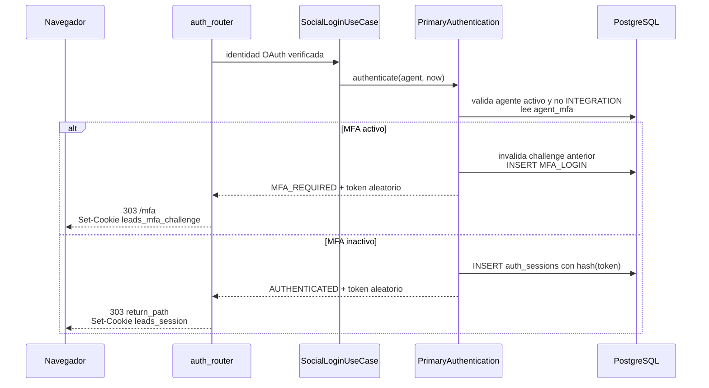

---
layout: blocked
bloque: "4 · MFA"
idea: "Activar MFA vincula la cuenta con la aplicación autenticadora y entrega un respaldo para emergencias."
---

# Activación de MFA

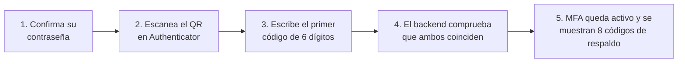

- El QR y la clave manual representan el mismo secreto. El usuario elige uno de los dos métodos para cargarlo en el teléfono.
- El backend guarda el secreto cifrado. Los códigos de respaldo aparecen una sola vez y la base conserva únicamente sus huellas.

---
layout: blocked
bloque: "4 · MFA"
idea: "La sesión nace sólo después de validar el segundo factor."
---

# Ingreso con MFA

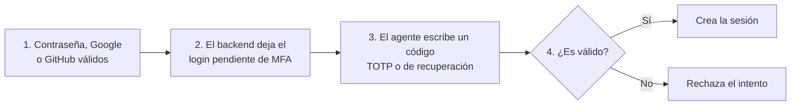

- Durante el paso 2, el navegador conserva una cookie temporal que identifica ese login pendiente. Todavía no existe una sesión.
- El backend registra cada intento antes de revisar el código. El proceso vence a los cinco minutos o después de cinco intentos.
- Si el código es válido, el backend consume el proceso pendiente y crea la sesión en una sola operación.

---
layout: blocked
bloque: "5 · Interfaz"
idea: "La interfaz separa proveedor configurado de identidad enlazada; no ofrece un botón de conexión que el backend no soporta."
---

# Estado de seguridad visible para el agente

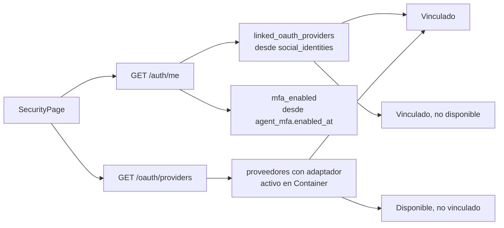

- La pantalla informa por separado MFA, Google y GitHub.
- No existe un endpoint de conexión explícita ligado a la sesión. El enlace ocurre durante un login OAuth cuando el proveedor entrega el mismo correo verificado del agente.
- Tampoco existe hoy un endpoint para cambiar la contraseña, por lo que la pantalla no simula esa operación.

---
layout: blocked
bloque: "5 · Interfaz"
idea: "El frontend controla navegación y estado visual; cada permiso y cada sesión se vuelven a validar en el backend."
---

# Controles de autenticación en el frontend

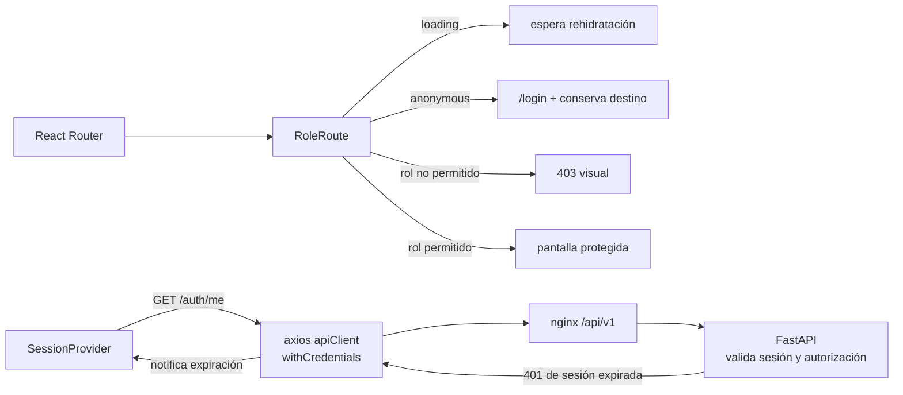

- `SessionProvider` mantiene `loading`, `authenticated` o `anonymous`; la identidad y el rol sólo llegan desde `/auth/me`.
- `RoleRoute` evita mostrar rutas incompatibles con el estado conocido, pero no sustituye la autorización del backend.
- `apiClient` deja que el navegador adjunte cookies HttpOnly. No almacena tokens ni agrega cabeceras `Authorization`.
- El interceptor convierte un 401 de sesión expirada en logout local; no cierra sesión por 403, `/auth/me` ni errores de formulario MFA.

---
layout: blocked
bloque: "5 · Interfaz"
idea: "Las librerías resuelven protocolos y criptografía; los casos de uso conservan las decisiones del negocio."
---

# Librerías que sostienen el flujo de seguridad

| Responsabilidad | Backend | Frontend |
|---|---|---|
| HTTP, cookies y dependencias | **FastAPI** y respuestas de Starlette | **axios** con `withCredentials` |
| Sesión y navegación | `secrets`, `hashlib`, dependencias FastAPI | **React**, `SessionProvider` y **React Router** |
| OAuth 2.0 | **httpx**; `secrets`, `hashlib`, `hmac`, `urllib` | Navegación completa del navegador al endpoint `start` |
| Contraseñas | **Passlib** con **bcrypt** | `<input type="password" autocomplete="current-password">` |
| TOTP y secreto | **PyOTP** y **cryptography/Fernet** | **qrcode.react** y `autocomplete="one-time-code"` |
| Persistencia | **psycopg** + `psycopg-pool`, SQL parametrizado | Contratos TypeScript generados con **openapi-typescript** |
| Pruebas del flujo | **pytest** con dobles y PostgreSQL real | **Vitest** + Testing Library |

`Container` instancia los adaptadores concretos. Los casos de uso dependen de puertos, no de estas librerías, y por eso las pruebas unitarias pueden reemplazarlas con dobles pequeños.

---
layout: blocked
bloque: "5 · API"
idea: "La API separa descubrimiento, primer factor, callback OAuth, segundo factor y gestión del enrolamiento."
---

# API completa de identidad y seguridad

| Tipo | Endpoint | Qué hace |
|---|---|---|
| Sesión | `POST /api/v1/auth/login` | Verifica correo y contraseña; crea sesión o challenge MFA |
| Sesión | `GET /api/v1/auth/me` | Devuelve identidad, rol, organización, estado MFA y proveedores vinculados |
| Sesión | `POST /api/v1/auth/logout` | Revoca la sesión y elimina cookies de sesión y MFA |
| OAuth | `GET /api/v1/auth/oauth/providers` | Lista Google y GitHub habilitados por configuración |
| OAuth | `GET /api/v1/auth/oauth/{provider}/start` | Crea challenge con `state` y PKCE; redirige al proveedor |
| OAuth | `GET /api/v1/auth/oauth/{provider}/callback` | Consume challenge, canjea `code`, enlaza identidad y continúa a sesión o MFA |
| MFA login | `POST /api/v1/auth/mfa/verify` | Valida TOTP o recuperación; consume challenge y crea sesión |
| MFA cuenta | `POST /api/v1/auth/mfa/setup` | Verifica contraseña y crea un secreto pendiente |
| MFA cuenta | `POST /api/v1/auth/mfa/setup/confirm` | Activa TOTP y entrega ocho códigos de recuperación |
| MFA cuenta | `POST /api/v1/auth/mfa/recovery-codes/regenerate` | Exige contraseña y factor; reemplaza todos los códigos |
| MFA cuenta | `POST /api/v1/auth/mfa/disable` | Exige contraseña y factor; elimina MFA y revoca otras sesiones |

`/setup`, `/setup/confirm`, `/recovery-codes/regenerate`, `/disable` y `/me` requieren `leads_session`. `/verify` requiere `leads_mfa_challenge`; `start` y `callback` usan `leads_oauth_challenge`.
