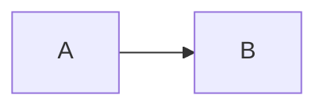

# Presentación · integración de eventos

Segunda sesión sobre Lead Router, centrada en la **integración de RabbitMQ y Kafka**. Construida con
[Slidev](https://sli.dev), mismo patrón que [`.slides/`](../.slides/README.md).

```bash
cd .slides-events
npm install        # sólo la primera vez
npm run dev        # http://localhost:3030 — recarga en caliente
npm run build      # genera dist/ (estático)
npm run export     # PDF, requiere playwright-chromium
```

Durante la exposición: `→` avanza, `←` retrocede, `o` abre la vista general, `p` alterna el modo
presentador y `f` la pantalla completa.

## Qué la diferencia de la primera

La primera presentación explica **qué decide el sistema sobre un lead** y cómo está construido por
dentro: arquitectura hexagonal, capas, puertos, adaptadores.

Ésta da eso por sabido. Dedica **dos diapositivas** a refrescar el problema y la arquitectura, y a
partir de ahí el problema es otro: **una vez decidido, cómo sale el lead del sistema y llega a quien
lo compró, sin perderse por el camino**. Ni una diapositiva sobre arquitectura limpia ni sobre los
conceptos de la primera sesión.

## Estructura

| Fichero | Qué contiene |
|---|---|
| `slides.md` | Las diapositivas. Único fichero de contenido |
| `layouts/blocked.vue` | Plantilla común: cabecera con bloque y contador, cuerpo, pie con la idea clave |
| `layouts/portada.vue` | Variante para la primera diapositiva |
| `style.css` | Tipografía, tablas, código y encaje de los diagramas |

Cada diapositiva declara su bloque y su idea clave en el frontmatter:

```markdown
---
layout: blocked
bloque: "2 · El problema"
idea: "Frase de cierre que aparece en el pie."
---
```

Los valores de `bloque` e `idea` **van entre comillas**: sin ellas, un texto con dos puntos se
interpreta como YAML anidado y no se muestra.

## Diagramas

Bloques Mermaid en línea, con la escala en la propia declaración:

````markdown

````

Mermaid renderiza dentro de un *shadow root*, así que el CSS externo no puede redimensionar el
resultado: si un diagrama no cabe, se ajusta su `scale` o se aplana su estructura.

## De dónde sale el contenido

De la documentación del proyecto, que es la fuente:

- [`docs/content/eventos/`](../docs/content/eventos/index.md) — la sección completa
- ADR [0023](../docs/content/decisiones/0023-eventos-del-canal-de-salida.md) ·
  [0024](../docs/content/decisiones/0024-el-contrato-de-salida-se-construye-una-vez.md) ·
  [0025](../docs/content/decisiones/0025-outbox-transaccional.md) ·
  [0026](../docs/content/decisiones/0026-kafka-como-canal-del-producto.md) ·
  [0027](../docs/content/decisiones/0027-cola-para-el-trabajo-de-fondo.md)
