# Integración de eventos

## De decidir sobre un lead a entregarlo

Cuando el problema deja de ser el dominio y pasa a ser el transporte.

Outbox transaccional · Apache Kafka · RabbitMQ

---
layout: blocked
bloque: "1 · Dónde estábamos"
idea: "Todo esto ya funciona. La sesión empieza donde termina esta diapositiva."
---

# Lo que el sistema ya hacía

Un **lead** entra, y el sistema toma tres decisiones independientes sobre él.

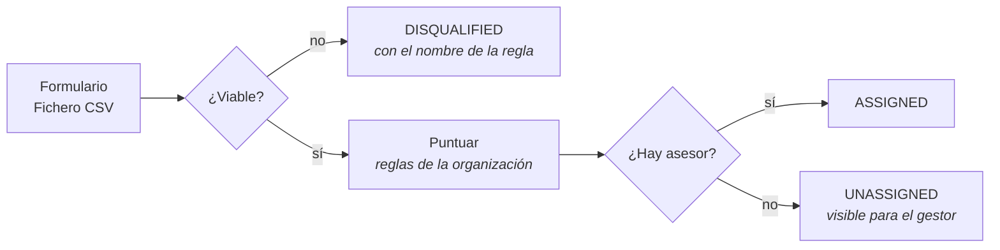

<div class="destacado">
<span class="destacado-tag">Damos por sabido</span>
Cada organización define sus reglas y el sistema guarda <strong>por qué</strong>
decidió lo que decidió. La arquitectura hexagonal, los puertos y los cuatro
tests que la verifican son la <strong>primera</strong> sesión.
</div>

---
layout: blocked
bloque: "1 · Dónde estábamos"
idea: "El lead queda decidido, guardado y explicado. Ahí terminaba el sistema."
---

# La arquitectura, en una diapositiva

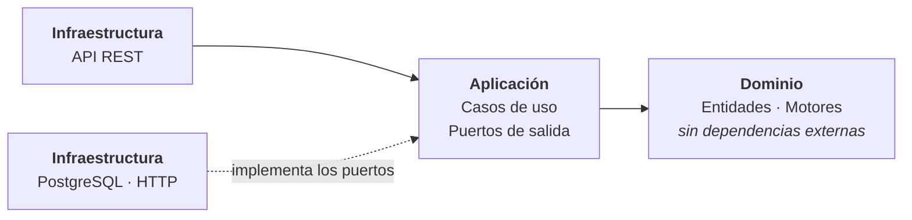

Las dependencias apuntan **hacia dentro**: el dominio no conoce a nadie.

<div class="destacado">
<span class="destacado-tag">El límite</span>
El recorrido de un lead termina con <strong>una fila guardada y un estado</strong>.
Eso basta mientras el único consumidor sea nuestra propia interfaz.
</div>

---
layout: blocked
bloque: "2 · El problema cambia"
idea: "El cliente no compra una aplicación: compra los leads ya filtrados dentro de su propio sistema."
---

# Lo que el cliente pidió de verdad

> «Que **nosotros** resolvamos y guardemos las reglas, y luego **ellos** tengan
> todos los leads procesados que pasaron el procesamiento y no son basura.
>
> Y si en algún punto necesitan los elementos, que puedan **reobtenerlos**.»

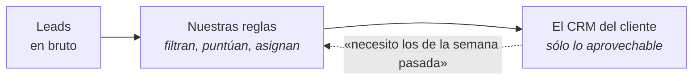

Esa última frase —**reobtenerlos**— parece un detalle. Es el requisito que
decide toda la arquitectura de esta sesión.

---
layout: blocked
bloque: "2 · El problema cambia"
idea: "Ninguna se arregla escribiendo mejor la lógica del lead. Todas son de transporte."
---

# Cinco preguntas que el sistema no sabía responder

| Pregunta | Quién la hace | Qué pasaba |
|---|---|---|
| ¿Cómo recibo los leads que pasaron el filtro? | El sistema del cliente | Un webhook con **cuatro campos**, o llamarnos a la API |
| Perdí mensajes tres días, ¿cómo los recupero? | El sistema del cliente | **No se podía** |
| Si vuestro proceso muere justo después de guardar, ¿me entero? | El sistema del cliente | **No** |
| ¿Por qué me mandáis leads que vuestras reglas descartaron? | El sistema del cliente | Se publicaban **todos** por el mismo canal |
| Un fichero de 10.000 leads y el contenedor se reinicia | El operador | El trabajo quedaba a medias, **sin que nadie lo retomara** |

<div class="destacado">
<span class="destacado-tag">El giro</span>
El problema ya no es <strong>decidir sobre un lead</strong>. Es <strong>qué se
publica, a dónde, con qué garantías y quién lo procesa</strong>.
</div>

---
layout: blocked
bloque: "3 · Los defectos"
idea: "El filtro que el cliente paga quedaba de su lado, y encima le facturábamos el tráfico."
---

# Defecto 1 · Le mandábamos la basura que acabábamos de filtrar

`LeadProcessedEvent` se publicaba para **todo** lead que la validación no
hubiera rechazado — incluidos los que una regla de viabilidad acababa de
descalificar.

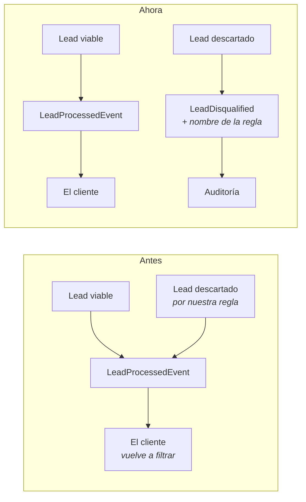

Dos hechos distintos, no uno ambiguo. **Lo que pasó el filtro es el producto;
lo que una regla descartó es una traza.**

---
layout: blocked
bloque: "3 · Los defectos"
idea: "Un evento que obliga a preguntar quién es el lead no ha entregado nada."
---

# Defecto 2 · El evento no decía quién era el lead

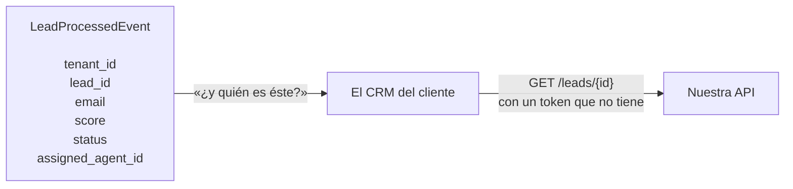

Seis campos: un identificador y poco más. Quien lo recibe **está fuera de este
sistema** y no tiene una llamada que hacer para averiguar de quién se trata.

El contrato pasó a llevar el lead entero: nombre, empresa, sector, presupuesto,
atributos propios, **el desglose de la puntuación** y las fechas.

<div class="destacado">
<span class="destacado-tag">Un detalle que no es cosmético</span>
<code>budget</code> viaja como <strong>cadena</strong>, nunca como número. La
columna es <code>NUMERIC(14,2)</code> porque un presupuesto es dinero, y
entregarlo como coma flotante tira la exactitud justo donde el dato sale de
nuestras manos.
</div>

---
layout: blocked
bloque: "3 · Los defectos"
idea: "La copia del cliente se quedaba congelada en el estado que tuvo el primer día."
---

# Defecto 3 · Asignar a mano no llegaba nunca

Cuando el enrutamiento automático no encontraba asesor, el lead quedaba
`UNASSIGNED` y el cliente lo recibía así. Después un gestor se lo asignaba a
alguien… y el cliente **no se enteraba jamás**.

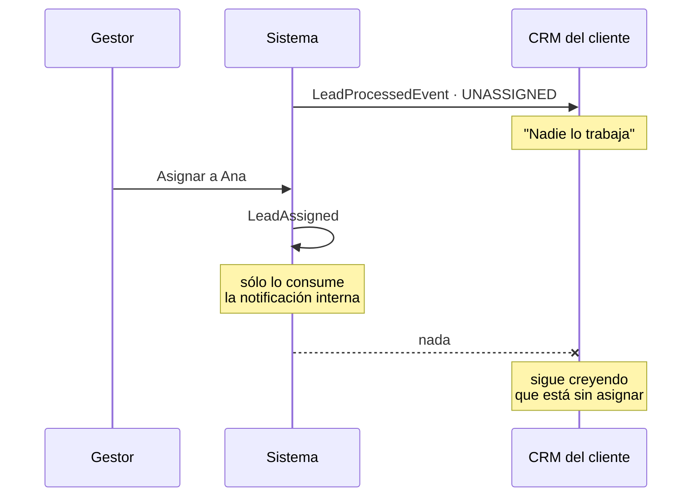

`LeadAssigned` existía, pero su único consumidor era el manejador de
notificaciones **de dentro**. El canal de salida no se enteraba.

---
layout: blocked
bloque: "3 · Los defectos"
idea: "Guardar y publicar son dos escrituras contra dos sistemas: el orden decide qué se pierde."
---

# Defecto 4 · La ventana entre guardar y publicar

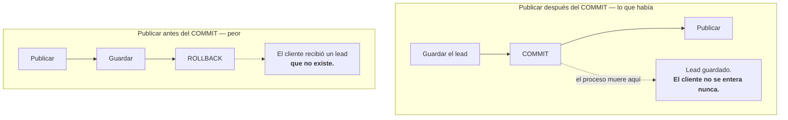

Publicar **después** del commit era deliberado: un aviso que falla no debe
deshacer un lead ya guardado. El precio era la ventana inversa.

Mientras el publicador vivía en memoria, esa ventana eran microsegundos. **En
cuanto publicar es una llamada de red a un bróker que puede estar caído, deja
de ser un caso de laboratorio.**

---
layout: blocked
bloque: "3 · Los defectos"
idea: "Un despliegue a mitad de fichero dejaba 6.000 leads sin procesar y a nadie encargado de terminarlos."
---

# Defecto 5 · El trabajo pesado moría con el proceso

Subir 10.000 leads devolvía `202` y dejaba el procesamiento en las tareas de
fondo **del propio proceso de la API**.

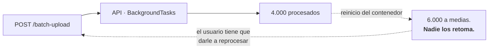

<div class="destacado">
<span class="destacado-tag">Lo que tienen en común los cinco</span>
Ninguno se arregla escribiendo mejor la lógica del lead. Los cinco son del
<strong>transporte</strong>.
</div>

---
layout: blocked
bloque: "4 · La decisión"
idea: "Meter las dos cosas en una sola tecnología obliga a emular en ella lo que la otra da gratis."
---

# No es un problema, son dos

La tentación es elegir **una** tecnología de mensajería y meter dentro todo lo
que se mueve. Aquí se descartó: los dos problemas piden garantías incompatibles.

| | El canal del producto | El trabajo interno |
|---|---|---|
| **Qué transporta** | Hechos: «este lead pasó el filtro» | Encargos: «procesa el trabajo 42» |
| **Quién consume** | El sistema del cliente, **fuera de aquí** | Un trabajador **nuestro** |
| **Al consumirlo** | Sigue ahí; otro consumidor lo lee igual | Desaparece: ya está hecho |
| **¿Volver atrás?** | **Sí** — es la razón de existir | No tiene sentido |
| **Si el consumidor muere** | Retoma por su cuenta desde su posición | Otro trabajador lo repite |

---
layout: blocked
bloque: "4 · La decisión"
idea: "El requisito de reobtención elige la tecnología. No es una preferencia."
---

# Por qué Kafka para el producto


Una cola **borra el mensaje al confirmarlo**. Emularlo exigiría guardar una
copia y exponer una API de reenvío: **reimplementar un log con retención,
peor**. En un log cada consumidor lleva su propia posición, y reobtener es
mover un número hacia atrás.

---
layout: blocked
bloque: "4 · La decisión"
idea: "El reparto entre trabajadores libres es exactamente lo que una cola resuelve sola."
---

# Por qué RabbitMQ para el trabajo

| Lo que hace falta | Quién lo da |
|---|---|
| Un trabajo se coge, se hace y **desaparece** | `ack` manual |
| Si quien lo cogió muere, **otro lo repite** | Reentrega automática |
| Lo que falla siempre, **se aparta** | Cola muerta (DLQ) |
| Reparto entre trabajadores libres | El bróker lo resuelve |

En Kafka habría que emular las cuatro con offsets y grupos de consumidores, y
el reparto pasaría a depender del **número de particiones** en vez de
resolverse solo.

<div class="destacado">
<span class="destacado-tag">El criterio</span>
No es «¿cuál es mejor?». Es <strong>qué garantía pide cada problema</strong>.
Retención y replay para el producto; reparto, reintento y descarte para el
trabajo.
</div>

---
layout: blocked
bloque: "5 · La solución"
idea: "El bróker deja de participar en la transacción, y por eso deja de poder romperla."
---

# El outbox · convertir dos escrituras en una

Publicar deja de ser una escritura remota y pasa a ser **una fila más**.

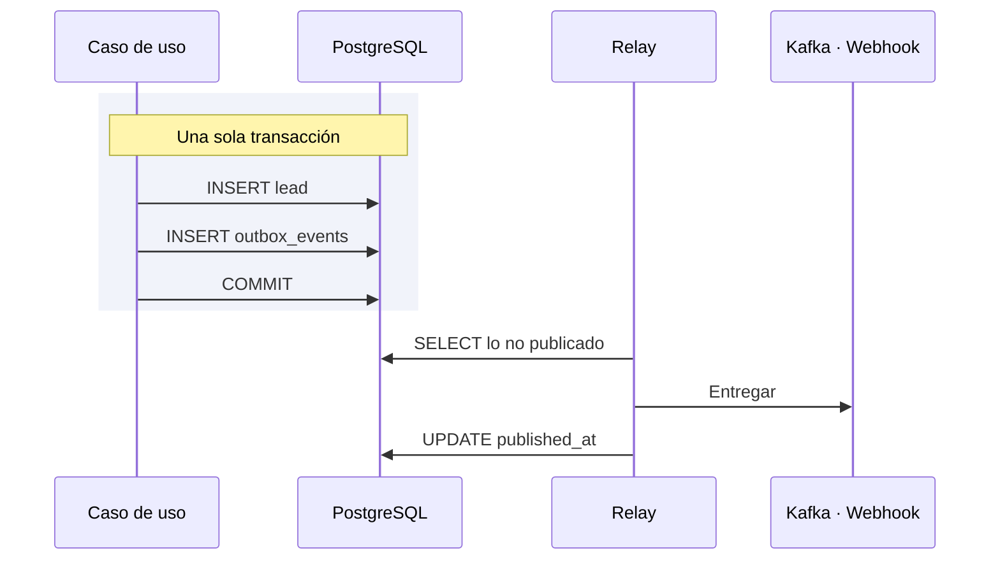

Un `ROLLBACK` se lleva el evento con el lead; una entrega que falla no toca el
lead. **Las dos caras, con el mismo mecanismo.**

---
layout: blocked
bloque: "5 · La solución"
idea: "El id de la fila es el del evento, y por eso el consumidor puede deduplicar."
---

# Qué guarda el outbox, y por qué cada columna

```sql
CREATE TABLE IF NOT EXISTS outbox_events (
    id            UUID PRIMARY KEY,   -- el event_id del evento, no uno nuevo
    tenant_id     UUID NOT NULL,
    partition_key TEXT NOT NULL,      -- el lead: su orden se respeta
    event_type    TEXT NOT NULL,
    payload       JSONB NOT NULL,
    occurred_on   TIMESTAMPTZ NOT NULL,
    published_at  TIMESTAMPTZ,        -- NULL mientras no haya salido
    attempts      INTEGER NOT NULL DEFAULT 0,
    last_error    TEXT
);
```

La entrega es **at-least-once**: si el relay muere entre entregar y marcar, el
mensaje sale dos veces. Con el mismo `event_id`, para que el consumidor lo
reconozca.

<div class="destacado">
<span class="destacado-tag">Nada se descarta por haber fallado</span>
El lote se ordena por <code>attempts, occurred_on</code>. Un tope de reintentos
parecía razonable hasta que llegó Kafka: con el bróker caído fallan
<strong>todas</strong> las entregas, y unos segundos de caída habrían
descartado para siempre los leads que esta tabla existe para no perder.
</div>

---
layout: blocked
bloque: "5 · La solución"
idea: "El relay es el único que entrega; añadir un destino nuevo no toca ni el caso de uso ni el relay."
---

# La arquitectura completa

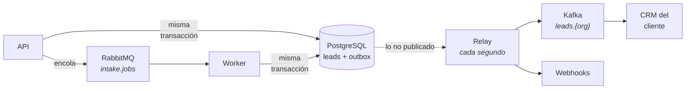

**Outbox**: que no exista un lead del que el cliente nunca se entere ·
**Kafka**: que reciba lo aprovechable y pueda volver a por ello ·
**RabbitMQ**: que el trabajo pesado no muera con el contenedor de la API.

---
layout: blocked
bloque: "5 · La solución"
idea: "Un ciclo son tres pasos porque el del medio habla por la red."
---

# El relay · leer, entregar, registrar

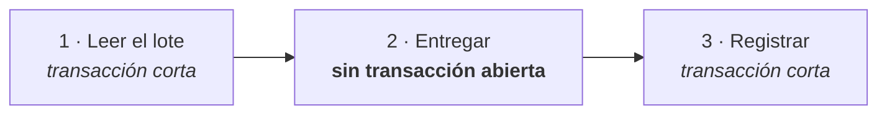

Entregar **dentro** de esa transacción retendría una conexión del pool durante
tantas llamadas de red como entradas tenga el lote: un puñado de receptores
agotando su plazo vacía el pool del que vive la API.

<div class="destacado">
<span class="destacado-tag">Qué entra en el outbox y qué no</span>
Sólo el <strong>canal de salida</strong>. Las notificaciones internas siguen
siendo síncronas: su consumidor está aquí dentro y el usuario espera verlas al
recargar. Meterlas en el outbox retrasaría lo único que hoy es inmediato.
</div>

---
layout: blocked
bloque: "6 · Kafka en detalle"
idea: "El aislamiento entre organizaciones es un invariante del sistema, no una cortesía del consumidor."
---

# Un topic por organización

`leads.{tenant_id}` · clave de partición `lead_id` · `event_type` en la cabecera

| Decisión | Alternativa descartada | Por qué |
|---|---|---|
| **Un topic por organización** | Uno compartido con `tenant_id` dentro | Obligaría a filtrar en el consumidor. Además abre la puerta a retención y credenciales distintas por cliente |
| **Los dos hechos en el mismo topic** | Un topic por tipo de evento | Repartirlos rompería el orden entre «se procesó» y «se descartó» del mismo lead |
| **`lead_id` como clave** | `tenant_id` como clave | Con `tenant_id`, una organización entera sería **una sola partición** |

---
layout: blocked
bloque: "6 · Kafka en detalle"
idea: "Con el desglose dentro, el cliente explica la puntuación sin preguntarnos y sin que las reglas sigan existiendo."
---

# El contrato que sale por el topic

```json
{
  "schema_version": 1,
  "event_id": "da8970dc-…",     // clave de deduplicación
  "occurred_on": "2026-08-24T20:05:41.511670+00:00",
  "tenant_id": "04047f84-…",  "lead_id": "e40fa333-…",
  "first_name": "Ana",        "last_name": "Diaz",
  "email": "ana@lead.test",   "company": "Acme",
  "industry": "Tech",         "budget": "9000.00",
  "score": 65,
  "score_breakdown": [
    { "rule_id": "788ff56f-…", "name": "tech o saas",      "score_delta": 40 },
    { "rule_id": "f9748a4d-…", "name": "presupuesto alto", "score_delta": 25 }
  ],
  "status": "UNASSIGNED",     "assigned_agent_id": null
}
```

Diecisiete campos construidos **en un solo sitio**: dos casos de uso lo publican
—la ingesta y la asignación manual—, y un campo añadido en uno solo sería un
contrato que se bifurca.

---
layout: blocked
bloque: "7 · RabbitMQ en detalle"
idea: "La reentrega no es segura por suerte: son tres piezas puestas antes, a propósito."
---

# La cola, el trabajador y la cola muerta

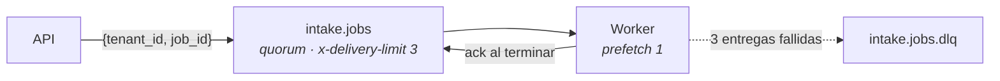

| Pieza puesta antes | Qué hace segura la reentrega |
|---|---|
| `start()` acepta `PROCESSING` | Un mensaje reentregado encuentra el trabajo empezado y **no lo rechaza** |
| Sólo se leen registros `PENDING` | Un lead ya promocionado no se crea dos veces |
| Los contadores se **derivan** de los registros | Dos consumidores del mismo mensaje llegan al mismo número |

El mensaje lleva **sólo** `{tenant_id, job_id}`: el trabajo ya está en base de
datos, y meter el payload también sería tenerlo en dos sitios que discrepan.

---
layout: blocked
bloque: "7 · RabbitMQ en detalle"
idea: "Degradar es preferible a rechazar los leads de un cliente porque nuestra cola está caída."
---

# Qué se encola de un fichero, y qué no

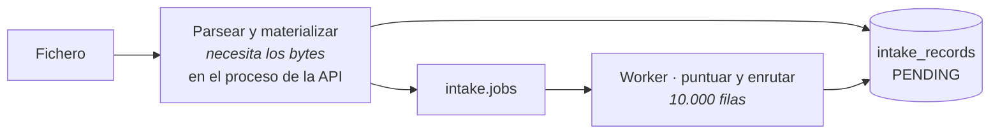

Parsear necesita los bytes, que sólo viven en la memoria de la petición. Pero
cuando termina, **cada fila ya es un registro duradero** y la parte larga se
encola igual que un lead suelto.

```python
if not job_queue.enqueue_intake_job(context.tenant_id, job_id):
    background.add_task(process.execute, context.tenant_id, job_id)
```

`enqueue_intake_job` devuelve `bool` en vez de lanzar — el **único** puerto de
salida del sistema que rompe ese patrón, y a propósito.

---
layout: blocked
bloque: "8 · Lo que se rompió"
idea: "La suite corre todo en un proceso, y el cambio consistía justamente en repartirlo entre varios."
---

# Tres defectos que sólo encontró el end-to-end

| Qué falló | Por qué la suite no lo veía |
|---|---|
| **El respaldo de la cola nunca entraba.** El endpoint devolvía `500` con el bróker apagado | `socket.gaierror` no hereda de `AMQPError`, y el test usaba un doble que lanzaba `AMQPError` |
| **Las notificaciones desaparecieron en silencio** | Al mover el trabajo al worker, los eventos internos se publican en el bus **de ese proceso**, donde nadie estaba suscrito. Nada falla: el manejador simplemente no existe |
| **El batch seguía procesándose en la API** | La suite no distingue en qué proceso corre el trabajo |

<div class="destacado">
<span class="destacado-tag">Y uno de diseño, propio</span>
El tope de reintentos del outbox se volvió <strong>pérdida de datos</strong> al
llegar Kafka: con el bróker caído fallan todas las entregas, así que once
segundos de caída agotaban el tope y descartaban los leads que el outbox existe
para no perder.
</div>

---
layout: blocked
bloque: "8 · Lo que se rompió"
idea: "Un cambio que reparte procesos rompe cosas que ninguna prueba de un solo proceso puede ver."
---

# Por qué el harness de negocio no es opcional

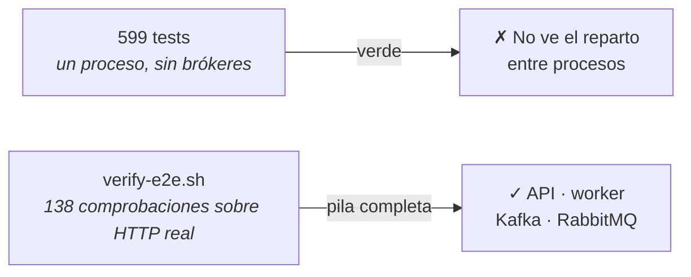

Los tres defectos de la diapositiva anterior **son del mismo tipo**: aparecen
sólo cuando el trabajo cruza de un proceso a otro.

| Comprobación | Resultado |
|---|---|
| Suite completa | **599 passed** |
| Guardián de la arquitectura | **4/4** |
| `verify-e2e.sh` con la pila real | **138 verdes**, tres pasadas seguidas |
| Outbox tras el recorrido completo | 247 publicados, **0 pendientes** |

---
layout: blocked
bloque: "9 · Decisiones"
idea: "Contradecir un ADR está permitido; hacerlo en silencio, no."
---

# Cinco decisiones, tres de ellas sustituyendo a otras

| ADR | Qué decide | Sustituye a |
|---|---|---|
| **0023** | Un evento del canal de salida existe porque describe un hecho que el producto publica, no porque haya un manejador en este proceso | **0016** · «sólo eventos con consumidor» |
| **0024** | El contrato se construye una sola vez, desde la entidad que describe | **0020** · «los eventos se construyen en la aplicación» |
| **0025** | Outbox transaccional: el evento se registra dentro de la transacción del lead | — |
| **0026** | Kafka, un topic por organización, con el contrato completo dentro | — |
| **0027** | Cola y trabajador aparte para el trabajo de fondo | **0019** · «trabajo de fondo en el mismo proceso» |

El 0019 decía literalmente: *«No hay cola externa —ni bróker, ni un proceso
trabajador independiente— en este alcance»*. **El alcance cambió, y el ADR se
sustituye en vez de contradecirse por la puerta de atrás.**

---
layout: blocked
bloque: "10 · Cierre"
idea: "Ninguno es un descuido: los cuatro están asumidos, escritos y con su razón."
---

# Qué no está resuelto

| Hueco | Consecuencia |
|---|---|
| **Retención de 168 h**, el valor por defecto | Reobtener funciona **siete días** |
| **`num.partitions=1`**, el valor por defecto | La clave de partición está bien elegida, pero el reparto que justifica todavía no existe |
| **El outbox crece sin podarse** | Las filas publicadas se quedan. A propósito mientras sean el único registro de lo que salió |
| **Nadie mira la cola muerta** | Un trabajo que falla tres veces se queda ahí sin que nada avise |

<div class="destacado">
<span class="destacado-tag">Y el que impide desplegarlo fuera</span>
<strong>Kafka está en PLAINTEXT, sin autenticación.</strong> Cualquiera con
acceso a la red lee los topics de todas las organizaciones. Es el siguiente
bloque de trabajo, y va junto con la credencial de máquina para la API: una
credencial mientras el bróker está abierto de par en par es seguridad de
teatro.
</div>

---
layout: blocked
bloque: "10 · Cierre"
idea: "El requisito que parecía un detalle —«poder reobtenerlos»— fue el que decidió toda la arquitectura."
---

# Conclusiones

| | |
|---|---|
| **1** | Cuando el consumidor deja de ser tu propia interfaz, el problema deja de ser el dominio y pasa a ser **el transporte y sus garantías** |
| **2** | Una frase del cliente —«**poder reobtenerlos**»— elige la tecnología. Una cola no puede darlo; un log con retención sí |
| **3** | Dos problemas con garantías incompatibles piden **dos tecnologías**. Meterlos en una obliga a emular en ella lo que la otra da gratis |
| **4** | Guardar y publicar no pueden ser atómicos… **salvo que publicar se convierta en insertar una fila** |
| **5** | Un cambio que reparte el trabajo entre procesos rompe cosas que **ninguna prueba de un solo proceso** puede ver |

<div class="destacado">
<span class="destacado-tag">Lo que queda escrito</span>
Cinco ADR, cinco páginas de documentación y un harness de 138 comprobaciones
sobre HTTP real. La decisión de mañana empieza leyendo por qué se tomó la de
hoy.
</div>
