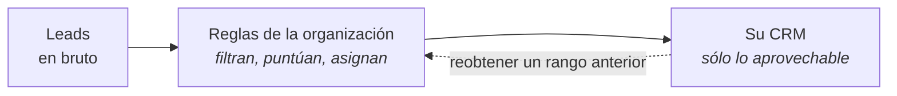
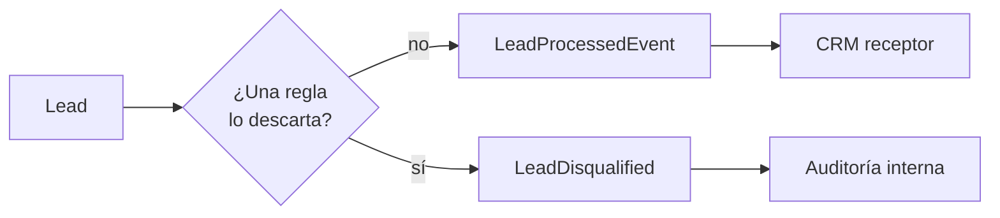
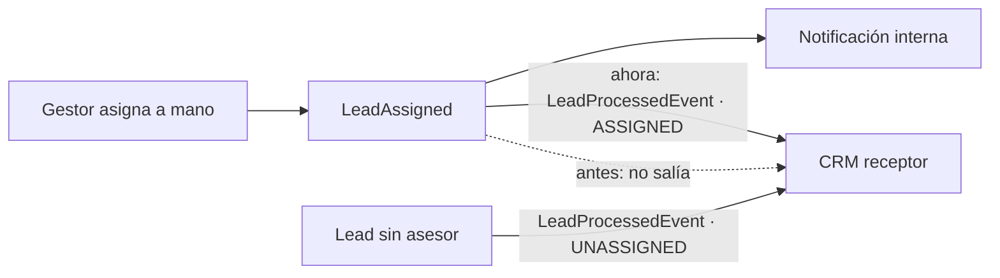
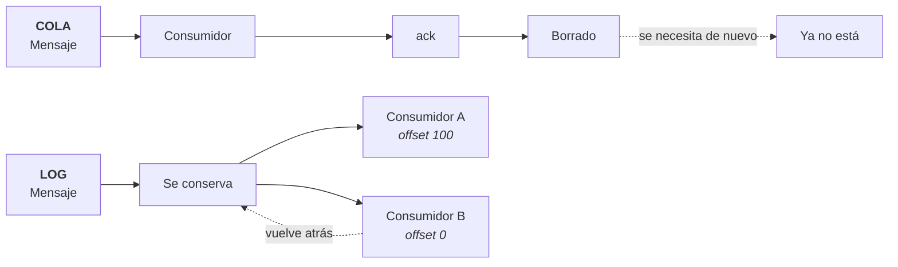
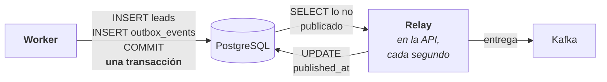
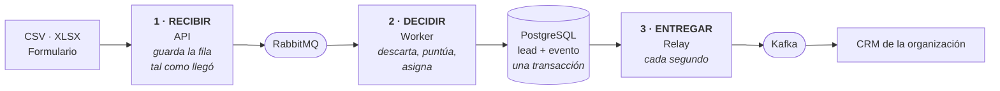
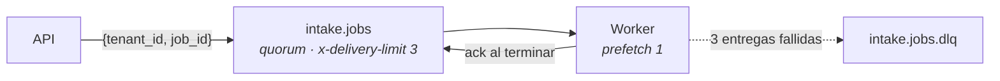
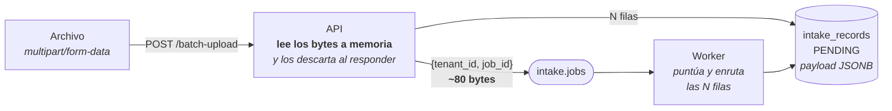
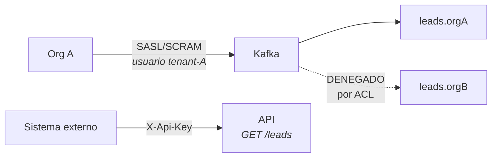
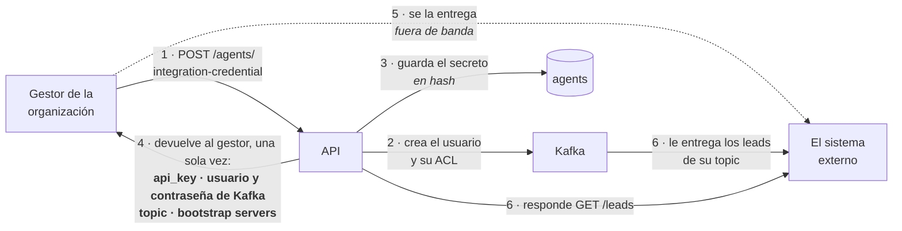

# Integración de eventos

## De decidir sobre un lead a entregarlo

Qué se publica, a dónde y con qué garantías.

Outbox transaccional · Apache Kafka · RabbitMQ

---
layout: blocked
bloque: "1 · Punto de partida"
idea: "Contexto de la primera sesión. El sistema decidía sobre el lead y lo guardaba; ahí terminaba."
---

# Punto de partida

El sistema toma tres decisiones sobre cada lead que ingresa, con las reglas de
cada organización, y guarda por qué decidió lo que decidió.


Arquitectura hexagonal: las dependencias apuntan al dominio, que no importa
nada de las otras capas. Cuatro tests lo verifican en cada ejecución.

<div class="destacado">
<span class="destacado-tag">Límite del alcance previo</span>
El recorrido terminaba con <strong>una fila guardada y un estado</strong>. Eso
alcanza mientras el único consumidor sea la propia interfaz.
</div>

---
layout: blocked
bloque: "2 · Alcance"
idea: "El sistema es multi-organización: cada organización opera con su propio CRM. Ese es el alcance que faltaba cubrir."
---

# Alcance pendiente: la entrega

El producto es multi-organización. Cada organización trabaja los leads en **su
propio CRM**, no en esta interfaz. Faltaba el tramo final del recorrido:



Tres requisitos, y el tercero condiciona la tecnología:

| | |
|---|---|
| **1** | Entregar sólo los leads que pasaron el filtro, ya puntuados y asignados |
| **2** | Que la entrega no dependa de que el receptor esté disponible en ese instante |
| **3** | **Poder reobtener** lo ya entregado, sin volver a procesarlo |

---
layout: blocked
bloque: "2 · Alcance"
idea: "Ninguno de los cinco se resuelve en la lógica del lead. Los cinco son de transporte."
---

# Limitaciones del mecanismo de salida anterior

| Hueco | Estado previo |
|---|---|
| Cómo recibe una organización los leads que pasaron el filtro | Un webhook con **cuatro campos**, o consultar la API |
| Cómo recupera lo que perdió durante una caída | **No era posible** |
| Cómo se entera si el proceso muere justo después de guardar | **No se enteraba** |
| Por qué recibía leads que las reglas ya habían descartado | Se publicaba **todo** por el mismo canal |
| Qué pasa con un archivo de 10.000 leads si el contenedor se reinicia | El trabajo quedaba a medias, **sin que nadie lo retomara** |

<div class="destacado">
<span class="destacado-tag">Cambio de alcance</span>
El problema deja de ser <strong>decidir sobre un lead</strong> y pasa a ser
<strong>qué se publica, a dónde, con qué garantías y quién lo procesa</strong>.
</div>

---
layout: blocked
bloque: "3 · Los defectos"
idea: "El filtro es el valor del producto. Publicar también lo descartado lo anula y agrega tráfico inútil."
---

# Defecto 1 · Se publicaba lo que las reglas descartaban

| | Antes | Ahora |
|---|---|---|
| **Lead que pasa el filtro** | `LeadProcessedEvent` | `LeadProcessedEvent` |
| **Lead que una regla descarta** | `LeadProcessedEvent`, el mismo | `LeadDisqualified`, con el nombre de la regla |
| **Qué llega al CRM** | Ambos, mezclados | Sólo el primero |
| **Quién vuelve a filtrar** | El receptor | Nadie |



---
layout: blocked
bloque: "3 · Los defectos"
idea: "Con seis campos el receptor no puede trabajar el lead: tendría que consultar la API, y no tiene credenciales para eso."
---

# Defecto 2 · El evento no identificaba al lead

| | Antes | Ahora |
|---|---|---|
| **Campos** | 6 | 17 |
| **Qué llevaba** | `lead_id`, `email`, `score`, `status`, `assigned_agent_id` | Además: nombre, empresa, sector, presupuesto, teléfono, atributos propios, fechas |
| **Explicar la puntuación** | Imposible: no venía el desglose | `score_breakdown` con cada regla aplicada |
| **Para trabajar el lead** | `GET /leads/{id}`, con un token que el receptor no tiene | Nada: el evento se basta |

El receptor está fuera del sistema y no tiene credenciales para consultar la
API, de modo que un evento sin datos no es utilizable.

---
layout: blocked
bloque: "3 · Los defectos"
idea: "El receptor sólo recibía el primer estado del lead. Todo lo posterior se quedaba dentro."
---

# Defecto 3 · La asignación manual no se publicaba

| | Antes | Ahora |
|---|---|---|
| **Enrutamiento automático encuentra asesor** | Se publica `ASSIGNED` | Igual |
| **No encuentra asesor** | Se publica `UNASSIGNED` | Igual |
| **Un gestor lo asigna después** | `LeadAssigned`, sólo para la notificación interna | Se vuelve a publicar el lead completo |
| **Qué registra el CRM** | `UNASSIGNED`, indefinidamente | El estado actual |



---
layout: blocked
bloque: "3 · Los defectos"
idea: "Guardar en PostgreSQL y publicar en un bróker son dos escrituras contra dos sistemas. Sin outbox, una de las dos puede quedarse sin la otra."
---

# Defecto 4 · La ventana entre guardar y publicar

Cuando el **worker** termina de puntuar y asignar, tiene que guardar el lead y
publicarlo. Son **dos escrituras contra dos sistemas** —PostgreSQL y el bróker—
y sin transacción común el proceso puede morir en medio.

| Orden | Si el proceso muere en medio | Resultado |
|---|---|---|
| **Guardar → publicar** *(lo que había)* | Después del `COMMIT` | Lead guardado que el CRM nunca recibe |
| **Publicar → guardar** | Después de publicar | El CRM tiene un lead que no existe |
| **Outbox** *(ahora)* | En cualquier punto | El worker escribe **dos filas en la misma transacción**: el lead en `leads` y el evento **pendiente** en `outbox_events`. No habla con el bróker |

Con el publicador en memoria la ventana era de microsegundos. Con un bróker
remoto, que puede estar caído, pasa a ser de segundos o minutos.

---
layout: blocked
bloque: "3 · Los defectos"
idea: "El procesamiento de un archivo grande vivía en el proceso de la API. Un reinicio lo dejaba a medias."
---

# Defecto 5 · El trabajo de fondo moría con el proceso

| | Antes | Ahora |
|---|---|---|
| **Dónde se procesan 10.000 leads** | `BackgroundTasks` de la API | Un worker aparte, por RabbitMQ |
| **Si el contenedor se reinicia** | Las filas restantes quedan a medias | El mensaje se reentrega y otro worker sigue |
| **Quién lo retoma** | Nadie: reproceso manual | El bróker |
| **Si el bróker está caído** | — | Se procesa en la API, como antes |

<div class="destacado">
<span class="destacado-tag">Causa común</span>
Ninguno se resuelve mejorando la lógica del lead. Los cinco están en
<strong>cómo sale el dato del sistema</strong>: qué se publica, cuándo, con qué
garantías y quién lo procesa.
</div>

---
layout: blocked
bloque: "4 · Selección de tecnología"
idea: "A = entregar el lead al CRM. B = procesar el archivo. La tercera fila es la que separa las tecnologías: retener frente a consumir."
---

# Dos casos de uso, dos tecnologías

En este sistema hay **dos cosas distintas que se mueven**, y hasta ahora las dos
vivían dentro del proceso de la API:

| | **A · Entregar un lead procesado**<br/>al CRM de la organización | **B · Procesar un archivo**<br/>de 10.000 filas |
|---|---|---|
| **Qué se transmite** | «El lead de Metalnor pasó el filtro: 115 pts, asignado a Iván Cadenas» | «Procesa el trabajo 42» |
| **Quién lo lee** | El CRM de la organización, fuera de este sistema | Un worker propio, aquí dentro |
| **Después de leerlo** | Debe **seguir disponible**: la organización puede pedir la semana pasada | Debe **desaparecer**: ya está hecho |
| **Si el lector se cae** | Retoma en el punto donde quedó | Otro worker repite el trabajo entero |
| **Tecnología que resulta** | **Kafka** · log con retención | **RabbitMQ** · cola con `ack` |

La fila que decide es la tercera. **A** necesita que el mensaje persista después
de leerse; **B** necesita lo contrario. Ninguna tecnología hace bien las dos.

---
layout: blocked
bloque: "4 · Selección de tecnología"
idea: "El reparto entre trabajadores disponibles es lo que una cola resuelve de base."
---

# Selección de RabbitMQ para el trabajo interno

| Lo que hace falta | Quién lo da |
|---|---|
| Un trabajo se toma, se ejecuta y **desaparece** | `ack` manual |
| Si quien lo tomó muere, **otro lo repite** | Reentrega automática |
| Lo que falla siempre, **se aparta** | Cola muerta (DLQ) |
| Reparto entre trabajadores disponibles | Lo resuelve el bróker |

En Kafka habría que emular las cuatro con offsets y grupos de consumidores, y
el reparto quedaría limitado por el **número de particiones**, en lugar de
resolverlo el bróker.

<div class="destacado">
<span class="destacado-tag">Criterio de selección</span>
No es cuál tecnología es mejor, sino <strong>qué garantía pide cada
problema</strong>: retención y replay para el producto; reparto, reintento y
descarte para el trabajo.
</div>

---
layout: blocked
bloque: "4 · Selección de tecnología"
idea: "El requisito de reobtención determina la tecnología. No es una preferencia de equipo."
---

# Selección de Kafka para el canal de salida



Una cola **borra el mensaje al confirmarlo**. Emular la reobtención exigiría
guardar una copia aparte y exponer una API de reenvío: reimplementar un log con
retención, con menos garantías. En un log cada consumidor mantiene su propia
posición, y reobtener es mover ese número hacia atrás.

---
layout: blocked
bloque: "5 · Diseño"
idea: "El worker escribe lead y evento en PostgreSQL. Nadie habla con el bróker dentro de la transacción; de eso se encarga el relay, después."
---

# Outbox transaccional

PostgreSQL y Kafka son **dos sistemas**: no hay transacción que los abarque a
los dos. La salida es que el worker no hable con el bróker: escribe el evento
como una fila más, en la misma transacción que el lead.



| Si falla… | Qué pasa |
|---|---|
| El `COMMIT` | Se pierden **los dos**: no queda lead sin evento ni evento sin lead |
| La entrega a Kafka | El lead ya está guardado. La fila del outbox sigue sin marcar y se reintenta |

---
layout: blocked
bloque: "5 · Diseño"
idea: "El id de la fila es el del evento. Eso es lo que permite deduplicar del lado del consumidor."
---

# Esquema de `outbox_events`

```sql
CREATE TABLE IF NOT EXISTS outbox_events (
    id            UUID PRIMARY KEY,   -- el event_id del evento, no uno nuevo
    tenant_id     UUID NOT NULL,
    partition_key TEXT NOT NULL,      -- el lead: su orden se respeta
    event_type    TEXT NOT NULL,
    payload       JSONB NOT NULL,
    occurred_on   TIMESTAMPTZ NOT NULL,
    published_at  TIMESTAMPTZ,        -- NULL mientras no haya salido
    attempts      INTEGER NOT NULL DEFAULT 0,
    last_error    TEXT
);
```

La entrega es **at-least-once**: si el relay muere entre entregar y marcar, el
mensaje sale dos veces, con el mismo `event_id` para que el consumidor lo
reconozca.

<div class="destacado">
<span class="destacado-tag">Reintentos sin tope</span>
El lote se ordena por <code>attempts, occurred_on</code>. Un tope de reintentos
se descartó al integrar Kafka: con el bróker caído fallan <strong>todas</strong>
las entregas, y unos segundos de caída habrían agotado el tope, descartando los
leads que esta tabla existe para conservar.
</div>

---
layout: blocked
bloque: "5 · Diseño"
idea: "Tres tramos y tres dueños: la API recibe, el worker decide, el relay entrega. Cada frontera existe para que un fallo no cruce."
---

# Recorrido completo

Tres tramos, tres procesos distintos. **Ninguno espera al siguiente.**



| Tramo | Quién | Qué deja escrito | Si se cae |
|---|---|---|---|
| **1 · Recibir** | La API | La fila cruda. **Todavía no hay lead** | El cliente recibe error y reintenta |
| **2 · Decidir** | El worker | El lead con su puntuación y su asesor, **y el evento**, juntos | RabbitMQ reentrega el trabajo a otro worker |
| **3 · Entregar** | El relay | `published_at` en la fila del evento | La fila sigue sin marcar; el siguiente ciclo la reintenta |

---
layout: blocked
bloque: "6 · RabbitMQ en detalle"
idea: "La reentrega es segura por tres piezas puestas antes, no por casualidad."
---

# Topología de `intake.jobs`



| Pieza puesta antes | Qué hace segura la reentrega |
|---|---|
| `start()` acepta `PROCESSING` | Un mensaje reentregado encuentra el trabajo empezado y **no lo rechaza** |
| Sólo se leen registros `PENDING` | Un lead ya promocionado no se crea dos veces |
| Los contadores se **derivan** de los registros | Dos consumidores del mismo mensaje llegan al mismo número |

El mensaje lleva **sólo** `{tenant_id, job_id}`: el trabajo ya está en base de
datos, e incluir también el payload lo dejaría en dos lugares que pueden
divergir.

---
layout: blocked
bloque: "6 · RabbitMQ en detalle"
idea: "El archivo no se guarda: se lee, se convierte en filas y se descarta. Lo reprocesable son los intake_records."
---

# Procesamiento de carga masiva

El archivo viaja en el **cuerpo de la petición HTTP**, en formato
`multipart/form-data` — el mismo con el que un formulario web sube un archivo:
el cuerpo se divide en partes y una de ellas, llamada `file`, son los bytes.
**No se almacena en ninguna parte y no entra en la cola.**



| Pregunta | Respuesta |
|---|---|
| ¿Dónde queda el archivo? | En ningún sitio. Ni disco, ni volumen, ni almacenamiento de objetos |
| ¿Por qué se parsea en la API? | Los bytes sólo existen mientras dura la petición: el worker no los tendría |
| ¿Qué se puede reprocesar? | Los `intake_records`, no el archivo. Por eso se guardan **antes** de interpretarlos |
| ¿Por qué la cola no lleva el archivo? | Estaría en dos sitios que pueden divergir, y RabbitMQ no es un almacén |

---
layout: blocked
bloque: "7 · Kafka en detalle"
idea: "El aislamiento entre organizaciones es un invariante del sistema, no una responsabilidad del consumidor."
---

# Un topic por organización

`leads.{tenant_id}` · clave de partición `lead_id` · `event_type` en la cabecera

| Decisión | Alternativa descartada | Por qué |
|---|---|---|
| **Un topic por organización** | Uno compartido con `tenant_id` dentro | Obligaría a filtrar en el consumidor. Además permite retención y credenciales distintas por organización |
| **Los dos hechos en el mismo topic** | Un topic por tipo de evento | Separarlos rompería el orden entre «se procesó» y «se descartó» de un mismo lead |
| **`lead_id` como clave** | `tenant_id` como clave | Con `tenant_id`, una organización entera quedaría en **una sola partición** |

---
layout: blocked
bloque: "7 · Kafka en detalle"
idea: "Con el desglose incluido, el receptor puede explicar la puntuación sin consultar la API."
---

# Contrato publicado

```json
{
  "schema_version": 1,
  "event_id": "da8970dc-…",     // clave de deduplicación
  "occurred_on": "2026-08-24T20:05:41.511670+00:00",
  "tenant_id": "04047f84-…",  "lead_id": "e40fa333-…",
  "first_name": "Ana",        "last_name": "Diaz",
  "email": "ana@lead.test",   "company": "Acme",
  "industry": "Tech",         "budget": "9000.00",
  "score": 65,
  "score_breakdown": [
    { "rule_id": "788ff56f-…", "name": "tech o saas",      "score_delta": 40 },
    { "rule_id": "f9748a4d-…", "name": "presupuesto alto", "score_delta": 25 }
  ],
  "status": "UNASSIGNED",     "assigned_agent_id": null
}
```

Diecisiete campos construidos **en un solo lugar**: dos casos de uso lo publican
—la ingesta y la asignación manual— y un campo agregado en uno solo produciría
un contrato divergente.

---
layout: blocked
bloque: "8 · Autenticación"
idea: "SASL es el marco, SCRAM el mecanismo, la ACL la regla. Los tres términos definidos antes de usarlos."
---

# SASL, SCRAM y ACL

| Término | Qué es |
|---|---|
| **SASL** | El marco con el que Kafka pide credenciales al conectarse. Define *que* hay autenticación, no *cómo* |
| **SCRAM-SHA-256** | El mecanismo concreto: usuario y contraseña por **desafío-respuesta**. El servidor manda un reto, el cliente responde con un cálculo sobre su contraseña. **La contraseña nunca viaja por la red** |
| **ACL** | Una regla del bróker: **qué principal** puede **qué operación** sobre **qué recurso** |

Las reglas que se crean al emitir una credencial:

| Principal | Operación | Recurso |
|---|---|---|
| `User:tenant-A` | `READ`, `DESCRIBE` | Topic `leads.orgA` |
| `User:tenant-A` | `READ` | Grupos que empiecen por `tenant-A` |

No existe ninguna regla que le dé acceso al topic de otra organización, y el
bróker deniega por defecto lo que no está permitido: contra `leads.orgB`
responde `TOPIC_AUTHORIZATION_FAILED`.

---
layout: blocked
bloque: "8 · Autenticación"
idea: "Dos puertas, dos mecanismos. El aislamiento entre organizaciones lo aplica el bróker mediante ACL, no el consumidor."
---

# Cómo se autentica cada extremo

Dos puertas de entrada al sistema, cada una con su mecanismo.



| Puerta | Quién entra | Mecanismo | Alcance |
|---|---|---|---|
| **Kafka** · listener externo | El CRM de cada organización | `SASL_PLAINTEXT` + `SCRAM-SHA-256` | Un usuario y una ACL por organización: sólo su propio topic |
| **API** · `GET /leads` | Un sistema de integración | Cabecera `X-Api-Key`, secreto en hash bcrypt | Un solo endpoint. No obtiene sesión ni accede a nada más |


---
layout: blocked
bloque: "8 · Autenticación"
idea: "Una llamada entrega las credenciales de las dos puertas. Rotar es la misma llamada; revocar corta ambas."
---

# Cómo se integra un sistema externo



| | |
|---|---|
| **Quién la pide** | El gestor, con su sesión. **No existe un endpoint donde el sistema externo pida la suya**: para pedirla ya tendría que estar autenticado |
| **Qué recibe** | `api_key`, usuario y contraseña de Kafka, y el nombre del topic. **Sólo se muestran una vez**: después se guardan en hash |
| **Rotar** | La misma llamada. Emite un secreto nuevo e invalida el anterior |
| **Revocar** | `DELETE /agents/{id}`. Corta las dos puertas a la vez |
| **La regla a cumplir** | El grupo de consumidor debe empezar por `tenant-{uuid}`. Con otro nombre, el bróker responde `GROUP_AUTHORIZATION_FAILED` |

---
layout: blocked
bloque: "9 · Cierre"
idea: "El requisito de reobtención fue el que determinó la arquitectura de toda esta fase."
---

# Qué hace el sistema ahora

| | |
|---|---|
| **Entrega** | Cada organización recibe en su CRM los leads que pasaron el filtro, con el lead completo: datos, puntuación, desglose de reglas y asesor asignado |
| **Reobtención** | Puede volver a leer los últimos siete días desde donde quiera, sin pedirle nada a nadie |
| **Durabilidad** | El evento se guarda en la misma transacción que el lead. No existe un lead cuyo evento se quede sin salir |
| **Procesamiento** | Un archivo de 10.000 filas lo procesa un worker aparte. Un reinicio no lo pierde: el trabajo se reentrega |
| **Aislamiento** | Cada organización lee sólo su topic, con su usuario y su ACL. Lo aplica el bróker |
| **Integración** | Una llamada entrega la clave de API y la credencial de Kafka. Rotar es la misma llamada; revocar corta las dos |
