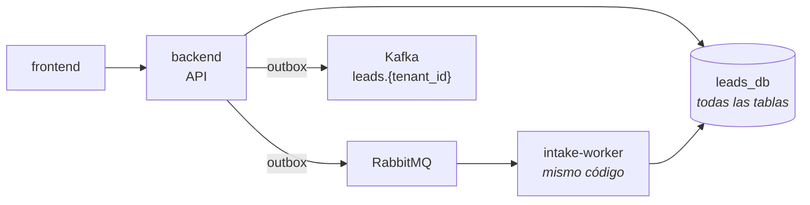
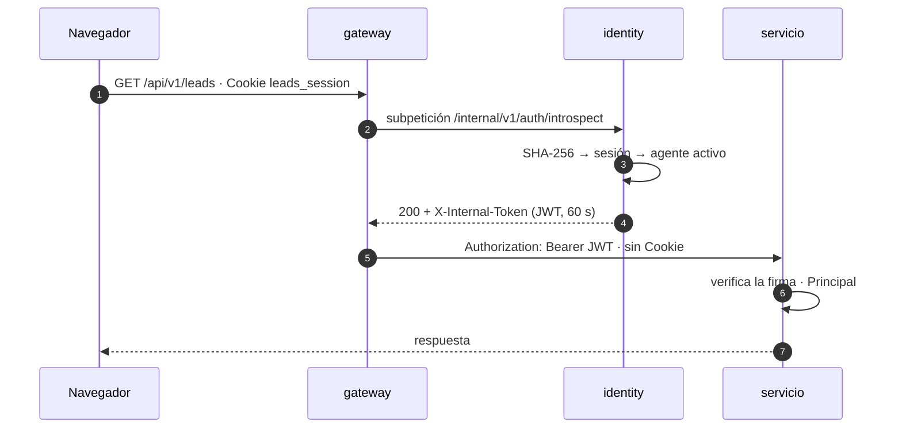
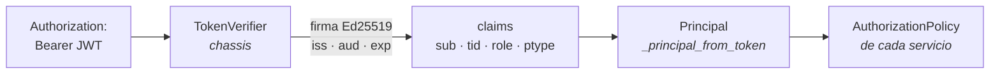
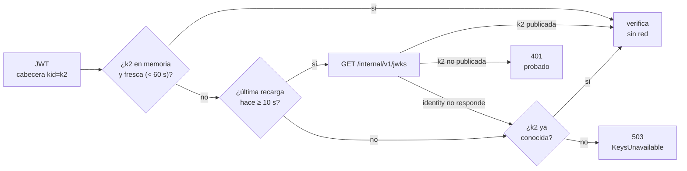
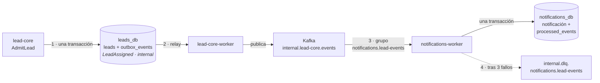
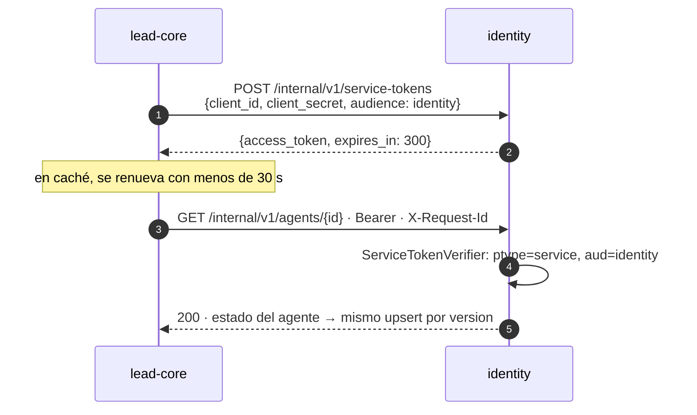
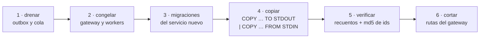
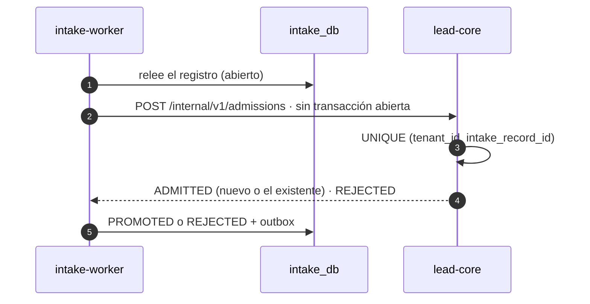

# Migración a microservicios

## Del monolito modular a servicios por contexto

Separación por contexto · una base por servicio · gateway y phantom token · eventos internos

identity · intake · lead-core · notifications

---
layout: blocked
bloque: "1 · Punto de partida"
idea: "Los contextos ya eran reconocibles en el código. Lo que los unía era la base compartida y una única transacción."
---

# Punto de partida: un monolito modular hexagonal



| Rasgo | Consecuencia |
|---|---|
| Una **unidad de trabajo** con 16 repositorios sobre una conexión | Cualquier caso de uso puede leer o escribir cualquier tabla en la misma transacción |
| **Nueve cruces** entre contextos (p. ej. la ingesta lee agentes y grupos; crear un tenant crea fuentes) | Identidad, ingesta, decisión y notificaciones no se pueden desplegar ni fallar por separado |
| Arquitectura hexagonal con guardián AST 4/4 | Casi todo cruce ya pasa por un **puerto**: separar es cambiar el adaptador detrás |

---
layout: blocked
bloque: "2 · Criterio de separación"
idea: "Un servicio por contexto de negocio, no por router ni por tabla. Cada base la abre sólo el rol de su servicio."
class: densa
---

# Cuatro servicios por contexto, una base cada uno

| Servicio | Responsabilidad | Base · rol |
|---|---|---|
| **identity** | Tenants, agentes, sesiones, MFA, OAuth, credenciales de integración, token interno | `identity_db` · `identity_svc` |
| **intake** | Fuentes, jobs, registros crudos, errores, ficheros, cola de trabajo | `intake_db` · `intake_svc` |
| **lead-core** | Reglas, viabilidad, scoring y asignación, grupos, asesores, leads, canal de producto | `leads_db` · `lead_core_svc` |
| **notifications** | La bandeja de cada destinatario | `notifications_db` · `notifications_svc` |
| **gateway** | Borde: enrutado, autenticación, CORS, `Origin`, `X-Request-Id`, límites | — |

| Regla de datos | Consecuencia |
|---|---|
| `db-bootstrap` crea cada rol y su base y hace `REVOKE CONNECT … FROM PUBLIC` | Un acceso a la base de otro servicio falla al conectar, no en una revisión de código |
| Sin consultas entre bases; las FK entre contextos pasan a ser **UUID externos** | Lo de otro servicio llega por API, evento o **proyección local**; la validez del tenant la da el token |
| Migraciones por servicio, aplicadas al arrancar su `api` | Cada esquema evoluciona con su servicio |

| Alternativa descartada | Motivo |
|---|---|
| Separar procesos y compartir la base | Monolito distribuido: los despliegues siguen acoplados por el esquema |
| Un servicio por router o por tabla | Reproduce la organización HTTP, no el dominio; multiplica llamadas por lead |
| Scoring y asignación por separado | Distribuye una transacción local (cursor de round-robin, lead y outbox) sin un problema de escala que lo pida |

---
layout: blocked
bloque: "3 · Arquitectura final"
idea: "Cuatro servicios, cada uno con api y worker de la misma imagen, detrás de un gateway nginx. Ningún servicio lee la base de otro."
---

# Arquitectura final · contenedores (C4)


<div class="text-xs text-center"><a href="/c4-contenedores.svg" target="_blank">Abrir a tamaño completo</a> · fuente editable en <code>docs/content/microservices/diagramas/c4-contenedores.drawio</code></div>

---
layout: blocked
bloque: "4 · Esqueleto común"
idea: "Si dos servicios resuelven lo mismo, lo resuelven en el mismo sitio y con el mismo nombre. Sólo cambian dominio, casos de uso y adaptadores."
---

# Mismo esqueleto en todos los servicios

<div class="par">

```text
services/<svc>/
├── Dockerfile · pyproject.toml · uv.lock
├── migrations/NNN_*.sql
├── src/
│   ├── domain/          sin dependencias
│   ├── application/     dtos · ports · use_cases
│   └── infrastructure/
│       ├── main.py      api
│       ├── worker/      relay + consumidores
│       ├── config/ · di/
│       └── adapters/
│           ├── input/   api · internal · consumers
│           └── output/  persistence · http · …
└── tests/  unit · integration · e2e · architecture
```

<div class="nota">

**`libs/chassis`** — sólo código técnico, sin tipos de dominio: verificación del token, pool y migraciones, outbox y relay, consumidor Kafka con DLQ, correlación, guardianes. Entra lo que necesitan dos servicios y no contiene reglas de negocio.

**Proyecto `uv` por servicio**, con `chassis` por ruta. La imagen contiene sólo su servicio y `chassis`: un import cruzado **no compila**.

**Guardián 4/4 y regla de estructura** en cada suite: el dominio no importa nada externo; ≤ 150 líneas por fichero.

</div>
</div>

---
layout: blocked
bloque: "5 · Gateway y autenticación"
idea: "Phantom: el cliente nunca ve el token que usan los servicios. Fuera de la red sólo circula un valor opaco que no significa nada sin identity."
---

# Qué es un phantom token

<div class="par">



<div class="nota">

Dos tokens para una misma identidad:

- **Opaco** (fuera): la cookie `leads_session`, un valor aleatorio. identity guarda sólo su SHA-256.
- **JWT interno** (dentro): firmado por identity, vive 60 s y no sale nunca de la red.

1. El navegador envía sólo su cookie.
2. El gateway pregunta a identity antes de enrutar.
3. identity busca la sesión por el hash y comprueba que el agente y su tenant siguen activos.
4. identity emite el JWT en la cabecera de respuesta.
5. El gateway lo pone en `Authorization` y quita la cookie.
6. El servicio verifica el JWT sin llamar a nadie.
7. La respuesta vuelve sin el JWT: el cliente no lo ve.

**Por qué**: un logout o una desactivación se aplican en la petición siguiente y no hay token en almacenamiento web (ADR-0029). Descartado: JWT en el navegador; cabeceras sin firmar (`X-User-Id`).

</div>
</div>

---
layout: blocked
bloque: "5 · Gateway y autenticación"
idea: "auth_request hace una subpetición a identity antes de enrutar. 2xx deja pasar; 401 devuelve 401; cualquier otra respuesta o un fallo de red, 503."
---

# Dónde está y cómo llama a identity

<div class="par">

```nginx
# gateway/nginx.conf
map $internal_token $internal_authorization {
    "" ""; default "Bearer $internal_token";
}
location = /_introspect {
    internal;
    proxy_pass http://identity/internal/v1/auth/introspect;
    include    /etc/nginx/conf.d/introspect.inc;
}
# = /_introspect_optional: igual, con ?optional=true
```

```nginx
# gateway/protected.inc — incluido por cada ruta protegida
auth_request     /_introspect;
auth_request_set $internal_token $upstream_http_x_internal_token;
include          /etc/nginx/conf.d/proxy_headers.inc;
proxy_set_header Cookie "";

# gateway/proxy_headers.inc — siempre sobrescrito
proxy_set_header Authorization $internal_authorization;
```

</div>

| Línea | Qué hace |
|---|---|
| `auth_request /_introspect` | Antes de enrutar, subpetición a identity sin cuerpo, con `Cookie`, `X-Api-Key` y `X-Request-Id` (`introspect.inc`, timeouts 1 s / 2 s) |
| `auth_request_set` | Copia la cabecera `X-Internal-Token` de la respuesta de identity a la variable `$internal_token` |
| `map` + `Authorization` | Construye `Bearer <JWT interno>` y sustituye siempre la `Authorization` que mande el cliente |
| `Cookie ""` | Quita la cookie: ningún servicio de negocio la ve |
| `/_introspect_optional` | Sólo `/api/v1/agents`: sin credencial pasa sin `Authorization`; una credencial inválida sigue siendo `401` |

---
layout: blocked
bloque: "5 · Gateway y autenticación"
idea: "La introspección dice quién es. Qué puede hacer lo decide cada servicio sobre el Principal; el tenant sale siempre del token."
---

# Cómo identifica el servicio al usuario



| Comprobación o claim | Qué significa |
|---|---|
| Firma **Ed25519** | Se comprueba con la clave pública de identity; sólo identity tiene la privada: un servicio verifica tokens, pero no puede fabricarlos |
| `iss = identity` · `aud = lead-router` | Lo emitió identity y va dirigido a los servicios de negocio, no es un token de otro uso |
| `exp` = emisión + 60 s | Un token copiado dentro de la red caduca en un minuto; la revocación real la da la introspección de cada petición |
| `sub` · `tid` | Id del agente y de su tenant (`null` para el ADMIN de plataforma) |
| `role` · `ptype` | Rol (`ADMIN`, `MANAGER`, `AGENT`, `INTEGRATION`) y tipo de principal: `human` (cookie) o `integration` (`X-Api-Key`) |
| `Principal` → autorización | Cada servicio decide qué puede hacer (p. ej. sólo `MANAGER` gestiona la organización); el tenant de toda consulta es `tid`, nunca la URL ni el cuerpo |

<div class="nota">

Firma inválida o claims incoherentes → `401`; claves imposibles de comprobar → `503`. Código: `_principal_from_token` en `services/lead-core/src/infrastructure/adapters/input/api/dependencies.py`.

</div>

---
layout: blocked
bloque: "5 · Gateway y autenticación"
idea: "Los servicios verifican la identidad sin llamar a identity en cada petición, y una rotación de claves es publicar un kid nuevo."
---

# JWKS: cómo obtiene el servicio la clave pública



<div class="par">
<div class="nota">

**JWKS** (*JSON Web Key Set*): documento JSON con las claves públicas de identity, cada una con su **`kid`** (*key id*). identity lo publica en `GET /internal/v1/jwks`. La cabecera de cada JWT lleva el `kid` de la clave que lo firmó.

**Por qué**: cada servicio verifica la identidad sin llamar a identity en cada petición, y rotar claves es publicar un `kid` nuevo: los servicios lo cargan al verlo por primera vez.

</div>
<div class="nota">

**`chassis.auth.JwksCache`** guarda las claves en memoria, idéntico en todos los servicios:

- `kid` conocido y fresco: se verifica sin red.
- Frescas 60 s; después, la siguiente verificación recarga. Una clave que ya no se publica desaparece.
- `kid` desconocido: recarga, como mucho una cada 10 s.
- Si el `kid` no se puede comprobar → **`503`**, nunca un `401` sin prueba: durante una rotación ese `401` cerraría la sesión del SPA.

</div>
</div>

---
layout: blocked
bloque: "6 · Comunicación"
idea: "Es el criterio de decisión del transporte: para cada interacción entre servicios se responde la pregunta de cada fila, y la primera que es sí fija el canal."
---

# Regla de canal: cómo se elige el transporte

| Canal | Pregunta que lo decide | Ejemplo en el sistema |
|---|---|---|
| **HTTP síncrono** | ¿Quien llama necesita la respuesta para continuar? | `introspect`: el gateway no puede enrutar sin saber quién es el usuario. `admissions`: intake necesita saber si lead-core admitió el registro para marcarlo |
| **RabbitMQ** | ¿Es trabajo que debe hacer **exactamente un** ejecutor, con reintento si muere? | `intake.jobs`: cada job de importación lo procesa un solo intake-worker; si cae, RabbitMQ lo reentrega |
| **Kafka** | ¿Es un **hecho** que interesa a varios servicios y que deben poder **releer**? | `internal.identity.agents`: lead-core y notifications consumen el mismo cambio de agente, y un consumidor nuevo relee el topic desde el principio |
| **Outbox** | ¿Cómo se publica sin perder ni inventar mensajes? | No es un canal más: es cómo se hace fiable **cualquier** publicación a RabbitMQ o Kafka |

| Canal | Garantía que aporta |
|---|---|
| HTTP | Timeout explícito; sólo se reintenta lo idempotente (`admissions` lo es por clave única) |
| RabbitMQ | `ack` manual tras procesar; reentrega si el worker muere; DLQ tras 3 entregas |
| Kafka | Retención y offsets por grupo de consumidores; compactación para topics de estado |
| Outbox | La fila se escribe en la misma transacción que el cambio; entrega al menos una vez |

---
layout: blocked
bloque: "6 · Comunicación"
idea: "HTTP cuando se necesita la respuesta, Kafka para hechos y estado, RabbitMQ para trabajo, outbox para toda publicación."
---

# Cómo se comunican los componentes


<div class="text-xs text-center"><a href="/comunicacion.svg" target="_blank">Abrir a tamaño completo</a> · fuente editable en <code>docs/content/microservices/diagramas/comunicacion.drawio</code></div>

---
layout: blocked
bloque: "6 · Comunicación"
idea: "Nunca se escribe en la base y en un broker por separado: una caída entre ambas escrituras perdería un evento o publicaría uno que no ocurrió."
---

# Un evento de punta a punta: lead-core asigna un lead



| Paso | Qué ocurre |
|---|---|
| **1 · Registrar** | En la misma transacción se guarda el lead y una fila en `outbox_events` (`event_type = LeadAssigned`, `channel = internal`). Si la transacción falla, no queda ni lead ni evento |
| **2 · Publicar** | El relay de `lead-core-worker` lee las filas sin publicar y las envía a `internal.lead-core.events`. Marca `published_at` sólo cuando Kafka confirma; si cae antes, la reenvía |
| **3 · Consumir** | El grupo `notifications.lead-events` lee el mensaje, crea la notificación y registra su `event_id` en `processed_events` en una transacción. Un duplicado encuentra el `event_id` y no hace nada |
| **4 · Aislar** | Tras 3 intentos fallidos el mensaje va a `internal.dlq.<grupo>` y el consumidor sigue con el siguiente |

---
layout: blocked
bloque: "6 · Comunicación"
idea: "Una proyección es una copia local, derivada y reconstruible del estado de otro servicio. Nunca es fuente de verdad."
class: media
---

# Topics de hechos, topics de estado y proyecciones

| Tipo | Topics | Qué contiene | Configuración |
|---|---|---|---|
| **Hechos** | `internal.lead-core.events`, `internal.intake.events` | Cosas que ocurrieron (`LeadAssigned`, `IntakeRejected`) | `delete`, 7 días |
| **Estado** | `internal.identity.agents`, `internal.identity.tenants` | El estado completo de un agente o tenant + `version`, con clave = su id | **`compact`**: Kafka conserva el último mensaje por clave, así que un consumidor nuevo reconstruye su proyección leyendo desde el principio |

| Grupo consumidor | Lee | Construye |
|---|---|---|
| `lead-core.advisors` | `internal.identity.agents` | Proyección `advisors`: candidatos de asignación; `group_id` es propio de lead-core |
| `notifications.members` | `internal.identity.agents` | Proyección `members`: gestores de un tenant como destinatarios |
| `intake.tenants` | `internal.identity.tenants` | Fuentes por defecto de un tenant nuevo (`MANUAL_FORM`, `FILE_UPLOAD`) |

| Regla | Efecto |
|---|---|
| **Upsert condicionado por `version` en SQL** | Un mensaje atrasado nunca pisa un estado más nuevo; reentregar es inocuo |
| **Hidratación bajo demanda** | Si falta un asesor recién creado, lead-core lo pide a identity por HTTP en vez de esperar al evento |
| **Consistencia eventual aceptada** | Las fuentes de un tenant nuevo aparecen ≈ 1 s después del alta; `provisioned_tenants` evita recrear una fuente borrada al releer el topic |

---
layout: blocked
bloque: "6 · Comunicación"
idea: "Sólo para desarrollo local: las dos consolas leen los brokers por la red interna de Compose."
---

# Cómo verlo en las consolas

<div class="par" style="align-items: start;">
<div>

## Kafka UI · `http://localhost:8004`

- **Topics → `internal.lead-core.events` → Messages**: cada sobre con `event_id`, `event_type`, `tenant_id`, `correlation_id` y el payload.
- **Topics → `internal.identity.agents`**: un mensaje por agente con su último estado (compactado).
- **Consumers**: el *lag* de cada grupo, p. ej. `notifications.lead-events`, `lead-core.advisors`, `intake.tenants`. Un lag que crece indica un consumidor parado o lento.
- **Topics → `internal.dlq.*`**: un topic por grupo; vacío en funcionamiento normal.

</div>
<div>

## RabbitMQ · `http://localhost:15672`

- Usuario `leads`, contraseña `leadspassword` (sólo desarrollo).
- **Queues → `intake.jobs`**: cola *quorum* con `x-delivery-limit = 3`; muestra mensajes listos, entregados sin `ack` y la tasa.
- **Queues → `intake.jobs.dlq`**: jobs que agotaron las tres entregas.

<div class="destacado">
<span class="destacado-tag">Prueba</span>
Subir un fichero en el frontend: pasa un mensaje por <code>intake.jobs</code>; cada lead asignado deja un <code>LeadAssigned</code> en <code>internal.lead-core.events</code> y el lag de <code>notifications.lead-events</code> vuelve a 0.
</div>

</div>
</div>

---
layout: blocked
bloque: "6 · Comunicación"
idea: "Las llamadas sin usuario detrás usan client credentials: identity emite un token de servicio que se verifica con el mismo código de chassis."
---

# Llamadas entre servicios: token de servicio

<div class="par">



<div>

<div class="nota">

Se usa cuando no hay usuario detrás: lead-core hidrata un asesor que falta en `advisors` (en la figura) e intake-worker llama a `admissions`.

</div>

| | |
|---|---|
| **Claims** | `iss=identity`, `sub` = servicio llamante, `aud` = servicio llamado, `ptype=service`, 300 s |
| **Clientes** | Configuración de identity (`SERVICE_CLIENTS`) con el **SHA-256 del secreto**, nunca el secreto |
| **Rutas internas** | `/internal/v1/*`: el gateway responde `404` desde fuera |
| **Fallos** | Un `401` descarta el token en caché; identity caído → `503`, nunca un `404` falso |

</div>
</div>

---
layout: blocked
bloque: "6 · Comunicación"
idea: "Un contrato vive en un solo sitio y lo prueban las dos partes. Si cambia, fallan los tests de ambos lados hasta adaptarse."
---

# `contracts/` y por qué HTTP/JSON y no gRPC

| Contrato | Productor | Consumidores |
|---|---|---|
| `identity-internal.v1.yaml` (introspect, jwks, service-tokens, agents) | identity | gateway, lead-core |
| `AgentState`, `TenantState` | identity | lead-core, notifications, intake |
| `LeadAssigned`, `LeadReassigned`, `LeadLeftUnassigned` | lead-core | notifications |
| `IntakeRejected` | intake | notifications |
| `lead-core-internal.v1.yaml` (`admissions`, lookup) | lead-core | intake |
| `intake/job-message.v1` | intake (relay) | intake-worker |

El productor valida lo que emite (`assert_conforms`); el consumidor se prueba con el fixture (`load_fixture`). Compatible = campo opcional nuevo; incompatible = fichero `v2` y convivencia hasta que no quedan consumidores.

<div class="destacado">
<span class="destacado-tag">Por qué no gRPC</span>
Hay dos rutas síncronas internas; gateway + introspección cuestan ≈ 3 ms en p50 (lo dominante es bcrypt, ≈ 290 ms); <code>auth_request</code> sólo habla HTTP. gRPC se justificaría con <strong>streaming</strong> o servicios en otros lenguajes, y el cambio sería un adaptador detrás de <code>LeadAdmissionPort</code> y <code>AdvisorDirectory</code>.
</div>

---
layout: blocked
bloque: "7 · Migración"
idea: "El mismo método en cada extracción: una ventana corta sin escrituras. Sin CDC ni doble escritura; la vuelta atrás existe hasta el paso 6."
---

# Procedimiento de corte de datos



| Extracción | Copiado con los mismos UUID · recuentos y `md5` idénticos |
|---|---|
| **identity** | 95 tenants · 197 agentes · 262 sesiones (236 activas) · MFA · identidades sociales. Sesiones copiadas: **nadie volvió a iniciar sesión** |
| **intake** | 76 fuentes · 117 jobs · 139 registros · 36 errores · 22 ficheros · 38 tenants aprovisionados |
| Guardas del script | Se niega con el stack vivo, con outbox interno sin drenar o si el servicio nuevo ya escribió |

---
layout: blocked
bloque: "7 · Migración"
idea: "Recepción y decisión se separan. Lo que antes garantizaba una transacción lo garantiza ahora una clave única."
---

# Extracción de intake: admisión idempotente



| Decisión | Por qué |
|---|---|
| Ninguna transacción abierta durante la llamada | Una conexión no espera a la red; la carrera la resuelve la restricción única |
| `REJECTED` cubre todo fallo determinista (campo obligatorio, importe fuera de rango) | Un 4xx se reintentaría hasta la DLQ por un dato que no va a cambiar |
| Un job interrumpido espera 10 s antes del `nack` y se corta en el primer fallo de lead-core | Un reinicio de segundos no agota las tres entregas |

---
layout: blocked
bloque: "7 · Migración"
idea: "La admisión por HTTP no encarece el job. El primer número, cuatro veces peor, señalaba un artefacto del modo desarrollo."
---

# Medición: job de 1.000 registros

| Job de 1.000 registros, de `202` a `COMPLETED` | |
|---|---|
| Monolito, decisión en proceso | 14,5 s |
| Admisión por HTTP, primera medida | 59,8 s · ≈ 42 ms por llamada |
| Admisión por HTTP, tras corregir el arranque en desarrollo | 12,9 s y 11,9 s |
| Arquitectura final: cuatro servicios, cada base con su rol | 13,0 s y 13,3 s |

| Llamadas síncronas, p50 / p95 | Monolito | Arquitectura final |
|---|---|---|
| `introspect`, dentro de la red | 4,7 / 8,4 ms | 3,2 / 4,1 ms |
| `GET /api/v1/leads` por el gateway | 10,6 / 13,9 ms | 5,3 / 10,6 ms |

<div class="destacado">
<span class="destacado-tag">Causa de los 59,8 s</span>
<code>uvicorn --reload</code> entrega el socket al proceso hijo por descriptor y asyncio deja <code>TCP_NODELAY</code> desactivado: cada respuesta en una conexión reutilizada esperaba el ACK retardado (≈ 40 ms). Las APIs arrancan ahora con <code>watchfiles</code>, como los workers. En producción no hay recargador.
</div>

---
layout: blocked
bloque: "8 · Cierre"
idea: "Se movió código que ya tenía puertos, se cambiaron adaptadores y no se reescribió dominio."
---

# Costes, riesgos y resumen

| Riesgo | Mitigación |
|---|---|
| **identity en el camino de cada petición** | Falla cerrado (`503`); timeouts de 1 s y 2 s; `keepalive`; réplicas si la medición lo pide |
| **Proyecciones atrasadas** | Upsert por `version`; hidratación de `advisors`; reconstrucción desde topics compactados |
| **Duplicados** (todo es al menos una vez) | `processed_events` o upsert condicionado en cada consumidor; `event_id` estable |
| **Ventanas de migración** | Scripts repetibles con verificación por recuentos y md5; vuelta atrás sólo hasta el corte |
| **`chassis` acopla despliegues** | Sólo código técnico estable; cambiarlo reconstruye las imágenes que lo usan |
| **Más piezas que operar** | De 2 procesos de aplicación a 8 más el gateway, con un patrón idéntico por servicio |
| **Observabilidad mínima** | `X-Request-Id` de punta a punta y logs correlacionados; métricas y trazas quedan fuera |

<div class="destacado">
<span class="destacado-tag">Resumen</span>
Un servicio por contexto, con su base y su rol · gateway nginx con cookie opaca fuera y JWT de 60 s dentro · HTTP cuando hace falta la respuesta, RabbitMQ para trabajo, Kafka para hechos y estado, outbox para toda publicación · proyecciones con upsert por <code>version</code> · mismo esqueleto y contratos probados en ambos lados.
</div>
