# Migración a microservicios

## Del monolito modular a servicios por contexto

Separación por contexto · una base por servicio · gateway y phantom token · eventos internos

Versión 2 · F0–F4 implantadas, F5 en curso

---
layout: blocked
bloque: "1 · Punto de partida"
idea: "Los contextos ya eran reconocibles en el código. Lo que los unía era la base compartida y una única transacción."
---

# Punto de partida: un monolito modular hexagonal

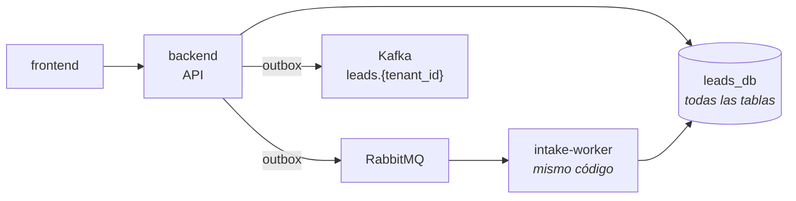

| Rasgo | Consecuencia |
|---|---|
| Una **unidad de trabajo** con 16 repositorios sobre una conexión | Cualquier caso de uso puede leer o escribir cualquier tabla en la misma transacción |
| **Nueve cruces** entre contextos (p. ej. la ingesta lee agentes y grupos; crear un tenant crea fuentes) | Identidad, ingesta, decisión y notificaciones no se pueden desplegar ni fallar por separado |
| Arquitectura hexagonal con guardián AST 4/4 | Casi todo cruce ya pasa por un **puerto**: separar es cambiar el adaptador detrás |

---
layout: blocked
bloque: "2 · Criterio de separación"
idea: "Un servicio por contexto de negocio, no por router ni por tabla. Lo que comparte una transacción local se queda junto."
---

# Cuatro servicios por contexto, más un gateway

| Servicio | Responsabilidad | Base |
|---|---|---|
| **identity** | Tenants, agentes, sesiones, MFA, OAuth, credenciales de integración, token interno | `identity_db` |
| **intake** | Fuentes, jobs, registros crudos, errores, ficheros | `intake_db` |
| **lead-core** | Reglas, motores de viabilidad, scoring y asignación, grupos, asesores, leads, canal de producto | `leads_db` |
| **notifications** | La bandeja de cada destinatario | `notifications_db` |
| **gateway** | Borde: enrutado, autenticación, CORS, `Origin`, `X-Request-Id`, límites | — |

| Alternativa | Por qué se descartó |
|---|---|
| Separar procesos y compartir la base | Monolito distribuido: los despliegues siguen acoplados por el esquema |
| Un servicio por router o por tabla | Reproduce la organización HTTP, no el dominio; multiplica llamadas por lead |
| Scoring y asignación por separado | Distribuye una transacción local (cursor de round-robin, lead y outbox) sin un problema de escala que lo pida |

---
layout: blocked
bloque: "3 · Arquitectura objetivo"
idea: "El navegador y los integradores sólo ven el gateway. Cada servicio tiene su base y se comunica por HTTP o por eventos, nunca por SQL."
---

# Arquitectura objetivo

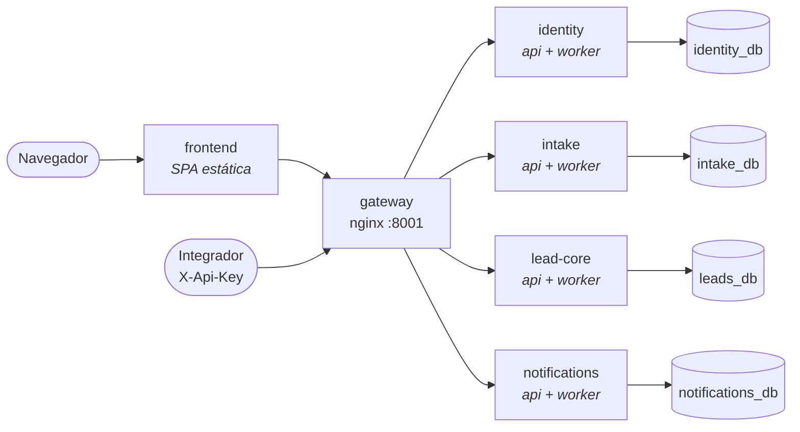

| Pieza | Papel |
|---|---|
| **gateway** | Única entrada de la API; autentica cada petición y enruta por prefijo |
| **Servicio** | Dos procesos de la misma imagen: `api` y `worker` (relay de su outbox y consumidores) |
| **Base** | Una por servicio, con rol propio; ningún servicio lee la de otro |
| **Brokers** | Kafka (hechos y estado) y RabbitMQ (trabajo de fondo), compartidos por todos; sección 8 |

---
layout: blocked
bloque: "4 · Datos"
idea: "Database per service exige propiedad lógica, no cuatro servidores. Un servicio que intentara leer otra base falla al conectar."
---

# Una base por servicio

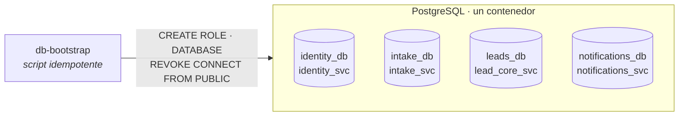

| Regla | Consecuencia |
|---|---|
| Cada rol es **dueño de su base** y sólo tiene `CONNECT` sobre ella | Un acceso cruzado falla al conectar, no en una revisión de código |
| **Sin consultas entre bases** | Lo de otro servicio llega por API, evento o **proyección local** |
| Las FK entre contextos pasan a ser **UUID externos** | La validez del tenant la garantiza el token, no una FK |
| Migraciones por servicio, aplicadas al arrancar su `api` | Cada esquema evoluciona con su servicio |

---
layout: blocked
bloque: "5 · Cómo se separa"
idea: "Primero se hace durable lo que sólo funcionaba dentro de un proceso; después se corta un contexto cada vez."
---

# Plan por fases

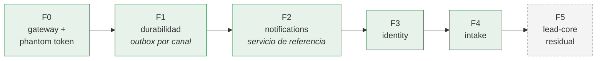

| Fase | Qué cambia | Qué demuestra |
|---|---|---|
| **F0** | nginx delante del monolito; introspección y JWT interno | El contrato con el navegador no cambia; el gateway añade ≈ 3 ms |
| **F1** | Outbox con canales `product`, `internal`, `job`; relays en `backend-worker` | Una caída de broker retrasa el trabajo, no lo pierde |
| **F2** | Primer servicio extraído, sobre un esqueleto que copian los demás | La plantilla funciona antes de repetirla tres veces |
| **F3** | Identity sale; lead-core pasa a una proyección `advisors` | Autenticación entera fuera del monolito, sin cerrar sesiones |
| **F4** | Intake sale; la decisión queda en lead-core detrás de `admissions` | La idempotencia sustituye a la transacción única sin duplicar leads |

---
layout: blocked
bloque: "5 · Cómo se separa"
idea: "Construir es paralelizable porque cada pista vive en su carpeta y trabaja contra contratos congelados. Cortar es secuencial."
---

# Construir frente a cortar

<div class="par">

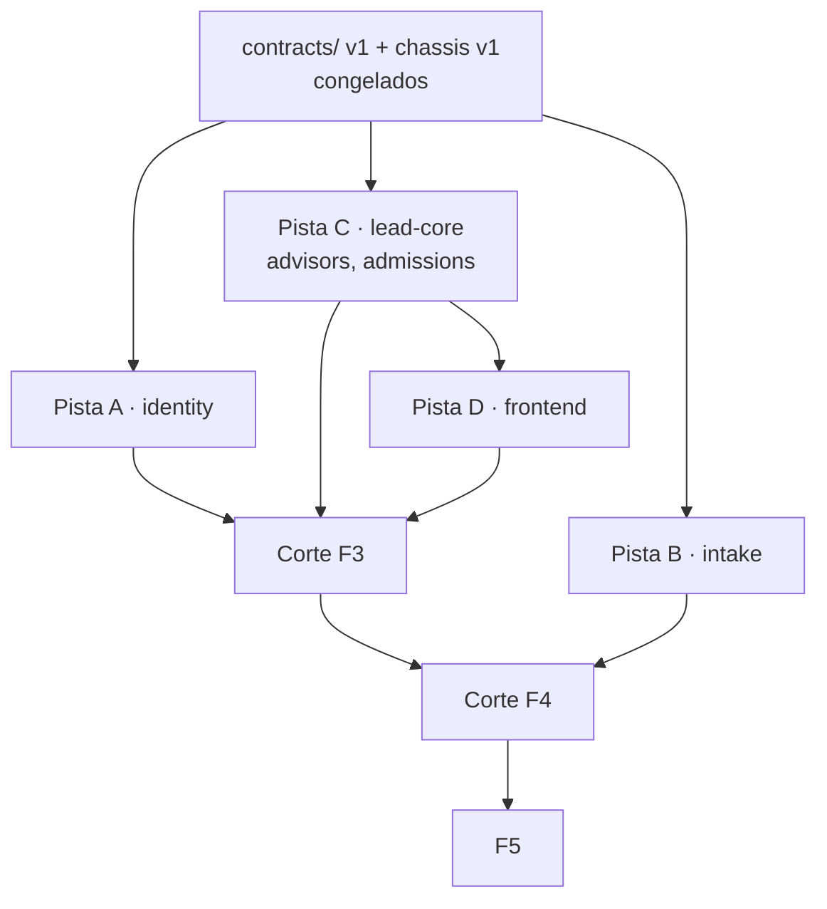

<div class="nota">

**Construir** — el servicio en su carpeta, con su base, sus tests y adaptadores falsos para lo remoto. Cada pista en su propio *worktree* de git.

**Cortar** — migración de datos, rutas del gateway, Compose, harness y retirada del código del monolito. Uno cada vez: comparten ficheros y una ventana sin escrituras.

**expand → migrate → contract** — lo nuevo se añade sin quitar lo viejo (`/advisors` convive con `/agents` y `group_id`); los clientes migran; lo viejo se retira en el corte.

</div>
</div>

---
layout: blocked
bloque: "5 · Cómo se separa"
idea: "Una ventana corta sin escrituras basta para un MVP local. No hay CDC ni doble escritura; la vuelta atrás existe sólo hasta el paso 6."
---

# Procedimiento de corte de datos

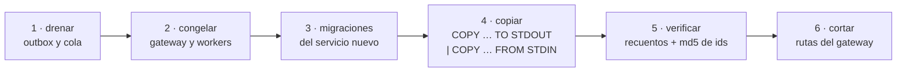

| Corte F3 · identity | Resultado |
|---|---|
| Tablas copiadas con los mismos UUID | 95 tenants · 197 agentes · 262 sesiones (236 activas) · MFA · identidades sociales |
| Verificación | Recuentos y `md5` idénticos en origen y destino |
| Sesiones | Copiadas: **nadie volvió a iniciar sesión** |
| Guardas del script | Se niega con el stack vivo, con outbox interno sin drenar o si identity ya escribió |

---
layout: blocked
bloque: "6 · Esqueleto común"
idea: "Si dos servicios resuelven lo mismo, lo resuelven en el mismo sitio y con el mismo nombre. Sólo cambian dominio, casos de uso y adaptadores."
---

# Mismo esqueleto en todos los servicios

<div class="par">

```text
services/<svc>/
├── Dockerfile · pyproject.toml · uv.lock
├── migrations/NNN_*.sql
├── src/
│   ├── domain/          sin dependencias
│   ├── application/     dtos · ports · use_cases
│   └── infrastructure/
│       ├── main.py      api
│       ├── worker/      relay + consumidores
│       ├── config/ · di/
│       └── adapters/
│           ├── input/   api · internal · consumers
│           └── output/  persistence · http · …
└── tests/  unit · integration · e2e · architecture
```

<div class="nota">

**`libs/chassis`** — sólo código técnico, sin tipos de dominio: verificación del token, pool y migraciones, outbox y relay, consumidor Kafka con DLQ, correlación, guardianes. Entra lo que necesitan dos servicios y no contiene reglas de negocio.

**Proyecto `uv` por servicio**, con `chassis` por ruta. La imagen contiene sólo su servicio y `chassis`: un import cruzado **no compila**.

**Guardián 4/4 y regla de estructura** en cada suite: el dominio no importa nada externo; ≤ 150 líneas por fichero.

</div>
</div>

---
layout: blocked
bloque: "7 · Gateway y autenticación"
idea: "El navegador sólo ve su cookie opaca. Los servicios sólo ven un JWT de vida corta que nadie fuera de la red ha visto."
---

# Phantom token

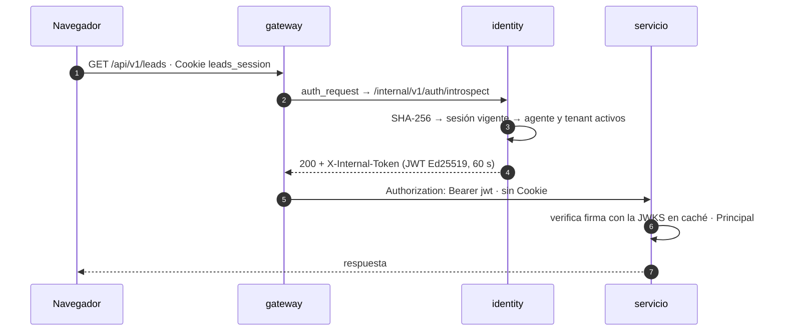

---
layout: blocked
bloque: "7 · Gateway y autenticación"
idea: "Se conserva la cookie opaca de ADR-0029 y los servicios obtienen un JWT que pueden verificar sin llamar a nadie."
---

# Por qué un phantom token

| Decisión | Motivo |
|---|---|
| **El navegador conserva la cookie opaca** | Revocación inmediata y ningún token en almacenamiento web (ADR-0029) |
| **Introspección en cada petición** | Logout, desactivación o suspensión se aplican en la petición siguiente |
| **JWT interno de 60 s** | Cada servicio verifica la identidad en local; los 60 s sólo acotan un token filtrado dentro de la red |
| **Ed25519 asimétrico** | identity firma; los servicios sólo tienen la clave pública y no pueden fabricar identidades |
| **El gateway sobrescribe `Authorization` y quita `Cookie`** | Ningún cliente puede inyectar un bearer; ningún servicio de negocio ve la cookie |
| **Falla cerrado** | identity caído → `503`, nunca deja pasar sin identidad |

| Descartado | Por qué |
|---|---|
| JWT en el navegador | ADR-0029 lo retiró: revocación y almacenamiento |
| Cabeceras sin firmar (`X-User-Id`, `X-Tenant-Id`) | Cualquier proceso de la red podría escribirlas |
| Caché de introspección en el gateway | Retrasa la revocación; la medición (≈ 3 ms) no la justifica |

---
layout: blocked
bloque: "7 · Gateway y autenticación"
idea: "La introspección sólo dice quién es. Qué puede hacer lo decide cada servicio sobre el Principal."
---

# Token interno y su verificación

<div class="par">

| Claim | Valor |
|---|---|
| `iss` · `aud` | `identity` · `lead-router` |
| `sub` · `tid` | agente · tenant (`null` para ADMIN) |
| `role` · `ptype` | `MANAGER`… · `human` / `integration` |
| `exp` | `iat + 60 s` |
| cabecera `kid` | clave de firma, publicada en la JWKS |

<div class="nota">

**`JwksCache` en `chassis`** — idéntico en todos los servicios:

- `kid` conocido y fresco: sin lock ni red.
- Edad máxima 60 s: al recargar se retiran las claves que ya no se publican.
- `kid` desconocido: como mucho una recarga cada 10 s.
- **`401` sólo con prueba**: si el `kid` no se puede comprobar todavía, `KeysUnavailable` → **`503`**. Durante una rotación un `401` cerraría la sesión del SPA.

**Integraciones** (`X-Api-Key`): misma introspección, `ptype=integration`; sólo `GET /leads` lo acepta.

</div>
</div>

---
layout: blocked
bloque: "8 · Comunicación"
idea: "El canal lo decide la pregunta: ¿necesito la respuesta para seguir?, ¿hay un ejecutor o varios consumidores?, ¿hay que poder releer?"
---

# Regla de canal

| Canal | Cuándo | Garantía |
|---|---|---|
| **HTTP síncrono** | Quien llama necesita la respuesta para continuar | Timeout explícito; sólo se reintenta lo idempotente |
| **RabbitMQ** | Trabajo con **un** ejecutor que se reintenta si muere | `ack` manual, redelivery, DLQ |
| **Kafka** | Un **hecho** con uno o varios consumidores, que debe poder releerse | Retención u offsets; compactación para estado |
| **Outbox** | Toda publicación, a cualquiera de los dos brokers | Misma transacción que el agregado; al menos una vez |

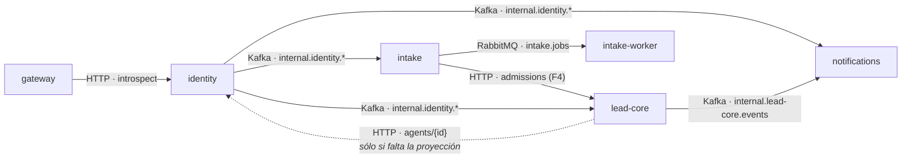

---
layout: blocked
bloque: "8 · Comunicación"
idea: "Nunca se escribe en la base y en un broker por separado. Lo que se publica se registra antes en el outbox del servicio."
---

# Eventos internos por outbox y Kafka

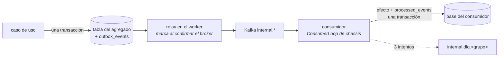

| Pieza | Regla |
|---|---|
| Sobre | `event_id` estable (clave de deduplicación), `event_type`, `schema_version`, `producer`, `tenant_id`, `correlation_id` |
| Hechos | `internal.lead-core.events`, `internal.intake.events`: `delete`, 7 días |
| Estado | `internal.identity.agents` y `.tenants`: estado completo + `version`, **`compact`** |
| Orden | Clave = agregado: la historia de una entidad llega en orden |
| DLQ | La declara el **consumidor**; el offset se confirma después del commit en base |

---
layout: blocked
bloque: "8 · Comunicación"
idea: "Una proyección es una copia local, derivada y reconstruible. Nunca se escribe desde una API pública ni es fuente de verdad."
---

# Proyecciones: cómo lead-core conoce a los asesores

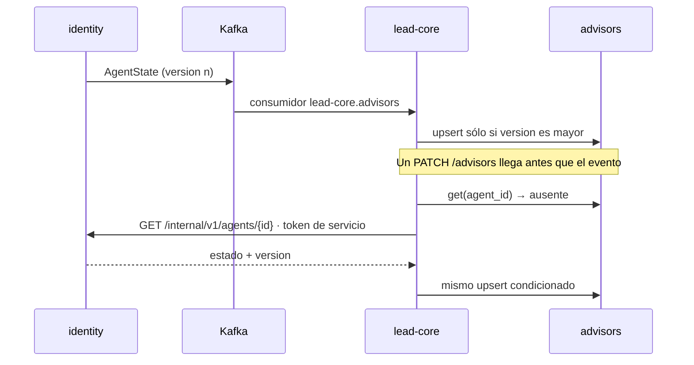

---
layout: blocked
bloque: "8 · Comunicación"
idea: "Consumidor e hidratación aplican la misma escritura condicionada: el orden de llegada deja de importar."
---

# Reglas de las proyecciones

| Proyección | Servicio | Fuente | Uso |
|---|---|---|---|
| `advisors` | lead-core | `internal.identity.agents` | Candidatos de asignación, asignación manual, carga con nombres; `group_id` propio |
| `members` | notifications | `internal.identity.agents` | Gestores de un tenant como destinatarios de avisos |

| Regla | Efecto |
|---|---|
| **Upsert condicionado por `version` en SQL** | Un mensaje atrasado nunca pisa un estado más nuevo; reentregar es inocuo |
| **`group_id` es de lead-core** | Ningún evento de identidad lo toca; se fija en `PATCH /advisors/{id}` |
| **Hidratación bajo demanda** | Asignar grupo o un lead a un agente recién creado no espera al evento |
| **Consistencia eventual aceptada** | Un asesor desactivado puede recibir un lead durante ≈ 1 s; su acceso se corta en la petición siguiente |

---
layout: blocked
bloque: "8 · Comunicación"
idea: "Una transacción que antes cruzaba dos contextos se convierte en un hecho publicado y un consumidor idempotente."
---

# Alta de una organización tras F3

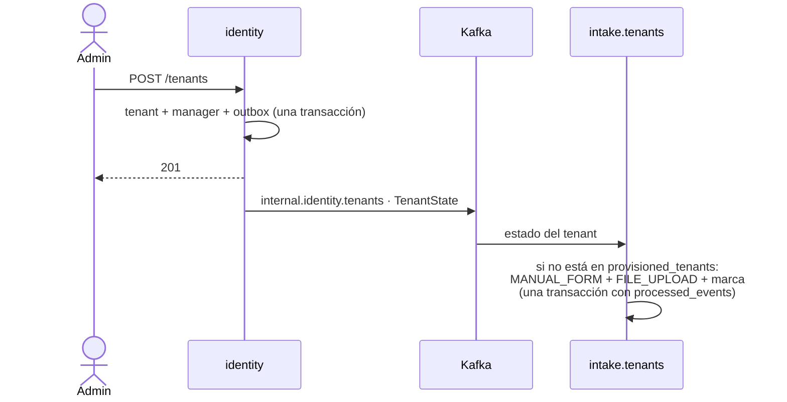

---
layout: blocked
bloque: "8 · Comunicación"
idea: "La consecuencia aceptada es un segundo de espera tras el alta; a cambio, identity no conoce las fuentes de intake."
---

# Alta de una organización: qué cambió

| Antes | Después |
|---|---|
| `CreateTenantUseCase` creaba tenant, manager **y fuentes** en una transacción | identity crea tenant y manager; intake crea las fuentes **al ver el evento** |
| Fuentes disponibles al instante | Disponibles ≈ 1 s después; una ingesta en ese segundo recibe `SOURCE_NOT_FOUND` |
| — | `provisioned_tenants` evita recrear una fuente borrada al releer el topic compactado |

---
layout: blocked
bloque: "8 · Comunicación"
idea: "Las llamadas sin usuario detrás usan client credentials: identity emite un token de servicio que se verifica con el mismo código de chassis."
---

# Llamadas entre servicios

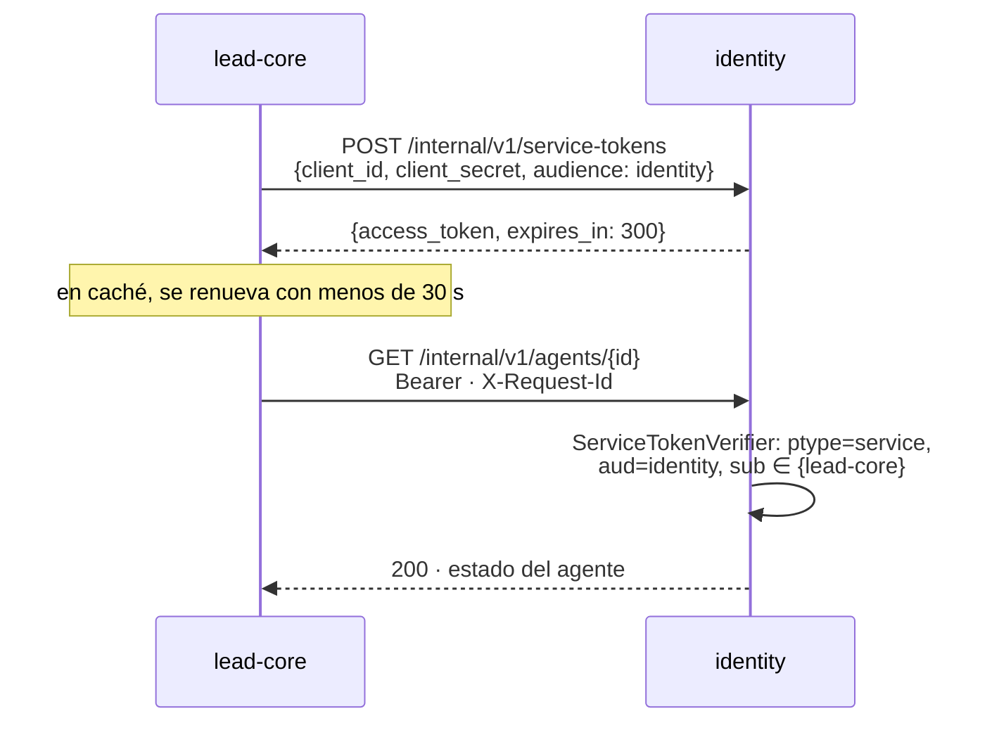

---
layout: blocked
bloque: "8 · Comunicación"
idea: "Los clientes son un conjunto fijo que sólo cambia cuando cambia la arquitectura; por eso son configuración y no una tabla."
---

# Tokens de servicio

| | |
|---|---|
| **Claims** | `iss=identity`, `sub` = servicio llamante, `aud` = servicio llamado, `ptype=service`, `exp = iat + 300 s` |
| **Clientes** | Configuración de identity (`SERVICE_CLIENTS`): `client_id`, audiencias y el **SHA-256 del secreto**, nunca el secreto |
| **Rutas internas** | `/internal/v1/*`: el gateway nunca las publica (`404`) |
| **Tenant** | Sale del dato persistido del llamante, no de una entrada del usuario |
| **Rechazo** | Un `401` descarta el token en caché y el siguiente intento pide otro |
| **Fallo** | identity caído durante una hidratación → `503 SERVICE_UNAVAILABLE`, nunca un `404` falso |
| **Ya proyectado en otra organización** | Se responde `404` en local, sin llamar a identity |

---
layout: blocked
bloque: "9 · Por qué no gRPC"
idea: "gRPC no está descartado para siempre: tiene una señal concreta que lo justificaría, y el cambio queda acotado a un adaptador."
---

# Por qué HTTP/JSON y no gRPC

| Criterio | Situación actual |
|---|---|
| **Volumen de llamadas internas** | Dos rutas síncronas entre servicios: `agents/{id}` (sólo si falta la proyección) y `admissions` (F4) |
| **Latencia medida** | Gateway + introspección ≈ **3 ms** por petición en p50. Lo dominante es bcrypt (≈ 290 ms), no el transporte |
| **`auth_request` de nginx** | Sólo habla HTTP: la introspección seguiría en HTTP aunque el resto pasara a gRPC |
| **API pública** | REST con OpenAPI; el frontend genera sus tipos de los contratos de cada servicio |
| **Coste de una segunda pila** | `protoc`, código generado, otro puerto, otra forma de probar y de depurar |
| **Contratos** | Ya tipados y versionados en `contracts/` (OpenAPI + JSON Schema) con tests en ambos lados |

<div class="destacado">
<span class="destacado-tag">Señal que lo justificaría</span>
La admisión por lotes no basta tras F4, hace falta <strong>streaming</strong> o entran servicios en otros
lenguajes. El cambio es un adaptador detrás de <code>LeadAdmissionPort</code> y <code>AdvisorDirectory</code>;
el dominio y los casos de uso no se tocan.
</div>

---
layout: blocked
bloque: "10 · Contratos"
idea: "Un contrato vive en un solo sitio y lo prueban las dos partes. Si cambia, fallan los tests de ambos lados hasta adaptarse."
---

# `contracts/` y tests de contrato

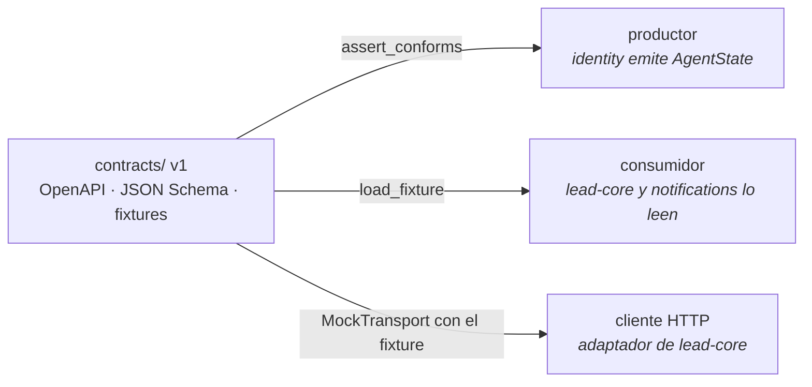

| Contrato | Productor | Consumidores |
|---|---|---|
| `identity-internal.v1.yaml` (introspect, jwks, service-tokens, agents) | identity | gateway, lead-core |
| `AgentState`, `TenantState` | identity | lead-core, notifications, intake |
| `LeadAssigned`, `LeadReassigned`, `LeadLeftUnassigned` | lead-core | notifications |
| `IntakeRejected` | intake | notifications |
| `lead-core-internal.v1.yaml` (`admissions`, lookup) | lead-core | intake |
| `intake/job-message.v1` | intake (relay) | intake-worker |

Compatible = campo opcional nuevo en la misma versión. Incompatible = fichero `v2` y convivencia hasta que no quedan consumidores.

---
layout: blocked
bloque: "11 · Validación"
idea: "Es lo que permite aceptar trabajo sin releer el diff entero: un agente afirma que terminó, y el harness dice si es verdad."
---

# Cómo se valida cada fase

| Comando | Qué demuestra |
|---|---|
| `docker compose --profile test run --rm <svc>-test` | Suite completa del servicio, con su base `*_test` |
| `uv run pytest -m unit` por servicio | Dominio aislado: sin base y sin variables de entorno |
| `./scripts/verify-e2e.sh [--reset]` | Negocio de punta a punta por HTTP real; cada fase añade su `verify_ms_fN` |
| `./scripts/verify-structure.sh` | Regla de estructura (ADR-0037) en todas las raíces Python |
| `bru run flows` | El contrato como lo ve un cliente, con una sesión por rol |

| Al cerrar | F3 | F4 |
|---|---|---|
| `verify-e2e.sh`, en frío (`--reset`) y en caliente | 327 checks | **369 checks** |
| Suites | lead-core 620 · identity 417 · notifications 93 · chassis 218 · frontend 175 | lead-core 475 · intake 421 · identity 417 · notifications 93 · chassis 231 · frontend 176 |
| Bruno | 98/98 | 99/99 |

---
layout: blocked
bloque: "12 · Estado"
idea: "Los cuatro contextos tienen ya su base. Lo que queda en el monolito es lead-core, que pasa a ser el servicio que siempre fue."
---

# Estado tras F4

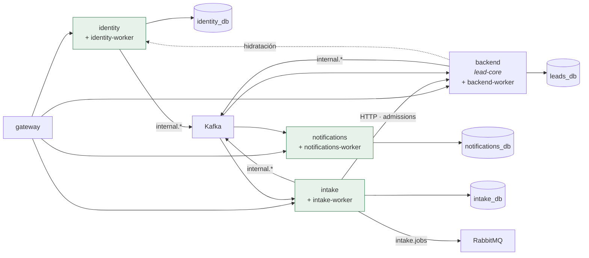

| Hecho en F3–F4 | |
|---|---|
| Fuera del monolito | Autenticación, organizaciones y agentes (F3); fuentes, jobs, registros, ficheros y cola (F4) |
| Sólo intake tiene | Acceso a `intake_db`, la cola `intake.jobs` y el parser (`pandas`, `openpyxl` salen de lead-core) |
| Cambios de contrato | 1: grupo del asesor en `/advisors` (F3). 2: `pending_intake` pasa a `GET /intake/stats` (F4) |

---
layout: blocked
bloque: "12 · Estado"
idea: "Vista C4 de contenedores: quién habla con quién, por qué medio y con qué propósito."
---

# Arquitectura tras F4 · contenedores (C4)


<div class="text-xs text-center"><a href="/c4-contenedores.svg" target="_blank">Abrir a tamaño completo</a> · fuente editable en <code>docs/content/microservices/diagramas/c4-contenedores.drawio</code></div>

---
layout: blocked
bloque: "12 · Estado"
idea: "HTTP cuando se necesita la respuesta, Kafka para hechos y estado, RabbitMQ para trabajo, outbox para toda publicación."
---

# Cómo se comunican los componentes


<div class="text-xs text-center"><a href="/comunicacion.svg" target="_blank">Abrir a tamaño completo</a> · fuente editable en <code>docs/content/microservices/diagramas/comunicacion.drawio</code></div>

---
layout: blocked
bloque: "13 · F4"
idea: "Recepción y decisión se separan. Lo que antes garantizaba una transacción lo garantiza ahora una clave única."
---

# F4 · Intake

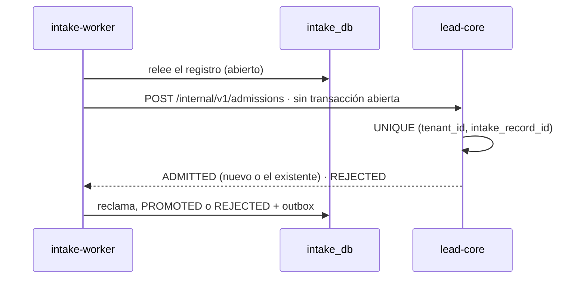

| Decisión | Por qué |
|---|---|
| Ninguna transacción abierta durante la llamada | Una conexión no espera a la red; la carrera la resuelve la restricción única |
| `REJECTED` cubre todo fallo determinista (campo obligatorio, importe fuera de rango) | Un 4xx se reintentaría hasta la DLQ por un dato que no va a cambiar |
| Un job interrumpido espera 10 s antes del `nack` y se corta en el primer fallo de lead-core | Un reinicio de segundos no agota las tres entregas |

---
layout: blocked
bloque: "13 · F4"
idea: "La admisión por HTTP no encarece el job. El primer número, cuatro veces peor, señalaba un artefacto del modo desarrollo."
---

# F4 · Resultado del corte

| Copiado a `intake_db` (recuentos y md5 iguales) | |
|---|---|
| `lead_sources` · `intake_jobs` · `intake_records` | 76 · 117 · 139 |
| `intake_errors` · `intake_files` · `provisioned_tenants` | 36 · 22 · 38 |

| Job de 1.000 registros, de `202` a `COMPLETED` | |
|---|---|
| F0, decisión en proceso | 14,5 s |
| F4, primera medida | 59,8 s · ≈ 42 ms por llamada |
| F4, tras corregir el arranque en desarrollo | 12,9 s y 11,9 s |

`uvicorn --reload` entrega el socket al proceso hijo por descriptor y asyncio deja `TCP_NODELAY` desactivado: cada respuesta en una conexión reutilizada esperaba el ACK retardado. Las APIs arrancan ahora con `watchfiles`, como los workers. En producción no hay recargador.

---
layout: blocked
bloque: "14 · Pendiente"
idea: "Se completa al cerrar F5."
---

# F5 · Lead-core residual

| Cambio | |
|---|---|
| Borrar de `leads_db` las tablas copiadas en F2–F4 | Ya no hay vuelta atrás que proteger |
| Unidad de trabajo, `Settings` y dependencias sólo de lead-core | Configuración por proceso, como identity |
| `backend/` → `services/lead-core/` | Cinco servicios con su guardián 4/4; cada base accesible sólo por su rol |

<div class="destacado">
<span class="destacado-tag">Por completar</span>
Arquitectura final desplegada, recuento de procesos y bases, y comparación de mediciones con la línea base de F0.
</div>

---
layout: blocked
bloque: "15 · Costes y riesgos"
idea: "Lo que el plan introduce también se escribe, con su mitigación."
---

# Costes y riesgos que introduce la separación

| Riesgo | Mitigación |
|---|---|
| **identity en el camino de cada petición** | Falla cerrado (`503`); timeouts de 1 s y 2 s; `keepalive`; réplicas si la medición lo pide |
| **Proyecciones atrasadas** | Upsert por `version`; hidratación de `advisors`; reconstrucción desde topics compactados |
| **Duplicados** (todo es al menos una vez) | `processed_events` o upsert condicionado en cada consumidor; `event_id` estable |
| **Ventanas de migración** | Scripts repetibles con verificación por recuentos y md5; vuelta atrás sólo hasta el corte |
| **`chassis` acopla despliegues** | Sólo código técnico estable; cambiarlo reconstruye las imágenes que lo usan |
| **Más piezas que operar** | De 2 procesos de aplicación a 9, con un patrón idéntico por servicio |
| **Observabilidad mínima** | `X-Request-Id` de punta a punta y logs correlacionados; métricas y trazas quedan fuera del plan |

---
layout: blocked
bloque: "16 · Cierre"
idea: "Se movió código que ya tenía puertos, se cambiaron adaptadores y no se reescribió dominio."
---

# Resumen

| | |
|---|---|
| **Separación** | Por contexto de negocio; una base y un rol por servicio; sin consultas entre bases |
| **Borde** | Un gateway nginx; cookie opaca en el navegador y JWT interno de 60 s dentro de la red |
| **Comunicación** | HTTP cuando hace falta la respuesta; Kafka para hechos y estado; RabbitMQ para trabajo; outbox para toda publicación |
| **Datos de otros** | Proyecciones locales con upsert por `version` e hidratación bajo demanda |
| **Construcción** | Esqueleto idéntico por servicio, `chassis` técnico, contratos probados en ambos lados |
| **Migración** | Fases secuenciales con corte verificado; construcción en paralelo contra contratos congelados |
| **Pendiente** | F5 (lead-core residual) |
