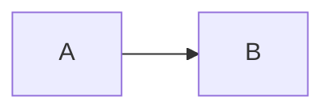

# Presentación de clase

26 diapositivas sobre Lead Router, construidas con [Slidev](https://sli.dev).

```bash
cd .slides
npm install        # sólo la primera vez
npm run dev        # http://localhost:3030 — recarga en caliente
npm run build      # genera dist/ (estático)
npm run export     # PDF, requiere playwright-chromium
```

Durante la exposición: `→` avanza, `←` retrocede, `o` abre la vista general,
`p` alterna el modo presentador y `f` la pantalla completa.

## Estructura

| Fichero | Qué contiene |
|---|---|
| `slides.md` | Las 26 diapositivas. Único fichero de contenido |
| `layouts/blocked.vue` | Plantilla común: cabecera con bloque y contador, cuerpo, pie con la idea clave |
| `layouts/portada.vue` | Variante para la primera diapositiva |
| `style.css` | Tipografía, tablas, código y encaje de los diagramas |
| `SPEC.md` · `PLAN.md` | Diseño y plan de construcción |

Cada diapositiva declara su bloque y su idea clave en el frontmatter:

```markdown
---
layout: blocked
bloque: "3 · Arquitectura"
idea: "Frase de cierre que aparece en el pie."
---
```

Los valores de `bloque` e `idea` **van entre comillas**: sin ellas, un texto con
dos puntos se interpreta como YAML anidado y no se muestra.

## Diagramas

Son bloques Mermaid en línea, con la escala en la propia declaración:

````markdown

````

Mermaid renderiza dentro de un *shadow root*, así que el CSS externo no puede
redimensionar el resultado: si un diagrama no cabe, se ajusta su `scale` o se
aplana su estructura. Los diagramas anchos (`flowchart LR`) aprovechan mejor el
formato apaisado que los verticales.
