# Lead Router

## Arquitectura de una plataforma de enrutamiento de leads

Del modelo de una sola empresa al modelo multi-organización con reglas
configurables.

Arquitectura hexagonal · Python 3 · FastAPI · PostgreSQL con SQL crudo

---
layout: blocked
bloque: "Introducción"
idea: "La sesión combina el caso de negocio, las decisiones de arquitectura y el código que las sostiene."
---

# Objetivos de la sesión

Al terminar la sesión se debería poder responder a estas cinco preguntas:

| | Objetivo |
|---|---|
| **1** | Identificar qué problema de negocio resuelve el sistema y qué decisiones toma sobre cada lead |
| **2** | Distinguir un **invariante del dominio** de una **regla configurable de cada organización**, y aplicar el criterio que las separa |
| **3** | Describir la arquitectura hexagonal del sistema: capas, puertos, adaptadores y regla de dependencia |
| **4** | Reconocer dos incidencias reales de desarrollo, su causa y la corrección aplicada |
| **5** | Localizar en el repositorio dónde vive cada concepto y cómo se verifica automáticamente |

---
layout: blocked
bloque: "Introducción"
idea: "El bloque 2 es el eje de la sesión; los bloques 3 a 5 desarrollan sus consecuencias."
---

# Contenido y recorrido

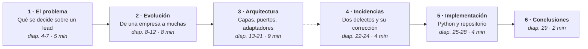

---
layout: blocked
bloque: "1 · El problema"
idea: "El coste del reparto manual no es sólo la lentitud: es la ausencia de trazabilidad sobre la decisión."
---

# Qué es un lead y por qué el reparto manual no escala

Un **lead** es un contacto que ha mostrado interés y todavía no está calificado:
un formulario web, una campaña, un fichero remitido por un socio.

| Problema del reparto manual | Coste asociado |
|---|---|
| **Lentitud** | El lead espera en una hoja de cálculo mientras la competencia contacta antes |
| **Reparto desigual** | Asesores saturados y ociosos de forma simultánea; los mejores leads para el más rápido |
| **Leads perdidos** | Nadie asume la responsabilidad y no queda registro del motivo |

<div class="destacado">
<span class="destacado-tag">La solución</span>
Un sistema que <strong>recibe el lead, lo evalúa contra las reglas que define
cada organización y lo entrega al asesor correspondiente</strong>, registrando el
motivo de la decisión. Lo que ninguna regla cubre no se pierde: queda visible
para su asignación manual.
</div>

---
layout: blocked
bloque: "1 · El problema"
idea: "Las tres decisiones son independientes entre sí y admiten tipos de respuesta distintos."
---

# Las tres decisiones sobre un lead

| Decisión | Pregunta | Naturaleza | Respuesta que admite |
|---|---|---|---|
| **Viabilidad** | ¿Se puede trabajar? | Binaria | Sí o no |
| **Calidad** | ¿Cuánto vale? | Continua | Un valor en una escala, que ordena y admite tramos |
| **Destino** | ¿Quién lo atiende? | Categórica | Un equipo o una persona de un conjunto |

Un lead puede ser viable, de calidad alta y proceder de una campaña atendida por
un equipo concreto. Otro puede ser viable, de calidad media y proceder del
formulario web. Las tres dimensiones no se implican entre sí.

---
layout: blocked
bloque: "1 · El problema"
idea: "Una escala continua no puede expresar decisiones binarias ni categóricas sin efectos indeseados."
---

# Limitación de un modelo de puntuación única

Si la puntuación es la única herramienta disponible, el gestor debe codificar en
una escala continua decisiones que no son cantidades. Se observan dos patrones:

| Objetivo del gestor | Patrón utilizado | Efecto indeseado |
|---|---|---|
| «Sin datos de contacto, descartar siempre» | Restar 9 999 puntos para caer por debajo del corte | Cualquier regla que sume puede recuperar el lead de forma accidental |
| «Los de esta campaña, a este equipo» | Sumar 9 999 y reservar un tramo alto | Dos campañas requieren tramos que no se solapen; añadir una regla de calidad los desplaza |

<div class="destacado">
<span class="destacado-tag">Criterio de diseño aplicado</span>
Asignar a cada decisión <strong>una herramienta acorde a su naturaleza</strong>,
en lugar de ajustar los valores numéricos: reglas de descalificación para lo
binario, puntuación para lo continuo y reglas de asignación para lo categórico.
</div>

---
layout: blocked
bloque: "1 · El problema"
idea: "La etapa de viabilidad interrumpe el proceso: no se puntúa ni se reparte lo que no se puede trabajar."
---

# Pipeline de procesamiento en tres etapas

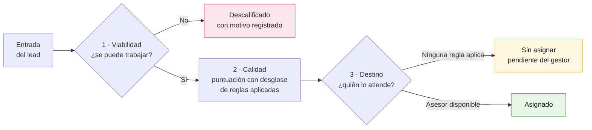

Cada etapa dispone de su propia familia de reglas: descalificación, puntuación y
asignación. Las tres comparten la misma unidad de evaluación.

---
layout: blocked
bloque: "2 · Evolución"
idea: "El criterio comercial era una columna del esquema: modificarlo requería una migración y un despliegue."
---

# Punto de partida: la regla como estructura fija

```sql
-- backend/migrations/001_baseline_schema.sql
CREATE TABLE IF NOT EXISTS scoring_rules (
    id UUID PRIMARY KEY,
    tenant_id UUID NOT NULL,
    name TEXT NOT NULL,
    field TEXT NOT NULL,        -- una condición por regla, y sólo una
    operator TEXT NOT NULL,
    value JSONB NOT NULL,
    score_delta INTEGER NOT NULL
);

CREATE TABLE IF NOT EXISTS routing_rules (
    id UUID PRIMARY KEY,
    tenant_id UUID NOT NULL,
    min_score INTEGER NOT NULL,  -- umbral, con valor por defecto en el código
    target_team TEXT NOT NULL,   -- el equipo es una cadena de texto libre
    assignment_strategy TEXT NOT NULL
);
```

`tenant_id` estaba presente en todas las tablas, pero la tabla `tenants` no
existía: una columna sin entidad asociada y sin mecanismo que garantizara el
aislamiento entre organizaciones.

---
layout: blocked
bloque: "2 · Evolución"
idea: "Ambas afirmaciones parecen validaciones, pero sólo una es cierta en cualquier organización."
---

# Criterio de separación: invariante o regla

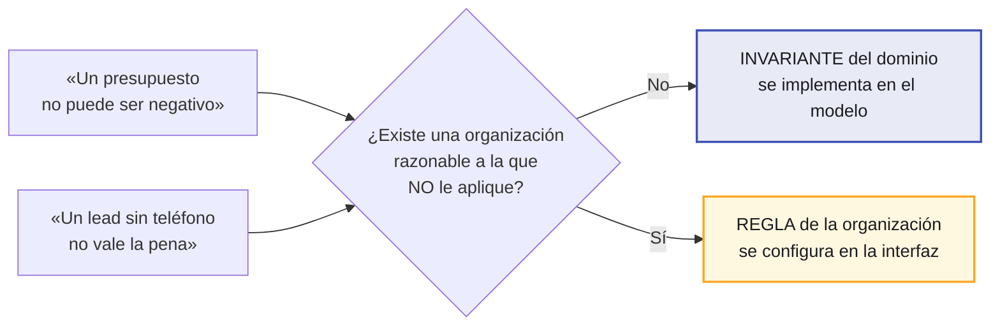

**Criterio complementario:** ¿la afirmación dice que el dato es *coherente* o que
es *rentable*? Coherente corresponde al dominio; rentable, a la organización.

---
layout: blocked
bloque: "2 · Evolución"
idea: "Situar una regla en el dominio produce ramas por cliente; sacar un invariante produce datos incoherentes."
---

# Clasificación resultante

| Permanece en el dominio | Pasa a configuración de la organización |
|---|---|
| Si el lead trae correo, debe tener formato válido | Qué determina que un lead sea contactable |
| El presupuesto no puede ser negativo | Qué campos suman puntos y cuántos |
| Sólo se asigna un lead calificado o sin asignar | A partir de qué puntuación procede asignar asesor |
| El asesor destino pertenece a la organización del lead | Qué asesores forman cada grupo y su capacidad |
| Descartar exige registrar un motivo | En qué orden se evalúan las reglas |
| Ningún actor accede a datos de otra organización | Estrategia de reparto: turnos, menor carga o directo |

Las tres últimas entradas de la columna derecha son las que con mayor frecuencia
se confunden con invariantes.

---
layout: blocked
bloque: "2 · Evolución"
idea: "La evolución es verificable en el control de versiones: ocho migraciones trasladan reglas del código a la configuración."
---

# Evolución del esquema: migraciones 001 – 007

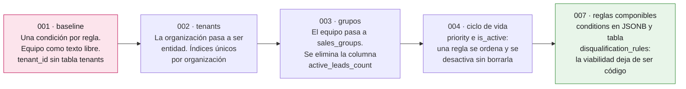

`active_leads_count` era una columna susceptible de desincronizarse. La carga de
un asesor se calcula ahora en el momento de la consulta: un dato derivado no se
almacena.

---
layout: blocked
bloque: "2 · Evolución"
idea: "La organización se deriva del token verificado, no de la URL ni del cuerpo de la petición."
---

# Aislamiento entre organizaciones

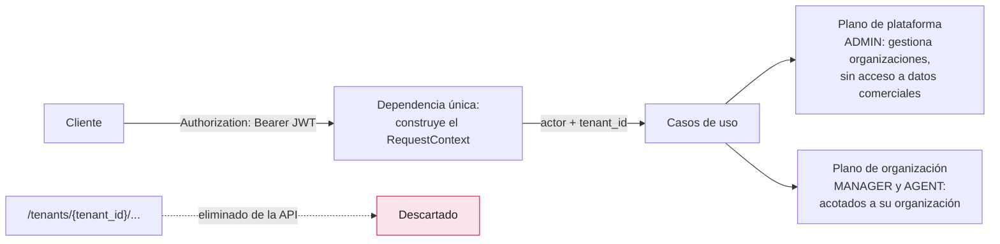

Al solicitar una entidad de otra organización el sistema responde **404, no
403**: un 403 confirmaría la existencia del recurso y permitiría enumerarlo.

---
layout: blocked
bloque: "3 · Arquitectura"
idea: "Las capas internas no conocen a las externas; la dependencia siempre apunta hacia el dominio."
---

# Arquitectura hexagonal: tres capas

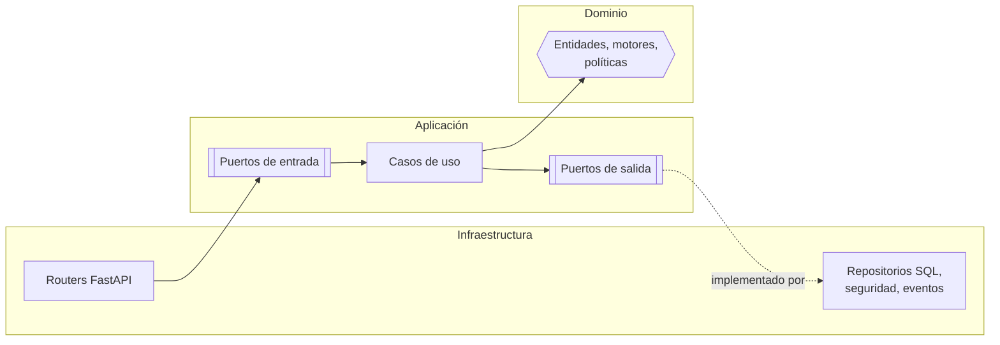

El dominio importa únicamente la biblioteca estándar de Python. La aplicación
accede a la infraestructura sólo a través de los puertos que ella misma declara.

---
layout: blocked
bloque: "3 · Arquitectura"
idea: "Cada caja del hexágono corresponde a un paquete concreto de backend/src, con su recuento real."
---

# Mapa de componentes: qué existe en el código

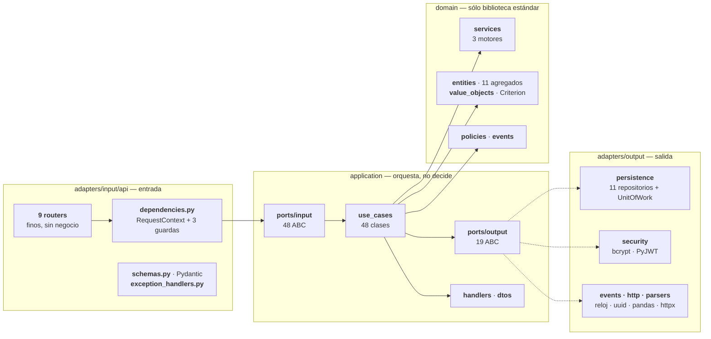

`di/container.py` construye los casos de uso resolviendo cada puerto; los
`handlers/` reaccionan a los eventos ya confirmados.

---
layout: blocked
class: densa
bloque: "3 · Arquitectura"
idea: "Un puerto de entrada por caso de uso: el contrato existe aunque sólo tenga una implementación."
---

# Puertos de entrada I · identidad y configuración

| Área | Puertos de entrada (`application/ports/input/`) | Implementación (`use_cases/`) | Qué resuelve |
|---|---|---|---|
| **Identidad** | `LoginInputPort` | `LoginUseCase` | Verifica credenciales y emite el JWT del que sale la organización |
| **Organizaciones** | `CreateTenantInputPort` · `GetTenantsInputPort` · `UpdateTenantInputPort` | `tenant_use_cases.py` — 3 clases | Alta de organización con sus fuentes y su primer gestor. Sólo plano de plataforma |
| **Asesores** | `GetAgentsInputPort` · `GetAgentInputPort` · `CreateAgentInputPort` · `UpdateAgentInputPort` · `DeactivateAgentInputPort` | `agent_use_cases.py` — 5 clases | Credencial de acceso y receptor de leads. Desactivar, nunca borrar |
| **Grupos** | `CreateSalesGroupInputPort` · `GetSalesGroupsInputPort` · `UpdateSalesGroupInputPort` · `DeleteSalesGroupInputPort` | `sales_group_use_cases.py` — 4 clases | Agrupa asesores con política de reparto y capacidad común |
| **Fuentes** | `CreateLeadSourceInputPort` · `GetLeadSourcesInputPort` · `UpdateLeadSourceInputPort` · `DeleteLeadSourceInputPort` | `lead_source_use_cases.py` — 4 clases | Canal de entrada y su correspondencia de campos |
| **Reglas de puntuación y asignación** | `GetScoringRulesInputPort` · `CreateScoringRuleInputPort` · `UpdateScoringRuleInputPort` · `DeleteScoringRuleInputPort` · `CreateAssignmentRuleInputPort` · `GetAssignmentRulesInputPort` · `UpdateAssignmentRuleInputPort` · `DeleteAssignmentRuleInputPort` | `rule_use_cases.py` — 8 clases | La configuración que sustituyó al código: lo que cada organización decide |
| **Reglas de descalificación** | `CreateDisqualificationRuleInputPort` · `GetDisqualificationRulesInputPort` · `UpdateDisqualificationRuleInputPort` · `DeleteDisqualificationRuleInputPort` | `disqualification_rule_use_cases.py` — 4 clases | La etapa de viabilidad, que antes vivía en el código |

Las cuatro primeras áreas son el **catálogo** de la organización; las dos de
reglas son la **configuración que sustituyó al código**.

---
layout: blocked
class: densa
bloque: "3 · Arquitectura"
idea: "Un puerto de entrada por caso de uso: el contrato existe aunque sólo tenga una implementación."
---

# Puertos de entrada II · operación diaria

| Área | Puertos de entrada (`application/ports/input/`) | Implementación (`use_cases/`) | Qué resuelve |
|---|---|---|---|
| **Ingesta · recepción** | `ReceiveIntakeInputPort` · `ProcessIntakeJobInputPort` | `receive_intake_use_case.py` · `process_intake_job_use_case.py` | Las dos fases con transacción propia: recibir y, después, interpretar |
| **Ingesta · pipeline** | `IngestLeadInputPort` · `ProcessBatchInputPort` | `ingest_lead_use_case.py` · `process_batch_use_case.py` | Atraviesa las tres etapas y promueve el registro a lead |
| **Trabajos de ingesta** | `GetIntakeJobsInputPort` · `GetIntakeJobInputPort` · `ReprocessIntakeJobInputPort` | `intake_job_use_cases.py` — 3 clases | Visibilidad de un lote y reproceso de lo que quedó pendiente |
| **Bandeja de entrada** | `GetIntakeRecordsInputPort` · `PromoteIntakeRecordInputPort` · `DiscardIntakeRecordInputPort` | `intake_record_use_cases.py` — 3 clases | Corregir y reintentar lo que no se pudo interpretar |
| **Leads** | `GetLeadsInputPort` · `GetLeadInputPort` · `GetMyLeadsInputPort` · `AssignLeadInputPort` · `DiscardLeadInputPort` · `GetLeadStatsInputPort` | `get_leads_use_case.py` · `lead_lifecycle_use_cases.py` · `get_lead_stats_use_case.py` | Consulta acotada por rol, asignación manual, descarte con motivo y agregados del panel |
| **Notificaciones** | `GetNotificationsInputPort` · `MarkNotificationReadInputPort` · `MarkAllNotificationsReadInputPort` | `notification_use_cases.py` — 3 clases | Avisos internos por sondeo, con contador de no leídos |

**48 puertos de entrada, 48 casos de uso**: correspondencia uno a uno. El router
nunca invoca una clase concreta, sólo el contrato que declara la aplicación.

---
layout: blocked
class: densa
bloque: "3 · Arquitectura"
idea: "Sustituir el motor de persistencia consiste en escribir un adaptador, sin modificar reglas de negocio."
---

# Puertos de salida · los 19, con su adaptador

| Puerto (`ports/output/`) | Adaptador (`adapters/output/`) | Qué resuelve |
|---|---|---|
| `LeadRepositoryPort` | `RawSqlLeadRepository` | Persistencia del lead, siempre filtrada por organización |
| `RuleRepositoryPort` | `RawSqlRuleRepository` | Reglas de puntuación y asignación, con sus condiciones en JSONB |
| `DisqualificationRuleRepositoryPort` | `RawSqlDisqualificationRuleRepository` | Reglas de la etapa de viabilidad |
| `AgentRepositoryPort` | `RawSqlAgentRepository` | Asesores y su carga de trabajo, contada al vuelo |
| `TenantRepositoryPort` | `RawSqlTenantRepository` | Organizaciones y unicidad global del identificador legible |
| `SalesGroupRepositoryPort` | `RawSqlSalesGroupRepository` | Grupos de venta y su capacidad por asesor |
| `LeadSourceRepositoryPort` | `RawSqlLeadSourceRepository` | Canales de entrada y su correspondencia de campos |
| `IntakeRecordRepositoryPort` | `RawSqlIntakeRecordRepository` | El payload crudo y sus errores por campo |
| `IntakeJobRepositoryPort` | `RawSqlIntakeJobRepository` | Estado del lote: pendiente, en curso, terminado |
| `NotificationRepositoryPort` | `RawSqlNotificationRepository` | Avisos por destinatario y contador de no leídos |
| `WebhookRepositoryPort` | `RawSqlWebhookRepository` | Destinos configurados del webhook saliente |
| `UnitOfWorkPort` | `PostgresUnitOfWork` | Una transacción por petición: confirmar o deshacer como bloque |
| `PasswordHasherPort` | `BcryptPasswordHasher` | Hash y verificación de contraseña |
| `TokenServicePort` | `JwtTokenService` | Emite y verifica el JWT del que se deriva la organización |
| `ClockPort` | `SystemClock` | La hora actual, inyectada para poder afirmar sobre ella en los tests |
| `IdGeneratorPort` | `UuidGenerator` | Identificadores nuevos sin llamar a `uuid4()` desde el dominio |
| `DomainEventPublisherPort` | `InMemoryEventPublisher` | Publica los eventos **después** del *commit* |
| `WebhookDispatcherPort` | `HttpxWebhookDispatcher` | Entrega firmada al sistema externo |
| `FileParserPort` | `PandasFileParser` | Convierte CSV y XLSX en filas, sin que el dominio conozca pandas |

`infrastructure/di/container.py` es el único punto donde se decide qué
implementación concreta recibe cada puerto y con qué ciclo de vida.

---
layout: blocked
class: densa
bloque: "3 · Arquitectura"
idea: "Una regla de dependencia sin verificación automática se degrada con el tiempo."
---

# Verificación automática de la regla de dependencia

```python
# backend/tests/architecture/test_dependency_rule.py
def _imported_roots(path: Path) -> set[str]:
    tree = ast.parse(path.read_text(encoding="utf-8"), filename=str(path))   # 1
    roots: set[str] = set()
    for node in ast.walk(tree):                                              # 2
        if isinstance(node, ast.Import):                                     # 3
            roots.update(alias.name.split(".")[0] for alias in node.names)   # 4
        elif isinstance(node, ast.ImportFrom):
            if node.level == 0 and node.module:                              # 5
                roots.add(node.module.split(".")[0])
    return roots

def _violations(layer: str, forbidden: set[str]) -> list[str]:
    return [f"{p} imports {m}" for p in _python_files(layer)                 # 6
            for m in sorted(_imported_roots(p) & forbidden)]
```

| | Qué hace |
|---|---|
| **1** | Lee el fichero como **texto** y lo convierte en árbol de sintaxis. No lo ejecuta ni lo importa: detecta la violación aunque al módulo le falte una dependencia |
| **2** | Recorre el árbol entero, no sólo el nivel superior: un `import` escondido dentro de una función también cuenta |
| **3-4** | `import psycopg.rows` → guarda `psycopg`. Se queda con la **raíz** del módulo, que es lo que identifica la capa o la librería |
| **5** | `node.level == 0` descarta los imports relativos: por definición no salen del propio paquete |
| **6** | Intersección entre lo que el fichero importa y la lista prohibida de esa capa. Si no está vacía, el test falla nombrando fichero y módulo |

---
layout: blocked
bloque: "3 · Arquitectura"
idea: "El test no describe la regla: la ejecuta contra los 149 ficheros del proyecto en cada suite."
---

# Un test concreto sobre ese andamiaje

```python
# La lista es explícita para que añadir una dependencia sea un acto deliberado.
_THIRD_PARTY_FORBIDDEN_IN_DOMAIN = {
    "pydantic", "fastapi", "starlette", "sqlalchemy", "psycopg", "passlib",
    "bcrypt", "jwt", "httpx", "pandas", "numpy", "openpyxl",
}

def test_domain_does_not_import_third_party_frameworks():
    violations = _violations("domain", _THIRD_PARTY_FORBIDDEN_IN_DOMAIN)
    assert violations == [], (
        "Domain must depend only on the standard library:\n" + "\n".join(violations)
    )
```

`_violations("domain", ...)` recorre **todos** los `.py` de `domain/` y devuelve
una línea por infracción. Si alguien importara `pydantic` en una entidad, el
fallo diría `entities/lead.py imports pydantic` — el fichero y el módulo, no un
«assert False».

Los otros tres tests son la misma llamada con otra pareja: `("domain",
{"application", "infrastructure"})`, `("application", {"infrastructure"})` y
`("application", _WEB_FRAMEWORKS_FORBIDDEN_IN_APPLICATION)`.

---
layout: blocked
bloque: "3 · Arquitectura"
idea: "Una condición se define una vez y se reutiliza en descalificación, puntuación y asignación."
---

# Los tres motores de dominio

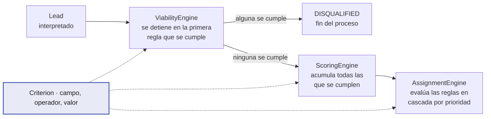

El desglose de puntuación almacena nombre y puntos en el momento del cálculo, de
forma que un lead conserva su justificación aunque la regla se edite o se borre.

---
layout: blocked
bloque: "3 · Arquitectura"
idea: "Descalificado es una decisión automática; descartado es una decisión humana. Unificarlos pierde información."
---

# Ciclo de vida del lead

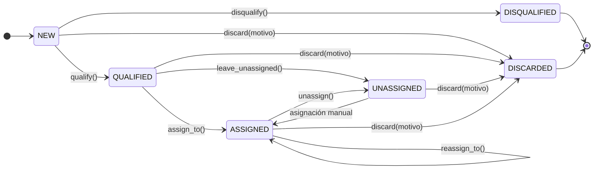

`UNASSIGNED` indica que el lead es válido pero ninguna regla produjo destino.
Mantenerlo separado de `DISQUALIFIED` conserva la utilidad de la bandeja de
revisión.

---
layout: blocked
bloque: "4 · Incidencias"
idea: "El sistema conservaba el dato cuando el error era sutil y lo descartaba cuando era evidente."
---

# Incidencia 1 · Pérdida de datos en la ingesta

El diseño establecía que todo payload recibido debía persistirse antes de
interpretarlo. Verificación con tres peticiones autenticadas, cada una con un
error distinto:

| Petición | Respuesta | ¿Registro creado? |
|---|---|---|
| `email` sin arroba | `202`, con el motivo por campo en la bandeja | **Sí** |
| `budget` con texto no numérico | `422` | **No** |
| Falta un campo obligatorio | `422` | **No** |

Un `budget` de `-50` sí genera registro —atraviesa el borde y lo rechaza el
dominio—, mientras que `"abc"` no. La validación del esquema HTTP interrumpía la
petición antes de ejecutar el servicio encargado de persistir.

---
layout: blocked
bloque: "4 · Incidencias"
idea: "El servicio deja de escribir en el registro de entrada y pasa a consumirlo como cola de trabajo."
---

# Corrección · Recepción y procesamiento separados

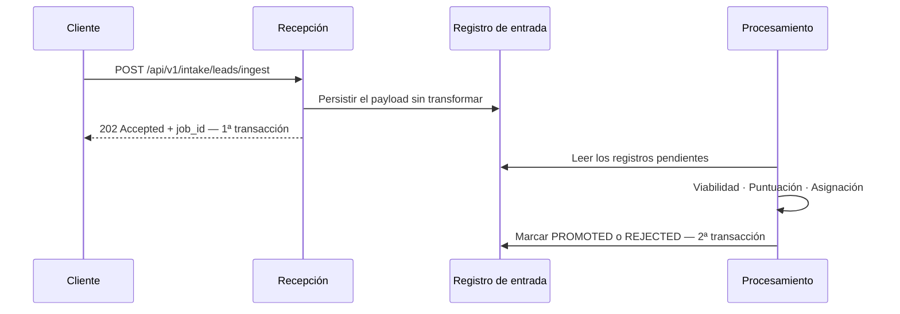

La causa no era de rendimiento: compartir transacción implica que el *rollback*
de una responsabilidad deshace la otra. Ahora son dos transacciones por
construcción.

---
layout: blocked
bloque: "4 · Incidencias"
idea: "Dos cortes de puntuación para la misma decisión, uno de ellos no visible para quien escribe las reglas."
---

# Incidencia 2 · Umbral de puntuación fijado en código

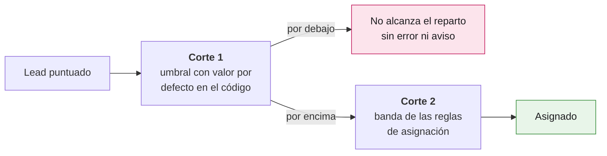

<div class="destacado">
<span class="destacado-tag">Corrección aplicada</span>
Síntoma: una regla de asignación para leads de calidad media no se activaba
nunca, sin mensaje de error. El corte 1 <strong>desaparece</strong> y la banda
más baja de las reglas del gestor pasa a ser el único corte del sistema. La
alternativa descartada —hacer el umbral configurable— mantenía los dos cortes,
sólo que ambos editables.
</div>

---
layout: blocked
bloque: "5 · Implementación"
idea: "Cada capa es un paquete, y lo que puede importar está definido en un test, no en un documento."
---

# Estructura del repositorio

```text
backend/src/
├── domain/            # sin dependencias externas: sólo biblioteca estándar
│   ├── entities/      # Lead, Rule, Tenant, Agent, IntakeRecord…
│   ├── value_objects/ # Criterion, Money, EmailAddress, enums
│   ├── services/      # ViabilityEngine, ScoringEngine, AssignmentEngine
│   ├── policies/      # AuthorizationPolicy
│   └── events/        # LeadAssigned, LeadLeftUnassigned…
├── application/       # depende únicamente de domain/
│   ├── ports/input/   # una clase abstracta por caso de uso
│   ├── ports/output/  # 19 puertos: repositorios, reloj, hasher, tokens…
│   ├── use_cases/     # implementan los puertos de entrada
│   └── dtos/          # @dataclass(frozen=True), sin Pydantic
└── infrastructure/    # única capa que conoce frameworks
    ├── adapters/input/api/   # 9 routers FastAPI y dependencies.py
    ├── adapters/output/      # psycopg, bcrypt, PyJWT, pandas, httpx
    └── di/container.py       # composition root
```

**149 ficheros Python · 88 ficheros de test · 8 migraciones SQL · sin ORM.**

---
layout: blocked
bloque: "5 · Implementación"
idea: "La lista blanca de campos es una frontera de seguridad, no una restricción funcional."
---

# Dominio sin dependencias externas: `Criterion`

```python
# backend/src/domain/value_objects/criterion.py
EVALUABLE_FIELDS = frozenset(
    {"first_name", "last_name", "email", "company", "industry", "budget", "phone", "score"}
)

@dataclass(frozen=True)
class Criterion:
    """One condition of a rule: this field, compared this way, to this value."""
    field: str
    operator: Operator
    value: Any = None

    @classmethod
    def create(cls, field, operator, value=None) -> "Criterion":
        clean_field = (field or "").strip()
        if not clean_field.startswith(_CUSTOM_PREFIX) and clean_field not in EVALUABLE_FIELDS:
            raise DomainException(
                f"El campo '{clean_field}' no es evaluable", error_code="FIELD_NOT_SCORABLE"
            )
        ...
```

Sin esta restricción, una regla comercial podría evaluar el identificador de
organización. `DomainException` transporta un `error_code`, nunca un código HTTP.

---
layout: blocked
bloque: "5 · Implementación"
idea: "Inyectar el reloj elimina un efecto oculto y permite afirmar sobre marcas de tiempo en los tests."
---

# Puerto, adaptador y composition root

```python
# application/ports/output/clock_port.py — la aplicación declara qué necesita
class ClockPort(abc.ABC):
    @abc.abstractmethod
    def now(self) -> datetime:
        """Return the current instant, always timezone-aware in UTC."""

# infrastructure/adapters/output/system_clock.py — la infraestructura implementa
class SystemClock(ClockPort):
    def now(self) -> datetime:
        return datetime.now(timezone.utc)

# infrastructure/di/container.py — el composition root los conecta
class Container:
    def __init__(self) -> None:
        self._clock = SystemClock()

    @property
    def clock(self) -> ClockPort:
        return self._clock
```

Es ceremonia adicional para un MVP y es el coste de que la separación de capas
sea verificable en lugar de una convención.

---
layout: blocked
bloque: "5 · Implementación"
idea: "Una suite en verde no garantiza un producto operativo; el recorrido sobre HTTP real sí lo comprueba."
---

# Estrategia de validación

| Comando | Qué comprueba | Duración |
|---|---|---|
| `docker compose --profile test run --rm backend-test` | Todas las capas, incluida la persistencia real | ~45 s |
| `uv run pytest -m unit -q` | El dominio sin base de datos ni variables de entorno. Si falla fuera de Docker, se ha introducido infraestructura en el dominio | ~1 s |
| `./scripts/verify-e2e.sh` | El flujo de negocio completo sobre HTTP real | ~3 s |

La suite incluye los **cuatro tests de arquitectura**, que deben estar siempre en
4/4. Es lo que permite aceptar una contribución sin revisar el diff completo.

---
layout: blocked
bloque: "6 · Conclusiones"
idea: "Varias funcionalidades ausentes son decisiones documentadas, no omisiones."
---

# Conclusiones

| | |
|---|---|
| **El límite entre dominio y configuración es una pregunta, no un criterio técnico** | ¿Existe una organización razonable a la que la afirmación no le aplique? |
| **Multi-organización no es una columna** | `tenant_id` existía desde el primer día sin aislar nada. El aislamiento proviene de derivar la organización de un token verificado |
| **Una regla de arquitectura requiere verificación automática** | Cuatro tests sobre el AST cuestan menos que una revisión manual recurrente |
| **Validar dos veces el mismo concepto en capas distintas es peor que validar una** | La comprobación externa decide el resultado y la interna nunca llega a intervenir |
| **Cuando varios obstáculos resultan ser el mismo, conviene revisar el planteamiento** | Rediseñar la pregunta resultó más económico que resolver los tres por separado |

Fuera de alcance de forma deliberada, cada una con su justificación registrada:
deduplicación de contactos, constructor visual de reglas y rango acotado de
puntuación.
