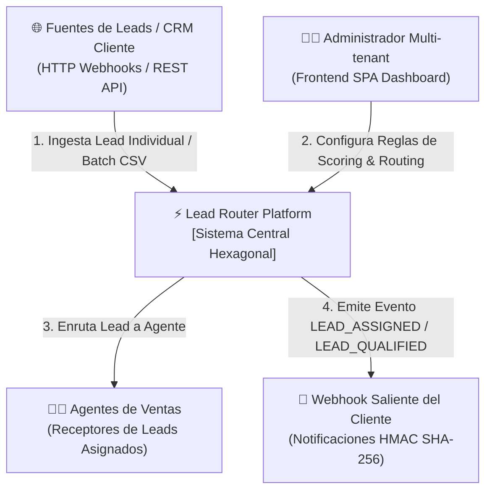
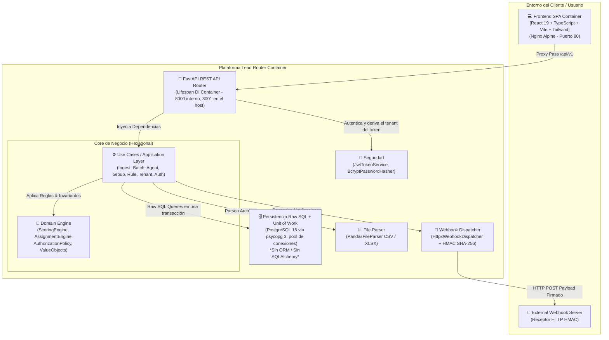
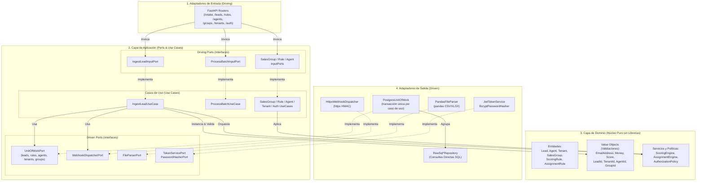

# 🚀 Lead Router Platform (Multi-tenant Hexagonal Monorepo)

Plataforma multi-tenant de **calificación (scoring)** y **enrutamiento (routing)** de prospectos comercializables (leads), diseñada bajo la **Arquitectura Hexagonal Pura (Ports & Adapters)** y construida en un monorepo desacoplado con **FastAPI**, **React 19**, **Tailwind CSS** y **Consultas Raw SQL (sin ORM)**.

---

## 📐 1. Diagramas de Negocio y Arquitectura

### 🏢 1.1 Diagrama C4 - Nivel 1: Contexto de Negocio
Describe cómo interactúan los actores externos, clientes y administradores con la plataforma **Lead Router**.



---

### 📦 1.2 Diagrama C4 - Nivel 2: Contenedores del Sistema
Visualiza los contenedores principales del monorepo y cómo interactúan entre sí.



---

### 🔷 1.3 Diagrama de Arquitectura Hexagonal (Ports & Adapters)
Muestra la separación concéntrica estricta en el Backend. Las capas internas jamás dependen de las externas.



---

### 🔄 1.4 Diagrama de Flujo y Secuencia: Ingesta Individual & Evaluación

```mermaid
sequenceDiagram
    autonumber
    actor Client as Cliente / Webhook
    participant API as FastAPI Router
    participant UC as IngestLeadUseCase
    participant VO as Value Objects (Email, Money)
    participant SE as ScoringEngine
    participant AE as AssignmentEngine
    participant UoW as PostgresUnitOfWork
    participant EV as EventPublisher

    Client->>API: POST /api/v1/intake/{tenant_id}/leads/ingest
    API->>UC: execute(IngestLeadCommand)
    UC->>VO: EmailAddress(email) + Money(budget)
    alt Email o Budget Inválido
        VO-->>UC: Lanza InvalidEmailException / InvalidBudgetException
        UC-->>API: LeadProcessedResult(status="FAILED", error="...")
        API-->>Client: HTTP 400 Bad Request
    else Validaciones Exitosas
        VO-->>UC: Value Objects Válidos instanciados
        UC->>UoW: abre transacción única
        UC->>SE: evaluate(lead, scoring_rules)
        SE-->>UC: Score acumulado (+35 pts)
        UC->>UC: lead.qualify(threshold_qualified=30)
        alt Lead Estado == QUALIFIED
            UC->>UoW: reglas, asesores del tenant, grupos y carga derivada
            UC->>AE: select_agent(lead, rules, agents, groups, loads)
            Note over AE: Cascada por prioridad; excluye asesores<br/>sin capacidad; el cursor rotatorio<br/>vive en la regla, no en memoria
            AE-->>UC: Agente seleccionado o None
            UC->>UoW: persiste el cursor si la regla rotó
        end
        UC->>UoW: save(lead) [Raw SQL] y commit
        UC->>EV: publish(LeadProcessedEvent)
        UC-->>API: LeadProcessedResult(status="ASSIGNED", score=35)
        API-->>Client: HTTP 201 Created JSON
    end
```

> El `tenant_id` de esta ruta viaja en la URL y **el endpoint no exige credencial**: es un defecto
> conocido, registrado en la sección 2.3 del spec, que cierra F2b con `LeadSource`. En el resto de
> la API la organización se deriva siempre del token, nunca de la URL ni del cuerpo.

---

## 📁 2. Por dónde empezar a leer

| Si buscas… | Ve a |
|---|---|
| Qué problema de negocio resuelve, en lenguaje llano | [docs/product/](docs/product/) |
| Qué se dejó **fuera** a propósito, y por qué | [docs/product/mejoras-futuras/](docs/product/mejoras-futuras/) |
| Contratos HTTP, cuerpos y códigos de error | [docs/api/endpoints.md](docs/api/endpoints.md) |
| Cómo se valida y cómo se reparte el trabajo | [CLAUDE.md](CLAUDE.md) |

El backend y el frontend comparten la misma separación en capas —dominio, aplicación,
infraestructura—, así que la estructura de carpetas se explica sola una vez entendido el diagrama
hexagonal de arriba.

---

## 🛠️ 3. Reglas Técnicas y Principios de Diseño

1. **Invariantes en Value Objects**: Validaciones como la sintaxis del correo electrónico ([EmailAddress](backend/src/domain/value_objects/email.py)) o presupuestos no negativos ([Money](backend/src/domain/value_objects/money.py)) residen 100% dentro del constructor del Value Object. Cero validaciones duras en la capa de servicios.
2. **Consultas Raw SQL Directas**: Se prohíbe el uso de ORMs como SQLAlchemy. La persistencia en [RawSqlLeadRepository](backend/src/infrastructure/adapters/output/persistence/raw_sql_lead_repository.py) se realiza mediante SQL puro con los marcadores parametrizados de psycopg 3 (`%s`).
3. **Regla de dependencias verificada por test**: `tests/architecture/` analiza el AST del código y falla si `domain/` importa algo fuera de la biblioteca estándar o si `application/` importa de `infrastructure/`. Es un guardián ejecutable, no una convención escrita.
4. **La organización se deriva del token**: el `tenant_id` sale siempre del JWT a través de `RequestContext`, nunca de la URL ni del cuerpo. El `ADMIN` de plataforma no alcanza dato operativo alguno: son dos planos disjuntos.
5. **Unit of Work**: cada caso de uso que escribe abre una transacción única sobre [PostgresUnitOfWork](backend/src/infrastructure/adapters/output/persistence/postgres_unit_of_work.py), que agrupa los repositorios y confirma o revierte en bloque.
6. **Migraciones versionadas**: ficheros SQL numerados en [backend/migrations/](backend/migrations/), aplicados al arrancar por un runner propio que registra lo ejecutado en `schema_migrations`. Sin Alembic, que arrastraría SQLAlchemy.
7. **Mappers Hexagonales en Frontend**: La capa de presentación y los hooks de React jamás consumen DTOs de infraestructura en bruto. [LeadMapper](frontend/src/application/mappers/lead.mapper.ts) transforma respuestas `snake_case` a modelos de dominio `camelCase`.
8. **Contenedor DI en Lifespan**: FastAPI inicializa conexiones y contenedores de casos de uso en el ciclo de vida `lifespan` de [main.py](backend/src/infrastructure/main.py), inyectándolos en `app.state`.

---

## 🚀 4. Guía de Inicio Rápido

### Prerrequisitos
- Python 3.12+ con `uv` instado (`pip install uv` o vía ejecutable astral-sh).
- Node.js 22+ y `npm`.
- Docker & Docker Compose.

### Ejecución Local del Backend
```bash
cd backend
uv sync                     # Instalar dependencias
uv run pytest -m unit       # Tests de dominio y casos de uso, sin variables de entorno
uv run uvicorn src.infrastructure.main:app --reload --port 8000
```

### Ejecución Local del Frontend
```bash
cd frontend
npm install                 # Instalar dependencias
npm run test                # Ejecutar tests unitarios con Vitest
npm run build               # Validar compilación TypeScript + Vite build
npm run dev                 # Iniciar servidor dev en http://localhost:5173
```

### Ejecución con Docker Compose (Stack Completo)
```bash
docker compose up --build -d
```
Acceder a:
- **Frontend SPA**: `http://localhost:80`
- **Backend API Docs (Swagger UI)**: `http://localhost:8001/docs`

### Ejecución de la Suite de Pruebas

Sin infraestructura (dominio y casos de uso, sin variables de entorno):
```bash
cd backend && uv run pytest -m unit
```

Suite completa (309 tests: unit, integration, e2e y architecture) dentro de
Docker, que es la única forma reproducible de ejecutarla porque requiere
`DATABASE_URL` apuntando a un PostgreSQL real:
```bash
docker compose --profile test run --rm backend-test
```

> `src/`, `tests/` y `migrations/` están montados en el contenedor, así que la suite ejecuta el
> árbol de trabajo tal cual está. **Sólo hace falta `--build` cuando cambian `pyproject.toml` o
> `uv.lock`**, porque el entorno virtual sí vive dentro de la imagen.

### Verificación de negocio

La suite prueba el código; este script prueba el **producto**, sobre HTTP real con tokens reales:

```bash
./scripts/verify-e2e.sh              # contra la pila levantada, ~3 s
./scripts/verify-e2e.sh --reset      # recreando el volumen, al cerrar una fase
```

Cada ejecución usa identificadores propios, así que no necesita base limpia para dar una respuesta
correcta. **Crece con cada fase:** se le añade una función `verify_fN` y se llama desde `main`. No se
reescribe.

El puerto 5433 del host publica el PostgreSQL del compose. Sirve para
ejecutar la suite completa desde fuera del contenedor exportando
`DATABASE_URL` y `TEST_DATABASE_URL` hacia `localhost:5433`. Si ya tienes un
PostgreSQL local escuchando en ese puerto, cambia el mapeo en
`docker-compose.yml`.
