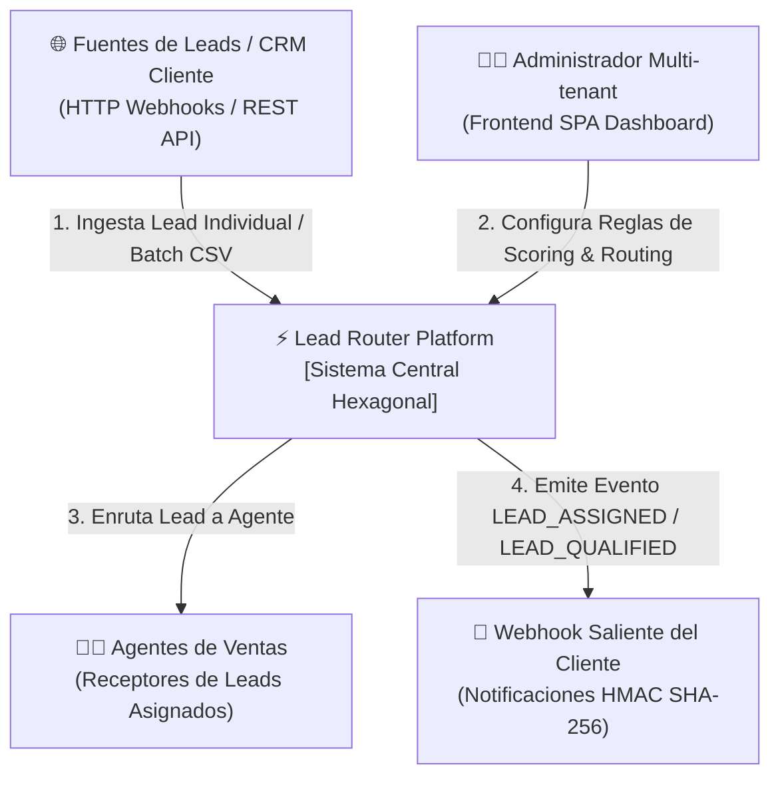
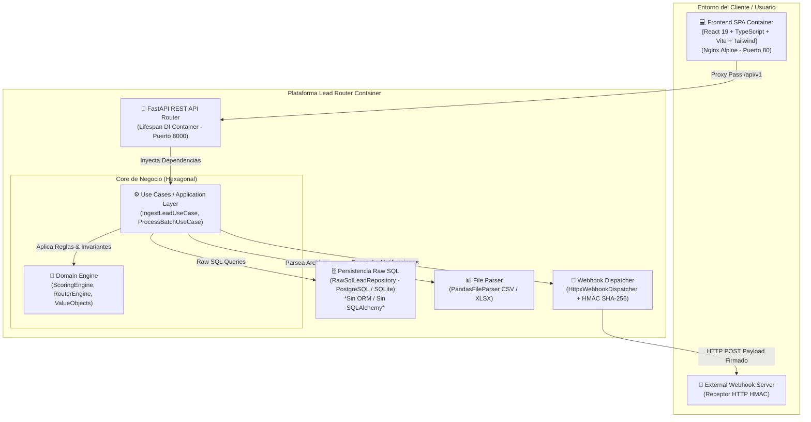
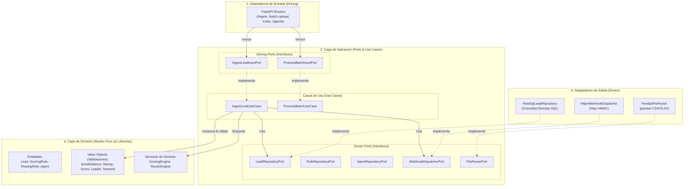
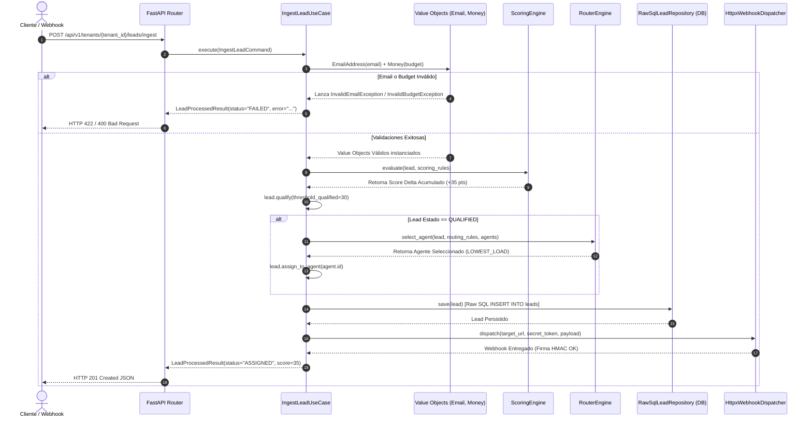

# 🚀 Lead Router Platform (Multi-tenant Hexagonal Monorepo)

Plataforma multi-tenant de **calificación (scoring)** y **enrutamiento (routing)** de prospectos comercializables (leads), diseñada bajo la **Arquitectura Hexagonal Pura (Ports & Adapters)** y construida en un monorepo desacoplado con **FastAPI**, **React 19**, **Tailwind CSS** y **Consultas Raw SQL (sin ORM)**.

---

## 📐 1. Diagramas de Negocio y Arquitectura

### 🏢 1.1 Diagrama C4 - Nivel 1: Contexto de Negocio
Describe cómo interactúan los actores externos, clientes y administradores con la plataforma **Lead Router**.



---

### 📦 1.2 Diagrama C4 - Nivel 2: Contenedores del Sistema
Visualiza los contenedores principales del monorepo y cómo interactúan entre sí.



---

### 🔷 1.3 Diagrama de Arquitectura Hexagonal (Ports & Adapters)
Muestra la separación concéntrica estricta en el Backend. Las capas internas jamás dependen de las externas.



---

### 🔄 1.4 Diagrama de Flujo y Secuencia: Ingesta Individual & Evaluación



---

## 📁 2. Estructura del Monorepo

```
leads-hexa/
├── backend/                            # FastAPI + Python 3.12 (uv, pyproject.toml)
│   ├── src/
│   │   ├── domain/                     # NÚCLEO PURO (Value Objects, Entities, Domain Services)
│   │   ├── application/                # CASOS DE USO Y PUERTOS (Interfaces abc.ABC & DTOs)
│   │   └── infrastructure/             # ADAPTADORES (FastAPI, Raw SQL, httpx, pandas)
│   ├── tests/
│   │   ├── unit/                       # Unit tests de Dominio y Aplicación
│   │   ├── integration/                # Integration tests de Raw SQL y Parsers
│   │   └── e2e/                        # Tests E2E de API y Flujo Completo
│   ├── Dockerfile
│   └── pyproject.toml
├── frontend/                           # React 19 + TypeScript + Vite + Tailwind CSS
│   ├── src/
│   │   ├── domain/                     # Modelos de Dominio Frontend
│   │   ├── application/                # Mappers (DTO <-> Domain) & Services
│   │   ├── infrastructure/             # DTOs REST & Axios API Client
│   │   └── presentation/               # UI Components & Pages (Tailwind v4)
│   ├── tests/                          # Tests unitarios con Vitest
│   ├── Dockerfile
│   └── nginx.conf                      # SPA Server + Reverse Proxy Proxy Pass /api/v1
├── docs/
│   └── diagrams/                       # Archivos .drawio nativos de diagramas
│       ├── c4_context_container.drawio
│       ├── hexagonal_architecture.drawio
│       └── lead_processing_flow.drawio
├── docker-compose.yml                  # Orquestación completa (DB, Backend, Frontend)
└── README.md
```

---

## 🛠️ 3. Reglas Técnicas y Principios de Diseño

1. **Invariantes en Value Objects**: Validaciones como la sintaxis del correo electrónico ([EmailAddress](file:///home/mdcast/Escritorio/PrivateProjects/arquitectura/leads-hexa/backend/src/domain/value_objects/email.py)) o presupuestos no negativos ([Money](file:///home/mdcast/Escritorio/PrivateProjects/arquitectura/leads-hexa/backend/src/domain/value_objects/money.py)) residen 100% dentro del constructor del Value Object. Cero validaciones duras en la capa de servicios.
2. **Consultas Raw SQL Directas**: Se prohíbe el uso de ORMs como SQLAlchemy. La persistencia en [RawSqlLeadRepository](file:///home/mdcast/Escritorio/PrivateProjects/arquitectura/leads-hexa/backend/src/infrastructure/adapters/output/persistence/raw_sql_lead_repository.py) se realiza mediante consultas SQL puras con marcadores de posición parametrizados (`?`).
3. **Mappers Hexagonales en Frontend**: La capa de presentación y los hooks de React jamás consumen DTOs de infraestructura en bruto. [LeadMapper](file:///home/mdcast/Escritorio/PrivateProjects/arquitectura/leads-hexa/frontend/src/application/mappers/lead.mapper.ts) transforma respuestas `snake_case` a modelos de dominio `camelCase`.
4. **Contenedor DI en Lifespan**: FastAPI inicializa conexiones y contenedores de casos de uso en el ciclo de vida `lifespan` de [main.py](file:///home/mdcast/Escritorio/PrivateProjects/arquitectura/leads-hexa/backend/src/infrastructure/main.py), inyectándolos en `app.state`.

---

## 🚀 4. Guía de Inicio Rápido

### Prerrequisitos
- Python 3.12+ con `uv` instado (`pip install uv` o vía ejecutable astral-sh).
- Node.js 22+ y `npm`.
- Docker & Docker Compose.

### Ejecución Local del Backend
```bash
cd backend
uv sync                     # Instalar dependencias
uv run pytest -m unit       # Tests de dominio y casos de uso, sin variables de entorno
uv run uvicorn src.infrastructure.main:app --reload --port 8000
```

### Ejecución Local del Frontend
```bash
cd frontend
npm install                 # Instalar dependencias
npm run test                # Ejecutar tests unitarios con Vitest
npm run build               # Validar compilación TypeScript + Vite build
npm run dev                 # Iniciar servidor dev en http://localhost:5173
```

### Ejecución con Docker Compose (Stack Completo)
```bash
docker compose up --build -d
```
Acceder a:
- **Frontend SPA**: `http://localhost:80`
- **Backend API Docs (Swagger UI)**: `http://localhost:8001/docs`

### Ejecución de la Suite de Pruebas

Sin infraestructura (dominio y casos de uso, sin variables de entorno):
```bash
cd backend && uv run pytest -m unit
```

Suite completa (125 tests: unit, integration, e2e y architecture) dentro de
Docker, que es la única forma reproducible de ejecutarla porque requiere
`DATABASE_URL` apuntando a un PostgreSQL real:
```bash
docker compose --profile test run --rm backend-test
```

El puerto 5433 del host publica el PostgreSQL del compose. Sirve para
ejecutar la suite completa desde fuera del contenedor exportando
`DATABASE_URL` y `TEST_DATABASE_URL` hacia `localhost:5433`. Si ya tienes un
PostgreSQL local escuchando en ese puerto, cambia el mapeo en
`docker-compose.yml`.
