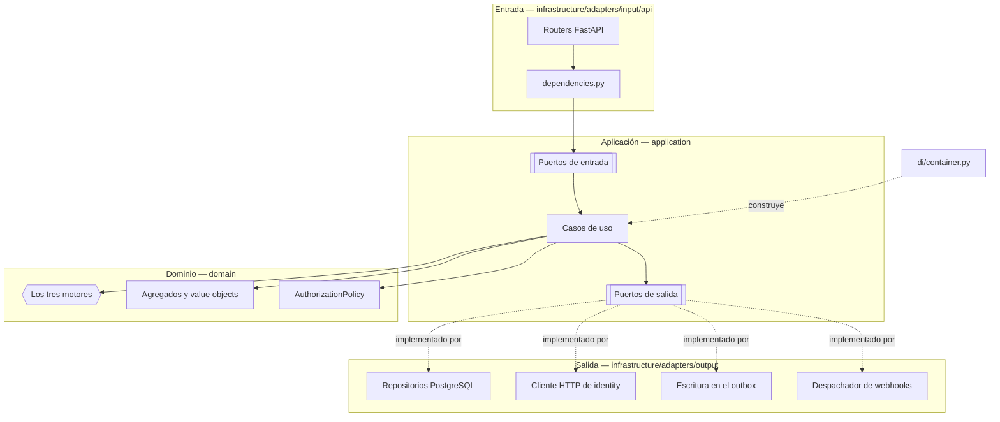

# C4 · Componentes

El tercer nivel del modelo C4, dentro del contenedor `lead-core`. Esta página conecta el hexágono de
[Arquitectura](index.md) con los ficheros reales de `services/lead-core/src/`. La identidad
—sesiones, MFA, OAuth, organizaciones y agentes— es de `services/identity/`
([Servicios y datos](../microservices/02-servicios-y-datos.md#identity)); aquí sólo están la
verificación del token y la copia de los asesores. La recepción —fuentes, trabajos, registros y
ficheros— es de `services/intake/` ([Servicios y datos](../microservices/02-servicios-y-datos.md#intake));
lead-core conserva la decisión, detrás de `/internal/v1/admissions`.

## Adaptadores de entrada

Seis routers públicos y uno interno, todos finos: convierten el cuerpo HTTP en un comando o
consulta, invocan un caso de uso a través de su puerto y mapean el agregado de vuelta a un schema de
respuesta. Ninguno decide una regla de negocio por su cuenta. `/auth`, `/tenants` y `/agents` los
sirve identity; `/sources`, `/intake` y `/notifications`, intake y notifications.

| Router (`infrastructure/adapters/input/api/`) | Prefijo | Qué expone |
|---|---|---|
| `advisors/router.py` | `/api/v1/advisors` | Los asesores de la organización con su grupo y su carga; asignar grupo |
| `groups/router.py` | `/api/v1/groups` | CRUD de grupos de venta |
| `rules/scoring_router.py` | `/api/v1/rules` | Reglas de puntuación |
| `rules/assignment_router.py` | `/api/v1/rules` | Reglas de asignación |
| `rules/disqualification_router.py` | `/api/v1/rules` | Reglas de descalificación |
| `leads/router.py` | `/api/v1/leads` | Consulta de leads, asignación manual, descarte y `GET /leads/stats` |

El router interno, `adapters/input/internal/admissions_router.py`, monta `POST` y `GET
/internal/v1/admissions` fuera de `/api/v1`: el gateway nunca lo publica. Su dependencia
`require_service_caller` verifica el token de servicio con `ServiceTokenVerifier(audience="lead-core")`
y sólo admite al llamante `intake`; un token ausente, inválido o de otro llamante es el mismo `401`.
Tiene sus propios esquemas Pydantic (`budget` viaja como texto) y no aparece en el OpenAPI público.

Tres ficheros más, compartidos por todos los routers públicos: `dependencies.py` construye el
`RequestContext` a partir del bearer interno verificado (el JWT de 60 s que el gateway obtiene por introspección, [ADR-0032](../decisiones/0032-gateway-y-phantom-token.md)) y define las guardas de autorización
(`require_organization_manager`, `require_organization_member` y `require_manager_or_integration`;
la de plataforma, `require_platform_admin`, es de identity), y
`use_case_factories.py` define una función `get_..._use_case` por caso de uso que lo instancia con
sus dependencias resueltas. `exception_handlers.py` traduce cada excepción de dominio a su código
HTTP. Cada contexto tiene su `schemas.py` con los modelos Pydantic de petición y respuesta — la única
capa donde Pydantic existe.

Los consumidores de Kafka son el otro adaptador de entrada, en `adapters/input/consumers/`:
`advisor_consumer.py` (grupo `lead-core.advisors`), con su tabla de grupos en `groups.py`. Lo ejecuta
`lead-core-worker`.

## Casos de uso y puertos de entrada

Cada caso de uso implementa un puerto de entrada (una clase abstracta en
`application/ports/input/<contexto>/`) y no conoce nada de FastAPI.

| Área | Casos de uso (`application/use_cases/`) | Puertos de entrada (`application/ports/input/`) |
|---|---|---|
| Admisión | `admissions/admit_lead.py` (`AdmitLeadUseCase`: la decisión de un registro, idempotente por `(tenant_id, intake_record_id)`) · `admissions/lookup_admissions.py` (la consulta de reconciliación) | `admissions/admission_ports.py` |
| Leads | `leads/get_leads_use_case.py` · `leads/get_lead_stats_use_case.py` · `leads/lead_lifecycle_use_cases.py` | `leads/` |
| Reglas | `rules/scoring_rule_use_cases.py` · `rules/assignment_rule_use_cases.py` · `rules/disqualification_rule_use_cases.py` | `rules/` |
| Grupos | `groups/sales_group_use_cases.py` | `groups/sales_group_use_case_ports.py` |
| Asesores | `advisors/advisor_use_cases.py` (listar, asignar grupo) · `advisors/project_advisor.py` (la proyección) | `advisors/` |

`application/dtos/` completa la capa: un fichero por contexto (`leads.py`, `rules.py`, `groups.py`,
`advisors.py`, `admissions.py`, `outbox.py`) con los `@dataclass(frozen=True)` que cruzan cada puerto,
y `context.py`, que define `RequestContext`.

Las notificaciones las sirve y las escribe el servicio `notifications`
([Notificaciones](../modulos/notificaciones.md)); este contenedor no tiene ese módulo. lead-core sólo
registra en el outbox los eventos que ese servicio consume.

## El dominio y sus tres motores

| Motor | Fichero | Responde |
|---|---|---|
| `ViabilityEngine` | `domain/services/viability_engine.py` | ¿Se puede trabajar este lead? |
| `ScoringEngine` | `domain/services/scoring_engine.py` | ¿Cuánto vale? |
| `AssignmentEngine` | `domain/services/assignment_engine.py` | ¿Quién lo atiende? |

Ver [El recorrido de un lead](recorrido-de-un-lead.md) para lo que decide cada uno.

Cada contexto de `domain/` guarda sus agregados: `leads/` (`lead.py`, con `intake_record_id`, el
registro de intake del que nació, y `lead_transitions.py`, las transiciones de estado), `rules/`
(`scoring_rule.py`, `assignment_rule.py` con su comportamiento en `assignment_rule_behavior.py`, y
`disqualification_rule.py`), `groups/sales_group.py`, `webhooks/webhook.py` (`WebhookConfig`) y
`advisors/advisor.py`, el `Advisor`, la copia del agente que enruta. `domain/policies/authorization_policy.py`
concentra `AuthorizationPolicy`. `domain/events/` declara los eventos que los casos de uso registran en el outbox:
`lead_events.py` (los dos del canal de salida y `LeadAssigned`, `LeadReassigned` y
`LeadLeftUnassigned`) y las bases `domain_event.py` e `internal_event.py`.

## Puertos y adaptadores de salida

Cada puerto de `application/ports/output/<contexto>/` tiene una única implementación, resuelta por el
composition root.

| Puerto de salida | Adaptador | Fichero (`infrastructure/adapters/output/`) |
|---|---|---|
| `LeadRepositoryPort` | `RawSqlLeadRepository` | `persistence/leads/lead_repository.py` |
| `RuleRepositoryPort` | `RawSqlRuleRepository` | `persistence/rules/rule_repository.py` |
| `DisqualificationRuleRepositoryPort` | `RawSqlDisqualificationRuleRepository` | `persistence/rules/disqualification_rule_repository.py` |
| `AdvisorRepositoryPort` | `RawSqlAdvisorRepository` | `persistence/advisors/advisor_repository.py` |
| `AdvisorDirectoryPort` | `HydratingAdvisorDirectory` | `persistence/advisors/hydrating_advisor_directory.py` |
| `IdentityAgentsPort` | `HttpIdentityAgents` | `http/advisors/http_identity_agents.py` |
| `SalesGroupRepositoryPort` | `RawSqlSalesGroupRepository` | `persistence/groups/sales_group_repository.py` |
| `OutboxRepositoryPort` | `RawSqlOutboxRepository` | `persistence/outbox/outbox_repository.py` |
| `WebhookRepositoryPort` | `RawSqlWebhookRepository` | `persistence/webhooks/webhook_repository.py` |
| `UnitOfWorkPort` | `PostgresUnitOfWork` | `persistence/unit_of_work.py` |
| `WebhookDispatcherPort` | `HttpxWebhookDispatcher` | `http/httpx_webhook_dispatcher.py` |

`RawSqlLeadRepository` también guarda y lee `intake_record_id`, traduce la `UniqueViolation` de
`uq_leads_tenant_intake_record` a `DuplicateAdmission` y responde la consulta de admisiones
(`persistence/leads/admission_lookups.py`).

El pool de conexiones (`RawSqlDatabase`) y el aplicador de migraciones (`MigrationRunner`, invocado
una vez al arrancar desde `infrastructure/main.py`) vienen de `chassis.persistence`: no están detrás de
un puerto porque nada del dominio ni de la aplicación necesita sustituirlos.

La entrega no pasa por un puerto de la aplicación: los casos de uso sólo escriben en
`OutboxRepositoryPort`. Quien lee el outbox y entrega es `lead-core-worker` (ver
[C4 · Contenedores](c4-contenedores.md)), con los despachadores de `chassis.outbox` y los de
`events/*_outbound_dispatcher.py`. Los eventos de lead los consume `notifications-worker`, con
adaptadores de entrada en `services/notifications/src/infrastructure/adapters/input/consumers/`; los de
identidad, también `lead-core-worker` (ver arriba). Los de ingesta (`IntakeRejected`) son de
`intake-worker`.

`HttpIdentityAgents` habla con `GET /internal/v1/agents/{agent_id}` de identity a través de un único
`httpx.Client` (2 s de *timeout*), que comparte con el `ServiceTokenClient` de `chassis.auth`; los
dos se construyen una vez en el `Container`, y las dos peticiones llevan el `X-Request-Id` de la que
las provocó. Cualquier fallo, incluido no obtener el token, se traduce a `SERVICE_UNAVAILABLE`; un
`401` de identity además descarta el token cacheado, para que la siguiente llamada pida uno nuevo.

## El composition root

`infrastructure/di/container.py` define `Container(settings: ApiSettings)`, sólo para la API:
construye las implementaciones sin estado propio como instancias únicas para todo el proceso
(`database`, `token_verifier` —contra la JWKS de identity—, `service_token_verifier`,
`assignment_engine`, `advisor_directory`),
y expone `unit_of_work()` como una fábrica — cada petición recibe la suya, porque una unidad de
trabajo abre su propia transacción y no puede compartirse entre peticiones concurrentes. Es aquí
donde se resolvió el defecto original del round-robin: el cursor ya no vive en una instancia que
FastAPI recreaba en cada request.

`dependencies.py`, dentro de `adapters/input/api/`, es quien consulta el contenedor, y cada
`get_..._use_case` de `use_case_factories.py` es una dependencia de FastAPI que arma el caso de uso a
partir del `UnitOfWorkPort` de la petición en curso.

El worker (`infrastructure/worker/main.py`) no usa `Container`: construye `RawSqlDatabase` y su
fábrica de unidades de trabajo, y sólo necesita `WorkerSettings` (`DATABASE_URL`,
`KAFKA_BOOTSTRAP_SERVERS`), nunca la JWKS ni el secreto de servicio. La configuración está partida
por proceso en `infrastructure/config/settings.py`: `ApiSettings` y `WorkerSettings`.

## Ver también

- [El recorrido de un lead](recorrido-de-un-lead.md)
- [Modelo de datos](modelo-de-datos.md)
