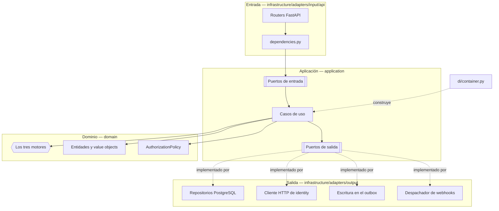

# C4 · Componentes

El tercer nivel del modelo C4, dentro del contenedor `backend` (lead-core). Esta página conecta el
hexágono de [Arquitectura](index.md) con los ficheros reales de `backend/src/`. Desde F3 la
identidad —sesiones, MFA, OAuth, organizaciones y agentes— vive en `services/identity/`, con el mismo
esqueleto ([Servicios y datos](../microservices/02-servicios-y-datos.md#identity)); aquí sólo quedan
la verificación del token y la copia de los asesores. Desde F4 la recepción —fuentes, trabajos,
registros y ficheros— vive en `services/intake/`
([Servicios y datos](../microservices/02-servicios-y-datos.md#intake)); lead-core conserva la
decisión, detrás de `/internal/v1/admissions`.

## Adaptadores de entrada

Cuatro routers públicos y uno interno, todos finos: convierten el cuerpo HTTP en un comando o
consulta, invocan un caso de uso a través de su puerto y mapean la entidad de vuelta a un schema de
respuesta. Ninguno decide una regla de negocio por su cuenta. `/auth`, `/tenants` y `/agents` los
sirve identity; `/sources` e `/intake`, intake.

| Router (`infrastructure/adapters/input/api/`) | Prefijo | Qué expone |
|---|---|---|
| `advisors/advisors_router.py` | `/api/v1/advisors` | Los asesores de la organización con su grupo y su carga; asignar grupo |
| `sales_group_router.py` | `/api/v1/groups` | CRUD de grupos de venta |
| `rule_router.py` | `/api/v1/rules` | Reglas de puntuación, asignación y descalificación |
| `lead_router.py` | `/api/v1/leads` | Consulta de leads, asignación manual, descarte y `GET /leads/stats` |

El router interno, `adapters/input/internal/admissions_router.py`, monta `POST` y `GET
/internal/v1/admissions` fuera de `/api/v1`: el gateway nunca lo publica. Su dependencia
`require_service_caller` verifica el token de servicio con `ServiceTokenVerifier(audience="lead-core")`
y sólo admite al llamante `intake`; un token ausente, inválido o de otro llamante es el mismo `401`.
Tiene sus propios esquemas Pydantic (`budget` viaja como texto) y no aparece en el OpenAPI público.

Tres ficheros más, compartidos por todos los routers públicos: `dependencies.py` construye el
`RequestContext` a partir del bearer interno verificado (el JWT de 60 s que el gateway obtiene por introspección, [ADR-0032](../decisiones/0032-gateway-y-phantom-token.md)) y define las guardas de autorización
(`require_organization_manager`, `require_organization_member` y `require_manager_or_integration`;
la de plataforma, `require_platform_admin`, es de identity), además
de una función `get_..._use_case` por caso de uso que lo instancia con sus dependencias resueltas.
`exception_handlers.py` traduce cada excepción de dominio a su código HTTP. `schemas.py` contiene
los modelos Pydantic de petición y respuesta — la única capa donde Pydantic existe.

Los consumidores de Kafka son el otro adaptador de entrada, en `adapters/input/consumers/`:
`advisor_consumer.py` (grupo `lead-core.advisors`), con su tabla de grupos en `groups.py`. Lo ejecuta
`backend-worker`. El consumidor `intake.tenants` es de intake desde F4.

## Casos de uso y puertos de entrada

Cada caso de uso implementa un puerto de entrada (una clase abstracta en
`application/ports/input/`) y no conoce nada de FastAPI.

| Área | Casos de uso (`application/use_cases/`) | Puertos de entrada (`application/ports/input/`) |
|---|---|---|
| Admisión | `admissions/admit_lead.py` (`AdmitLeadUseCase`: la decisión de un registro, idempotente por `(tenant_id, intake_record_id)`) · `admissions/lookup_admissions.py` (la consulta de reconciliación) | `admissions/admission_ports.py` |
| Leads | `get_leads_use_case.py` · `lead_lifecycle_use_cases.py` | `get_leads_use_case_port.py` · `lead_lifecycle_use_case_ports.py` |
| Reglas | `rule_use_cases.py` · `disqualification_rule_use_cases.py` | `rule_use_case_ports.py` · `disqualification_rule_use_case_ports.py` |
| Catálogo | `sales_group_use_cases.py` | `sales_group_use_case_ports.py` |
| Asesores | `advisors/advisor_use_cases.py` (listar, asignar grupo) · `advisors/project_advisor.py` (la proyección) | `advisors/` |

`application/dtos/` completa la capa: `commands.py` y `queries.py` son los `@dataclass(frozen=True)`
que cruzan cada puerto, y `context.py` define `RequestContext`.

Las notificaciones las sirve y las escribe el servicio `notifications`
([Notificaciones](../modulos/notificaciones.md)); este contenedor no tiene ese módulo. El backend sólo
registra en el outbox los eventos que ese servicio consume.

## El dominio y sus tres motores

| Motor | Fichero | Responde |
|---|---|---|
| `ViabilityEngine` | `domain/services/viability_engine.py` | ¿Se puede trabajar este lead? |
| `ScoringEngine` | `domain/services/scoring_engine.py` | ¿Cuánto vale? |
| `AssignmentEngine` | `domain/services/assignment_engine.py` | ¿Quién lo atiende? |

Ver [El recorrido de un lead](recorrido-de-un-lead.md) para lo que decide cada uno.

Las entidades viven en `domain/entities/`: `sales_group.py`, `lead.py` (con `intake_record_id`, el
registro de intake del que nació), `rule.py` (`ScoringRule` y `AssignmentRule`),
`disqualification_rule.py` y `webhook.py` (`WebhookConfig`). `domain/advisors/advisor.py` es el
`Advisor`, la copia del agente que enruta. `Tenant`, `Agent` y, desde F4, `LeadSource`, `IntakeJob` e
`IntakeRecord` ya no existen aquí. `domain/policies/authorization_policy.py`
concentra `AuthorizationPolicy`. `domain/events/` declara los eventos que los casos de uso registran en el outbox:
`lead_events.py` (los dos del canal de salida y `LeadAssigned`, `LeadReassigned` y
`LeadLeftUnassigned`) y las bases `domain_event.py` e `internal_event.py`.

## Puertos y adaptadores de salida

Cada puerto de `application/ports/output/` tiene una única implementación, resuelta por el
composition root.

| Puerto de salida | Adaptador | Fichero (`infrastructure/adapters/output/`) |
|---|---|---|
| `LeadRepositoryPort` | `RawSqlLeadRepository` | `persistence/raw_sql_lead_repository.py` |
| `RuleRepositoryPort` | `RawSqlRuleRepository` | `persistence/raw_sql_rule_repository.py` |
| `DisqualificationRuleRepositoryPort` | `RawSqlDisqualificationRuleRepository` | `persistence/raw_sql_disqualification_rule_repository.py` |
| `AdvisorRepositoryPort` | `RawSqlAdvisorRepository` | `persistence/advisors/raw_sql_advisor_repository.py` |
| `AdvisorDirectoryPort` | `HydratingAdvisorDirectory` | `persistence/advisors/hydrating_advisor_directory.py` |
| `IdentityAgentsPort` | `HttpIdentityAgents` | `http/advisors/http_identity_agents.py` |
| `SalesGroupRepositoryPort` | `RawSqlSalesGroupRepository` | `persistence/raw_sql_sales_group_repository.py` |
| `OutboxRepositoryPort` | `RawSqlOutboxRepository` | `persistence/raw_sql_outbox_repository.py` |
| `ProcessedEventRepositoryPort` | `RawSqlProcessedEventRepository` | `persistence/raw_sql_processed_event_repository.py` |
| `WebhookRepositoryPort` | `RawSqlWebhookRepository` | `persistence/raw_sql_webhook_repository.py` |
| `UnitOfWorkPort` | `PostgresUnitOfWork` | `persistence/postgres_unit_of_work.py` |
| `ClockPort` | `SystemClock` | `system_clock.py` |
| `IdGeneratorPort` | `UuidGenerator` | `uuid_generator.py` |
| `WebhookDispatcherPort` | `HttpxWebhookDispatcher` | `http/httpx_webhook_dispatcher.py` |

`RawSqlLeadRepository` también guarda y lee `intake_record_id`, traduce la `UniqueViolation` de
`uq_leads_tenant_intake_record` a `DuplicateAdmission` y responde la consulta de admisiones
(`persistence/leads/admission_lookups.py`).

Dos piezas más no están detrás de un puerto porque nada del dominio ni de la aplicación necesita
sustituirlas: `persistence/connection.py` (`RawSqlDatabase`, el pool de conexiones) y
`persistence/migration_runner.py` (`MigrationRunner`, invocado una vez al arrancar desde
`infrastructure/main.py`).

La entrega no pasa por un puerto de la aplicación: los casos de uso sólo escriben en
`OutboxRepositoryPort`. Quien lee el outbox y entrega es `backend-worker` (ver
[C4 · Contenedores](c4-contenedores.md)), con los despachadores de `chassis.outbox` y los de
`events/*_outbound_dispatcher.py`. Los eventos de lead los consume `notifications-worker`, con
adaptadores de entrada en `services/notifications/src/infrastructure/adapters/input/consumers/`; los de
identidad, también `backend-worker` (ver arriba). Los de ingesta (`IntakeRejected`) son de
`intake-worker`.

`HttpIdentityAgents` habla con `GET /internal/v1/agents/{agent_id}` de identity a través de un único
`httpx.Client` (2 s de *timeout*), que comparte con el `ServiceTokenClient` de `chassis.auth`; los
dos se construyen una vez en el `Container`, y las dos peticiones llevan el `X-Request-Id` de la que
las provocó. Cualquier fallo, incluido no obtener el token, se traduce a `SERVICE_UNAVAILABLE`; un
`401` de identity además descarta el token cacheado, para que la siguiente llamada pida uno nuevo.

## El composition root

`infrastructure/di/container.py` define `Container`: construye las implementaciones sin estado
propio como instancias únicas para todo el proceso (`database`, `token_verifier` —contra la JWKS de
identity—, `service_token_verifier`, `clock`, `id_generator`, `assignment_engine`, `advisor_directory`),
y expone `unit_of_work()` como una fábrica — cada petición recibe la suya, porque una unidad de
trabajo abre su propia transacción y no puede compartirse entre peticiones concurrentes. Es aquí
donde se resolvió el defecto original del round-robin: el cursor ya no vive en una instancia que
FastAPI recreaba en cada request.

`dependencies.py`, dentro de `adapters/input/api/`, es quien consulta el contenedor: cada
`get_..._use_case` es una dependencia de FastAPI que arma el caso de uso a partir del `Container` y
del `UnitOfWorkPort` de la petición en curso.

## Ver también

- [El recorrido de un lead](recorrido-de-un-lead.md)
- [Modelo de datos](modelo-de-datos.md)
