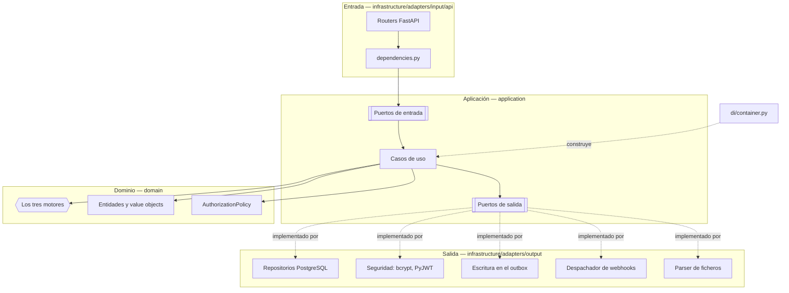

# C4 · Componentes

El tercer nivel del modelo C4, dentro del contenedor `backend`. Esta página conecta el hexágono de
[Arquitectura](index.md) con los ficheros reales de `backend/src/`.

## Adaptadores de entrada

Ocho routers, todos finos: convierten el cuerpo HTTP en un comando o consulta, invocan un caso de
uso a través de su puerto y mapean la entidad de vuelta a un schema de respuesta. Ninguno decide
una regla de negocio por su cuenta.

| Router (`infrastructure/adapters/input/api/`) | Prefijo | Qué expone |
|---|---|---|
| `auth_router.py` | `/api/v1/auth` | Login y la identidad del usuario autenticado |
| `tenant_router.py` | `/api/v1/tenants` | Alta y listado de organizaciones — sólo `ADMIN` |
| `agent_router.py` | `/api/v1/agents` | CRUD de asesores, incluida la regla de bootstrap del primer `ADMIN` |
| `sales_group_router.py` | `/api/v1/groups` | CRUD de grupos de venta |
| `source_router.py` | `/api/v1/sources` | CRUD de fuentes de leads |
| `rule_router.py` | `/api/v1/rules` | Reglas de puntuación, asignación y descalificación |
| `intake_router.py` | `/api/v1/intake` | Recepción de leads, bandeja de entrada, trabajos de ingesta |
| `lead_router.py` | `/api/v1/leads` | Consulta de leads, asignación manual y descarte |

Tres ficheros más, compartidos por todos los routers anteriores: `dependencies.py` construye el
`RequestContext` a partir del bearer interno verificado (el JWT de 60 s que el gateway obtiene por introspección, [ADR-0032](../decisiones/0032-gateway-y-phantom-token.md)) y define las tres guardas de autorización
(`require_platform_admin`, `require_organization_manager`, `require_organization_member`), además
de una función `get_..._use_case` por caso de uso que lo instancia con sus dependencias resueltas.
`exception_handlers.py` traduce cada excepción de dominio a su código HTTP. `schemas.py` contiene
los modelos Pydantic de petición y respuesta — la única capa donde Pydantic existe.

## Casos de uso y puertos de entrada

Cada caso de uso implementa un puerto de entrada (una clase abstracta en
`application/ports/input/`) y no conoce nada de FastAPI.

| Área | Casos de uso (`application/use_cases/`) | Puertos de entrada (`application/ports/input/`) |
|---|---|---|
| Ingesta | `ingest_lead_use_case.py` · `receive_intake_use_case.py` · `process_batch_use_case.py` · `process_intake_job_use_case.py` · `intake_job_use_cases.py` · `intake_record_use_cases.py` | `ingest_lead_use_case_port.py` · `intake_phase_use_case_ports.py` · `process_batch_use_case_port.py` · `intake_job_use_case_ports.py` · `intake_record_use_case_ports.py` |
| Leads | `get_leads_use_case.py` · `lead_lifecycle_use_cases.py` | `get_leads_use_case_port.py` · `lead_lifecycle_use_case_ports.py` |
| Reglas | `rule_use_cases.py` · `disqualification_rule_use_cases.py` | `rule_use_case_ports.py` · `disqualification_rule_use_case_ports.py` |
| Catálogo | `agent_use_cases.py` · `sales_group_use_cases.py` · `lead_source_use_cases.py` | `agent_use_case_ports.py` · `sales_group_use_case_ports.py` · `lead_source_use_case_ports.py` |
| Identidad y organizaciones | `auth_use_cases.py` · `tenant_use_cases.py` | `auth_use_case_port.py` · `tenant_use_case_ports.py` |

`application/dtos/` completa la capa: `commands.py` y `queries.py` son los `@dataclass(frozen=True)`
que cruzan cada puerto, y `context.py` define `RequestContext`.

Las notificaciones ya no son de este contenedor: desde F2 las sirve y las escribe el servicio
`notifications` ([Notificaciones](../modulos/notificaciones.md)). El backend sólo registra en el
outbox los eventos que ese servicio consume.

## El dominio y sus tres motores

| Motor | Fichero | Responde |
|---|---|---|
| `ViabilityEngine` | `domain/services/viability_engine.py` | ¿Se puede trabajar este lead? |
| `ScoringEngine` | `domain/services/scoring_engine.py` | ¿Cuánto vale? |
| `AssignmentEngine` | `domain/services/assignment_engine.py` | ¿Quién lo atiende? |

Ver [El recorrido de un lead](recorrido-de-un-lead.md) para lo que decide cada uno.

Las entidades viven en `domain/entities/`: `tenant.py`, `agent.py`, `sales_group.py`,
`lead_source.py`, `lead.py`, `rule.py` (`ScoringRule` y `AssignmentRule`),
`disqualification_rule.py`, `intake_record.py` (`IntakeRecord` e `IntakeError`), `intake_job.py`
y `webhook.py` (`WebhookConfig`). `domain/policies/authorization_policy.py`
concentra `AuthorizationPolicy`. `domain/events/` declara los eventos que los casos de uso registran en el outbox:
`lead_events.py` (los dos del canal de salida y `LeadAssigned`, `LeadReassigned` y
`LeadLeftUnassigned`), `intake_events.py` (`IntakeRejected` e `IntakeJobRequested`, la orden del canal
`job`), `identity_events.py` (`AgentState` y `TenantState`) y las bases `domain_event.py` e
`internal_event.py`.

## Puertos y adaptadores de salida

Cada puerto de `application/ports/output/` tiene una única implementación, resuelta por el
composition root.

| Puerto de salida | Adaptador | Fichero (`infrastructure/adapters/output/`) |
|---|---|---|
| `LeadRepositoryPort` | `RawSqlLeadRepository` | `persistence/raw_sql_lead_repository.py` |
| `RuleRepositoryPort` | `RawSqlRuleRepository` | `persistence/raw_sql_rule_repository.py` |
| `DisqualificationRuleRepositoryPort` | `RawSqlDisqualificationRuleRepository` | `persistence/raw_sql_disqualification_rule_repository.py` |
| `AgentRepositoryPort` | `RawSqlAgentRepository` | `persistence/raw_sql_agent_repository.py` |
| `TenantRepositoryPort` | `RawSqlTenantRepository` | `persistence/raw_sql_tenant_repository.py` |
| `SalesGroupRepositoryPort` | `RawSqlSalesGroupRepository` | `persistence/raw_sql_sales_group_repository.py` |
| `LeadSourceRepositoryPort` | `RawSqlLeadSourceRepository` | `persistence/raw_sql_lead_source_repository.py` |
| `IntakeRecordRepositoryPort` | `RawSqlIntakeRecordRepository` | `persistence/raw_sql_intake_record_repository.py` |
| `IntakeJobRepositoryPort` | `RawSqlIntakeJobRepository` | `persistence/raw_sql_intake_job_repository.py` |
| `OutboxRepositoryPort` | `RawSqlOutboxRepository` | `persistence/raw_sql_outbox_repository.py` |
| `ProcessedEventRepositoryPort` | `RawSqlProcessedEventRepository` | `persistence/raw_sql_processed_event_repository.py` |
| `IntakeFileRepositoryPort` | `RawSqlIntakeFileRepository` | `persistence/raw_sql_intake_file_repository.py` |
| `WebhookRepositoryPort` | `RawSqlWebhookRepository` | `persistence/raw_sql_webhook_repository.py` |
| `UnitOfWorkPort` | `PostgresUnitOfWork` | `persistence/postgres_unit_of_work.py` |
| `PasswordHasherPort` | `BcryptPasswordHasher` | `security/bcrypt_password_hasher.py` |
| `ClockPort` | `SystemClock` | `system_clock.py` |
| `IdGeneratorPort` | `UuidGenerator` | `uuid_generator.py` |
| `WebhookDispatcherPort` | `HttpxWebhookDispatcher` | `http/httpx_webhook_dispatcher.py` |
| `FileParserPort` | `PandasFileParser` | `parsers/pandas_file_parser.py` |

Dos piezas más no están detrás de un puerto porque nada del dominio ni de la aplicación necesita
sustituirlas: `persistence/connection.py` (`RawSqlDatabase`, el pool de conexiones) y
`persistence/migration_runner.py` (`MigrationRunner`, invocado una vez al arrancar desde
`infrastructure/main.py`).

La entrega no pasa por un puerto de la aplicación: los casos de uso sólo escriben en
`OutboxRepositoryPort`. Quien lee el outbox y entrega es `backend-worker` (ver
[C4 · Contenedores](c4-contenedores.md)), con los despachadores de `chassis.outbox` y
`chassis.rabbit` y los de `events/*_outbound_dispatcher.py`. El consumo de los eventos internos
no está en el backend: lo hace `notifications-worker`, con adaptadores de entrada en
`services/notifications/src/infrastructure/adapters/input/consumers/`.

## El composition root

`infrastructure/di/container.py` define `Container`: construye las implementaciones sin estado
propio como instancias únicas para todo el proceso (`database`, `password_hasher`,
`token_verifier`, `clock`, `id_generator`, `file_parser`, `assignment_engine`),
y expone `unit_of_work()` como una fábrica — cada petición recibe la suya, porque una unidad de
trabajo abre su propia transacción y no puede compartirse entre peticiones concurrentes. Es aquí
donde se resolvió el defecto original del round-robin: el cursor ya no vive en una instancia que
FastAPI recreaba en cada request.

`dependencies.py`, dentro de `adapters/input/api/`, es quien consulta el contenedor: cada
`get_..._use_case` es una dependencia de FastAPI que arma el caso de uso a partir del `Container` y
del `UnitOfWorkPort` de la petición en curso.

## Ver también

- [El recorrido de un lead](recorrido-de-un-lead.md)
- [Modelo de datos](modelo-de-datos.md)
