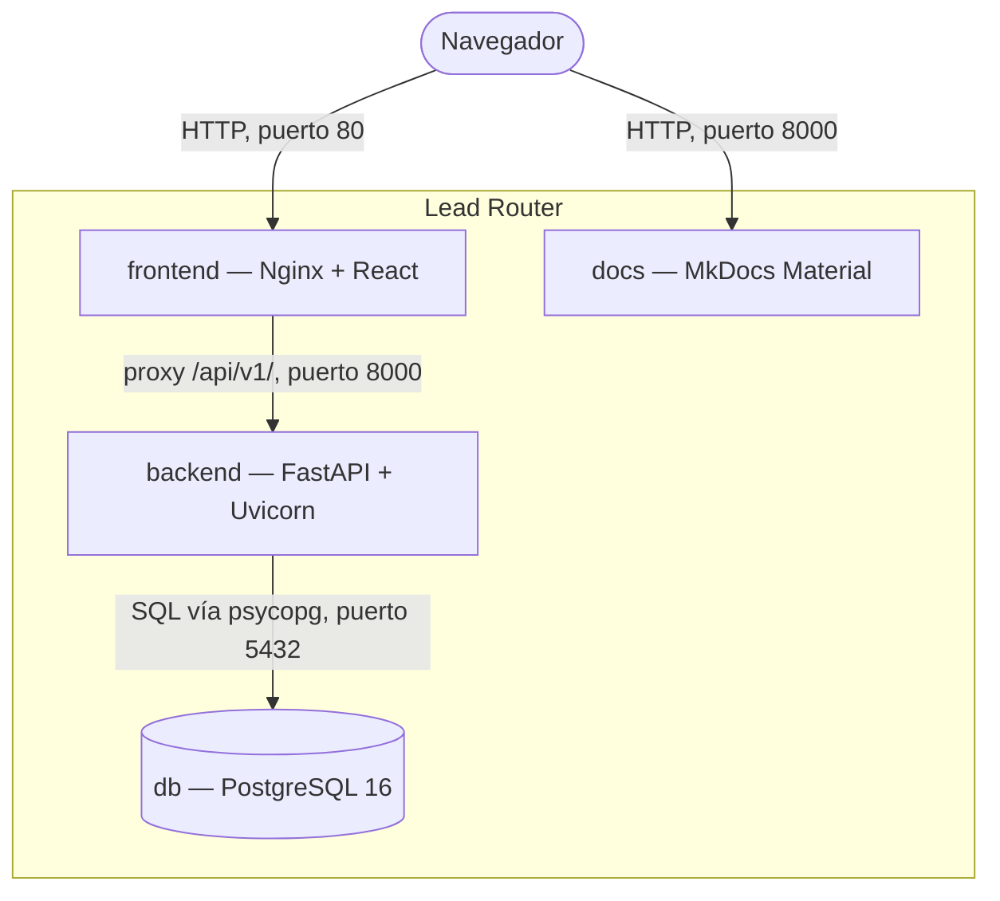

# C4 · Contenedores

El segundo nivel del modelo C4: las piezas desplegables que forman Lead Router, según
`docker-compose.yml`, y cómo hablan entre sí.

## Los contenedores

| Contenedor | Tecnología | Puerto (host:contenedor) | Protocolo | Responsabilidad |
|---|---|---|---|---|
| `frontend` | Nginx sirviendo el build estático de React (Vite) | 80:80 | HTTP | Interfaz web; también hace de proxy inverso de `/api/v1/` hacia `backend` |
| `backend` | FastAPI + Uvicorn sobre Python 3.12 | 8001:8000 | HTTP con JSON | La API completa: autenticación, reglas, ingesta, asignación, notificaciones |
| `db` | PostgreSQL 16 (`postgres:16-alpine`) | 5433:5432 | Protocolo de PostgreSQL, vía `psycopg` | Único almacén de estado del sistema |
| `docs` | MkDocs Material | 8002:8000 | HTTP | Este sitio, servido desde `docs/content` |

Un quinto servicio, `backend-test`, existe sólo bajo el perfil `test`: construye la misma imagen
con destino `test` y ejecuta la suite contra una base de datos efímera. No es un contenedor de
producto; ver [Validación](../desarrollo/validacion.md).

## Qué depende de qué, y por qué

`db` no depende de ningún otro contenedor: es la base del grafo de arranque. `backend` espera a
que `db` esté saludable (`condition: service_healthy`) antes de arrancar, porque aplica las
migraciones nada más iniciar. `frontend` espera a que `backend` esté saludable, para que Nginx no
arranque antes de poder resolver su upstream.

`docs` no depende ni de `backend` ni de `db`. Es deliberado: la documentación tiene que poder
leerse incluso cuando el producto no arranca, que es precisamente cuando más se necesita.

## Volúmenes y recarga

`backend` y `docs` montan su código fuente como volumen de sólo lectura (`./backend/src`,
`./backend/migrations`, `./docs/content`) en vez de copiarlo en la imagen. Un cambio en un
fichero se sirve sin `--build` ni `restart`: Uvicorn recarga con `--reload` y MkDocs sirve en
caliente. Sólo `pgdata`, el volumen de `db`, persiste datos entre arranques; los demás contenedores
son efímeros por diseño.

## Ver también

- [C4 · Componentes](c4-componentes.md) entra dentro del contenedor `backend`.
- [Puesta en marcha](../desarrollo/puesta-en-marcha.md)
