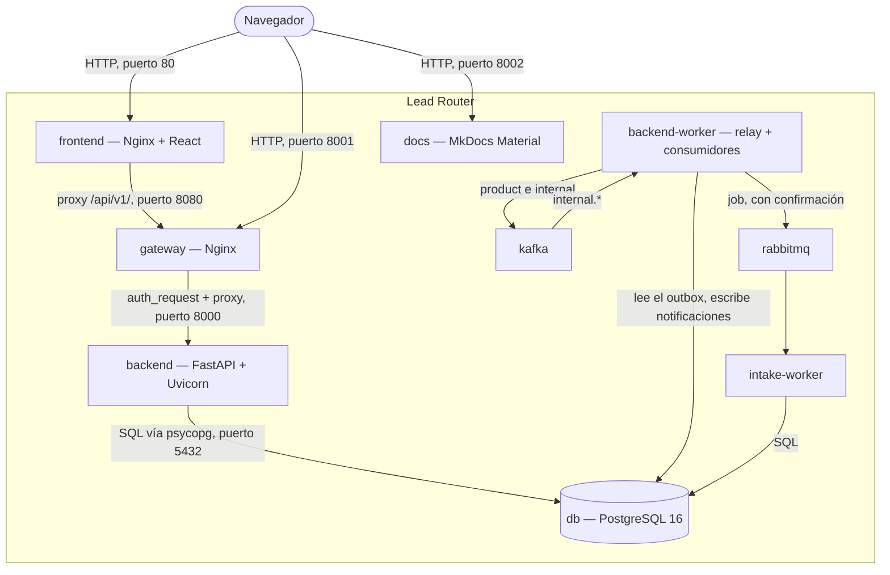

# C4 · Contenedores

El segundo nivel del modelo C4: las piezas desplegables que forman Lead Router, según
`docker-compose.yml`, y cómo hablan entre sí.

## Los contenedores

| Contenedor | Tecnología | Puerto (host:contenedor) | Protocolo | Responsabilidad |
|---|---|---|---|---|
| `frontend` | Nginx sirviendo el build estático de React (Vite) | 80:80 | HTTP | Interfaz web; también hace de proxy inverso de `/api/v1/` hacia `gateway` |
| `gateway` | Nginx (`nginx:1.27-alpine`) | 8001:8080 | HTTP con JSON | Única entrada de la API: enruta, autentica con el *phantom token* (introspección + JWT interno), CORS, `Origin`, `X-Request-Id` y límites. Ver [Gateway y autenticación](../microservices/03-gateway-y-autenticacion.md) |
| `backend` | FastAPI + Uvicorn sobre Python 3.12 | — (sólo red interna, `8000`) | HTTP con JSON | La API completa: autenticación, reglas, ingesta, asignación, notificaciones; sirve también la introspección y la JWKS internas. Sólo **escribe** en el outbox: no entrega nada |
| `backend-worker` | La imagen del `backend`, ejecutando `python -m infrastructure.worker` | — | SQL; Kafka; AMQP; HTTP (webhooks) | La entrega: un relay del outbox por canal (`product`, `internal`, `job`) y los consumidores de notificaciones (`notifications.lead-events`, `notifications.intake-events`). Crea los topics `internal.*` al arrancar |
| `intake-worker` | La imagen del `backend`, ejecutando `python -m infrastructure.intake_worker` | — | AMQP; SQL | Consume `intake.jobs` y ejecuta el procesamiento de cada trabajo de ingesta |
| `kafka` | Apache Kafka (KRaft, un nodo) | 9094 | Kafka con SASL (el host); 9092 sin autenticación dentro de la red | El canal del producto `leads.{tenant_id}` y los topics internos `internal.*` |
| `rabbitmq` | RabbitMQ con el plugin de administración | 5672 · 15672 | AMQP | La cola `intake.jobs` y su cola muerta |
| `db` | PostgreSQL 16 (`postgres:16-alpine`) | 5433:5432 | Protocolo de PostgreSQL, vía `psycopg` | Único almacén de estado del sistema |
| `docs` | MkDocs Material | 8002:8000 | HTTP | Este sitio, servido desde `docs/content` |

`kafka-ui` (consola de Kafka, 8004) es una herramienta de operación, no parte del producto. Otro
servicio, `backend-test`, existe sólo bajo el perfil `test`: construye la misma imagen
con destino `test` y ejecuta la suite contra una base de datos efímera. No es un contenedor de
producto; ver [Validación](../desarrollo/validacion.md).

## Qué depende de qué, y por qué

`db` no depende de ningún otro contenedor: es la base del grafo de arranque. `backend` espera a
que `db` esté saludable (`condition: service_healthy`) antes de arrancar, porque aplica las
migraciones nada más iniciar. `frontend` espera a que `gateway` esté saludable. `gateway` no espera a
nadie: vuelve a resolver el nombre de `backend` por DNS en ejecución, así que arranca sin él y sobrevive
a que se recree.

La API no espera a `kafka` ni a `rabbitmq` ([ADR-0026](../decisiones/0026-kafka-como-canal-del-producto.md),
[ADR-0027](../decisiones/0027-cola-para-el-trabajo-de-fondo.md)): sólo escribe en el outbox, y la
entrega es de `backend-worker`, que espera a `db` pero no a Kafka (reintenta sus topics y sigue
entregando el resto de canales). `intake-worker` sí espera a que `rabbitmq` esté saludable: sin
bróker no tiene nada que hacer. Separar la entrega de la API significa que un bróker lento o un
webhook que agota su plazo no consumen capacidad de petición, y que reiniciar la API no interrumpe la
entrega.

`docs` no depende ni de `backend` ni de `db`. Es deliberado: la documentación tiene que poder
leerse incluso cuando el producto no arranca, que es precisamente cuando más se necesita.

## Volúmenes y recarga

`backend` y `docs` montan su código fuente como volumen de sólo lectura (`./backend/src`,
`./backend/migrations`, `./docs/content`) en vez de copiarlo en la imagen. Un cambio en un
fichero se sirve sin `--build` ni `restart`: Uvicorn recarga con `--reload`, MkDocs sirve en
caliente, y `backend-worker` e `intake-worker` se reinician solos con `watchfiles` al cambiar
`backend/src` o `libs/chassis/src`. Sólo `pgdata`, el volumen de `db`, persiste datos entre arranques; los demás contenedores
son efímeros por diseño.

## Ver también

- [C4 · Componentes](c4-componentes.md) entra dentro del contenedor `backend`.
- [Puesta en marcha](../desarrollo/puesta-en-marcha.md)
