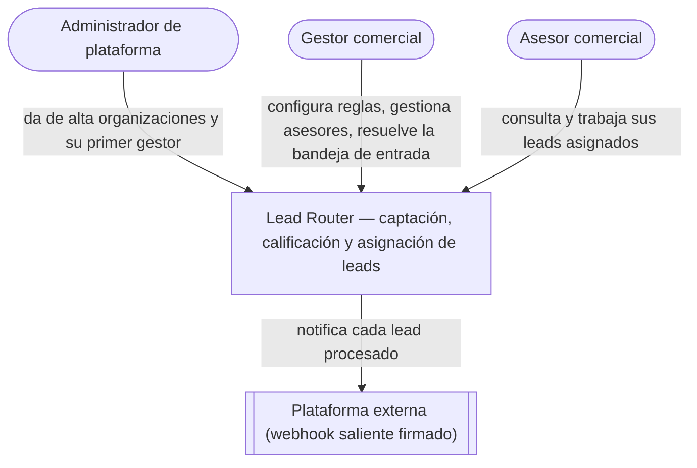

# C4 · Contexto

El primer nivel del modelo C4: Lead Router como caja negra, quién lo usa y con qué otro sistema
habla.

## El sistema

Lead Router es una plataforma multi-tenant: varias organizaciones (empresas cliente) comparten el
mismo despliegue sin ver los datos unas de otras. Recibe leads comerciales, los puntúa con reglas
propias de cada organización y los asigna a un asesor de forma automática. Lo que ninguna regla
sabe resolver queda visible para que un gestor intervenga a mano.

## Tipos de usuario

| Actor | Rol técnico | Alcance | Qué hace |
|---|---|---|---|
| Administrador de plataforma | `ADMIN` | Ninguna organización propia | Da de alta organizaciones y su primer gestor. No accede a leads, reglas ni asesores de ningún cliente |
| Gestor comercial | `MANAGER` | Su organización | Administra asesores, grupos, reglas y fuentes; ve toda la cartera de leads; resuelve la bandeja de entrada; asigna a mano y descarta |
| Asesor comercial | `AGENT` | Sus propios leads | Consulta y trabaja los leads que se le asignaron; recibe notificaciones |

El administrador de plataforma y el gestor no son el mismo rol con más permisos: operan sobre
objetos distintos. Un `ADMIN` no tiene organización propia y no puede leer los datos operativos de
ninguna, ni siquiera con más privilegios — es una separación de planos, no una jerarquía.

## Sistemas externos

Hoy no hay ningún sistema externo empujando leads hacia dentro: la ingesta llega por el formulario
individual o la carga de fichero, ambas acciones del propio gestor sobre la interfaz, no de un
tercero por red. La incorporación de una fuente externa autenticada por webhook está fuera del
alcance de este MVP; ver [Webhook entrante](../roadmap/webhook-entrante.md).

En sentido saliente sí existe una integración: por cada lead procesado, el sistema puede notificar
a una plataforma externa mediante un webhook firmado, si la organización tiene uno configurado.
Hoy esa configuración no tiene una API propia — vive sólo en la base de datos —, así que en la
práctica no hay ningún destino dado de alta.

## Ver también

- [C4 · Contenedores](c4-contenedores.md) abre el sistema en sus piezas desplegables.
- [Identidad y acceso](../modulos/identidad-y-acceso.md) detalla los tres roles y sus permisos.
- [ADR-0003 · Dos planos disjuntos](../decisiones/0003-dos-planos-disjuntos.md)
