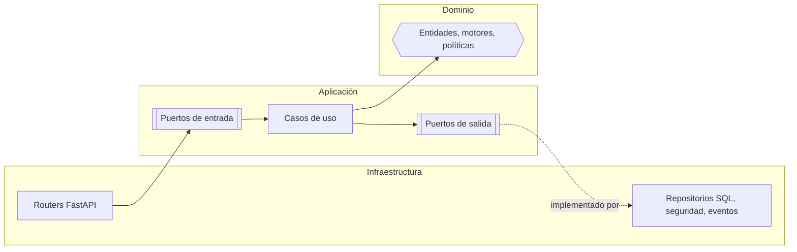

# Arquitectura

Lead Router separa el código en tres capas concéntricas —dominio, aplicación e infraestructura—
con una única regla: las capas internas no conocen a las externas. Esta página describe esas
capas, qué puede importar cada una, y el guardián automático que lo comprueba en cada ejecución de
la suite.

## Las tres capas

`backend/src/` contiene las tres, cada una en su propio paquete:

| Capa | Ruta | Contenido |
|---|---|---|
| Dominio | `backend/src/domain/` | Entidades, value objects, los tres motores de negocio, políticas, eventos y excepciones |
| Aplicación | `backend/src/application/` | Puertos de entrada y salida (ABC), casos de uso, DTOs y manejadores de eventos |
| Infraestructura | `backend/src/infrastructure/` | Routers FastAPI, adaptadores de salida, configuración y el composition root |

### Dominio

Es el núcleo: `entities/` (agregados con comportamiento, no estructuras de datos pasivas),
`value_objects/` (invariantes atados al constructor: un `EmailAddress` o un `Money` inválidos no
llegan a existir), `services/` (los tres motores: `ViabilityEngine`, `ScoringEngine`,
`AssignmentEngine`), `policies/` (`AuthorizationPolicy`, quién puede hacer qué) y `events/` (lo
que las entidades emiten). `exceptions.py` no conoce HTTP: una excepción de dominio lleva un
`error_code`, nunca un código de estado.

### Aplicación

Orquesta sin tomar decisiones de negocio. `ports/input/` declara un contrato ABC por caso de uso;
`ports/output/` declara lo que la infraestructura debe implementar (repositorios, hasher de
contraseñas, servicio de tokens, reloj, generador de identificadores, publicador de eventos,
parser de ficheros). `use_cases/` implementa los puertos de entrada. `dtos/` son
`@dataclass(frozen=True)`, nunca Pydantic. `handlers/` reacciona a eventos de dominio ya
confirmados: notificar, despachar un webhook saliente.

### Infraestructura

Todo lo que depende de un framework o de un driver externo. `adapters/input/api/` son los routers
FastAPI, finos: convierten HTTP en comandos y comandos en respuestas, sin lógica de negocio propia.
`adapters/output/` implementa cada puerto de salida sobre PostgreSQL con SQL crudo (`psycopg`),
bcrypt, PyJWT, `pandas` y un publicador de eventos en memoria. `di/container.py` es el composition
root: decide qué implementación concreta recibe cada puerto y su ciclo de vida.

## La regla de dependencia

El dominio no importa nada de `application` ni de `infrastructure`, ni ninguna librería de
terceros: sólo la biblioteca estándar de Python. La aplicación no importa `infrastructure`: conoce
la infraestructura únicamente a través de los puertos que ella misma declara. La infraestructura es
la única capa que puede importar las otras dos.

La flecha entre `POUT` y `REPOS` va en el sentido de la inversión de dependencias: el puerto de
salida lo declara la aplicación, y es la infraestructura la que depende de él —no al revés—, aunque
en tiempo de ejecución los datos viajen en sentido contrario.

Lo que se gana: el dominio se prueba sin base de datos, sin HTTP y sin variables de entorno. Un
caso de uso se prueba con dobles de los puertos, sin levantar PostgreSQL. Cambiar de PostgreSQL a
otro almacén, o de bcrypt a otro hasher, es escribir un adaptador nuevo detrás del mismo puerto,
sin tocar una sola regla de negocio.

## El guardián automático

La regla de dependencia no se sostiene sola bajo presión: sin algo que la compruebe, un import de
`infrastructure` dentro de un caso de uso pasaría el resto de la suite en verde.
`backend/tests/architecture/test_dependency_rule.py` la hace irrompible.

En vez de importar cada módulo —lo que fallaría en cuanto faltase una dependencia externa—,
recorre su árbol de sintaxis con `ast` y lee los imports directamente del código fuente, sin
ejecutarlo. Son cuatro pruebas:

- `test_domain_does_not_import_outer_layers` — `domain/` no importa `application` ni
  `infrastructure`.
- `test_application_does_not_import_infrastructure` — `application/` no importa `infrastructure`.
- `test_domain_does_not_import_third_party_frameworks` — `domain/` no importa Pydantic, FastAPI,
  Starlette, SQLAlchemy, psycopg, passlib, bcrypt, `jwt` (PyJWT), httpx, pandas, numpy ni openpyxl.
- `test_application_does_not_import_web_frameworks` — `application/` no importa FastAPI,
  Starlette, Pydantic, psycopg, httpx ni pandas.

!!! note "Dónde se ejecuta"
    Las cuatro corren siempre, sin base de datos, como parte de la suite completa y de los tests
    unitarios. Ver [Validación](../desarrollo/validacion.md).

## Ver también

- [C4 · Componentes](c4-componentes.md) conecta cada capa con sus ficheros reales.
- [ADR-0001 · Arquitectura hexagonal](../decisiones/0001-arquitectura-hexagonal.md)
