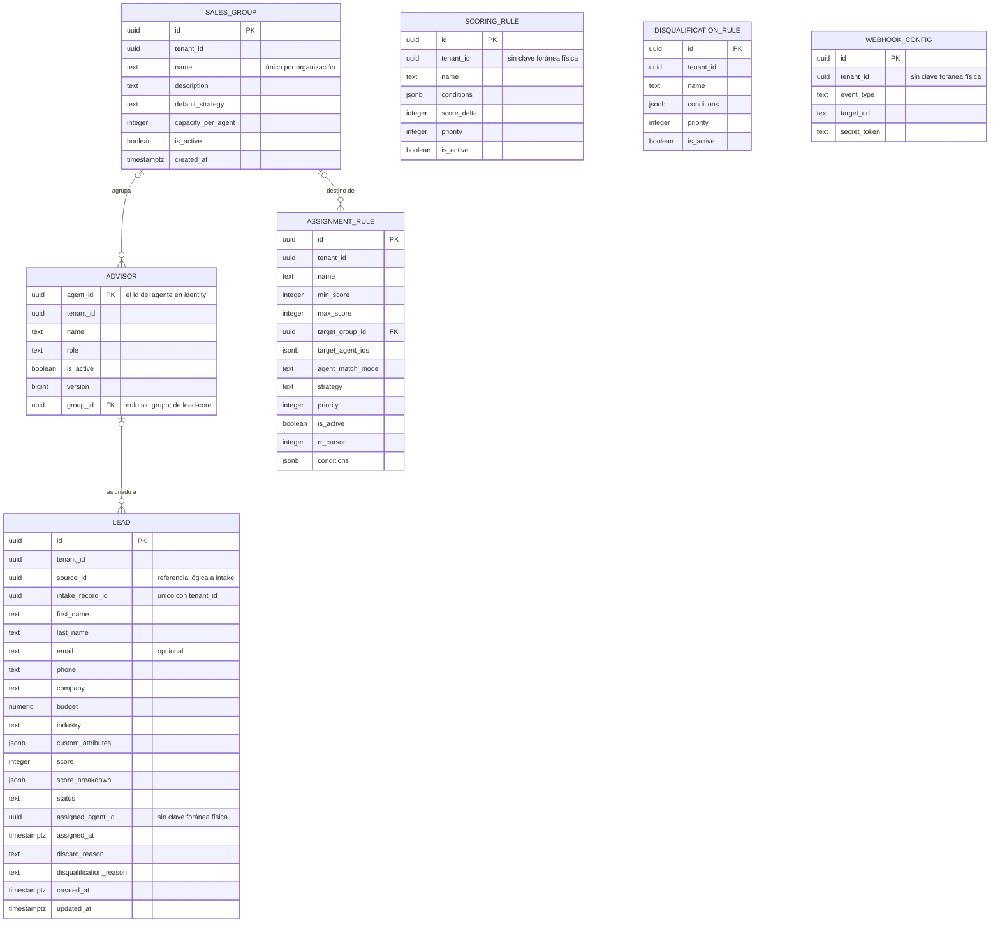
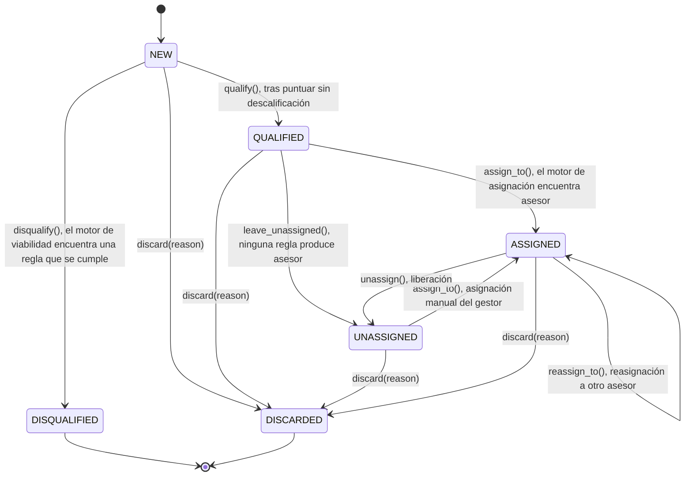
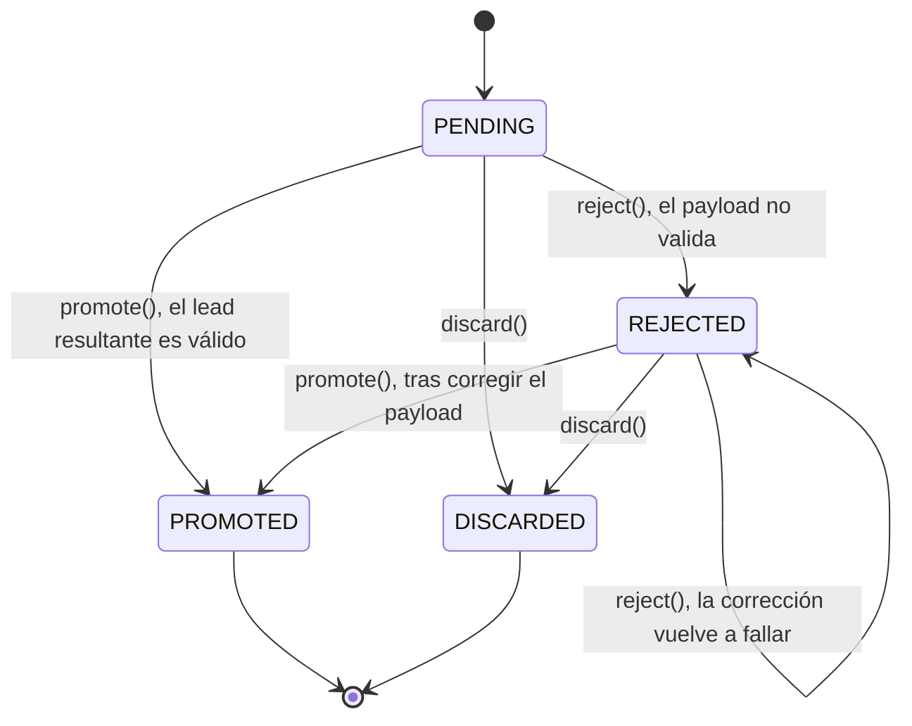
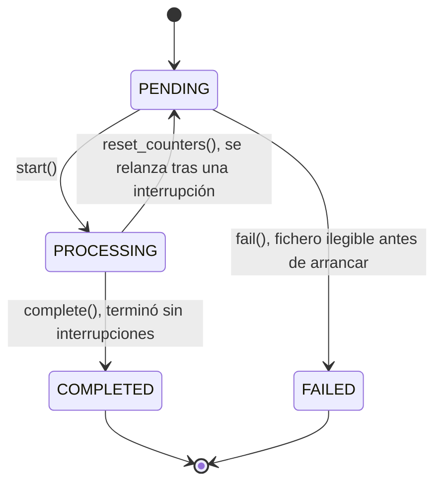

# Modelo de datos

El modelo entidad-relación de `leads_db`, la base de lead-core, tal como lo dejan las migraciones de
`services/lead-core/migrations/`, y las máquinas de estados que gobiernan el ciclo de vida de un lead
y de la ingesta que lo origina. `leads_db` tiene nueve tablas y sólo la abre el rol `lead_core_svc`;
cada servicio tiene su base y su rol (ADR-0031).

| Tabla | Qué guarda |
|---|---|
| `leads` | Los leads: datos, puntuación, estado y asesor asignado. `UNIQUE (tenant_id, intake_record_id)` es la clave de idempotencia de la admisión |
| `advisors` | Proyección de los agentes de identity (`version` la escribe el consumidor `lead-core.advisors`) más el `group_id`, que es de lead-core |
| `sales_groups` | Grupos de venta |
| `scoring_rules`, `assignment_rules`, `disqualification_rules` | Las tres familias de reglas, con sus condiciones en JSONB |
| `webhook_configs` | Destinos de webhooks salientes |
| `outbox_events` | El outbox transaccional que entrega `lead-core-worker` ([Outbox](../eventos/outbox.md)) |
| `schema_migrations` | Migraciones ya aplicadas |

Las entidades de los demás servicios viven en sus bases y no se dibujan aquí:

| Servicio | Base | Tablas | Documentación |
|---|---|---|---|
| identity | `identity_db` | organizaciones, agentes, sesiones, MFA, identidades sociales | [Identidad y acceso](../modulos/identidad-y-acceso.md), [Organizaciones](../modulos/organizaciones.md) |
| intake | `intake_db` | fuentes, trabajos, registros, errores y ficheros de ingesta | [Ingesta](../modulos/ingesta.md) |
| notifications | `notifications_db` | la bandeja de avisos | [Notificaciones](../modulos/notificaciones.md) |

Ninguna tabla de `leads_db` lleva clave foránea hacia ellas: `tenant_id`, `source_id` y
`assigned_agent_id` son referencias lógicas, garantizadas por el token y por la admisión.

## Diagrama entidad-relación

## Los agregados

### Advisor

`services/lead-core/src/domain/advisors/advisor.py`, tabla `advisors`. La copia del agente que
lead-core necesita para enrutar: `name`, `role`, `is_active` y `version`, que escribe sólo el
consumidor `lead-core.advisors` con un *upsert* condicionado por `version`, más `group_id`, que es de
lead-core y sólo cambia `PATCH /advisors/{agent_id}`. El agente en sí (credenciales, correo, MFA) es
de identity y no se guarda aquí.

### SalesGroup

`services/lead-core/src/domain/groups/sales_group.py`, tabla `sales_groups`. Agrupa asesores que comparten política de
asignación. `name` no vacío y único por organización; `capacity_per_agent`, si se define, debe ser
mayor que cero. Borrar un grupo no arrastra sus asesores ni las reglas que lo señalan: `group_id`
en `advisors` y `target_group_id` en `assignment_rules` quedan en `NULL`, así que el gestor ve el
hueco en vez de perder datos en cascada.

### Lead

`services/lead-core/src/domain/leads/lead.py` (las transiciones, en `lead_transitions.py`), tabla `leads`. El prospecto comercial: existe si sus datos son
coherentes, no si son comercialmente útiles. `budget` es un `Money` (`Decimal` no negativo);
`email`, si viene, debe tener formato válido, pero su ausencia ya no impide crear el lead. Cada
transición de estado está guardada en su propio método — ver la máquina de estados más abajo.
`assigned_agent_id` no lleva clave foránea física: es `Lead._bind_agent()` quien impide asignar el
lead a un asesor de otra organización, comparando `tenant_id` en memoria antes de guardar.

### ScoringRule y AssignmentRule

`services/lead-core/src/domain/rules/scoring_rule.py` y `assignment_rule.py`, tablas `scoring_rules` y `assignment_rules`. Comparten `conditions`,
una lista de `Criterion` serializada en JSONB. `ScoringRule` no exige un nombre no vacío — a
diferencia de `AssignmentRule` y `DisqualificationRule`, que sí lo hacen. `AssignmentRule` exige
al menos un `target_group_id` o un `target_agent_id` (si no, no podría producir ningún candidato),
y si define `max_score` éste debe ser mayor o igual que `min_score`. `rr_cursor` es el cursor del
reparto rotatorio, persistido en la fila para que sobreviva entre peticiones.

### DisqualificationRule

`services/lead-core/src/domain/rules/disqualification_rule.py`, tabla `disqualification_rules`. Exige nombre no vacío
y al menos una condición: una regla sin condiciones se cumpliría para cualquier lead y
descalificaría a la organización entera.

### WebhookConfig

`services/lead-core/src/domain/webhooks/webhook.py`, tabla `webhook_configs`. Configura un destino externo para el
webhook saliente firmado. No declara invariantes propias más allá del tipado de sus
identificadores, y hoy no existe ningún endpoint que lo dé de alta: sólo el despachador que lo
consume está escrito. Ver [ADR-0017](../decisiones/0017-retirada-de-webhook-dispatched.md).

## Máquinas de estados

La del lead es de lead-core. Las de `IntakeRecord` e `IntakeJob` son de intake (`services/intake/src/domain/`); se incluyen porque el recorrido de un lead empieza en ellas.

### Lead

Seis estados. Cada transición vive en un método de `Lead` que comprueba el estado de partida,
salvo `qualify()` y `disqualify()`: ninguno de los dos exige un estado previo concreto en el propio
método — el pipeline de ingesta es quien garantiza que sólo se invocan sobre un lead recién creado.

`DISQUALIFIED` y `DISCARDED` son terminales: ningún método transiciona fuera de ellos. `discard()`
los excluye a propósito de sus estados de partida — ya salieron del flujo por su cuenta, y
descartarlos otra vez no aporta información.

### IntakeRecord (intake)

`PROMOTED` y `DISCARDED` son terminales. `PENDING` y `REJECTED` son los únicos estados
reabribles: son los dos desde los que `promote()` y `reject()` aceptan actuar, lo que deja al
gestor corregir un registro rechazado y reintentarlo tantas veces como haga falta.

### IntakeJob (intake)

Un trabajo interrumpido por un fallo inesperado a mitad de proceso se queda en `PROCESSING` —
ninguna transición lo mueve por sí sola— hasta que el gestor lo reprocesa. `COMPLETED` no es una
afirmación de éxito: un trabajo con diez registros rechazados también termina en `COMPLETED`,
con `failed = 10`. Terminado y salió bien son preguntas distintas, y sólo la primera decide el
estado.

## Ver también

- [El recorrido de un lead](recorrido-de-un-lead.md) muestra cuándo se dispara cada transición.
- [Organizaciones](../modulos/organizaciones.md) explica organizaciones, grupos de venta y fuentes
  desde el negocio.
- [ADR-0007 · Tipos nativos de SQL](../decisiones/0007-tipos-nativos-de-sql.md)
- [ADR-0013 · Condiciones en JSONB](../decisiones/0013-condiciones-en-jsonb.md)
