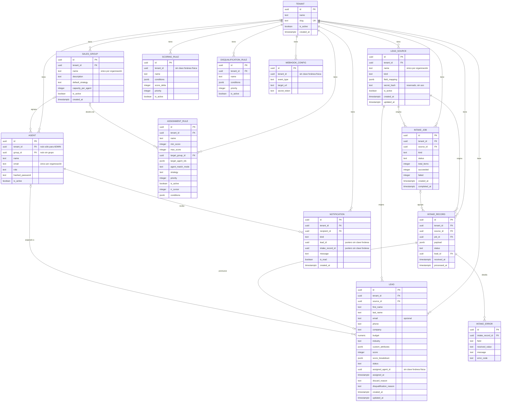
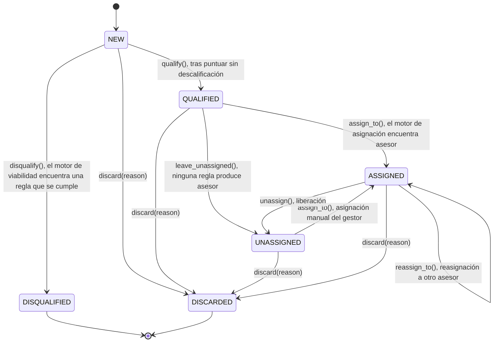
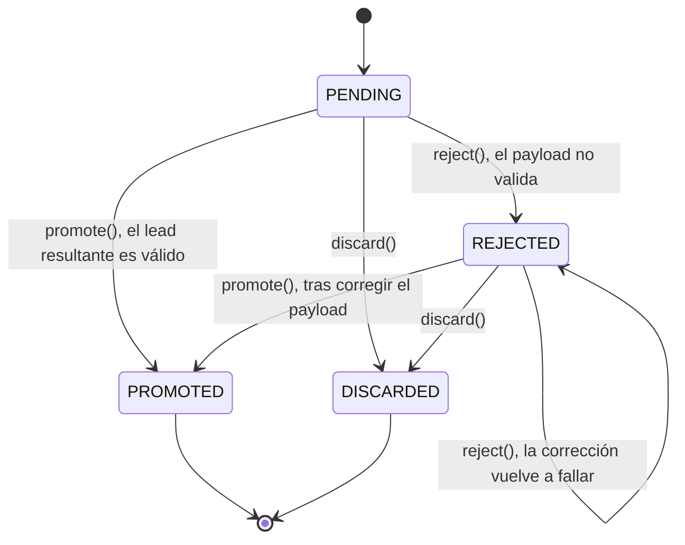
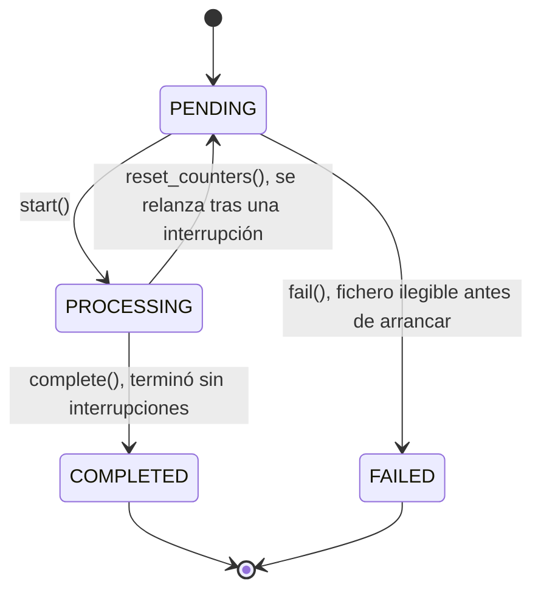

# Modelo de datos

El modelo entidad-relación completo, tal como lo dejan las ocho migraciones de
`backend/migrations/`, y las tres máquinas de estados que gobiernan el ciclo de vida de un lead
mientras lo atraviesa.

## Diagrama entidad-relación

## Los agregados

### Tenant

`domain/entities/tenant.py`, tabla `tenants`. Representa a la organización cliente. `name` no
puede quedar vacío; `slug` se deriva del nombre plegando tildes y símbolos (`slugify()`) y es
único en toda la plataforma, no sólo dentro de una organización — evita que "Solución" y
"Solucion" produzcan dos organizaciones indistinguibles en el listado del administrador. Crear una
organización crea, en la misma transacción, sus dos fuentes por defecto (`Formulario manual`,
`Carga de fichero`) y su primer gestor.

### Agent

`domain/entities/agent.py`, tabla `agents`. Es a la vez credencial de acceso y receptor de leads.
`tenant_id` es nulo únicamente para `ADMIN`. `email` es único por organización, o único en toda la
plataforma si `tenant_id` es nulo — lo garantizan los dos índices únicos parciales de
`002_tenants.sql`, no una comprobación de aplicación. El hash de la contraseña vive en la misma
fila (`hashed_password`); no hay un agregado de credenciales separado, y es el mapeador de
respuesta del router quien evita que ese campo llegue al cliente, omitiéndolo explícitamente. El
formato del correo no lo valida el dominio —`email` es un `str` llano— sino el esquema Pydantic de
entrada.

### SalesGroup

`domain/entities/sales_group.py`, tabla `sales_groups`. Agrupa asesores que comparten política de
asignación. `name` no vacío y único por organización; `capacity_per_agent`, si se define, debe ser
mayor que cero. Borrar un grupo no arrastra sus asesores ni las reglas que lo señalan: `group_id`
en `agents` y `target_group_id` en `assignment_rules` quedan en `NULL`, así que el gestor ve el
hueco en vez de perder datos en cascada.

### LeadSource

`domain/entities/lead_source.py`, tabla `lead_sources`. El canal por el que entra un lead. `name`
no vacío y único por organización; `field_mapping`, si se define, exige claves y valores no
vacíos. Toda organización nace con dos fuentes activas, `MANUAL_FORM` y `FILE_UPLOAD`. La columna
`secret_hash` está reservada para el webhook entrante — la entidad de dominio no tiene hoy ningún
atributo que la use.

### Lead

`domain/entities/lead.py`, tabla `leads`. El prospecto comercial: existe si sus datos son
coherentes, no si son comercialmente útiles. `budget` es un `Money` (`Decimal` no negativo);
`email`, si viene, debe tener formato válido, pero su ausencia ya no impide crear el lead. Cada
transición de estado está guardada en su propio método — ver la máquina de estados más abajo.
`assigned_agent_id` no lleva clave foránea física: es `Lead._bind_agent()` quien impide asignar el
lead a un asesor de otra organización, comparando `tenant_id` en memoria antes de guardar.

### ScoringRule y AssignmentRule

`domain/entities/rule.py`, tablas `scoring_rules` y `assignment_rules`. Comparten `conditions`,
una lista de `Criterion` serializada en JSONB. `ScoringRule` no exige un nombre no vacío — a
diferencia de `AssignmentRule` y `DisqualificationRule`, que sí lo hacen. `AssignmentRule` exige
al menos un `target_group_id` o un `target_agent_id` (si no, no podría producir ningún candidato),
y si define `max_score` éste debe ser mayor o igual que `min_score`. `rr_cursor` es el cursor del
reparto rotatorio, persistido en la fila para que sobreviva entre peticiones.

### DisqualificationRule

`domain/entities/disqualification_rule.py`, tabla `disqualification_rules`. Exige nombre no vacío
y al menos una condición: una regla sin condiciones se cumpliría para cualquier lead y
descalificaría a la organización entera.

### IntakeJob, IntakeRecord e IntakeError

`domain/entities/intake_job.py` y `domain/entities/intake_record.py`; tablas `intake_jobs`,
`intake_records` e `intake_errors`. Un `IntakeJob` agrupa una operación de ingesta completa, sea de
un único lead o de un fichero entero. Cada payload recibido genera su propio `IntakeRecord`, con el
dato **tal cual llegó** en `payload`. Los errores de validación viven en su propia tabla,
`intake_errors`, no embebidos en JSONB: un registro puede fallar por varios campos a la vez, y el
gestor necesita saber cuáles. `promote()` y `reject()` sólo aceptan un registro en `PENDING` o
`REJECTED`; `reject()` exige además al menos un error.

### Notification

`domain/entities/notification.py`, tabla `notifications`. El aviso interno; exige un `message` no
vacío. `lead_id` e `intake_record_id` son punteros informativos sin clave foránea: sólo permiten
que la interfaz navegue al elemento relacionado, y la notificación sobrevive aunque ese elemento
se borre.

### WebhookConfig

`domain/entities/webhook.py`, tabla `webhook_configs`. Configura un destino externo para el
webhook saliente firmado. No declara invariantes propias más allá del tipado de sus
identificadores, y hoy no existe ningún endpoint que lo dé de alta: sólo el despachador que lo
consume está escrito. Ver [ADR-0017](../decisiones/0017-retirada-de-webhook-dispatched.md).

## Máquinas de estados

### Lead

Seis estados. Cada transición vive en un método de `Lead` que comprueba el estado de partida,
salvo `qualify()` y `disqualify()`: ninguno de los dos exige un estado previo concreto en el propio
método — el pipeline de ingesta es quien garantiza que sólo se invocan sobre un lead recién creado.

`DISQUALIFIED` y `DISCARDED` son terminales: ningún método transiciona fuera de ellos. `discard()`
los excluye a propósito de sus estados de partida — ya salieron del flujo por su cuenta, y
descartarlos otra vez no aporta información.

### IntakeRecord

`PROMOTED` y `DISCARDED` son terminales. `PENDING` y `REJECTED` son los únicos estados
reabribles: son los dos desde los que `promote()` y `reject()` aceptan actuar, lo que deja al
gestor corregir un registro rechazado y reintentarlo tantas veces como haga falta.

### IntakeJob

Un trabajo interrumpido por un fallo inesperado a mitad de proceso se queda en `PROCESSING` —
ninguna transición lo mueve por sí sola— hasta que el gestor lo reprocesa. `COMPLETED` no es una
afirmación de éxito: un trabajo con diez registros rechazados también termina en `COMPLETED`,
con `failed = 10`. Terminado y salió bien son preguntas distintas, y sólo la primera decide el
estado.

## Ver también

- [El recorrido de un lead](recorrido-de-un-lead.md) muestra cuándo se dispara cada transición.
- [Organizaciones](../modulos/organizaciones.md) explica `Tenant`, `SalesGroup` y `LeadSource` desde
  el negocio.
- [ADR-0007 · Tipos nativos de SQL](../decisiones/0007-tipos-nativos-de-sql.md)
- [ADR-0013 · Condiciones en JSONB](../decisiones/0013-condiciones-en-jsonb.md)
