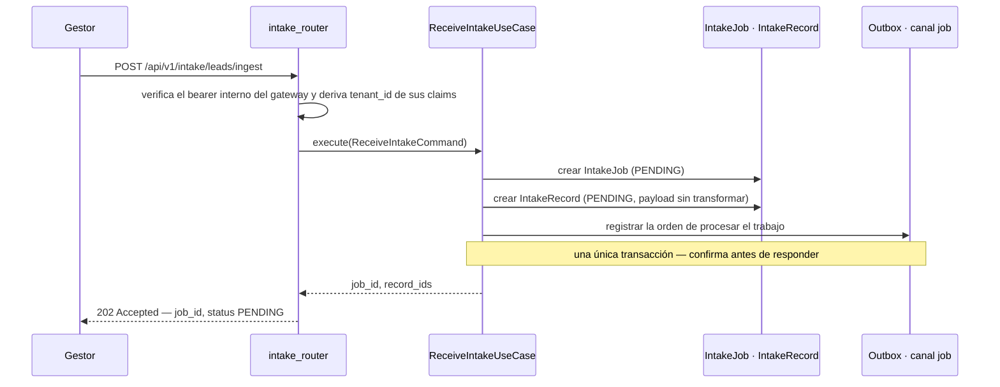
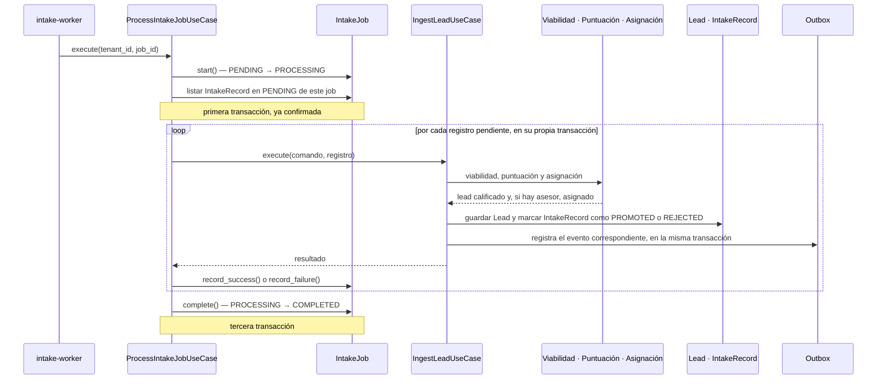

# El recorrido de un lead

Qué ocurre entre que un lead llega por HTTP y aparece en la pantalla de un asesor. Dos fases
—recepción y procesamiento— y, dentro de la segunda, tres decisiones de naturaleza distinta:
viabilidad, puntuación y asignación.

## Fase 1 · Recepción

La API nunca interpreta un lead en la misma petición que lo recibe: guarda el payload tal cual
llegó, responde `202` y deja la interpretación para el `intake-worker`, al que le llega una orden
registrada en el outbox en la misma transacción. Así, un payload que no se
puede interpretar nunca borra la constancia de haberse recibido.

La carga de fichero (`POST /api/v1/intake/leads/batch-upload`) responde con el mismo contrato, pero
en esta fase sólo crea el `IntakeJob` y guarda el fichero crudo: se lee, se parte en filas y cada
fila se convierte en su propio `IntakeRecord` ya dentro de la fase de procesamiento, no antes.

## Fase 2 · Procesamiento en segundo plano

`backend-worker` publica la orden en RabbitMQ y el `intake-worker` la recoge. `ProcessIntakeJobUseCase`
recorre los registros `PENDING` del trabajo, uno a uno, cada uno en su
propia transacción: un fallo al interpretar el registro trescientos no debe poder deshacer los
doscientos noventa y nueve que ya se guardaron.

Si el proceso muere a mitad de un registro por un fallo inesperado, ese registro sigue `PENDING` —
es el único estado que la relectura considera— y el trabajo se queda en `PROCESSING` sin cerrar. El
trabajo se reentrega solo, por la muerte del proceso o por un `nack`, hasta tres veces; luego pasa a la
cola muerta. Si llegó ahí, el gestor
lo reprocesa desde `POST /api/v1/intake/jobs/{id}/reprocess`, que encola otra orden y retoma
exactamente los registros que quedaron pendientes.

Cuando el payload no llega a construir un `Lead` válido —un correo mal formado, por ejemplo— el
registro se marca `REJECTED` con el detalle del error por campo, y ahí termina su paso por esta
fase: no llega a las tres etapas siguientes. El gestor lo corrige y lo reintenta desde
`POST /api/v1/intake/records/{id}/promote`, que vuelve a atravesar el mismo pipeline.

## Las tres etapas

Cada una responde una pregunta de naturaleza distinta, y ninguna dos comparten motor.

### Viabilidad — ¿se puede trabajar?

`ViabilityEngine.evaluate()` recorre las reglas de descalificación activas de la organización,
ordenadas por prioridad y por identificador como desempate, y se detiene en la **primera** que se
cumple — no acumula, sólo necesita una. Cada regla combina sus condiciones con Y: para que se
cumpla, tienen que cumplirse todas. Para expresar una alternativa (O), el gestor escribe una
segunda regla en vez de un operador dentro de la primera.

Si alguna regla se cumple, el lead pasa a `DISQUALIFIED` con el nombre de esa regla como motivo, y
el pipeline se corta ahí: no se puntúa ni se reparte. **Si ninguna se cumple**, el lead sigue el
flujo con normalidad — la viabilidad no tiene un estado propio para "no se pudo decidir": es
binaria, y por defecto el lead es viable.

### Puntuación — ¿cuánto vale?

`ScoringEngine.evaluate()` recorre las reglas de puntuación activas, en el mismo orden que
viabilidad, pero aquí sí acumula: **todas** las que se cumplen suman su `score_delta`, no sólo la
primera. Cada regla aplicada queda registrada —id, nombre, puntos— en el desglose que se guarda
junto al lead, así que la interfaz puede explicar una puntuación aunque la regla que la produjo se
edite o se borre después.

Tras puntuar, el lead pasa a `QUALIFIED` sin ningún umbral propio de esta etapa: ese corte se
retiró del código (ver [ADR-0014](../decisiones/0014-retirada-del-umbral-fijo.md)) y hoy vive en la
banda más baja de las reglas de asignación. **Si ninguna regla de puntuación se cumple**, el lead
conserva su puntuación de partida —cero— y pasa a `QUALIFIED` igual: la puntuación tampoco detiene
el flujo por sí sola.

### Asignación — ¿quién lo atiende?

`AssignmentEngine.select_agent()` filtra las reglas de asignación activas cuyo rango de puntuación
contiene la del lead y cuyas condiciones, si las tiene, se cumplen; las ordena por prioridad y
prueba cada una en cascada:

1. Construye los candidatos combinando el grupo destino y los asesores nombrados, según
   `agent_match_mode` — unión (`ANY`) o intersección (`ONLY`).
2. Descarta a quien no sea de la misma organización, esté inactivo, pertenezca a un grupo inactivo,
   o haya alcanzado la `capacity_per_agent` de su grupo (la carga se calcula al vuelo, contando
   leads `ASSIGNED`; no es una columna que pueda desincronizarse).
3. Si no queda ningún candidato, prueba la siguiente regla. Si queda alguno, aplica la estrategia
   —`LOWEST_LOAD`, `ROUND_ROBIN` o `DIRECT_AGENT`— y ahí termina la búsqueda.

**Si ninguna regla produce un candidato**, es la única de las tres etapas con un estado y un aviso
dedicados a esa salida: el lead queda `UNASSIGNED`, se emite `LeadLeftUnassigned` y el gestor
recibe una notificación para asignarlo a mano.

| Etapa | Si ninguna regla aplica |
|---|---|
| Viabilidad | El lead sigue el flujo normal: es viable por defecto |
| Puntuación | Conserva su puntuación de partida y pasa a `QUALIFIED` igual |
| Asignación | Queda `UNASSIGNED`, con evento y notificación al gestor |

## Y después

Un lead `ASSIGNED` aparece de inmediato en `GET /api/v1/leads/mine` para su asesor, que además
recibió una notificación `LEAD_ASSIGNED` (`GET /api/v1/notifications`). Uno `UNASSIGNED` sólo
aparece en la cartera completa del gestor (`GET /api/v1/leads`), a la espera de
`POST /api/v1/leads/{id}/assign`.

!!! note "Reglas componibles"
    `Criterion` —`campo`, `operador`, `valor`— es la misma unidad que evalúan las tres etapas.
    Aprenderla una vez sirve para descalificar, puntuar y repartir. Ver
    [ADR-0011](../decisiones/0011-gramatica-de-condiciones.md).

## Ver también

- [Modelo de datos](modelo-de-datos.md) — la máquina de estados completa de `Lead`, `IntakeRecord`
  e `IntakeJob`.
- [Ingesta](../modulos/ingesta.md) y [Asignación](../modulos/asignacion.md) — el detalle de negocio
  de cada etapa.
- [ADR-0010 · Recepción y procesamiento separados](../decisiones/0010-recepcion-y-procesamiento-separados.md)
- [ADR-0012 · Y dentro, O entre](../decisiones/0012-y-dentro-o-entre.md)
