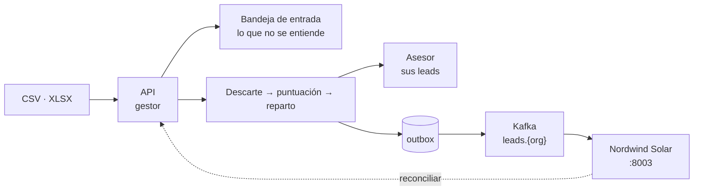

# La demo de extremo a extremo

Un recorrido de unos veinte minutos que ejercita el producto entero: una empresa real con sus
equipos y sus reglas, una carga masiva, el reparto automático, y **un sistema externo que recibe los
leads ya asignados por Kafka** y los trabaja por su cuenta.

Está escrito para ejecutarse tal cual. Cada paso dice qué tiene que verse; si algo no coincide, eso
*es* el hallazgo.

## Qué queda demostrado

| | Dónde se ve |
|---|---|
| Las reglas de descarte cortan antes de puntuar | 4 leads `DISQUALIFIED` que nunca llegan a un asesor |
| La puntuación es explicable | El desglose por regla en el detalle del lead |
| El reparto respeta las bandas y la carga | 36 leads repartidos entre 12 asesores de 3 equipos |
| Lo que no se entiende no se pierde | «3 filas cargadas, 4 rechazadas», cada una con su campo y su motivo |
| El evento y el lead viajan juntos o no viajan | Outbox a 0 pendientes tras cada carga |
| Un tercero consume sin tocar la base | La bandeja de la aplicación consumidora cuadra con el enrutador |
| Cada organización sólo lee lo suyo | `TOPIC_AUTHORIZATION_FAILED` contra el topic de otra |
| Un consumidor puede releer lo perdido | «Releer desde el origen» recupera el topic entero |



## Preparación

```bash
docker compose up -d                                   # seis servicios
docker compose --profile demo up -d test-consumer      # la aplicación del cliente
python3 demo/seed.py                                   # la empresa, sus equipos y sus reglas
```

El sembrado se puede repetir: comprueba antes de crear y dice qué ya existía. Deja escrito en
`demo/credenciales.local.json` lo necesario para hablar con Kafka desde la máquina anfitriona.

| | |
|---|---|
| Interfaz del gestor | <http://localhost> (`docker compose up -d frontend`) o `cd frontend && npm run dev` → <http://localhost:5173> |
| API | <http://localhost:8001/docs> |
| Bandeja del cliente | <http://localhost:8003> |
| Documentación | <http://localhost:8002> |

Lo que siembra `demo/seed.py`:

| | |
|---|---|
| Organización | **Nordwind Solar** — instalación de autoconsumo |
| Gestora | `gestor@nordwindsolar.test` / `Demo1234` |
| Asesores | 12, con contraseña `Demo1234` — p. ej. `lucia.ferrer@nordwindsolar.test` |
| Equipos | Residencial (menos cargado) · Comercial (por turnos) · Industrial (menos cargado) |
| Reglas | 3 de descarte · 5 de puntuación · 3 bandas de asignación |

Las bandas no se solapan, así que la banda de un lead se lee de su puntuación sola:

| Puntos | Equipo | Reparto |
|---|---|---|
| 70 o más | Industrial | Al menos cargado |
| 35 – 69 | Comercial | Por turnos |
| 0 – 34 | Residencial | Al menos cargado |

## Acto 1 · La gestora carga el fichero de la feria

Entra en la interfaz como `gestor@nordwindsolar.test`, ve a **Carga masiva** y sube
`demo/leads-lote-1.csv` (24 filas).

**Qué tiene que verse.** El trabajo pasa por `PENDING` y termina `COMPLETED` con 24 de 24. En
**Asesores** los doce tienen leads; ninguno se queda a cero.

Repite con `demo/leads-lote-2.xlsx` (16 filas). El mismo camino admite Excel: lo decide la extensión
del fichero, no una opción de la pantalla.

```bash
# Lo mismo por API, si prefieres verlo en crudo
curl -s -c /tmp/nordwind.cookies -X POST localhost:8001/api/v1/auth/login \
  -d 'username=gestor@nordwindsolar.test&password=Demo1234'
curl -s -X POST localhost:8001/api/v1/intake/leads/batch-upload \
  -b /tmp/nordwind.cookies -F "file=@demo/leads-lote-1.csv"
```

## Acto 2 · Las reglas deciden, y lo dicen

```bash
curl -s localhost:8001/api/v1/leads/stats -b /tmp/nordwind.cookies | python3 -m json.tool
```

Con los dos ficheros cargados: **40 leads, 36 asignados y 4 descartados**.

Los cuatro descartados no son un fallo, son el filtro haciendo su trabajo:

| Lead | Regla que lo cortó |
|---|---|
| Irene Dopazo (1 200 €) | Presupuesto por debajo del mínimo |
| Óscar Guillén · *Solaria Directa* | Consulta de la competencia |
| Ramiro Nogueira · *EnerFake* | Consulta de la competencia |
| Andrés Villaverde (sin correo ni teléfono) | Sin ninguna forma de contacto |

Abre en la interfaz el lead de **Metalnor** (132 000 €, industrial, con teléfono, campaña de la
feria). Puntúa **115**, y el desglose lo justifica regla a regla: gran cuenta +45, cuenta media +20,
sector objetivo +25, localizable +10, feria +15. Está en la banda alta, así que fue a Industrial.

Compara con **Hotel Mirasol** (26 400 €, hostelería): 30 puntos, banda residencial. Misma máquina,
distinto resultado, y la razón se lee.

## Acto 3 · El asesor sólo ve lo suyo

Sal de la sesión y entra como `lucia.ferrer@nordwindsolar.test` / `Demo1234`.

**Qué tiene que verse.** Sus leads, y sólo los suyos. Un lead de un compañero responde **404, no
403** — un 403 confirmaría que existe.

```bash
curl -s -c /tmp/lucia.cookies -X POST localhost:8001/api/v1/auth/login \
  -d 'username=lucia.ferrer@nordwindsolar.test&password=Demo1234'
# El identificador de un lead que no es suyo, sacado de la lista de la gestora:
curl -s -o /dev/null -w '%{http_code}\n' localhost:8001/api/v1/leads/<id-ajeno> -b /tmp/lucia.cookies
```

## Acto 4 · El cliente recibe los leads ya asignados

Abre <http://localhost:8003>. Es una aplicación aparte, con su propio contenedor y su propia base;
no comparte nada con el producto salvo lo que éste publica.

1. **Registrarla.** `gestor@nordwindsolar.test` / `Demo1234`. Pide una credencial de máquina y
   empieza a escuchar. La contraseña de la persona no se guarda.
2. **Ponerla al día.** «Reconciliar por HTTP» trae por `GET /leads?updated_since=` todo lo cargado
   antes de que existiera. Los contadores tienen que **cuadrar con los del enrutador**: mismo total,
   mismos filtrados.
3. **Verla en directo.** Vuelve a la interfaz del gestor, crea un lead suelto en **Nuevo lead** con
   presupuesto alto y sector industrial. En tres segundos aparece en la bandeja del cliente, marcado
   `⚡` (por Kafka), ya con su asesor.
4. **Trabajarlo.** Cámbiale el estado a `CONTACTADO`, pon un responsable y una nota. Eso es de esta
   oficina: el enrutador no se entera, ni tiene por qué.
5. **Releer desde el origen.** El evento vuelve a entregarse y **el trabajo local no se pisa**: sigue
   `CONTACTADO`, con su responsable y su nota. Es la disciplina que exige una entrega *al menos una
   vez*.

!!! note "Emitir una credencial invalida la anterior"
    `POST /agents/integration-credential` es un *upsert*: cada llamada rota el secreto. Si registras
    la aplicación después de sembrar, `demo/credenciales.local.json` se queda obsoleto; vuelve a
    ejecutar `demo/seed.py` para refrescarlo.

### El aislamiento, contra el bróker de verdad

Con las credenciales de una organización, contra el topic de otra:

```bash
cd tools/test-consumer
python consume.py --tenant <ORG-AJENA> \
  --sasl-username tenant-<ORG-PROPIA> --sasl-password <secreto-propio>
```

El bróker responde `TOPIC_AUTHORIZATION_FAILED`. Un grupo de consumidor que no empiece por
`tenant-<uuid>` responde `GROUP_AUTHORIZATION_FAILED` — no es un problema de topic, aunque lo
parezca.

## Acto 5 · Lo que se rompe a propósito

### Un fichero con filas malas no se lleva las buenas

Sube `demo/leads-sucios.csv` (7 filas, 4 defectuosas).

**Qué tiene que verse.** El trabajo termina **COMPLETED con 3 correctas y 4 rechazadas** — no
`FAILED`, y ninguna fila desaparece. Cada rechazo nombra su campo:

| Fila | Motivo |
|---|---|
| Nicolás Rebollo | `email`: formato inválido |
| Julia Sandoval | `budget`: no puede ser negativo |
| Mateo Arriaga | `budget`: celda vacía |
| Teresa Puigcerver | `budget`: el texto «por determinar» |

La interfaz avisa —«3 filas cargadas, 4 rechazadas»— pero **no tiene todavía pantalla de bandeja de
entrada**: corregir una fila rechazada se hace hoy por API. Está en la
[hoja de ruta del frontend](../roadmap/frontend.md).

```bash
JOB=<el job de la carga>
curl -s "localhost:8001/api/v1/intake/records?status=REJECTED&job_id=$JOB" \
  -b /tmp/nordwind.cookies | python3 -m json.tool
curl -s -X POST "localhost:8001/api/v1/intake/records/<id>/promote" \
  -b /tmp/nordwind.cookies -H 'Content-Type: application/json' \
  -d '{"payload":{"first_name":"Teresa","last_name":"Puigcerver","email":"teresa.puigcerver@puig.test","company":"Puig Agrícola","industry":"Agroalimentario","budget":34000}}'
```

Se convierte en lead sin volver a subir el fichero. Promocionar dos veces la misma responde
**400 `INVALID_INTAKE_TRANSITION`**, y no aparece un segundo lead.

### La API sigue en pie con los brókeres caídos

```bash
docker compose stop kafka rabbitmq
curl -s -X POST localhost:8001/api/v1/intake/leads/ingest -b /tmp/nordwind.cookies \
  -H 'Content-Type: application/json' \
  -d '{"first_name":"Sin","last_name":"Broker","email":"sinbroker@x.test","company":"Prueba","industry":"Industrial","budget":90000}'
```

**Qué tiene que verse.** Responde `202` igual. El lead se procesa en el propio proceso, porque la
cola no está; el evento queda registrado en el outbox esperando. Nada se pierde.

```bash
docker compose start kafka rabbitmq
sleep 20
docker compose exec -T db psql -U postgres -d leads_db -c \
  "SELECT count(*) FILTER (WHERE published_at IS NULL) AS pendientes FROM outbox_events;"
```

Vuelve a **0 pendientes** solo, sin intervención: el relay reintenta hasta entregarlo. Y en la
bandeja del cliente aparece el lead que se ingirió con Kafka apagado.

## Anexo · El harness

```bash
docker compose --profile test run --rm backend-test   # 629 pruebas, todas las capas
./scripts/verify-e2e.sh                               # el negocio sobre HTTP real
cd frontend && npm run build && npm test              # el contrato compila, 140 pruebas
```

`verify-e2e.sh` es lo que decide si un cambio se acepta sin releer el diff entero. Esta demo enseña
lo que el harness no puede enseñar: cómo se ve.

## Los ficheros de la demo

| | |
|---|---|
| `demo/seed.py` | Siembra la organización, los equipos, los asesores y las reglas. Repetible |
| `demo/leads-lote-1.csv` | 24 leads, las tres bandas y los tres motivos de descarte |
| `demo/leads-lote-2.xlsx` | 16 leads en Excel, para el otro formato |
| `demo/leads-sucios.csv` | 7 filas, 4 defectuosas, una por cada modo de fallo |
| `test-consumer/` | La aplicación del cliente, con su propio Dockerfile |
