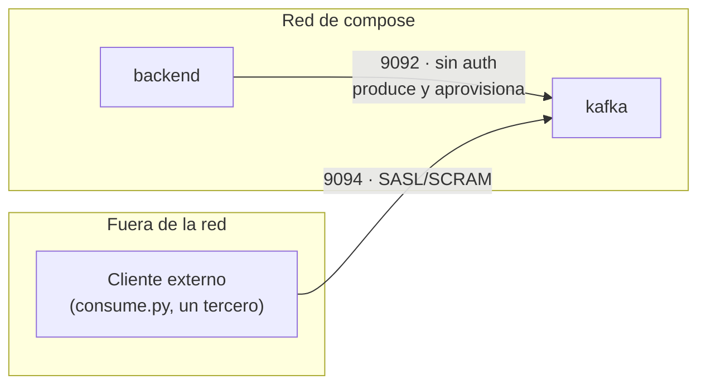
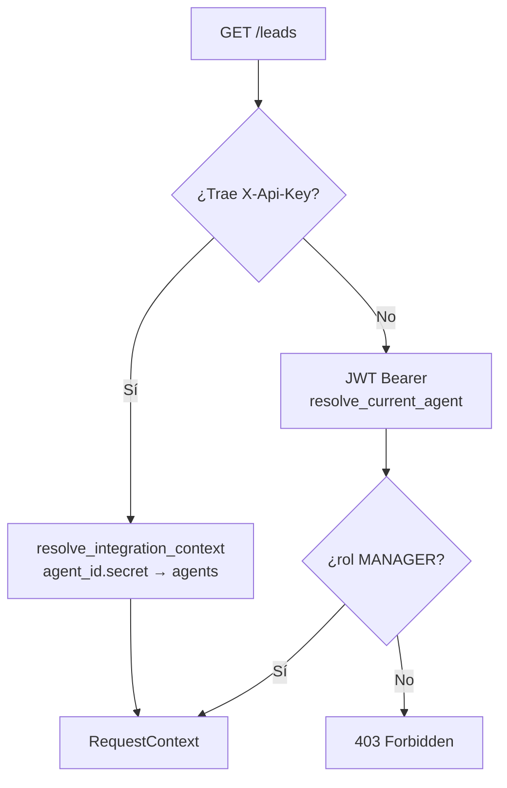

# Autenticación de la mensajería

Hasta aquí, Kafka hablaba en claro y `GET /leads` sólo se abría con un token de persona. Esta página
cubre las dos piezas que lo cierran: quién puede leer el topic de una organización, y cómo se
integra un sistema externo sin pedir prestada la sesión de un humano.

Decisión que lo fija: [ADR-0028](../decisiones/0028-autenticacion-de-la-mensajeria.md).

## Por qué sólo un listener pasa a SASL

`docker-compose.yml` declara tres listeners de Kafka con dos audiencias distintas:

| Listener | Puerto | Alcance | Autenticación |
|---|---|---|---|
| `PLAINTEXT` | 9092 | Sólo la red de compose — nunca mapeado a `ports:` | Ninguna, a propósito |
| `CONTROLLER` | 9093 | Tráfico interno de KRaft | Ninguna |
| `PLAINTEXT_HOST` | 9094 | Mapeado al host — el consumidor de prueba y cualquier cliente externo | **SASL/SCRAM** |

El hueco que cerraba este trabajo —«cualquiera con acceso a la red lee los topics de todas las
organizaciones»— vivía únicamente en `PLAINTEXT_HOST`. `PLAINTEXT` se queda abierto: nunca sale de
la red de compose, el mismo perímetro de confianza que ya asume Postgres, y es además la vía que usa
el propio backend para aprovisionar credenciales sin necesitar una cuenta de arranque propia —una
conexión sin SASL resuelve al principal `User:ANONYMOUS`, declarado `super.users`.



**Cómo se entrega el JAAS del lado servidor.** La primera implementación intentó montar una
propiedad `sasl.jaas.config` suelta en el directorio de configuración que esta imagen fusiona —
verificado contra un arranque real que **no** lo hace: el fichero se copia tal cual y el broker
nunca lo lee, así que revienta al no encontrar el contexto JAAS. Lo que funciona, confirmado en el
log de arranque, es el mecanismo estándar de la JVM: un fichero JAAS real
(`kafka/kafka_server_jaas.conf`) montado en el contenedor y `KAFKA_OPTS` apuntando
`-Djava.security.auth.login.config` a esa ruta.

## Un usuario por organización, con ACL

El productor sigue siendo uno solo —el backend, sobre el listener sin autenticación—, así que no
hace falta un usuario Kafka por organización en ese lado. El consumo es distinto: es ahí donde un
tercero se conecta directo al bróker expuesto, y sin ACL por organización la credencial de una leería
el topic de cualquier otra.

| Recurso | Patrón | Principal | Operaciones |
|---|---|---|---|
| Topic `leads.{tenant_id}` | `LITERAL` | `User:tenant-{tenant_id}` | `READ`, `DESCRIBE` |
| Grupo `test-consumer-{tenant_id}-` | `PREFIXED` | `User:tenant-{tenant_id}` | `READ` |

El grupo usa un ACL `PREFIXED` y no `LITERAL` porque `consume.py` genera un `group.id` con un sufijo
aleatorio en cada ejecución —a propósito, para que un segundo `--from-beginning` no reanude desde el
commit del primero—; un ACL literal se rompería en cada ejecución nueva.

**Verificado en vivo, con la pila completa:** las credenciales de la organización A leen su propio
topic y reciben el mensaje publicado; las mismas credenciales contra el topic de la organización B
fallan con `TOPIC_AUTHORIZATION_FAILED` del propio bróker.

```bash
cd tools/test-consumer
python consume.py --tenant <A> --sasl-username tenant-<A> --sasl-password <secreto-A>   # lee
python consume.py --tenant <B> --sasl-username tenant-<A> --sasl-password <secreto-A>   # falla
```

## La credencial de máquina

`GET /leads` acepta dos vías de entrada, resueltas por `require_manager_or_integration` según qué
cabecera llegue — no una cabecera que mezcla dos formatos, sino dos caminos visiblemente separados:



La credencial es una fila más en `agents`, con `role=INTEGRATION` y el mismo hash `bcrypt` que un
agente humano — no se crea tabla nueva. `POST /agents/integration-credential` es upsert: alta y
rotación son la misma llamada, así que no hay dos rutas que puedan divergir. La revocación es
`DELETE /agents/{agent_id}`, el endpoint que ya existe para cualquier agente.

```json
POST /api/v1/agents/integration-credential
Authorization: Bearer <jwt-del-manager>
```
```json
{
  "agent_id": "9b1deb4d-3b7d-4bad-9bdd-2b0d7b3dcb6d",
  "tenant_id": "a0eebc99-9c0b-4ef8-bb6d-6bb9bd380a11",
  "api_key": "9b1deb4d-3b7d-4bad-9bdd-2b0d7b3dcb6d.xR2k9F...",
  "kafka_username": "tenant-a0eebc99-9c0b-4ef8-bb6d-6bb9bd380a11",
  "kafka_password": "wL8pQ...",
  "kafka_bootstrap_servers": "localhost:9094",
  "kafka_topic": "leads.a0eebc99-9c0b-4ef8-bb6d-6bb9bd380a11"
}
```

Una sola llamada entrega lo necesario tanto para HTTP (`api_key`) como para Kafka (usuario,
contraseña, topic) — el tercero no necesita una segunda petición ni una segunda credencial.

**Kafka se aprovisiona antes que la fila de `agents`, fuera de la transacción de Postgres.** Si el
bróker no admite la credencial, la llamada entera falla con `503 MESSAGING_UNAVAILABLE` y no se crea
ningún agente: emitir una clave de API sin su contraparte en Kafka es exactamente la seguridad de
teatro que este trabajo cierra. Verificado que ese fallo tarda hasta 10 s en confirmarse — el
`request_timeout_seconds` del adaptador — cuando el bróker no responde en absoluto.

## Por qué el rol de máquina no es un asesor

`AgentRole.INTEGRATION` está excluido de `POST /auth/login` (no puede obtener un JWT de sesión) y de
`POST /agents` (no se crea por la vía genérica, sólo por `POST /agents/integration-credential`, que
genera su propio secreto en vez de aceptar uno en el cuerpo). Pero vivir en la tabla `agents` traía
un hueco que el primer borrador de este trabajo no cerraba: `GET /agents` y el pool de candidatos del
motor de asignación seguían devolviendo la fila.

Sin excluirla ahí, una credencial de API aparecería en la plantilla de asesores del gestor y podría
acabar nombrada en una regla de asignación — recibiendo leads que nadie va a trabajar. Las dos
consultas la excluyen en SQL (`role <> 'INTEGRATION'`), no en el caso de uso, porque los dos únicos
llamadores quieren lo mismo. La búsqueda por identificador (`GET /agents/{agent_id}`,
`DELETE /agents/{agent_id}`) se deja sin ese filtro a propósito: es la vía que usa la revocación, y
filtrarla ahí la rompería.

## Qué queda fuera

- **TLS en RabbitMQ**, aplazado con razón escrita — ver [RabbitMQ](rabbitmq.md#limites-de-hoy).
- **Sin test de integración contra un Kafka con SASL real en la suite automática.** El aislamiento
  entre organizaciones se demuestra a mano, con la pila completa, igual que el resto de lo que el
  [ADR-0026](../decisiones/0026-kafka-como-canal-del-producto.md) ya dejó fuera de la suite.

## Dónde vive

| Pieza | Fichero |
|---|---|
| El puerto de aprovisionamiento | `application/ports/output/messaging_credential_provisioner_port.py` |
| El adaptador Kafka | `infrastructure/adapters/output/events/kafka_credential_provisioner.py` |
| El caso de uso | `application/use_cases/agent_use_cases.py` (`IssueIntegrationCredentialUseCase`) |
| La cabecera y el contexto | `infrastructure/adapters/input/api/dependencies.py` (`resolve_integration_context`, `require_manager_or_integration`) |
| El fichero JAAS | `kafka/kafka_server_jaas.conf` |
