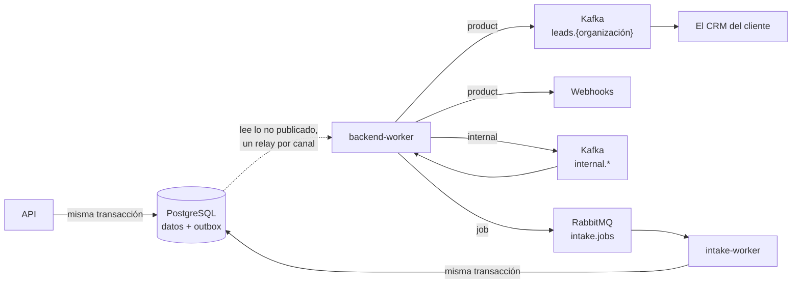

# Eventos y mensajería

Hasta aquí, la documentación describe cómo el sistema **decide** sobre un lead: si es viable, cuánto
vale y quién lo atiende. Esta sección describe qué ocurre **después de decidir**, y es donde el
producto deja de ser una aplicación y pasa a ser una plataforma con la que otros sistemas se
integran.

## El cambio de problema

El recorrido de un lead termina con una fila guardada y un estado. Eso basta mientras el único
consumidor sea nuestra propia interfaz. En cuanto el cliente quiere **los leads procesados dentro de
su CRM**, aparecen preguntas que ninguna capa del sistema respondía:

| Pregunta | Quién la hace | Qué pasaba antes |
|---|---|---|
| ¿Cómo recibo los leads que pasaron el filtro? | El sistema del cliente | Un webhook con cuatro campos, o llamar a la API |
| Perdí mensajes tres días. ¿Cómo los recupero? | El sistema del cliente | No se podía |
| Si vuestro proceso muere justo después de guardar, ¿me entero? | El sistema del cliente | No |
| ¿Por qué me mandáis leads que vuestras reglas descartaron? | El sistema del cliente | Se publicaban todos por el mismo canal |
| Un fichero de 10.000 leads tarda y el contenedor se reinicia | El operador | El trabajo quedaba a medias, sin que nadie lo retomase |

Ninguna se arregla escribiendo mejor la lógica del lead. Todas son del **transporte**: qué se
publica, a dónde, con qué garantías y quién lo procesa.

## Dos problemas distintos, dos tecnologías

La tentación es elegir una sola tecnología de mensajería y meter en ella todo lo que se mueve. Aquí
se descartó, porque los dos problemas tienen garantías incompatibles:

| | El canal del producto | El trabajo interno |
|---|---|---|
| **Qué transporta** | Hechos: «este lead pasó el filtro» | Encargos: «procesa el trabajo 42» |
| **Quién consume** | El sistema del cliente, fuera de aquí | Un trabajador nuestro |
| **Al consumirlo** | Sigue ahí. Otro consumidor lo lee igual | Desaparece. Ya está hecho |
| **Se puede volver atrás** | Sí, ésa es la razón de existir | No tiene sentido |
| **Tecnología** | **Kafka** | **RabbitMQ** |

El criterio no es de gusto: **una cola de trabajo borra el mensaje al confirmarlo**. Quien ya lo
consumió no puede volver a por él. Eso hace imposible la reobtención, que es exactamente lo que el
cliente pide. Y al revés: un log con retención puede emular una cola de trabajo, pero el reparto
entre trabajadores disponibles pasa a depender de las particiones en vez de resolverse solo.

## Las piezas

1. **[El outbox](outbox.md)** — el evento, el aviso interno o la orden de procesar un trabajo se
   registran en la misma transacción que el dato que los origina. Es lo que impide que exista un
   lead del que el cliente nunca se entere, o un `202` cuyo trabajo nadie ejecute. La API sólo
   escribe: entrega `backend-worker`, con un relay por canal (`product`, `internal`, `job`).
2. **[Kafka](kafka.md)** — el canal del producto, un topic por organización con retención, que es lo
   que el cliente compra y puede volver a leer; y los topics `internal.*`, con los hechos y el estado
   que se mueven entre procesos de este sistema (hoy, las notificaciones).
3. **[RabbitMQ](rabbitmq.md)** — la cola del trabajo pesado y el proceso que lo ejecuta. Es lo que
   permite que procesar un fichero grande deje de morir con el contenedor de la API.

Y una cuarta, que no es tecnología sino disciplina: **[la operación](operacion.md)** —cómo se
levanta, qué mirar cuando algo no llega, y qué límites tiene esto todavía.

## Las decisiones que lo fijan

Siete ADR, cuatro de ellos sustituyendo, del todo o en parte, a decisiones anteriores:

| ADR | Qué decide | Sustituye a |
|---|---|---|
| [0023](../decisiones/0023-eventos-del-canal-de-salida.md) | Qué eventos existen en el canal de salida | [0016](../decisiones/0016-solo-eventos-con-consumidor.md) |
| [0024](../decisiones/0024-el-contrato-de-salida-se-construye-una-vez.md) | Dónde se construye el contrato | [0020](../decisiones/0020-eventos-desde-la-aplicacion.md) |
| [0025](../decisiones/0025-outbox-transaccional.md) | Cómo se garantiza que nada se pierde | — |
| [0026](../decisiones/0026-kafka-como-canal-del-producto.md) | Topics, claves y contrato de Kafka | — |
| [0027](../decisiones/0027-cola-para-el-trabajo-de-fondo.md) | La cola y el trabajador aparte | [0019](../decisiones/0019-trabajo-de-fondo-en-proceso.md) |
| [0033](../decisiones/0033-eventos-internos-en-kafka.md) | Eventos internos en Kafka, outbox por canal y estado compactado | — |
| [0034](../decisiones/0034-encolado-por-outbox-y-fichero-durable.md) | Encolado por outbox y fichero guardado en base | El *fallback* en proceso de [0027](../decisiones/0027-cola-para-el-trabajo-de-fondo.md) |
