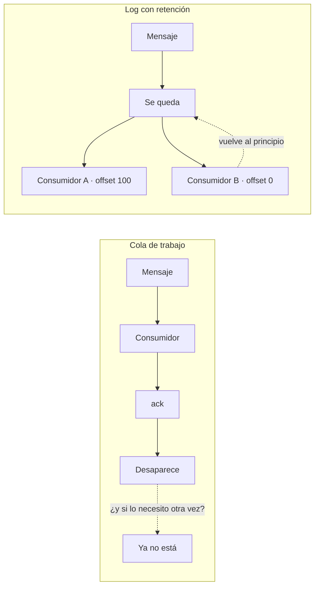

# Kafka · el canal del producto

Kafka es lo que el cliente compra: **sus leads procesados, en un flujo propio, que puede volver a
leer**. No es un detalle de infraestructura; es la forma que tiene el producto de entregarse.

Decisión que lo fija: [ADR-0026](../decisiones/0026-kafka-como-canal-del-producto.md).

## Por qué un log y no una cola

La pregunta que decide no es «¿cuál es mejor?», sino **qué pide el cliente**:

> *Si en algún punto necesito los elementos, quiero poder reobtenerlos.*



Una cola **borra el mensaje al confirmarlo**. Quien ya lo consumió no puede volver a por él, y
emularlo exigiría que nosotros guardásemos una copia y expusiéramos una API de reenvío — es decir,
reimplementar un log con retención, peor.

Un log guarda el mensaje aunque alguien ya lo haya leído, y cada consumidor lleva su propia
posición. Reobtener es mover un número hacia atrás. **Ese requisito es el que elige la tecnología**,
no una preferencia.

## Un topic por organización

`leads.{tenant_id}`, con `lead_id` como clave de partición y `event_type` en la cabecera del
mensaje.

| Decisión | Alternativa descartada | Por qué |
|---|---|---|
| **Un topic por organización** | Uno compartido con `tenant_id` dentro | Obligaría a filtrar en el consumidor. El aislamiento entre organizaciones es un invariante del sistema, no una cortesía. Además abre la puerta a retención y credenciales distintas por cliente |
| **Los dos hechos en el mismo topic**, separados por cabecera | Un topic por tipo de evento | Repartirlos rompería el orden entre «se procesó» y «se descartó» del mismo lead, que es justo lo que garantiza la clave de partición |
| **`lead_id` como clave** | `tenant_id` como clave | Con `tenant_id`, una organización entera sería una sola partición. Con `lead_id`, todo lo de un lead llega en orden y el topic puede repartirse |

## Qué viaja dentro

El contrato completo del lead, no un identificador. **Quien lo recibe está fuera de este sistema y
no tiene una llamada que hacer para averiguar de quién se trata.**

```json
{
  "schema_version": 1,
  "event_id": "da8970dc-48de-4188-8c42-ea89cbd075ec",
  "occurred_on": "2026-08-24T20:05:41.511670+00:00",
  "tenant_id": "04047f84-...",
  "lead_id": "e40fa333-...",
  "source_id": "c2f8766a-...",
  "first_name": "Ana",
  "last_name": "Diaz",
  "email": "ana@lead.test",
  "phone": null,
  "company": "Acme",
  "industry": "Tech",
  "budget": "9000.00",
  "custom_attributes": {},
  "score": 65,
  "score_breakdown": [
    { "rule_id": "788ff56f-...", "name": "tech o saas", "score_delta": 40 },
    { "rule_id": "f9748a4d-...", "name": "presupuesto alto", "score_delta": 25 }
  ],
  "status": "UNASSIGNED",
  "assigned_agent_id": null,
  "assigned_at": null,
  "created_at": "2026-08-24T20:05:41.507122+00:00"
}
```

Tres detalles que no son casuales:

- **`budget` es una cadena, nunca un número.** La columna es `NUMERIC(14, 2)` porque un presupuesto
  es dinero, y entregarlo como coma flotante binaria tiraría la exactitud justo donde el dato sale
  de nuestras manos.
- **`score_breakdown` viaja con el evento.** El cliente puede explicar la puntuación sin
  preguntarnos, y sin que las reglas que la produjeron tengan que seguir existiendo.
- **`event_id` es la clave de deduplicación.** La entrega es *at-least-once*: si el relay muere
  entre entregar y marcar, el mismo hecho sale dos veces con el mismo identificador.

## Dos hechos, no uno ambiguo

| Evento | Significa | Va al webhook |
|---|---|---|
| `LeadProcessedEvent` | Pasó el filtro: `ASSIGNED` o `UNASSIGNED` | Sí |
| `LeadDisqualified` | Una regla lo descartó, con el nombre de la regla | **No** |

Antes se publicaba **todo** por el mismo evento, incluidos los leads que nuestras reglas acababan de
descartar. El cliente recibía la basura que habíamos filtrado y volvía a filtrarla de su lado: justo
el trabajo por el que nos paga.

`LeadDisqualified` sí llega a Kafka —es la traza de auditoría— pero **no** al webhook: un cliente que
hoy recibe webhooks de leads procesados no debe empezar a recibir de golpe el doble de tráfico.

## La reobtención, en la práctica

```bash
cd tools/test-consumer

python consume.py --tenant <uuid> --sasl-username tenant-<uuid> --sasl-password <secreto>                  # desde ahora
python consume.py --tenant <uuid> --sasl-username tenant-<uuid> --sasl-password <secreto> --from-beginning # todo lo retenido
```

`--sasl-username`/`--sasl-password` los emite `POST /agents/integration-credential` — ver
[Autenticación](autenticacion.md).

El script no importa nada del backend **a propósito**: es lo que un cliente escribiría por su
cuenta, y si necesitara una librería nuestra sería señal de que el contrato no se sostiene solo.

## El backend arranca sin Kafka

El servicio `kafka` no lleva `depends_on` desde `backend`. Si el bróker no responde, el relay falla
al entregar, lo registra y reintenta en el ciclo siguiente; la API sigue aceptando y guardando
leads. Es exactamente el comportamiento que el outbox existe para dar, y está verificado: con Kafka
apagado, `/health` responde `200` y los leads se guardan.

## Límites de hoy

| Límite | Consecuencia |
|---|---|
| **Retención de 168 h** (el valor por defecto, no elegido) | Reobtener funciona siete días |
| **`num.partitions=1`** por defecto | La clave de partición está bien elegida, pero el reparto que justifica todavía no existe |
| **`AUTO_CREATE_TOPICS_ENABLE=true`** | Un `tenant_id` mal escrito crea un topic fantasma en silencio |

Los tres están asumidos como decisiones de MVP con fecha de caducidad, no como descuidos. El cuarto
límite que estaba aquí —el listener del host sin autenticación— ya se cerró:
[ADR-0028](../decisiones/0028-autenticacion-de-la-mensajeria.md).
