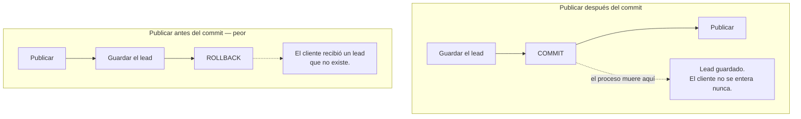
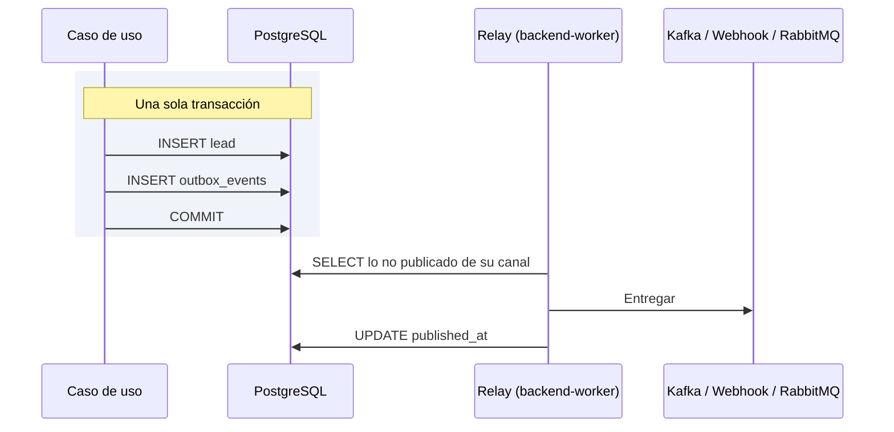

# El outbox transaccional

El outbox es la pieza que hace verdad la frase *«si necesitas los leads, puedes reobtenerlos»*. Sin
él, esa promesa depende de que nada falle en el momento exacto entre guardar y publicar.

Decisión que lo fija: [ADR-0025](../decisiones/0025-outbox-transaccional.md).

## El problema de las dos escrituras

Guardar un lead y publicarlo son dos escrituras contra dos sistemas distintos: PostgreSQL y el
bróker. **No hay forma de hacerlas atómicas**, y el orden que se elija determina qué se pierde
cuando el proceso muere en medio.



Publicar **después** del commit es lo que protege al lead: un aviso que falla no debe deshacer un
lead ya guardado. El precio es la ventana inversa, y en cuanto publicar implica una llamada de red a
un bróker que puede estar caído, deja de ser un caso de laboratorio.

## La solución: que publicar deje de ser una escritura remota

El outbox convierte «publicar» en «insertar una fila». Y una fila **sí** entra en la transacción del
lead.



Un `ROLLBACK` se lleva el evento con el lead. Una entrega que falla no toca el lead. Las dos caras
del problema, resueltas por el mismo mecanismo.

## Qué guarda la tabla

```sql
CREATE TABLE IF NOT EXISTS outbox_events (
    id UUID PRIMARY KEY,          -- el event_id del evento, no uno nuevo
    tenant_id UUID,               -- NULL para el estado del administrador de plataforma
    partition_key TEXT NOT NULL,  -- el agregado: su orden se respeta
    event_type TEXT NOT NULL,
    payload JSONB NOT NULL,
    occurred_on TIMESTAMPTZ NOT NULL,
    published_at TIMESTAMPTZ,     -- NULL mientras no haya salido
    attempts INTEGER NOT NULL DEFAULT 0,
    last_error TEXT,
    channel TEXT NOT NULL DEFAULT 'product',  -- product | internal | job
    correlation_id TEXT           -- el X-Request-Id de la petición que la escribió
);
```

**`id` es el `event_id` del propio evento**, no uno generado por la tabla. Es lo que un consumidor
usa para deduplicar cuando la entrega es *at-least-once*: si el relay muere entre entregar y marcar,
el mensaje sale dos veces con el mismo identificador.

**`correlation_id`** se toma del `X-Request-Id` de la petición en curso (`request_id_var` de
`chassis.web`). Viaja en el sobre, en la cabecera Kafka y en el mensaje de RabbitMQ, y el relay y
los consumidores lo ponen en sus propias líneas de log: la misma petición se sigue de la API al
`backend-worker` y al `intake-worker`.

## Un canal por tipo de entrega

`channel` decide **quién entrega** la fila. Un `CHECK` limita los valores a tres, y el índice parcial
`idx_outbox_unpublished_by_channel (channel, attempts, occurred_on)` cubre lo no publicado.

| `channel` | Qué lleva | Destino | Despachadores |
|---|---|---|---|
| `product` | `LeadProcessedEvent`, `LeadDisqualified` | `leads.{tenant_id}` y los webhooks de la organización | `KafkaOutboundDispatcher`, `WebhookOutboundDispatcher` |
| `internal` | `LeadAssigned`, `LeadReassigned`, `LeadLeftUnassigned`, `IntakeRejected`, `AgentState`, `TenantState` | Topics `internal.*` | `KafkaEventDispatcher` |
| `job` | `IntakeJobRequested` | Cola `intake.jobs` | `RabbitJobDispatcher` |

Un relay por canal, **cada uno en su hilo** dentro de `backend-worker`. La entrega es secuencial
dentro de un relay, así que uno compartido dejaría a un Kafka interno inalcanzable reteniendo los
webhooks que tiene detrás. Con un hilo por canal, un destino caído sólo atasca su propio canal.

El canal `internal` arranca sin despachador y lo recibe cuando sus topics existen (`ensure_topics`,
ver [Kafka](kafka.md#los-topics-internos)): mientras no, sus filas esperan sin gastar intentos.

La API **no ejecuta ningún relay**: sólo escribe filas. Reiniciarla no interrumpe la entrega, y
reiniciar `backend-worker` no pierde nada, porque una fila sin marcar se entrega otra vez.

## Un ciclo del relay son tres pasos

Y son tres, no uno, porque el del medio habla por la red:

| Paso | Dónde ocurre | Por qué separado |
|---|---|---|
| **Leer** el lote | Una transacción corta | — |
| **Entregar** a cada despachador | **Sin transacción abierta** | Una llamada de red por entrada con una conexión del pool retenida: unos cuantos receptores agotando su plazo vacían el pool del que vive la API |
| **Registrar** el resultado | Otra transacción corta | — |

El precio de soltar la transacción es que dos relays podrían entregar la misma entrada dos veces.
Es exactamente lo que significa *at-least-once*, y para eso el consumidor tiene el `event_id`.

## Nada se descarta por haber fallado

El orden del lote es `ORDER BY attempts, occurred_on`: **las que menos han fallado, primero**.

Ordenar sólo por antigüedad dejaba que un destino roto de forma permanente saliera siempre el
primero y dejara sin sitio a todo lo demás. La respuesta obvia —un tope de reintentos— resultó ser
peor: con el bróker caído fallan **todas** las entregas, así que unos segundos de caída agotaban el
tope y descartaban para siempre los leads que esta tabla existe para no perder.

Con el orden por intentos, una entrada que falla se hunde, las nuevas la adelantan, y se sigue
reintentando el tiempo que haga falta.

## Qué entra en el outbox

Todo lo que sale de un caso de uso hacia otro proceso, **dentro de su transacción**: no hay un
segundo camino en memoria.

| Quién escribe | Qué registra | Canal |
|---|---|---|
| `IngestLeadUseCase` | `LeadProcessedEvent` o `LeadDisqualified`; `LeadAssigned`, `LeadLeftUnassigned` o `IntakeRejected` | `product` / `internal` |
| `AssignLeadUseCase` | `LeadProcessedEvent`; `LeadAssigned` o `LeadReassigned` | `product` / `internal` |
| Escrituras de agentes y organizaciones, incluida la desactivación en bloque al suspender una organización | `AgentState`, `TenantState` (con la `version` que sube la base) | `internal` |
| Recepción, `batch-upload` y reproceso de un trabajo | `IntakeJobRequested` | `job` |

Los dos catálogos del canal `product` siguen siendo los de [ADR-0023](../decisiones/0023-eventos-del-canal-de-salida.md)
y [ADR-0024](../decisiones/0024-el-contrato-de-salida-se-construye-una-vez.md): lo que sale al
cliente y lo que se queda dentro son criterios distintos, y por eso son canales distintos.

## Dónde vive

| Pieza | Fichero |
|---|---|
| La tabla | `backend/migrations/009_outbox.sql`, `015_durability.sql` (canal y correlación) |
| El puerto | `application/ports/output/outbox_repository_port.py` |
| El adaptador SQL | `infrastructure/adapters/output/persistence/raw_sql_outbox_repository.py` |
| El relay y los despachadores genéricos | `libs/chassis/src/chassis/outbox.py` (`OutboxRelay`, `run_relay`, `KafkaEventDispatcher`), `chassis/rabbit.py` (`RabbitJobDispatcher`) |
| El almacén que lee el relay | `infrastructure/adapters/output/persistence/outbox_store.py` |
| Los despachadores del producto | `infrastructure/adapters/output/events/*_outbound_dispatcher.py` |
| Qué topic recibe cada evento interno | `infrastructure/adapters/output/events/internal_topics.py` |
| El proceso que lo ejecuta | `infrastructure/worker.py`, servicio `backend-worker` |
