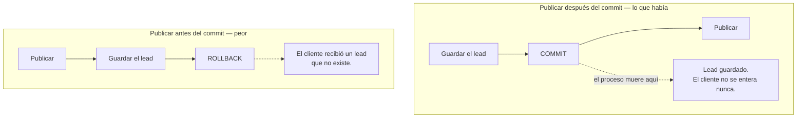
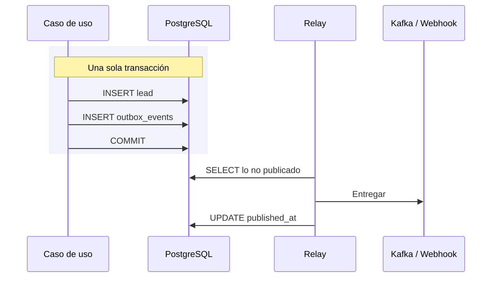

# El outbox transaccional

El outbox es la pieza que hace verdad la frase *«si necesitas los leads, puedes reobtenerlos»*. Sin
él, esa promesa depende de que nada falle en el momento exacto entre guardar y publicar.

Decisión que lo fija: [ADR-0025](../decisiones/0025-outbox-transaccional.md).

## El problema de las dos escrituras

Guardar un lead y publicarlo son dos escrituras contra dos sistemas distintos: PostgreSQL y el
bróker. **No hay forma de hacerlas atómicas**, y el orden que se elija determina qué se pierde
cuando el proceso muere en medio.



El código publicaba **después** del commit, y lo hacía a propósito: un aviso que falla no debe
deshacer un lead ya guardado. El precio era la ventana inversa. Mientras el publicador vivía en
memoria dentro del mismo proceso, esa ventana eran microsegundos. En cuanto publicar implica una
llamada de red a un bróker que puede estar caído, deja de ser un caso de laboratorio.

## La solución: que publicar deje de ser una escritura remota

El outbox convierte «publicar» en «insertar una fila». Y una fila **sí** entra en la transacción del
lead.



Un `ROLLBACK` se lleva el evento con el lead. Una entrega que falla no toca el lead. Las dos caras
del problema, resueltas por el mismo mecanismo.

## Qué guarda la tabla

```sql
CREATE TABLE IF NOT EXISTS outbox_events (
    id UUID PRIMARY KEY,          -- el event_id del evento, no uno nuevo
    tenant_id UUID NOT NULL,
    partition_key TEXT NOT NULL,  -- el lead: su orden se respeta
    event_type TEXT NOT NULL,
    payload JSONB NOT NULL,
    occurred_on TIMESTAMPTZ NOT NULL,
    published_at TIMESTAMPTZ,     -- NULL mientras no haya salido
    attempts INTEGER NOT NULL DEFAULT 0,
    last_error TEXT
);
```

**`id` es el `event_id` del propio evento**, no uno generado por la tabla. Es lo que un consumidor
usa para deduplicar cuando la entrega es *at-least-once*: si el relay muere entre entregar y marcar,
el mensaje sale dos veces con el mismo identificador.

## Un ciclo del relay son tres pasos

Y son tres, no uno, porque el del medio habla por la red:

| Paso | Dónde ocurre | Por qué separado |
|---|---|---|
| **Leer** el lote | Una transacción corta | — |
| **Entregar** a cada despachador | **Sin transacción abierta** | Una llamada de red por entrada con una conexión del pool retenida: unos cuantos receptores agotando su plazo vacían el pool del que vive la API |
| **Registrar** el resultado | Otra transacción corta | — |

El precio de soltar la transacción es que dos relays podrían entregar la misma entrada dos veces.
Es exactamente lo que significa *at-least-once*, y para eso el consumidor tiene el `event_id`.

## Nada se descarta por haber fallado

El orden del lote es `ORDER BY attempts, occurred_on`: **las que menos han fallado, primero**.

Ordenar sólo por antigüedad dejaba que un destino roto de forma permanente saliera siempre el
primero y dejara sin sitio a todo lo demás. La respuesta obvia —un tope de reintentos— resultó ser
peor: con el bróker caído fallan **todas** las entregas, así que unos segundos de caída agotaban el
tope y descartaban para siempre los leads que esta tabla existe para no perder.

Con el orden por intentos, una entrada que falla se hunde, las nuevas la adelantan, y se sigue
reintentando el tiempo que haga falta.

## Qué entra en el outbox y qué no

| Eventos | Camino | Por qué |
|---|---|---|
| `LeadProcessedEvent`, `LeadDisqualified` | **Outbox** | Salen del sistema. Perderlos es perder producto |
| `LeadAssigned`, `LeadReassigned`, `LeadLeftUnassigned`, `IntakeRejected` | En proceso, síncronos | Su consumidor está aquí dentro, y el usuario espera ver la notificación al recargar. Meterlos en el outbox retrasaría lo único que hoy es inmediato |

Es la misma frontera que trazan el [ADR-0023](../decisiones/0023-eventos-del-canal-de-salida.md) y
el [ADR-0024](../decisiones/0024-el-contrato-de-salida-se-construye-una-vez.md): dos catálogos con
dos criterios, no uno relajado.

## Dónde vive

| Pieza | Fichero |
|---|---|
| La tabla | `backend/migrations/009_outbox.sql` |
| El puerto | `application/ports/output/outbox_repository_port.py` |
| El adaptador SQL | `infrastructure/adapters/output/persistence/raw_sql_outbox_repository.py` |
| El relay | `application/services/outbox_relay.py` |
| El hilo que lo late | `infrastructure/adapters/output/events/outbox_relay_thread.py` |
| Los destinos | `infrastructure/adapters/output/events/*_outbound_dispatcher.py` |
