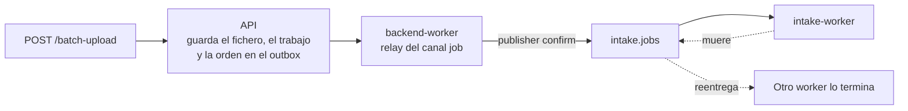
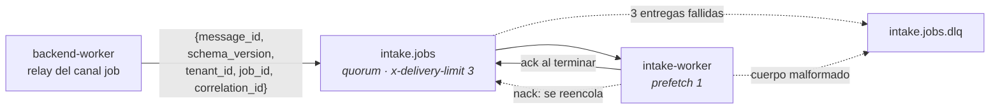
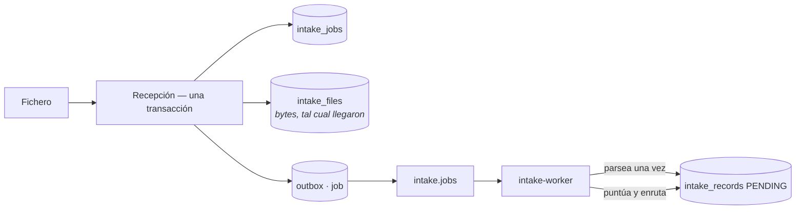

# RabbitMQ · el trabajo interno

RabbitMQ no transporta producto: transporta **encargos**. «Procesa el trabajo 42» es una frase con
fecha de caducidad — una vez hecho, el mensaje no vale nada.

Decisión que lo fija: [ADR-0027](../decisiones/0027-cola-para-el-trabajo-de-fondo.md), que sustituye
al [ADR-0019](../decisiones/0019-trabajo-de-fondo-en-proceso.md).

## El defecto que cierra

Subir un fichero de 10.000 leads devolvía `202`, y si el proceso que lo iba a procesar caía a
mitad —un despliegue, una actualización, un `OOM`—, el trabajo quedaba a medias y **nadie lo
retomaba**. Peor aún: si caía entre el `202` y el encolado, el trabajo no existía para nadie.

Lo que recibe un `202` llega a procesarse aunque caiga cualquier proceso o el propio bróker
([ADR-0034](../decisiones/0034-encolado-por-outbox-y-fichero-durable.md)).

## Por qué una cola y no un log

Es el reverso exacto del razonamiento de [Kafka](kafka.md):

| | Lo que hace falta aquí | Quién lo da |
|---|---|---|
| Un trabajo se coge, se hace y **desaparece** | `ack` manual | RabbitMQ |
| Si quien lo cogió muere, **otro lo repite** | Reentrega automática | RabbitMQ |
| Lo que falla siempre, **se aparta** | Cola muerta (DLQ) | RabbitMQ |
| Reparto entre trabajadores libres | El bróker lo resuelve | RabbitMQ |

En Kafka habría que emular las cuatro con offsets y grupos de consumidores, y el reparto entre
trabajadores pasaría a depender del número de particiones en vez de resolverse solo.

## La topología

| Decisión | Por qué |
|---|---|
| **El relay publica con *publisher confirms*** | `published_at` no se escribe hasta que el bróker confirma: lo que no se confirmó se reintenta |
| **`ack` manual y al terminar**, no al recibir | Un trabajo confirmado antes de acabar es un trabajo perdido si el worker muere a mitad |
| **`nack` con reencolado** si el trabajo se interrumpe | Un registro que falló de forma imprevista sigue `PENDING`, y la reentrega es lo que termina el trabajo. A la tercera entrega RabbitMQ lo mueve a la DLQ |
| **`prefetch_count=1`** | Los trabajos son largos; un prefetch mayor dejaría a un worker acaparando varios mientras otro está libre |
| **Cola `quorum` con `x-delivery-limit: 3`** | RabbitMQ lleva la cuenta de entregas él mismo. Contarlas a mano por la cabecera `x-death` sería código nuestro haciendo lo que el bróker ya hace |
| **El mensaje no lleva el trabajo**, sólo sus identificadores y metadatos | El trabajo ya está en base de datos. Meter también el payload sería tenerlo en dos sitios que pueden discrepar |
| **Un cuerpo que no es un mensaje de trabajo va a la DLQ** sin reintentos | Ninguna reentrega arregla unos bytes que no se pueden interpretar |

El mensaje lleva `message_id` (el `id` de la fila del outbox), `schema_version`, `tenant_id`,
`job_id` y `correlation_id`: el de la petición que encoló el trabajo o, en un reproceso, el de la
petición de reproceso. El worker lo restablece en sus logs, así que el `X-Request-Id` de la
ingesta aparece también en el procesamiento.

## Por qué la reentrega es segura

Esto no funciona por suerte: son tres piezas puestas antes, a propósito, y ésta es la que las usa.

| Pieza | Qué garantiza |
|---|---|
| `IntakeJob.start()` acepta `PROCESSING` | Un mensaje reentregado encuentra el trabajo ya empezado y **no lo rechaza**; si lo hiciese, dejaría sus registros `PENDING` para siempre |
| Sólo se leen registros `PENDING` | Un lead ya promocionado no se crea dos veces en la segunda pasada |
| Los contadores se **derivan** de los registros | Dos consumidores del mismo mensaje llegan al mismo número. Acumulándolos en memoria, el último en guardar pisaba al otro |

## Qué se encola y qué no

El mensaje no lleva ni los datos ni el fichero: el trabajo vive en base de datos.

Un `batch-upload` guarda el fichero en `intake_files` (`bytea`) en la **misma transacción** que crea
el trabajo y registra la orden en el outbox. El límite es de 10 MB, en el gateway y en el endpoint
(`413 PAYLOAD_TOO_LARGE`): el fichero vive en la base, y un cuerpo sin tope también viviría ahí.

Parsear lo hace el worker, una sola vez: lee el fichero con `FOR UPDATE`, materializa un
`IntakeRecord` por fila y marca `parsed_at` en la misma transacción. Una reentrega encuentra
`parsed_at` y salta directamente a puntuar y enrutar los registros `PENDING`. Un fichero ilegible
marca el trabajo `FAILED` y hace `ack`: no hay filas que reintentar.

Una ingesta individual y un reproceso siguen el mismo camino sin fichero: la orden entra en el
outbox con la transacción que guarda el trabajo (o que reinicia sus contadores) y el endpoint
responde `202` sin ejecutar nada.

## Si RabbitMQ está caído, el trabajo espera

No hay ruta alternativa. Con el bróker caído la ingesta responde `202`, el trabajo queda `PENDING` y
su fila `job` queda sin publicar. `RabbitJobDispatcher` falla al conectar, el relay lo registra y
reintenta, y cuando el bróker vuelve la fila sale, el trabajo se procesa y el lead aparece. Un lead
tarda más con la cola caída; no se pierde y no se procesa por otro camino.

Es lo que `verify_ms_f1` demuestra con `docker compose stop rabbitmq`: ver
[Validación](../desarrollo/validacion.md#la-durabilidad-verify_ms_f1).

`RabbitJobDispatcher` (`chassis.rabbit`) mantiene una conexión abierta, la reabre y redeclara la
topología si se cae, y reintenta una vez sobre una conexión nueva si la reutilizada falla en silencio.
Un `NackError` o un mensaje no enrutable no se reintentan por reconexión: la fila cuenta como fallo.

## Dónde vive

| Pieza | Fichero |
|---|---|
| El mensaje y su procesamiento | `infrastructure/intake_worker/messages.py` |
| El trabajador | `infrastructure/intake_worker/` (`consumer.py`, `main.py`), `python -m infrastructure.intake_worker` |
| La topología de la cola | `infrastructure/adapters/output/queue/intake_queue_topology.py` |
| El despachador que publica | `libs/chassis/src/chassis/rabbit.py` (`RabbitJobDispatcher`), cableado en `infrastructure/worker/` |
| El fichero guardado | `infrastructure/adapters/output/persistence/raw_sql_intake_file_repository.py` |
| Los servicios | `docker-compose.yml`, `backend-worker` e `intake-worker` |

## Límites de hoy

- El worker **reconecta** por su cuenta con una espera de 1 s que se duplica hasta 30 s: sin ello, bajo
  el recargador de desarrollo un worker que sale se queda parado hasta que cambie un fichero, y los
  trabajos que el relay sigue publicando esperarían a nadie.
- En desarrollo **sí recarga al cambiar `src/`**, con `watchfiles` —el mismo que usa uvicorn por
  dentro— envolviendo su comando. Sin eso el worker seguía ejecutando lo que importó al arrancar
  mientras el código decía otra cosa, y el síntoma era un trabajo parado en `PROCESSING` sin que
  nada fallara a la vista. Reiniciar a mitad de un mensaje es seguro por lo de arriba: la reentrega
  ya está resuelta.
- **Nadie mira la DLQ.** Un mensaje que llega ahí se queda sin que nada avise; ver
  [Operar la mensajería](operacion.md#las-colas-muertas-y-como-reinyectar-un-mensaje).
- **Un registro que falla siempre** lleva su trabajo a la DLQ en tres entregas, y recuperarlo es manual.
- **Los ficheros no se purgan.** `intake_files` crece con cada `batch-upload`; necesita una política de
  retención.
- **Sin apagado ordenado:** un `SIGTERM` a mitad de un mensaje lo mata, y es justo el caso que la
  reentrega ya cubre por diseño.
- **Credenciales en claro** en el fichero de compose, sin TLS. Aplazado con razón escrita, no
  olvidado: ver «Alternativas consideradas» en el
  [ADR-0028](../decisiones/0028-autenticacion-de-la-mensajeria.md#alternativas-consideradas).
