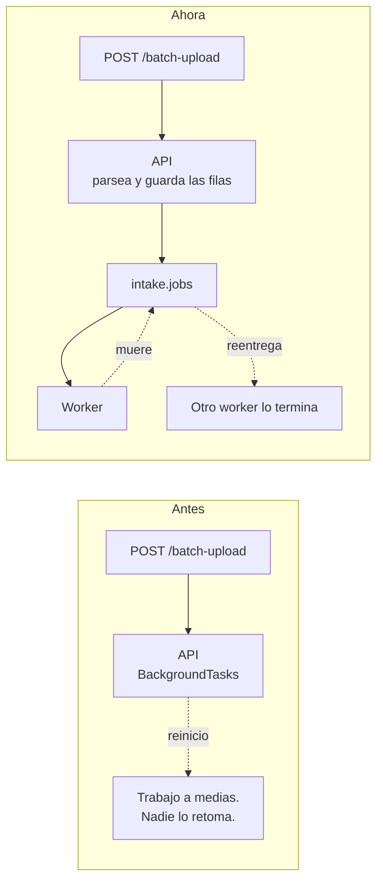
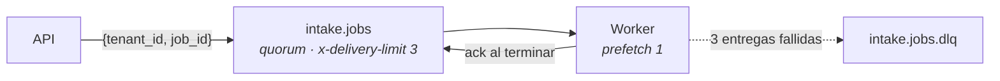
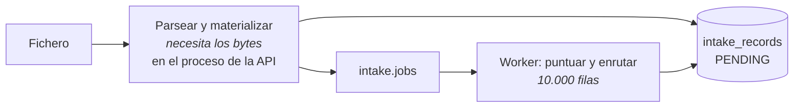

# RabbitMQ · el trabajo interno

RabbitMQ no transporta producto: transporta **encargos**. «Procesa el trabajo 42» es una frase con
fecha de caducidad — una vez hecho, el mensaje no vale nada.

Decisión que lo fija: [ADR-0027](../decisiones/0027-cola-para-el-trabajo-de-fondo.md), que sustituye
al [ADR-0019](../decisiones/0019-trabajo-de-fondo-en-proceso.md).

## El defecto que cierra

Subir un fichero de 10.000 leads devolvía `202` y dejaba el procesamiento en las tareas de fondo del
propio proceso de la API. Si el contenedor se reiniciaba a mitad —un despliegue, una actualización,
un `OOM`—, el trabajo quedaba a medias y **nadie lo retomaba**: el usuario tenía que darle a
reprocesar a mano.



## Por qué una cola y no un log

Es el reverso exacto del razonamiento de [Kafka](kafka.md):

| | Lo que hace falta aquí | Quién lo da |
|---|---|---|
| Un trabajo se coge, se hace y **desaparece** | `ack` manual | RabbitMQ |
| Si quien lo cogió muere, **otro lo repite** | Reentrega automática | RabbitMQ |
| Lo que falla siempre, **se aparta** | Cola muerta (DLQ) | RabbitMQ |
| Reparto entre trabajadores libres | El bróker lo resuelve | RabbitMQ |

En Kafka habría que emular las cuatro con offsets y grupos de consumidores, y el reparto entre
trabajadores pasaría a depender del número de particiones en vez de resolverse solo.

## La topología



| Decisión | Por qué |
|---|---|
| **`ack` manual y al terminar**, no al recibir | Un trabajo confirmado antes de acabar es un trabajo perdido si el worker muere a mitad |
| **`prefetch_count=1`** | Los trabajos son largos; un prefetch mayor dejaría a un worker acaparando varios mientras otro está libre |
| **Cola `quorum` con `x-delivery-limit: 3`** | RabbitMQ lleva la cuenta de entregas él mismo. Contarlas a mano por la cabecera `x-death` sería código nuestro haciendo lo que el bróker ya hace |
| **El mensaje lleva sólo `{tenant_id, job_id}`** | El trabajo ya está en base de datos. Meter también el payload sería tenerlo en dos sitios que pueden discrepar |

## Por qué la reentrega es segura

Esto no funciona por suerte: son tres piezas puestas antes, a propósito, y ésta es la que las usa.

| Pieza | Qué garantiza |
|---|---|
| `IntakeJob.start()` acepta `PROCESSING` | Un mensaje reentregado encuentra el trabajo ya empezado y **no lo rechaza**; si lo hiciese, dejaría sus registros `PENDING` para siempre |
| Sólo se leen registros `PENDING` | Un lead ya promocionado no se crea dos veces en la segunda pasada |
| Los contadores se **derivan** de los registros | Dos consumidores del mismo mensaje llegan al mismo número. Acumulándolos en memoria, el último en guardar pisaba al otro |

## Qué se encola y qué no

La subida de un fichero se parte en dos mitades, y sólo una viaja:



Parsear necesita los bytes del fichero, que sólo viven en la memoria de la petición. Pero cuando
termina, **cada fila ya es un registro duradero**, y puntuar y enrutar diez mil de ellas —que es la
parte que de verdad muere con el proceso— se encola igual que un lead suelto.

Encolar el fichero entero habría exigido meter sus bytes en el mensaje, contradiciendo la decisión
de qué lleva dentro.

## Si la cola está caída, se degrada

`JobQueuePort.enqueue_intake_job` devuelve `bool` en vez de lanzar. Es el **único puerto de salida
del sistema que rompe ese patrón**, y a propósito: que el bróker esté caído no es culpa de quien
envió el lead, y el endpoint necesita poder decidir.

```python
if not job_queue.enqueue_intake_job(context.tenant_id, job_id):
    background.add_task(process.execute, context.tenant_id, job_id)
```

Degradar al comportamiento anterior es preferible a rechazar los leads de un cliente porque nuestra
cola interna está caída. **Es el respaldo lo que hay que demostrar con tests**, no el camino feliz:
un fallo aquí no rompe nada visible hasta que el bróker cae de verdad.

## Dónde vive

| Pieza | Fichero |
|---|---|
| El puerto | `application/ports/output/job_queue_port.py` |
| El adaptador | `infrastructure/adapters/output/queue/rabbitmq_job_queue.py` |
| El trabajador | `infrastructure/workers/intake_worker.py` |
| El servicio | `docker-compose.yml`, servicio `intake-worker` |

## Límites de hoy

- **El worker no reconecta** por su cuenta: una conexión caída hace morir el proceso, y
  `restart: on-failure` lo recupera. Está marcado en el código como simplificación deliberada.
- **Nadie mira la DLQ.** Un mensaje que llega ahí se queda sin que nada avise.
- **Sin apagado ordenado:** un `SIGTERM` a mitad de un mensaje lo mata, y es justo el caso que la
  reentrega ya cubre por diseño.
- **Credenciales en claro** en el fichero de compose, sin TLS.
