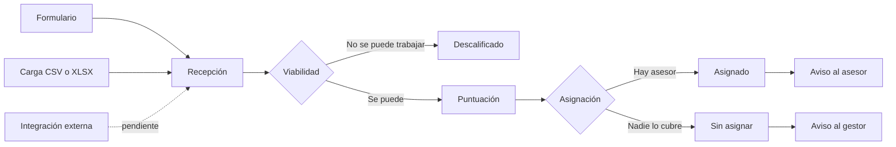

# Lead Router

Un sistema de enrutamiento y autoasignación de leads comerciales, construido con arquitectura
hexagonal sobre FastAPI y PostgreSQL.

Cuando un contacto comercial entra al sistema —por formulario, por carga de fichero o por
integración—, alguien tiene que decidir tres cosas: si se puede trabajar, cuánto vale y quién lo
atiende. Lead Router convierte esas tres decisiones en configuración que escribe cada organización,
en lugar de en código que sólo un programador puede cambiar.

<div class="grid cards" markdown>

-   **Empieza por aquí**

    ---

    Qué problema resuelve, con qué modelo y por qué está separado en tres etapas.

    [Visión general](vision/index.md)

-   **Cómo está construido**

    ---

    Diagramas C4, modelo de datos y el recorrido completo de un lead por el sistema.

    [Arquitectura](arquitectura/index.md)

-   **Por qué está así**

    ---

    Las decisiones de diseño con su contexto, sus alternativas y sus consecuencias.

    [Decisiones](decisiones/index.md)

-   **Voy a programar**

    ---

    Puesta en marcha, validación, convenciones y la referencia completa de la API.

    [Desarrollo](desarrollo/index.md)

</div>

## En una imagen



Cada etapa responde una pregunta de naturaleza distinta y usa la herramienta que le corresponde:
la viabilidad es binaria y se resuelve con reglas de descalificación, la calidad es continua y se
resuelve con puntuación, y el destino es categórico y se resuelve con reglas de asignación.

Forzar las tres dentro de una sola escala numérica es el error que este diseño corrige, y está
explicado en [El modelo de decisión](vision/modelo-de-decision.md).

## Qué hay construido

El backend está funcionalmente completo salvo la integración entrante. La interfaz web es lo que
falta para tener producto.

| Capacidad | Estado |
|---|---|
| Ingesta autenticada, individual y por fichero | Disponible |
| Nada de lo que entra se pierde, aunque no se pueda interpretar | Disponible |
| Reglas de descalificación, puntuación y asignación configurables | Disponible |
| Autoasignación con carga de trabajo, capacidad y turnos | Disponible |
| Bandeja de revisión para lo que el sistema no entendió | Disponible |
| Avisos internos con contador de no leídos | Disponible |
| Aislamiento entre organizaciones | Disponible |
| Integración entrante autenticada por firma | [En la hoja de ruta](roadmap/webhook-entrante.md) |
| Interfaz web | [En la hoja de ruta](roadmap/frontend.md) |

## Empezar en dos comandos

```bash
docker compose up -d
curl http://localhost:8001/health
```

La documentación que estás leyendo se sirve desde el mismo `compose`, en
[http://localhost:8002](http://localhost:8002).

Los detalles —usuario inicial, credenciales, primera organización— están en
[Puesta en marcha](desarrollo/puesta-en-marcha.md).

## Sobre este proyecto

Lead Router nació como material docente para un curso de arquitectura de software, y esa es la razón
de que esté documentado con este nivel de detalle: el objetivo no es sólo que funcione, sino que se
pueda explicar por qué funciona así.

Varias capacidades que parecen faltar —deduplicación de contactos, constructor visual de reglas,
límites a la escala de puntuación— se discutieron y se dejaron fuera **a propósito**. Cada una tiene
su razón escrita en la [hoja de ruta](roadmap/index.md). Antes de proponer una como si fuera un
olvido, conviene mirar ahí.
