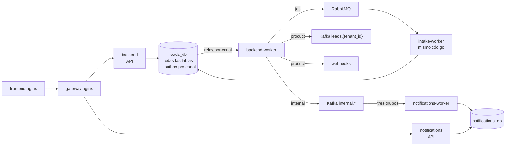

# 01 · Punto de partida

Esta página fija lo que existe antes del desacople, verificado contra el código, y enumera los
acoplamientos que cada fase tiene que cortar. Es la lista de trabajo: si un acoplamiento no aparece
aquí, el plan no lo resuelve. Las tablas reflejan el estado actual, con F0, F1 y F2 ya implantadas; lo
que una fase cortó lo dice su fila.

## Lo que corre hoy

El gateway (F0), la durabilidad (F1) y el servicio `notifications` (F2) ya están en su sitio; el resto
de la tabla es el punto de partida que las fases F3 a F5 van cortando. `backend` no publica puerto en el host.

| Contenedor | Qué hace | Comparte |
|---|---|---|
| `backend` | API completa, migraciones y casos de uso. Sólo **escribe** en el outbox: no entrega nada | Imagen, código y base con los workers |
| `backend-worker` | Un relay del outbox por canal (`product`, `internal`, `job`) (`infrastructure/worker/`). Desde F2 ya no consume | Imagen, código y base con `backend` |
| `notifications`, `notifications-worker` | **Servicio extraído en F2**: la bandeja (API y tres consumidores) con su base `notifications_db` | Nada: imagen propia con `libs/chassis`; sólo comparte el servidor PostgreSQL |
| `intake-worker` | Consume `intake.jobs` y ejecuta el procesamiento del trabajo | Reutiliza el cableado de `dependencies.py` |
| `db` | `leads_db` con las tablas de los contextos aún no extraídos, y `notifications_db`, que crea `db-bootstrap` | — |
| `rabbitmq` | `intake.jobs` (cuórum, `x-delivery-limit: 3`) y `intake.jobs.dlq` | — |
| `kafka` | `leads.{tenant_id}`, ACL `LITERAL` por organización (ADR-0028), y los topics `internal.*` | — |
| `gateway` | nginx: única entrada de la API en `:8001`; autentica con *phantom token* ([03](03-gateway-y-autenticacion.md)) | — |
| `frontend` | SPA + proxy `/api/v1/` → `gateway:8080` | — |

El backend ya es hexagonal y el guardián AST (`tests/architecture/test_dependency_rule.py`) lo
impone. Eso es lo que hace barata la extracción: casi todo lo que cruza un contexto ya pasa por un
puerto, y separar consiste en cambiar el adaptador que hay detrás.

## Una sola unidad de trabajo para todo

`PostgresUnitOfWork` expone **16 repositorios** sobre una conexión. Cualquier caso de uso puede leer
o escribir cualquier tabla dentro de la misma transacción. La tabla siguiente es el resultado de
recorrer `application/` buscando qué repositorios usa cada caso de uso; las celdas en negrita son
los cruces entre contextos.

| Caso de uso | Repositorios que usa | Cruce |
|---|---|---|
| `IngestLeadUseCase` | `intake_records`, `sources`, `leads`, `rules`, `disqualification_rules`, **`agents`**, **`groups`**, `outbox` | Ingesta ↔ decisión ↔ identidad |
| `GetLeadStatsUseCase` | `leads`, **`intake_records`** | Leads ↔ ingesta |
| `AssignLeadUseCase` | `leads`, **`agents`**, `outbox` | Leads ↔ identidad |
| `NotificationHandler` | `notifications`, **`agents`** (managers del tenant) | Notificaciones ↔ identidad. **Cortado en F2**: vive en `notifications` y lee su proyección `members` |
| `SalesGroup*UseCase` | `groups`, **`agents`** (recuento y huérfanos al borrar) | Leads ↔ identidad |
| `UpdateAgentUseCase` | `agents`, **`groups`** (valida `group_id`) | Identidad ↔ leads |
| `CreateTenantUseCase` | `tenants`, `agents`, **`sources`** (dos fuentes por defecto) | Identidad ↔ ingesta |
| `DeleteLeadSourceUseCase` | `sources`, **`leads`** (`count_by_source`) | Ingesta ↔ leads |
| `RawSqlLeadRepository` | `JOIN agents` en la carga con nombres y subconsulta por `group_id` | SQL directo entre contextos |

Todo lo demás (reglas, fuentes, jobs, registros, sesiones, MFA, OAuth, notificaciones) ya vive en un
solo contexto.

## Cómo entra la identidad

- Humanos: cookie `leads_session`, valor aleatorio de 256 bits, sólo su SHA-256 en `auth_sessions`
  (ADR-0029). El gateway introspecciona la cookie en **cada** petición (`resolve_current_agent`
  vuelve a cargar al agente): desactivar a alguien corta su acceso en la siguiente.
- Integraciones: `X-Api-Key` con formato `{agent_id}.{secreto}`, verificada con bcrypt en la
  introspección y aceptada **sólo** en `GET /leads` mediante `require_manager_or_integration`.
- Los routers protegidos reciben del gateway un bearer interno (JWT Ed25519 de 60 s). Todos dependen de
  `get_request_context`, que lo verifica y construye el `Principal`, y de sus tres guardas
  (`require_platform_admin`, `require_organization_manager`, `require_organization_member`).
  Cambiar el origen de la identidad es un cambio en un único punto por servicio. Ninguna ruta de
  negocio (`/api/v1/*` salvo `/api/v1/auth/*`) recibe la cookie: sólo `/auth/*` y la introspección
  interna la leen.
- `Origin` en escrituras y CORS se resuelven en el gateway, no en `main.py`.

## Mensajería: lo que ya está bien y lo que no aguanta la separación

**Se conserva:**

- RabbitMQ para trabajo con un único ejecutor y Kafka para hechos reobtenibles (ADR-0026, ADR-0027).
- El mensaje de `intake.jobs` lleva sólo identificadores y metadatos (`message_id`, `schema_version`,
  `tenant_id`, `job_id`, `correlation_id`); el trabajo vive en base de datos.
- Outbox transaccional (ADR-0025), ahora con un canal por tipo de entrega: `LeadProcessedEvent` y
  `LeadDisqualified` en `product`, y los hechos internos y las órdenes de trabajo en `internal` y
  `job`. Con `event_id` estable y entrega al menos una vez.
- Reentrega segura: `start()` acepta `PROCESSING`, sólo se releen registros `PENDING`, los contadores
  se derivan y `claim_unpromoted` impide dos leads del mismo registro.

**No sobrevivía a separar procesos o bases, y F1 lo cortó:**

| Hecho verificado | Dónde estaba | Estado |
|---|---|---|
| Las notificaciones se publicaban con un bus en memoria (`InMemoryEventPublisher`) | `di/event_wiring.py`, `application/handlers/notification_handler.py` | **Resuelto en F1.** Los eventos se registran en el outbox `internal` dentro de la transacción y `NotificationConsumer` los consume desde `internal.lead-core.events` e `internal.intake.events`; desde F2, en `notifications-worker` |
| El relay corría en un hilo de la API | `main.py`, `outbox_relay_thread.py` | **Resuelto en F1.** La API ya no ejecuta ningún relay; los ejecuta `backend-worker`, uno por canal |
| Un job con un registro fallido hacía `ACK` y quedaba en `PROCESSING` | `process_intake_job_use_case.py`, `intake_worker.py` | **Resuelto en F1.** Hace `nack` con reencolado y, a la tercera entrega, pasa a `intake.jobs.dlq` |
| Si RabbitMQ no respondía, el job se procesaba en el proceso de la API | `intake_router.py`, `process_batch_use_case.py` | **Resuelto en F1.** Se elimina el *fallback*: el job espera en el outbox |
| `batch-upload` parseaba el fichero en un `BackgroundTask` con los bytes en memoria | `intake_router.py` | **Resuelto en F1.** El fichero se guarda en `intake_files` en la transacción de recepción y lo parsea el worker |
| Topics creados por *auto-create* | `docker-compose.yml` (`KAFKA_AUTO_CREATE_TOPICS_ENABLE`) | **Resuelto para `internal.*`** (F1): los crea `ensure_topics` y su productor no usa la creación automática. `leads.{tenant_id}` sigue creándose al publicar |

## Datos: referencias que hoy son FK y dejarán de serlo

| Referencia | Hoy | Tras separar |
|---|---|---|
| `intake_records.lead_id` → `leads` | FK | UUID externo |
| `leads.source_id` → `lead_sources` | FK | UUID externo |
| `leads.assigned_agent_id` → `agents` | Lógica | UUID externo, resuelto contra la proyección `advisors` |
| `notifications.recipient_id` → `agents` | FK | UUID externo, resuelto contra la proyección `members` |
| `*.tenant_id` → `tenants` | FK en casi todas | UUID externo; la validez la garantiza el token |
| `leads` ↔ `intake_records` | Sólo `intake_records.lead_id` | Nueva columna `leads.intake_record_id` con `UNIQUE (tenant_id, intake_record_id)` |

La última fila es la que hace idempotente la admisión entre servicios: hoy la garantiza
`claim_unpromoted` dentro de una única transacción, y esa transacción deja de existir.

## Conclusión

1. Los contextos ya son reconocibles en el código; lo que los une es la unidad de trabajo compartida
   y nueve cruces concretos.
2. La identidad se resuelve en un único punto, así que cambiar su origen es barato.
3. La mensajería tenía la semántica correcta, pero tres piezas sólo funcionaban dentro de un proceso:
   el bus de notificaciones, el relay y el *fallback* de encolado. F1 las sustituyó por el outbox por
   canal y por Kafka y RabbitMQ.
4. El orden del plan sale de aquí: primero lo que es durable sólo dentro de un proceso, después los
   cruces, un contexto cada vez.
