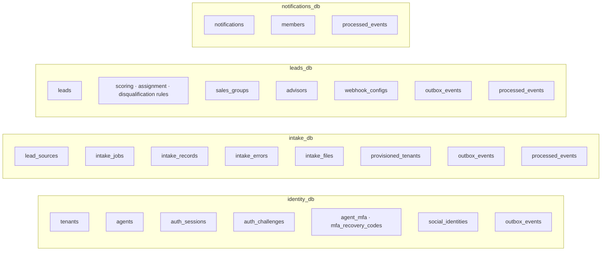
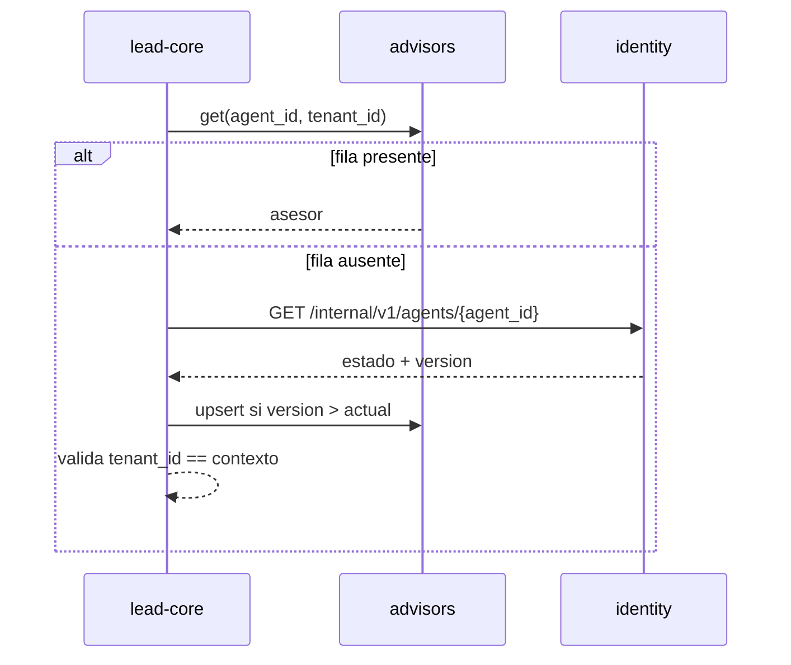
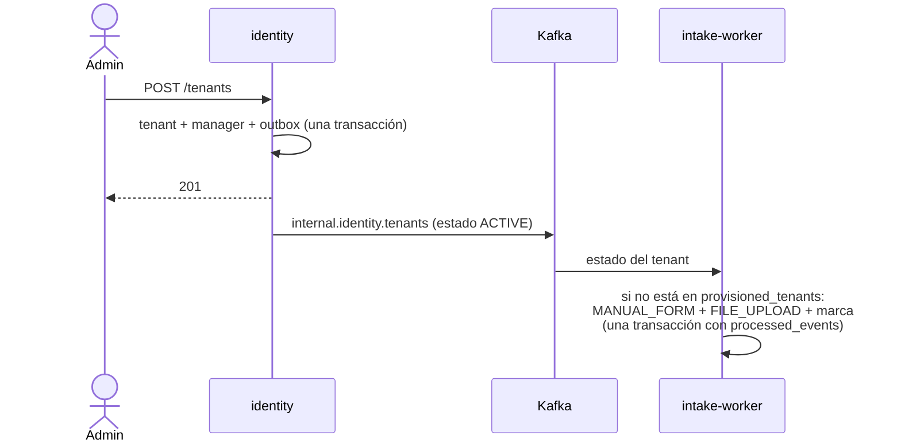

# 02 · Servicios y datos

Cuatro servicios de negocio y un gateway. Cada servicio es dueño de una base y de un hexágono propio;
todos se construyen con el mismo esqueleto, de modo que entender uno es entender los cinco y sólo
cambia el núcleo. Decisión registrada en [ADR-0031](../decisiones/0031-microservicios-por-contexto.md).

## Catálogo

| Servicio | Responsabilidad | Base | API pública | API interna |
|---|---|---|---|---|
| **gateway** | Borde: enrutado, autenticación por `auth_request`, CORS, `Origin`, `X-Request-Id`, límites | — | `/api/v1/*` | — |
| **identity** | Quién eres y qué puedes hacer: tenants, agentes, sesiones, MFA, OAuth, credenciales de integración | `identity_db` | `/auth/*`, `/tenants/*`, `/agents/*` | `auth/introspect`, `jwks`, `service-tokens`, `agents/{id}` |
| **intake** | Lo que llega: fuentes, jobs, registros crudos, errores, ficheros | `intake_db` | `/sources/*`, `/intake/*` | — |
| **lead-core** | La decisión y su ciclo de vida: reglas, motores, grupos, asesores, leads, canal de producto | `leads_db` | `/leads/*`, `/rules/*`, `/groups/*`, `/advisors/*` | `admissions` |
| **notifications** | La bandeja de cada destinatario | `notifications_db` | `/notifications/*` | — |

Todas las rutas internas cuelgan de `/internal/v1/`, que el gateway nunca publica.

## Propiedad de los datos



| Tabla | Dueño | Nota |
|---|---|---|
| `tenants`, `agents`, `auth_*`, `agent_mfa`, `mfa_recovery_codes`, `social_identities` | identity | `agents` pierde `group_id` en F3 |
| `lead_sources`, `intake_jobs`, `intake_records`, `intake_errors` | intake | |
| `intake_files` | intake | **Nueva** (F1): el fichero crudo de un `batch-upload`, en `bytea`, antes de parsearlo |
| `provisioned_tenants` | intake | **Nueva** (F3, todavía en `leads_db`; se mueve en F4): marca que las fuentes por defecto de un tenant ya se crearon una vez |
| `leads`, reglas, `sales_groups`, `webhook_configs` | lead-core | `leads` gana `intake_record_id` (F4) |
| `advisors` | lead-core | **Nueva** (F3): proyección de identidad + `group_id` propio |
| `notifications` | notifications | Copiada en F2; `leads_db.notifications` se queda, sin crecer, hasta F5 |
| `members` | notifications | **Nueva** (F2): proyección de identidad para decidir destinatarios; sembrada en el corte desde `agents` |
| `outbox_events` | cada productor | Gana la columna `channel` (F1) |
| `processed_events` | cada consumidor | **Nueva**: `PRIMARY KEY (consumer, event_id)` |

`leads_db` se queda como base de lead-core: es la base actual y lo que se va son las tablas de los
demás. Las otras tres se crean nuevas.

## Proyecciones

Una proyección es una copia local, derivada y reconstruible de datos de otro servicio. Nunca se
escribe desde una API pública y nunca es fuente de verdad.

| Proyección | Servicio | Fuente | Columnas | Uso |
|---|---|---|---|---|
| `advisors` | lead-core | `internal.identity.agents` | `agent_id`, `tenant_id`, `name`, `role`, `is_active`, `version` **+ `group_id` (propio)** | Candidatos de asignación, asignación manual, carga con nombres |
| `members` | notifications | `internal.identity.agents` | `agent_id`, `tenant_id`, `role`, `is_active`, `version` | Managers de un tenant como destinatarios |

`members` no tiene la carrera de abajo: nadie la hidrata bajo demanda. Si un lead queda sin asignar
antes de que el manager de un tenant recién creado llegue a la proyección, ese aviso no se genera
([Notificaciones](../modulos/notificaciones.md#la-proyeccion-members)). Ambas copias aplican el mismo
*upsert* condicionado por `version`.

`advisors` mezcla a propósito dos dueños en una fila: las columnas de identidad las escribe sólo el
consumidor; `group_id` lo escribe sólo lead-core, a través de `PATCH /advisors/{agent_id}`. Ningún
evento de identidad toca `group_id`.

### La carrera de proyección

Crear un agente en identity y asignarle grupo en lead-core un segundo después puede llegar antes que
el evento. lead-core lo resuelve con un puerto de salida, `AdvisorDirectory`:



- El consumidor y la hidratación hacen el mismo *upsert* condicionado por `version`, que identity
  incrementa en cada escritura del agente: un mensaje atrasado nunca pisa un estado más nuevo.
- Si el agente no existe o pertenece a otra organización, `AGENT_NOT_FOUND` → **404**, igual que hoy.
- La misma vía cubre la asignación manual de un lead a un agente recién creado.

## Cómo se corta cada acoplamiento

| Acoplamiento ([01](01-punto-de-partida.md)) | Resolución | Fase |
|---|---|---|
| `IngestLeadUseCase` lee `agents` y `groups` | Lee `advisors` y `sales_groups`, ambos locales de lead-core | F3 |
| `IngestLeadUseCase` lee y escribe `intake_records` | Se parte en dos: intake reclama y marca el registro; lead-core decide en `POST /internal/v1/admissions` | F4 |
| `IngestLeadUseCase.resolve_source_id` | El `source_id` viaja en la admisión, tomado del registro | F4 |
| `GetLeadStatsUseCase` cuenta registros | `pending_intake` se mueve a `GET /intake/stats` (cambio de contrato 2) | F4 |
| `AssignLeadUseCase` valida el agente | `AdvisorDirectory` | F3 |
| `NotificationHandler` busca managers | Proyección `members` | F2 |
| `SalesGroup*` cuenta y deja huérfanos agentes | Opera sobre `advisors.group_id`, local | F3 |
| `UpdateAgentUseCase` valida `group_id` | `group_id` sale de `/agents`; pasa a `PATCH /advisors/{agent_id}` (cambio de contrato 1) | F3 |
| `CreateTenantUseCase` crea fuentes | identity crea tenant + manager y publica el estado del tenant; intake crea las dos fuentes al verlo por primera vez | F3 (consumidor en el monolito), F4 (se mueve a intake) |
| `DeleteLeadSourceUseCase` cuenta leads | Cuenta `intake_records` de la fuente: todo lead nace de un registro, así que el resultado es el mismo | F4 |
| `RawSqlLeadRepository` hace `JOIN agents` | `JOIN advisors` | F3 |
| `KafkaCredentialProvisioner` y el principal `INTEGRATION` | Se mueven a identity | F3 |

### Alta de una organización



Consecuencia aceptada: una ingesta enviada en el primer segundo tras el alta puede recibir
`SOURCE_NOT_FOUND`. `provisioned_tenants` evita que releer el topic compactado recree una fuente que
el manager borró después.

## Cambios en el contrato público

Son dos y están registrados en [ADR-0036](../decisiones/0036-cambios-de-contrato-publico.md). El resto
de rutas, cuerpos, códigos y el sobre de error no cambian.

| | Hoy | Después |
|---|---|---|
| Grupo del asesor | `POST/PATCH /agents` aceptan `group_id`; `GET /agents?group_id=` filtra | `/agents` no lo admite. Nuevo `GET /advisors?group_id=&is_active=` (id, nombre, grupo, carga activa) y `PATCH /advisors/{agent_id}` `{group_id}` |
| Pendientes de ingesta | `GET /leads/stats` devuelve `pending_intake` | `GET /leads/stats` lo pierde. Nuevo `GET /intake/stats` → `{pending, rejected, pending_intake}` |

Impacto en el frontend: el formulario de agente pasa a hacer dos llamadas (crear en `/agents`,
asignar grupo en `/advisors`); el listado combina `/agents` y `/advisors` por `agent_id`; el panel
hace dos lecturas. Los tipos se regeneran desde los OpenAPI de cada servicio.

## Patrón de construcción

Todos los servicios Python comparten el mismo esqueleto. La regla: **si dos servicios resuelven lo
mismo, lo resuelven en el mismo sitio y con el mismo nombre**. Lo único que diverge es el contenido de
`domain/`, `application/use_cases/` y los adaptadores concretos.

El árbol de `src/` y `tests/` —`servicio → capa → contexto`, con sus límites de tamaño— es el
[árbol modelo de Convenciones](../desarrollo/convenciones.md#estructura-y-tamano-del-codigo) y no se
repite aquí. Lo que añade cada servicio extraído:

| Ruta, bajo `services/<svc>/` | Contiene |
|---|---|
| `pyproject.toml`, `uv.lock` | Proyecto uv propio; depende de `libs/chassis` por ruta |
| `Dockerfile` | Etapas `runner`, `dev` y `test`, iguales en todos |
| `migrations/NNN_*.sql` | Sólo las tablas propias, idempotentes |
| `src/application/dtos/context.py` | `RequestContext(principal, tenant_id)` |
| `src/infrastructure/adapters/input/internal/` | Routers `/internal/v1/*` |
| `src/infrastructure/adapters/input/consumers/` | Consumidores Kafka y RabbitMQ |
| `src/infrastructure/config/settings.py`, `di/container.py` | Configuración y cableado |

| Pieza | Regla |
|---|---|
| Procesos | Siempre dos, desde la misma imagen: `api` (`main.py`) y `worker` (paquete `worker/`, `python -m infrastructure.worker`). Un servicio sin consumidores tiene igualmente worker: el relay de su outbox vive ahí |
| `RequestContext` | `RequestContext(principal, tenant_id)` en `application/dtos/context.py`. `Principal` es un dataclass del propio servicio: `agent_id`, `tenant_id`, `role`, `principal_type`. Sustituye a la entidad `Agent` que hoy viaja en el contexto |
| `AuthorizationPolicy` | Misma lógica que hoy, sobre `Principal`. Vive en `domain/policies` de cada servicio que la necesita |
| Errores | Mismo sobre `{error, error_code, message}` y misma tabla `STATUS_BY_ERROR_CODE` por servicio |
| Guardián | Los cuatro tests AST de hoy, por servicio, más el de estructura de [ADR-0037](../decisiones/0037-estructura-y-tamano-del-codigo.md), que el servicio nuevo pasa sin lista base; sus `src/` y `tests/` se declaran en `scripts/verify-structure.sh`. `libs/chassis` cuenta como infraestructura: `domain` y `application` no pueden importarlo |
| Configuración | `Settings.from_environment()` falla al arrancar si falta un valor obligatorio, como hoy |
| Configuración por proceso | Deuda anotada para F3. En notifications, `api` y `worker` leen el mismo `Settings`, así que cada proceso exige también las variables del otro. F3 separa la configuración por proceso |

### notifications, el servicio de referencia

Primer servicio extraído (F2). Es el árbol modelo de
[Convenciones](../desarrollo/convenciones.md#estructura-y-tamano-del-codigo) hecho código: lo que
identity e intake copian y lo que cambia es el contenido de `domain/` y `use_cases/`.

```text
services/notifications/
├── Dockerfile · pyproject.toml · uv.lock · migrations/ (001 notifications, 002 members, 003 processed_events)
├── src/
│   ├── domain/            notifications/ (Notification, NotificationKind) · members/ (Member) · policies/
│   ├── application/       dtos/ · ports/{input,output}/ · use_cases/{notifications,members}/
│   └── infrastructure/
│       ├── main.py                      API: aplica las migraciones al arrancar, /health
│       ├── worker/                      notifications-worker: un carril por grupo
│       ├── config/ · di/
│       └── adapters/
│           ├── input/api/notifications/ router y esquemas
│           ├── input/consumers/         groups.py, notification_consumer.py, member_consumer.py
│           └── output/persistence/      repositorios y unidad de trabajo (SQL crudo)
└── tests/                 unit/ · integration/ · e2e/ · architecture/
```

### `libs/chassis`

Una librería de **código técnico**, sin un solo tipo de dominio. Existe porque hay piezas que deben
ser idénticas en todos los servicios, y la verificación del token es la primera: si cada servicio la
copiara, bastaría que una copia divergiera para abrir un agujero.

| Módulo | Contiene |
|---|---|
| `chassis.auth` | `TokenVerifier` del JWT interno (firma, `iss`, `aud`, `exp`, `ptype` y par `role`/`ptype` coherentes), `JwksCache` y `KeysUnavailable` ([03](03-gateway-y-autenticacion.md#el-token-interno)); cliente de tokens de servicio |
| `chassis.persistence` | `RawSqlDatabase` (pool psycopg), `MigrationRunner` |
| `chassis.outbox` | Relay genérico y despachadores (Kafka, RabbitMQ, webhook) filtrados por `channel` |
| `chassis.consumer` | `ConsumerLoop` (`processed_events`, reintentos, DLQ), `run_consumer_lane` (reconstruye el consumidor tras un fallo), `ensure_topics()` y `ensure_topics_until_ready()` |
| `chassis.kafka_config` | `producer_config` y `consumer_config`: los ajustes de cliente que comparten todos los servicios |
| `chassis.web` | Middleware de `X-Request-Id` y logging correlacionado |
| `chassis.testing` | Guardianes de estructura (ADR-0037) y de capas (`layer_violations`, `stdlib_only_violations`, aislamiento de los tests de dominio), parametrizados por la raíz `src/` del servicio. Entró en F2, cuando un segundo servicio lo necesitó |

Criterio de entrada: un módulo entra en `chassis` cuando lo necesitan dos servicios **y** no
contiene ninguna regla de negocio. Lo que sólo usa uno se queda en ese servicio.

Cada servicio es un proyecto `uv` independiente con su `uv.lock`, no un miembro de un `uv workspace`:
los cinco tienen paquetes de primer nivel llamados `domain`, `application` e `infrastructure`, y en un
entorno virtual compartido colisionarían.

### `backend/` es lead-core

`backend/` no se vacía ni se copia: es el servicio lead-core desde el primer día y adopta el esqueleto
de arriba a medida que pierde módulos. Moverlo a `services/lead-core/` es el último paso de F5 y sólo
renombra.
