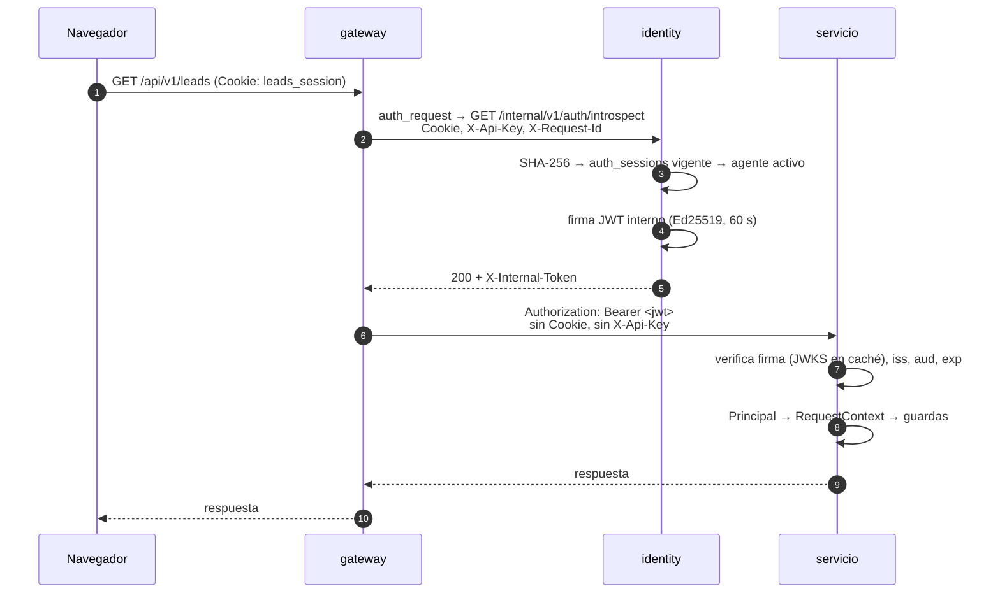

# 03 · Gateway y autenticación

Una petición entra por un único punto, se autentica una vez y llega a cada servicio con una
identidad que el servicio puede verificar por sí mismo. El navegador no cambia: sigue usando la
cookie opaca de [ADR-0029](../decisiones/0029-sesiones-opacas.md). Decisión registrada en
[ADR-0032](../decisiones/0032-gateway-y-phantom-token.md).

## El gateway

Un contenedor `gateway` con nginx. Ocupa el puerto **8001** del host, el de la API antes del
gateway, así que `verify-e2e.sh`, las colecciones de Bruno y los
`GOOGLE_REDIRECT_URI`/`GITHUB_REDIRECT_URI` siguen apuntando al mismo sitio. El `backend` ya no
publica puerto. El nginx del frontend apunta al gateway
(`proxy_pass http://gateway_api/api/v1/`, con `gateway_api` un `upstream` que se vuelve a resolver
por DNS, igual que en el gateway).

El gateway no tiene lógica de negocio ni base de datos. Hace sólo lo que es del borde:

| Responsabilidad | Antes | Con el gateway |
|---|---|---|
| Enrutar por prefijo | — (un único upstream) | Tabla de abajo |
| Autenticar | `get_current_agent` en el backend | `auth_request` contra la introspección (backend en F0, identity desde F3) |
| CORS | `CORSMiddleware` en `main.py` | `map $http_origin` en nginx |
| `Origin` en escrituras | Middleware `reject_untrusted_browser_origins` | `map` + `return 403` con el mismo sobre JSON |
| `X-Request-Id` | — | Conserva el que llega si es seguro para un log (`[A-Za-z0-9._-]{1,128}`); si no, genera uno (`$request_id`). Lo propaga y lo devuelve |
| Límites | — | `client_max_body_size 10m`; `limit_req` sólo en `/api/v1/auth/` |

**Orígenes permitidos.** Viven en dos sitios: el `map $http_origin` del gateway (comparación exacta,
nunca por prefijo) y `CORS_ORIGINS` del backend, que éste sólo usa ya para validar que
`FRONTEND_ORIGIN` es uno de ellos. Añadir un origen es tocar los dos.

**Límites.** `limit_req` (20 r/s por IP, `burst=60`, 429) sólo protege `/api/v1/auth/`: es donde está
la fuerza bruta de login, y la carga legítima del frontend y de `verify-e2e.sh` no debe toparse con él.

### Tabla de enrutado

| Prefijo | Upstream | `auth_request` | Motivo |
|---|---|---|---|
| `/api/v1/auth/` | identity | **No** | Es la frontera de autenticación: valida su propia cookie y emite la sesión. Es el único prefijo con `limit_req` |
| `/api/v1/agents` y `/api/v1/agents/` (ruta exacta) | identity | **Opcional** | `POST /agents` crea al administrador de plataforma sin credencial sobre una base vacía; ver [Bootstrap](#bootstrap-anonimo-de-post-agents) |
| `/api/v1/tenants/`, `/api/v1/agents/` (resto) | identity | Sí | |
| `/api/v1/sources/`, `/api/v1/intake/` | intake | Sí | |
| `/api/v1/leads/`, `/api/v1/rules/`, `/api/v1/groups/`, `/api/v1/advisors/` | lead-core | Sí | |
| `/api/v1/notifications/` | notifications | Sí | |
| `/openapi.json`, `/docs` | lead-core | **No** | Documentación de la API; el gateway quita `Cookie` |
| `/internal/` | — | — | `return 404`: nunca se publica |
| `/health` | el propio gateway | No | |
| Cualquier otra ruta | — | — | `404` con el sobre `NOT_FOUND` |

Durante la migración, un prefijo cuyo servicio todavía no existe apunta a `lead-core` (el monolito).
Mover una capacidad es añadir un `location` más específico con su `upstream`.

!!! note "En F0"
    Todos los prefijos apuntan a `backend`, que además sirve la introspección y la JWKS. El
    contenedor `identity` no existe todavía.

## *Phantom token*



El nombre del patrón describe lo que hace: fuera de la red interna el token no existe. El navegador
sólo ve su cookie opaca; los servicios sólo ven un JWT de vida corta que nadie fuera ha visto.

### Contrato de introspección

```text
GET /internal/v1/auth/introspect[?optional=true]
  Cookie: leads_session=…        (opcional)
  X-Api-Key: {agent_id}.{secreto} (opcional; si llega, tiene prioridad, como hoy)
  X-Request-Id: …

200  X-Internal-Token: <jwt>      cuerpo vacío
204                               sólo con ?optional=true y sin ninguna credencial
401                               sin credencial, sesión caducada o revocada, agente inactivo, clave inválida
```

La introspección **no autoriza**: no devuelve 403 ni mira la ruta. Sólo dice quién es. La
autorización sigue en cada servicio, sobre el `Principal`.

#### Bootstrap anónimo de `POST /agents`

La ruta exacta `/api/v1/agents` (con o sin barra final) usa la introspección opcional
(`?optional=true`): sin credencial devuelve `204` y el gateway reenvía la petición sin `Authorization`.
**Cualquier credencial que llegue debe ser válida**: una inválida es `401`, nunca degrada a anónimo.
La decisión es del servicio: una petición anónima sólo crea al `ADMIN` de plataforma sobre una base de
agentes vacía, y un principal de máquina en esa ruta es `401` (`get_optional_human_principal`).

### El token interno

| Claim | Valor |
|---|---|
| `iss` | `identity` |
| `aud` | `lead-router` |
| `sub` | `agent_id` |
| `tid` | `tenant_id`, o `null` para `ADMIN` |
| `role` | `ADMIN`, `MANAGER`, `AGENT` o `INTEGRATION` |
| `ptype` | `human` o `integration` |
| `iat`, `exp` | `exp = iat + 60 s` |
| `jti` | UUID, para trazas |
| cabecera `kid` | Identificador de la clave de firma |

- **Firma Ed25519 (`EdDSA`).** Asimétrica: identity firma con la privada y los servicios sólo tienen
  la pública. Un servicio comprometido no puede fabricar identidades. Se verifica, no se descifra: el
  contenido no es secreto, su integridad sí.
- **JWKS** en `GET /internal/v1/jwks`. `chassis.auth` la cachea y la vuelve a pedir si llega un `kid`
  desconocido. Rotar es publicar la clave nueva junto a la anterior, firmar con la nueva y retirar la
  vieja pasados 60 s.
- **`SIGNING_KEYS`** es una lista `kid=<semilla>[,kid=<semilla>…]`, donde la semilla es la semilla
  Ed25519 de 32 bytes en base64url sin relleno (no PEM). La primera firma; todas se publican en la
  JWKS. El valor de desarrollo vive en `docker-compose.yml`.
- **PyJWT** (`pyjwt[crypto]`) en `chassis`. `cryptography` ya es dependencia del backend.
- **Revocación igual que hoy.** Cada petición vuelve a introspeccionar: logout, desactivación de un
  agente o suspensión de un tenant se aplican en la petición siguiente. Los 60 s no son una ventana
  de revocación; sólo acotan cuánto vale un token si se filtrara dentro de la red.

### Lo que cada servicio hace con él

`get_current_agent` desaparece de los servicios. `dependencies.py` queda así en todos:

```python
def get_request_context(request: Request) -> RequestContext:
    claims = verify_user_token(_bearer(request))          # chassis.auth: firma, iss, aud, exp
    if claims.ptype != "human":
        raise UnauthorizedException("Authentication required")
    return build_request_context(Principal.from_claims(claims))
```

Las guardas `require_platform_admin`, `require_organization_manager` y `require_organization_member`
no cambian: siguen componiéndose sobre `get_request_context`.

### La credencial de integración

`X-Api-Key` usa la misma introspección y produce un token con `ptype=integration`. La regla «sólo
`GET /leads`» **sigue en el servicio**: `get_request_context` rechaza `ptype=integration` con 401,
exactamente lo que ocurre hoy porque una integración no puede obtener sesión, y sólo
`require_manager_or_integration` de lead-core lo acepta. Es autorización por ruta, el patrón que el
código ya usa; el gateway no conoce ninguna regla de negocio.

### Fallos: siempre cerrado

| Situación | Respuesta del gateway |
|---|---|
| Introspección `401` | `401 {"error": true, "error_code": "UNAUTHORIZED", "message": "Authentication required"}` |
| Identity no responde (`proxy_connect_timeout 1s`, `proxy_read_timeout 2s`) | `503 {"error": true, "error_code": "SERVICE_UNAVAILABLE", "message": "Service unavailable"}` |
| Servicio destino no responde | `503` con el mismo sobre |
| Escritura con `Origin` no permitido | `403 FORBIDDEN`, «Origen no permitido», antes de introspeccionar |
| Ruta fuera de las publicadas | `404 NOT_FOUND` |
| Cuerpo mayor de 10 MB | `413 PAYLOAD_TOO_LARGE` |
| Más de 20 r/s por IP (+ ráfaga de 60) en `/api/v1/auth/` | `429 TOO_MANY_REQUESTS` |
| `Authorization` enviado por el cliente | Se sobrescribe siempre; nunca llega al servicio |

`auth_request` sólo propaga el código de estado, no el cuerpo; los sobres los compone el gateway con
`error_page`. Los `error_code` previos no cambian, y el contrato hacia el navegador tampoco. El
`message` de un 401 es siempre «Authentication required», sea cual sea la causa («Agent no longer
exists or is inactive», «Invalid API key» eran los anteriores): unificarlo deja de revelar cuál de las
credenciales falló.

El esquema de seguridad `X-Api-Key` ya no aparece en OpenAPI, porque la valida el gateway y no la API;
[API · Referencia](../desarrollo/api-referencia.md) lo documenta a mano.

### Esqueleto de la configuración

Extracto de `gateway/nginx.conf`; `proxy_headers.conf` e `introspect.conf` son los `include` que
comparten todos los `location`.

```nginx
# Docker's embedded DNS: a recreated container (new IP) is picked up without a restart.
resolver 127.0.0.11 valid=10s ipv6=off;

upstream backend {
    zone backend 64k;
    server backend:8000 resolve;
    keepalive 32;
}

location = /_introspect {
    internal;
    proxy_pass http://backend/internal/v1/auth/introspect;
    include    /etc/nginx/introspect.conf;   # no body; Cookie, X-Api-Key, X-Request-Id; 1 s / 2 s
}

location /api/v1/ {
    auth_request     /_introspect;
    auth_request_set $internal_token $upstream_http_x_internal_token;
    include          /etc/nginx/proxy_headers.conf;   # overwrites Authorization, drops X-Api-Key
    proxy_set_header Cookie "";
    proxy_pass       http://backend;
}

location /internal/ { return 404 '{"error":true,"error_code":"NOT_FOUND","message":"Not Found"}'; }
error_page 401 = @unauthorized;
# auth_request turns any subrequest failure other than 401/403 into a 500.
error_page 500 502 503 504 = @unavailable;
```

`resolve` en un `upstream` exige nginx 1.27.3 o posterior. Con él, el gateway arranca sin que sus
servicios existan y sobrevive a que uno se recree, por lo que **no declara `depends_on`**. Un
`proxy_pass` con nombre estático falla al arrancar si el nombre no resuelve. Cada `location` incluye
`proxy_headers.conf` en vez de repetir las cabeceras: nginx descarta los `proxy_set_header` del
nivel `server` en cuanto un `location` declara uno propio, y lo mismo pasa con `add_header`, que por
eso se queda a nivel `server`.

Sin `proxy_intercept_errors`, `error_page` sólo actúa sobre las respuestas que genera el propio nginx:
un 401 o un 500 que devuelva un servicio llega al cliente tal cual, con su sobre.

`keepalive` en los `upstream` con `proxy_http_version 1.1` y `Connection ""` es obligatorio: sin eso
cada introspección y cada petición abren una conexión TCP nueva.

### Operación

Los tres ficheros de `gateway/` están montados como volumen. Tras editarlos:

```bash
docker compose exec gateway nginx -s reload
```

## Llamadas entre servicios

Algunas llamadas no tienen un usuario detrás: el worker de intake pidiendo una admisión, lead-core
hidratando un asesor. Usan **tokens de servicio**, emitidos por identity con el patrón *client
credentials* y verificados con el mismo código de `chassis`.

```text
POST /internal/v1/service-tokens
{ "client_id": "intake", "client_secret": "…", "audience": "lead-core" }

200 { "access_token": "<jwt>", "expires_in": 300 }
     claims: iss=identity, sub=intake, aud=lead-core, ptype=service, exp=iat+300
```

| Llamante | Audiencia permitida | Para |
|---|---|---|
| `intake` | `lead-core` | `POST /internal/v1/admissions` |
| `lead-core` | `identity` | `GET /internal/v1/agents/{agent_id}` |

- Los clientes y sus audiencias permitidas son configuración de identity (`SERVICE_CLIENTS`), no una
  tabla: son un conjunto fijo que sólo cambia cuando cambia la arquitectura. Identity guarda el hash
  del secreto, nunca el secreto.
- El llamante cachea el token y lo renueva cuando le quedan menos de 30 s.
- Las rutas `/internal/v1/*` exigen `ptype=service`, `aud` igual al propio servicio y un `sub` de la
  lista de llamantes permitidos para esa ruta.
- **El `tenant_id` de una llamada interna sale del dato persistido del llamante**, no de una entrada
  del usuario: la admisión lleva el `tenant_id` del `intake_record`, que a su vez se derivó del token
  del usuario al recibirlo. ADR-0004 se mantiene de punta a punta.

## Secretos por contenedor

| Secreto | identity | intake | lead-core | notifications | gateway |
|---|:-:|:-:|:-:|:-:|:-:|
| Clave privada de firma | ✓ | | | | |
| `MFA_ENCRYPTION_KEY` | ✓ | | | | |
| Secretos OAuth Google/GitHub | ✓ | | | | |
| Hashes de los secretos de servicio | ✓ | | | | |
| Secreto de servicio propio | | ✓ | ✓ | | |
| DSN de su base | ✓ | ✓ | ✓ | ✓ | |
| URL de la JWKS | | ✓ | ✓ | ✓ | |

Hoy `MFA_ENCRYPTION_KEY` y `SIGNING_KEYS` (la semilla privada de firma) están en `backend`,
`intake-worker` y `backend-test` porque comparten `Settings`. Tras F3 sólo los tiene identity.

## Fuera de alcance, a propósito

- **mTLS entre servicios y principales SASL de Kafka por servicio.** La red de Compose sigue siendo
  el perímetro de confianza, como ya asume [ADR-0028](../decisiones/0028-autenticacion-de-la-mensajeria.md)
  para el listener interno de Kafka. El token firmado ya impide que un proceso de la red fabrique
  identidades; mTLS añadiría cifrado y autenticación del transporte. Ver
  [Evoluciones y riesgos](07-evoluciones-y-riesgos.md).
- **Caché de introspección en el gateway.** Ahorraría la consulta a identity a cambio de que una
  revocación tarde lo que dure la caché. La medición de F0 (≈3 ms por petición) no la justifica; ver
  [Mediciones](07-evoluciones-y-riesgos.md#mediciones).
