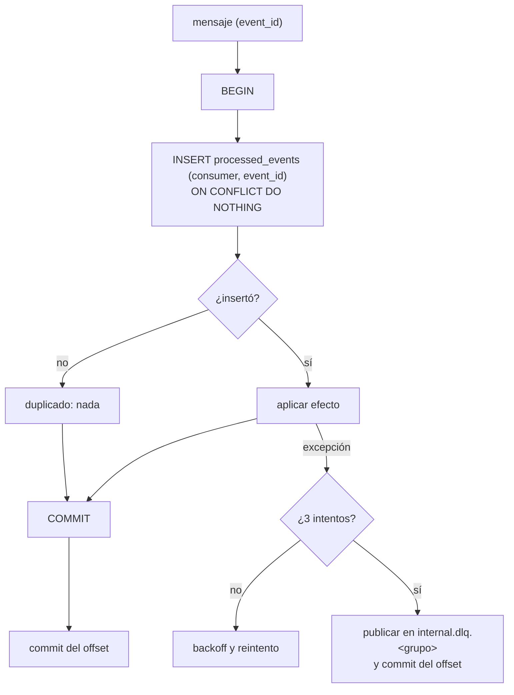
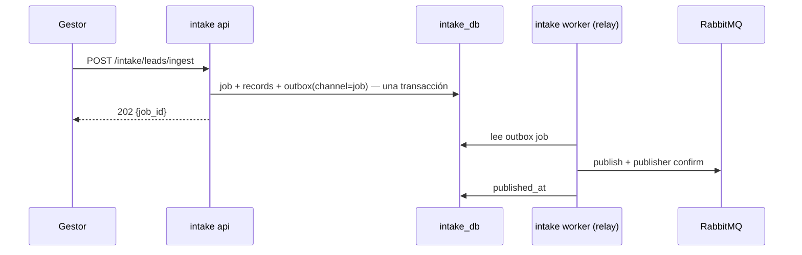
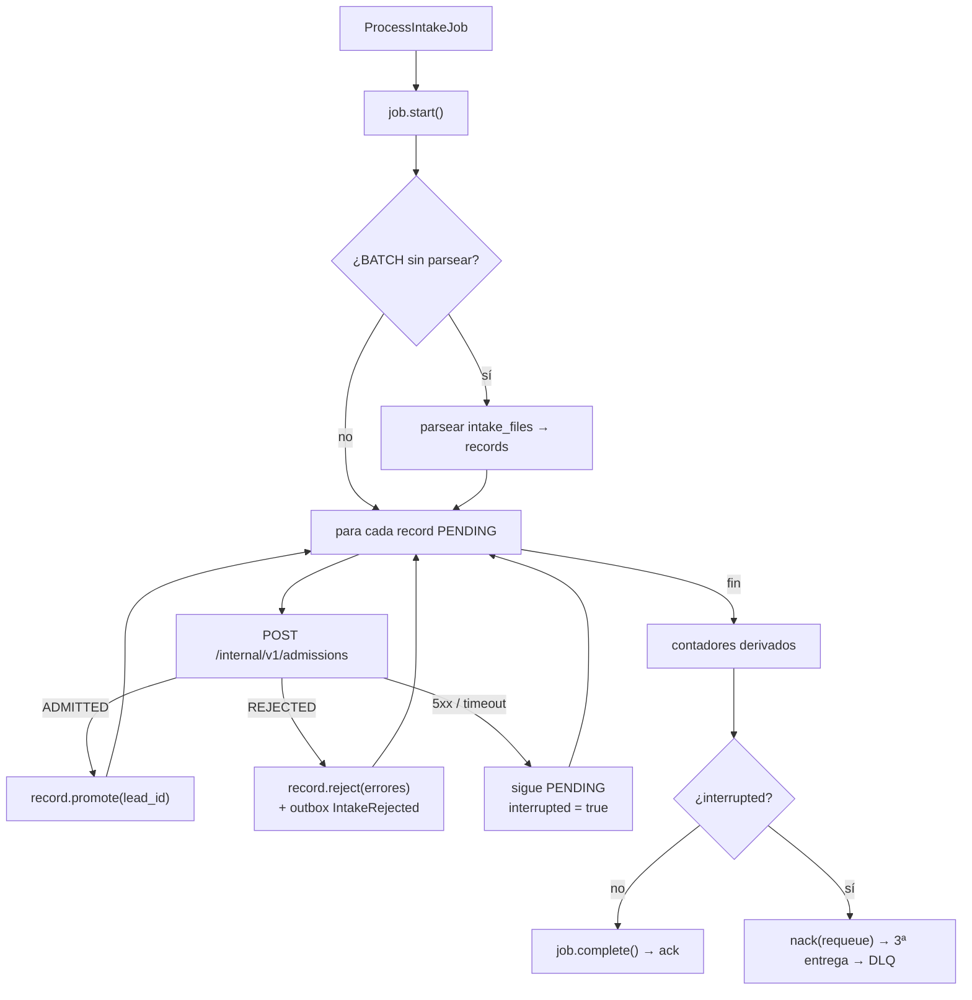
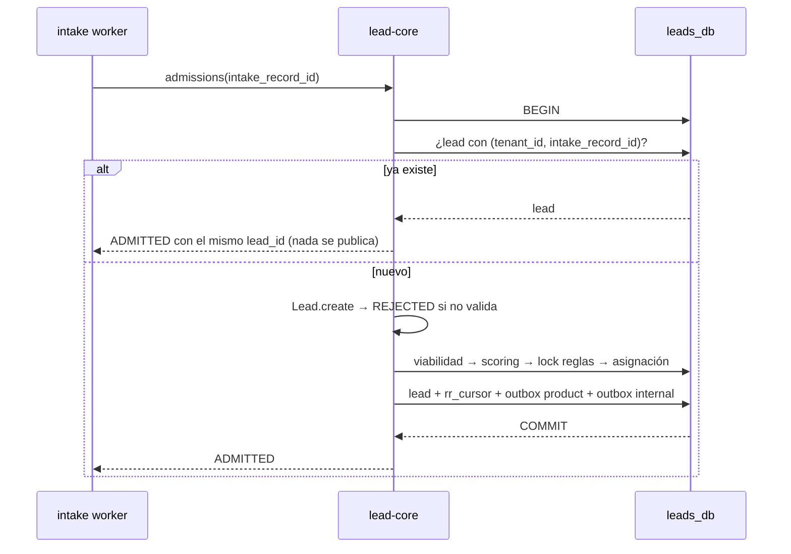

# 04 · Comunicación y eventos

La separación no cambia la regla de canales que ya rige el sistema; la extiende a los nuevos cruces.
Decisiones registradas en [ADR-0033](../decisiones/0033-eventos-internos-en-kafka.md),
[ADR-0034](../decisiones/0034-encolado-por-outbox-y-fichero-durable.md) y
[ADR-0035](../decisiones/0035-admision-sincrona-idempotente.md).

!!! note "Estado de F1"
    Lo que esta página describe de outbox, eventos internos, RabbitMQ y fichero durable está
    implantado desde F1. Los «hoy» de las secciones de outbox y RabbitMQ se refieren al sistema
    anterior a F1. Lo que se construyó difiere en lo que lista la
    [fase F1 del plan](06-plan-de-desacople.md#f1-durabilidad-en-el-monolito).

## Regla de canal

| Canal | Cuándo | Garantía |
|---|---|---|
| **HTTP** | Quien llama necesita la respuesta para continuar | Timeout explícito; sólo se reintenta lo idempotente |
| **RabbitMQ** | Trabajo con **un** ejecutor que se reintenta si muere | `ack` manual, redelivery, DLQ |
| **Kafka** | Un **hecho** con uno o varios consumidores, que debe poder releerse | Retención u offsets; compactación para estado |
| **Outbox** | Toda publicación, a cualquiera de los dos brokers | Misma transacción que el agregado; al menos una vez |

Nunca se escribe en la base y en un broker por separado: lo que se publica se registra antes en el
outbox del servicio y el relay lo entrega después.

## Inventario de interacciones

| De → a | Canal | Mensaje | Síncrono para el usuario |
|---|---|---|:-:|
| gateway → identity | HTTP | `GET /internal/v1/auth/introspect` | Sí |
| gateway → servicio | HTTP | La petición pública | Sí |
| intake → RabbitMQ → intake-worker | Outbox + RabbitMQ | `ProcessIntakeJob` | No |
| intake-worker → lead-core | HTTP | `POST /internal/v1/admissions` | No |
| intake (promoción manual) → lead-core | HTTP | `POST /internal/v1/admissions` | Sí |
| lead-core → identity | HTTP | `GET /internal/v1/agents/{id}` (sólo si falta la proyección) | A veces |
| servicio → identity | HTTP | `POST /internal/v1/service-tokens` (caché 5 min) | No |
| lead-core → clientes | Outbox + Kafka/webhook | `leads.{tenant_id}` | No |
| identity → lead-core, notifications, intake | Outbox + Kafka | `internal.identity.*` | No |
| lead-core → notifications | Outbox + Kafka | `internal.lead-core.events` | No |
| intake → notifications | Outbox + Kafka | `internal.intake.events` | No |

Todos los clientes HTTP internos reutilizan conexiones (un `httpx.Client` por proceso, no uno por
llamada) y declaran timeout. La latencia y su coste se miden en F0; ver
[Evoluciones y riesgos](07-evoluciones-y-riesgos.md) para lo que se haría si la medición lo pidiera.

## Kafka

### Topics

| Topic | Productor | Clave | Contenido | Limpieza | Consumidores (grupo) |
|---|---|---|---|---|---|
| `leads.{tenant_id}` | lead-core | `lead_id` | `LeadProcessedEvent`, `LeadDisqualified`. **Contrato externo sin cambios** | Como hoy | Sistemas de cada tenant |
| `internal.lead-core.events` | lead-core | `lead_id` | `LeadAssigned`, `LeadReassigned`, `LeadLeftUnassigned` | `delete`, 7 días | `notifications.lead-events` |
| `internal.intake.events` | intake | `intake_record_id` | `IntakeRejected` | `delete`, 7 días | `notifications.intake-events` |
| `internal.identity.agents` | identity | `agent_id` | `AgentState` completo + `version` | **`compact`** | `lead-core.advisors`, `notifications.members` |
| `internal.identity.tenants` | identity | `tenant_id` | `TenantState` completo + `version` | **`compact`** | `intake.tenants` |

- **Hechos frente a estado.** Los topics `*.events` llevan cosas que ocurrieron. Los topics
  `identity.*` llevan el **estado completo** de una entidad cada vez que cambia (*event-carried state
  transfer*). Con compactación, Kafka conserva el último mensaje de cada clave, de modo que una
  proyección se reconstruye leyendo el topic desde el principio, hoy o dentro de un año.
- **No hay borrado lógico que propagar.** Desactivar un agente o suspender un tenant es un cambio de
  estado (`is_active`, `status`), no un *tombstone*.
- **Creación explícita.** El *auto-create* actual (ADR-0026) crea los topics con la configuración por
  defecto, que no compacta. Los `internal.*` los declara el worker productor al arrancar con
  `chassis.consumer.ensure_topics()`: idempotente, con `cleanup.policy`, retención y tres
  particiones. Es el mismo patrón que `declare_intake_topology` sigue con RabbitMQ. Si un topic ya
  existe con otras particiones o configuración, `ensure_topics` no lo toca y registra un `WARNING`:
  cambiarlas con consumidores vivos es una decisión del operador.
- **Las DLQ las declara el consumidor.** `internal.dlq.<grupo>` (1 partición, `cleanup.policy=delete`,
  7 días) la crea el servicio dueño del grupo, con `ensure_topics_until_ready()`, que reintenta con
  *backoff* hasta que el broker responde y sólo entonces deja arrancar los carriles. Desde F2 las de
  los tres grupos de notifications son suyas; el backend ya no declara ninguna.
- **Cliente.** `chassis.kafka_config` fija los ajustes de productor y consumidor de todos los
  servicios; entre ellos, `topic.metadata.refresh.interval.ms=10000`, para que un grupo suscrito
  antes de que el productor cree su topic lo vea en segundos y no a los 5 minutos por defecto.
- **Aislamiento.** Las ACL de tenant son `LITERAL` sobre `leads.{tenant_id}`; un tenant no puede leer
  `internal.*`. El prefijo distinto permite, cuando se endurezca, dar ACL `PREFIXED` por servicio.
- **Grupos.** Llevan el prefijo del servicio (`notifications.`, `lead-core.`, `intake.`). No chocan con
  el prefijo de grupo de los tenants, que es su nombre de usuario SCRAM. Un grupo lo consume **un
  solo** proceso: si otro se uniera, Kafka repartiría las particiones entre ambos.

| Grupo | Topic | Consume | Estado |
|---|---|---|---|
| `notifications.lead-events` | `internal.lead-core.events` | `notifications-worker` | F2 (mismo nombre que tenía el monolito) |
| `notifications.intake-events` | `internal.intake.events` | `notifications-worker` | F2 (mismo nombre que tenía el monolito) |
| `notifications.members` | `internal.identity.agents` | `notifications-worker` | F2 (nuevo; mantiene `members`) |
| `lead-core.advisors` | `internal.identity.agents` | lead-core | F3 |
| `intake.tenants` | `internal.identity.tenants` | intake (en el monolito hasta F4) | F3 |

### Sobre de los eventos internos

Sólo para los topics `internal.*`. `leads.{tenant_id}` conserva su forma actual (cabecera
`event_type` y payload plano) porque es un contrato con terceros.

```json
{
  "event_id": "7a4dfb8d-2b5d-46d9-a5ea-9e83a5c0e3ad",
  "event_type": "LeadAssigned",
  "schema_version": 1,
  "occurred_at": "2026-10-01T10:00:00Z",
  "producer": "lead-core",
  "tenant_id": "04047f84-…",
  "aggregate_id": "e40fa333-…",
  "correlation_id": "f0d7fdf8-…",
  "payload": { "lead_id": "e40fa333-…", "agent_id": "9b1c…" }
}
```

- `event_id` no cambia entre reintentos: es la clave de deduplicación.
- `event_type` también viaja como cabecera Kafka, para filtrar sin deserializar.
- Un cambio compatible añade campos opcionales con la misma `schema_version`; uno incompatible sube
  la versión y convive con la anterior hasta que no quedan consumidores.
- Nunca viajan contraseñas, hashes, secretos TOTP, tokens ni credenciales.

### Productor

`acks=all` y `enable.idempotence=true`. El relay marca una fila como publicada sólo cuando el broker
confirma la entrega.

### Consumidor

Idéntico en todos los servicios, en `chassis.consumer`:



- `enable.auto.commit=false` y `auto.offset.reset=earliest`: el offset se confirma después del commit
  en base. Si el proceso cae entre ambos, el mensaje se reentrega y la deduplicación lo descarta.
- Las proyecciones de estado aplican además un *upsert* condicionado por `version`, **en SQL**: un
  mensaje viejo nunca pisa un estado más nuevo, aunque llegue después o lo escriba un segundo
  consumidor a la vez. Por eso el de `members` no usa `processed_events`.
- Un mensaje que agota los intentos bloquea su partición hasta que está en la DLQ; el bucle libera
  las particiones bloqueadas al perderlas o cederlas en un *rebalance*, y al parar cierra el
  consumidor y vacía el productor de la DLQ.
- Cada grupo corre en un **carril** (`run_consumer_lane`): si su cliente de Kafka falla, se construye
  otro tras una espera de 1 s que se duplica hasta 30 s. Un carril no arranca hasta que los topics
  existen, para no unirse a uno que Kafka creó solo con la configuración por defecto.
- `internal.dlq.<grupo>` se ve en kafka-ui, igual que `intake.jobs.dlq` en la consola de RabbitMQ. Un
  mensaje aparcado se reinyecta a mano tras corregir la causa.

## Outbox

Cada servicio productor tiene su `outbox_events`. La tabla gana una columna, `channel`:

| `channel` | Destino | Despachadores |
|---|---|---|
| `product` | El canal de producto de hoy | Kafka `leads.{tenant_id}` + webhooks |
| `internal` | Topics `internal.*` | Kafka interno |
| `job` | Trabajo de fondo | RabbitMQ `intake.jobs` |

Cada despachador sólo lee las filas de su canal. Hoy `OutboxRelay` reentrega una fila a todos sus
despachadores si uno falla; con canales, un webhook caído deja de arrastrar a los eventos internos.
Dentro de `product` el comportamiento actual no cambia.

El relay **sale del hilo de la API** y pasa al proceso `worker` de cada servicio productor. Varios
workers pueden drenar a la vez: el resultado es algún duplicado, que es lo que el consumidor ya
espera.

## RabbitMQ: `intake.jobs`

La topología no cambia: cola cuórum, `x-delivery-limit: 3`, `intake.jobs.dlq`, `prefetch_count=1`.
Dueño: intake. Cambia cómo se llega a ella y qué hace el worker cuando algo falla.

### Encolado por outbox



- Desaparece el *fallback* de procesar en el proceso de la API (`BackgroundTasks`). Con RabbitMQ caído
  el job espera en el outbox y sale cuando vuelve: más latencia, ninguna pérdida y una sola ruta de
  ejecución. Sustituye esa parte de [ADR-0027](../decisiones/0027-cola-para-el-trabajo-de-fondo.md).
- El relay publica con *publisher confirms* (`confirm_delivery`): sin confirmación no hay `published_at`.
- El mensaje gana campos aditivos: `{message_id, schema_version, tenant_id, job_id, correlation_id}`.

### Fichero crudo durable

`batch-upload` guarda el fichero en `intake_files` (`bytea`) en la misma transacción que crea el job,
y encola. Hoy el endpoint no limita el tamaño; al guardarlo en base el límite pasa a ser necesario y
se aplica en el gateway (`client_max_body_size`) y en el propio endpoint (`413`), con un valor
coherente con los 10.000 registros que admite un job. El worker parsea el fichero, materializa
los registros y sigue como con cualquier job. Es [ADR-0009](../decisiones/0009-registrar-antes-de-interpretar.md)
aplicado al fichero: hoy se registra cada fila, pero no el fichero del que salen.

Un fichero ilegible sigue terminando en `job.fail()` y `ack`: no hay filas que reintentar.

### El worker



El cambio respecto a hoy es la última rama: un job interrumpido hace `nack` en lugar de `ack`. Hoy se
queda en `PROCESSING` sin nadie que lo retome; con lead-core al otro lado de la red un fallo
transitorio deja de ser raro. El reproceso manual (`POST /intake/jobs/{id}/reprocess`) sigue
existiendo, ahora encolando por outbox, y es lo que recupera un job desde la DLQ.

## Contrato de admisión

```text
POST /internal/v1/admissions
Authorization: Bearer <token de servicio: sub=intake, aud=lead-core>
X-Request-Id: <correlation_id>

{
  "tenant_id": "…", "intake_record_id": "…", "source_id": "…",
  "candidate": { "first_name": "…", "last_name": "…", "email": "…", "phone": "…",
                 "company": "…", "industry": "…", "budget": "9000.00",
                 "custom_attributes": {} }
}

200 { "outcome": "ADMITTED", "lead_id": "…", "status": "ASSIGNED|UNASSIGNED|DISQUALIFIED",
      "score": 65, "assigned_agent_id": "…|null", "applied_rules_count": 3 }
200 { "outcome": "REJECTED", "errors": [{ "field": "email", "message": "…", "error_code": "INVALID_EMAIL" }] }
401 / 403  token de servicio ausente o de otro llamante
5xx        error del servicio → el llamante lo trata como fallo transitorio
```

`budget` viaja como texto decimal, nunca como `float`.

### Lo que hace lead-core



- **Idempotencia** por `UNIQUE (tenant_id, intake_record_id)` en `leads`. La consulta previa evita
  evaluar los motores dos veces; la restricción cubre la carrera de dos llamadas simultáneas: la
  perdedora recibe `UniqueViolation`, revierte (incluido el avance del cursor) y responde con el lead
  de la ganadora.
- **`REJECTED` no guarda nada.** Depende sólo de la validación de `Lead.create`, que es determinista:
  repetir la llamada da la misma respuesta.
- **Mejora sobre hoy:** `LeadAssigned` y `LeadLeftUnassigned` dejan de publicarse en memoria después
  del commit y pasan al outbox `internal` **dentro** de la transacción del lead. Ya no hay ventana en
  la que un reinicio pierda el aviso.

### Lo que hace intake con la respuesta

En una transacción propia: marca el registro (`PROMOTED` con `lead_id`, o `REJECTED` con sus
errores), y si fue rechazado registra `IntakeRejected` en su outbox `internal`. Si el worker cae entre
la respuesta de lead-core y este commit, la redelivery repite la admisión y obtiene el mismo
`lead_id`.

La **promoción manual** desde la bandeja (`POST /intake/records/{id}/promote`, con el payload
corregido) usa el mismo endpoint, llamado desde la API de intake. Es la única admisión que el usuario
espera en línea.

### Reconciliación

Un comando de intake recorre los registros `PROMOTED` de un periodo y pide a lead-core, con
`GET /internal/v1/admissions?intake_record_ids=…`, cuáles conoce y con qué `lead_id`. Una diferencia no se corrige escribiendo en la base ajena: se vuelve a
admitir el registro, que es idempotente, o se emite una alerta. Se usa como criterio de salida de F4.

## Correlación

`X-Request-Id` lo genera el gateway (o lo respeta si llega) y recorre todo el camino: petición →
`intake_jobs.correlation_id` → mensaje de RabbitMQ → cabecera de la admisión →
`outbox_events.correlation_id` → sobre del evento. `chassis.web` lo incluye en cada línea de log.
Seguir un lead de punta a punta es filtrar los logs de los cinco servicios por un valor.

## Matriz de fallos

| Cae | Efecto | Recuperación |
|---|---|---|
| identity | Login y peticiones autenticadas → 503. Nada se procesa con una identidad sin verificar | Al volver, sin intervención |
| lead-core | Las admisiones fallan → jobs interrumpidos → `nack` | RabbitMQ reentrega; tras 3 entregas, DLQ y reproceso |
| intake | No se reciben leads nuevos; lo encolado sigue en RabbitMQ | Al volver |
| notifications | La bandeja no responde; los eventos esperan en Kafka | El consumidor retoma desde su offset |
| RabbitMQ | Los jobs esperan en el outbox de intake | El relay publica al volver |
| Kafka | Los eventos esperan en cada outbox; las proyecciones dejan de avanzar | Los relays publican al volver |
| Un relay a mitad de lote | Algunas filas se entregan dos veces | Deduplicación por `event_id` |
| Un worker a mitad de job | El mensaje vuelve a la cola | Redelivery; la admisión es idempotente |
