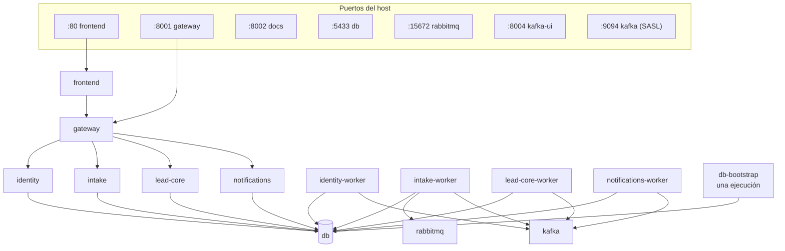

# 05 · Despliegue local

Todo sigue levantándose con Docker Compose. Kubernetes no reduce la latencia entre servicios ni es
requisito para que una arquitectura sea de microservicios; el diseño queda preparado para llevarlo
ahí sin cambios (ver [Evoluciones y riesgos](07-evoluciones-y-riesgos.md)).

## Topología



| Servicio de Compose | Imagen | Comando | Puerto en el host |
|---|---|---|---|
| `gateway` | nginx | — | **8001** |
| `frontend` | la actual | — | 80 |
| `identity`, `identity-worker` | `services/identity` | `api` / `worker` | — |
| `intake`, `intake-worker` | `services/intake` | `api` / `worker` | — |
| `lead-core`, `lead-core-worker` | `services/lead-core` | `api` / `worker` | — |
| `notifications`, `notifications-worker` | `services/notifications` | `api` / `worker` | — |
| `db-bootstrap` | postgres | script idempotente | — |
| `db`, `rabbitmq`, `kafka`, `kafka-ui`, `docs` | las actuales | — | las actuales |
| `test-consumer` (perfil `demo`) | la actual | — | 8003 |

Sólo el gateway publica la API. Los servicios no tienen puerto en el host: para depurar uno se entra
por el gateway, igual que el frontend. `test-consumer` cambia `LEADS_API_BASE` a
`http://gateway:8080/api/v1`.

El gateway **no declara `depends_on`**. Sus `upstream` usan `resolve` con el DNS de Docker
(`resolver 127.0.0.11 valid=10s`, nginx 1.27.3 o posterior), así que arranca sin que sus servicios
existan y sigue funcionando si uno se recrea con otra IP. El nginx del frontend hace lo mismo con el
gateway.

El directorio `gateway/` se monta **entero** en `/etc/nginx/conf.d`, no fichero a fichero: un montaje
de un solo fichero fija el *inode*, y un editor que reemplaza el fichero dejaba el contenedor con la
configuración vieja. La imagen sólo carga `*.conf` (`nginx.conf`); los `*.inc` son fragmentos que se
incluyen (`proxy_headers.inc`, `introspect.inc`, `protected.inc`, `protected_optional.inc`; ver
[03](03-gateway-y-autenticacion.md#includes-compartidos)). Tras editar cualquiera de ellos basta
`docker compose exec gateway nginx -s reload`.

## Bases de datos

Un único contenedor PostgreSQL con una base y un rol por servicio. *Database per service* exige
propiedad lógica, no cuatro servidores.

| Base | Rol | Servicio | Test |
|---|---|---|---|
| `identity_db` | `identity_svc` | identity | `identity_test` |
| `intake_db` | `intake_svc` | intake | `intake_test` |
| `leads_db` | `lead_core_svc` | lead-core | `leads_test` |
| `notifications_db` | `notifications_svc` | notifications | `notifications_test` |

Cada rol tiene `CONNECT` y propiedad sobre su base y sobre ninguna otra; `REVOKE CONNECT … FROM PUBLIC`
en todas. Un servicio que intentara leer otra base fallaría al conectar, no al revisar un diff.

**Las crea `db-bootstrap`**, un servicio de una sola ejecución con un script `psql` idempotente
(`db/bootstrap.sql`), del que dependen los servicios con `condition: service_completed_successfully`.
Crea los cuatro roles (`identity_svc`, `intake_svc`, `lead_core_svc` y `notifications_svc`, con la
contraseña de desarrollo que le pasa Compose, que vuelve a fijar en cada ejecución) y las ocho bases
(`identity_db`, `intake_db`, `leads_db`, `notifications_db` y sus `*_test`) con su rol de propietario, y
aplica `REVOKE CONNECT … FROM PUBLIC` y `GRANT CONNECT` sólo al rol. Las bases de pruebas las crea él
porque ningún rol de servicio tiene `CREATEDB`. `leads_db` ya existía, creada por la imagen de
PostgreSQL con el superusuario; en cada ejecución el script le cambia el propietario a `lead_core_svc` y
transfiere a ese rol las tablas de `leads_db` y `leads_test` que siguen siendo de `postgres`, de forma
idempotente: un volumen anterior a F5 se corrige en cualquier `up`, no sólo en el corte. Ningún proceso
de aplicación entra con el superusuario `postgres`, que queda para `db-bootstrap`, los scripts de corte
y las comprobaciones de `verify-e2e.sh`. Cada fase que extrae un servicio añade el suyo al
script. No sirve
`/docker-entrypoint-initdb.d`: sólo se ejecuta con el volumen vacío, y el volumen `pgdata` actual ya
tiene datos. `CREATE DATABASE` no admite `IF NOT EXISTS`, así que el script usa el patrón:

```sql
SELECT format('CREATE DATABASE %I OWNER %I', name, owner)
FROM service_databases
WHERE NOT EXISTS (SELECT 1 FROM pg_database WHERE datname = name)
\gexec
```

`service_databases` es una tabla temporal con cada base y su propietario.

Las migraciones siguen siendo de cada servicio y se aplican al arrancar su proceso `api`, como hoy.

## Imágenes

- **Contexto de construcción: el directorio del servicio, más un contexto con nombre para
  `libs/chassis`**, con un `Dockerfile` por servicio (`additional_contexts: chassis: ./libs/chassis`
  en Compose; `COPY --from=chassis` en el `Dockerfile`). No se usa la raíz del repo como contexto.
  Cada imagen contiene **sólo** su servicio y `libs/chassis`; ningún otro servicio está dentro. Que un
  servicio importe código de otro no es una regla que revisar: no compila. BuildKit respeta el
  `.dockerignore` de `libs/chassis` para ese contexto con nombre.
- **Disposición en la imagen: `/srv/services/<svc>` y `/srv/libs/chassis`.** Replica la del
  repositorio porque `uv.lock` registra `chassis` como `../../libs/chassis`. El proyecto es *virtual*
  (sin `build-system`): `uv sync --no-install-project` instala las dependencias y `src/` se importa
  por `PYTHONPATH`.
- **Proyecto `uv` independiente por servicio** con su `uv.lock`, y `chassis` como dependencia por
  ruta (`chassis = { path = "../../libs/chassis", editable = true }`). Cambiar `chassis` obliga a
  reconstruir las imágenes que lo usan; es el precio de que la verificación del token sea idéntica en
  todas.
- **Mismas etapas en todos:** `runner`, `dev` (con `watchfiles`) y `test`. El `Dockerfile` de lead-core
  es el de intake con otro nombre de servicio.

## Recarga en caliente

Igual que hoy: `src/` y `migrations/` del servicio, más `libs/chassis/src`, montados en sólo lectura.
`api` y `worker` se reinician con `watchfiles` (no con `uvicorn --reload`, que deja las conexiones sin
`TCP_NODELAY` y añadía ≈ 40 ms a cada llamada entre servicios; ver [Mediciones](07-evoluciones-y-riesgos.md#mediciones)). Un cambio de código no necesita
`--build` ni `restart`; sólo se reconstruye si cambian `pyproject.toml`, `uv.lock` o un `Dockerfile`.

## Configuración por servicio

| Variable | identity | intake | lead-core | notifications |
|---|:-:|:-:|:-:|:-:|
| `DATABASE_URL` (su base, su rol) | ✓ | ✓ | ✓ | ✓ |
| `SIGNING_KEYS` (`kid=<semilla Ed25519 en base64url>[,kid=…]`; la primera firma, todas se publican) | ✓ | | | |
| `SERVICE_CLIENTS` (hashes y audiencias) | ✓ | | | |
| `MFA_ENCRYPTION_KEY`, `GOOGLE_*`, `GITHUB_*`, `FRONTEND_ORIGIN` | ✓ | | | |
| `CORS_ORIGINS` (sólo para validar `FRONTEND_ORIGIN`) | ✓ | | | |
| `JWKS_URL` (`http://identity:8000/internal/v1/jwks`) | | ✓ (sólo la API) | ✓ (sólo la API) | ✓ |
| `SERVICE_CLIENT_ID`, `SERVICE_CLIENT_SECRET` | | ✓ (`intake`) | ✓ (`lead-core`, sólo la API) | |
| `LEAD_CORE_URL` (`http://lead-core:8000`) | | ✓ | | |
| `IDENTITY_URL` (`http://identity:8000`) | | ✓ | ✓ (sólo la API) | |
| `KAFKA_BOOTSTRAP_SERVERS` | ✓ | ✓ (sólo el worker) | ✓ (sólo el worker) | ✓ |
| `KAFKA_EXTERNAL_BOOTSTRAP_SERVERS` | ✓ | | | |
| `RABBITMQ_URL` | | ✓ (sólo el worker) | | |
| `OUTBOX_RELAY_INTERVAL_SECONDS` (1 s por defecto) | | ✓ (sólo el worker) | ✓ (sólo el worker) | |
| `WEBHOOK_TIMEOUT_SECONDS` (5 s por defecto) | | | ✓ (sólo el worker) | |
| `LOG_LEVEL` (`INFO` por defecto) | ✓ | ✓ | ✓ | ✓ |

**Por proceso.** identity separa la configuración: `identity` exige `DATABASE_URL`, `SIGNING_KEYS`,
`SERVICE_CLIENTS` y `MFA_ENCRYPTION_KEY`; `identity-worker` sólo `DATABASE_URL` y
`KAFKA_BOOTSTRAP_SERVERS`. Intake la separa igual desde F4: `intake` exige `DATABASE_URL`,
`JWKS_URL`, `LEAD_CORE_URL` y `SERVICE_CLIENT_SECRET` (la promoción manual admite en línea);
`intake-worker` exige `DATABASE_URL`, `LEAD_CORE_URL`, `SERVICE_CLIENT_SECRET`, `RABBITMQ_URL` y
`KAFKA_BOOTSTRAP_SERVERS`, y no necesita `JWKS_URL`. La CLI de reconciliación
(`python -m infrastructure.cli.reconcile`) tiene una tercera clase, `ReconcileSettings`, sin broker, y
corre desde cualquiera de los dos contenedores. El secreto de servicio va fuera del `repr` de los
ajustes. Lead-core la separa en F5: `lead-core` exige `DATABASE_URL`, `JWKS_URL` y
`SERVICE_CLIENT_SECRET`, y no recibe `KAFKA_BOOTSTRAP_SERVERS` porque sólo escribe el outbox;
`lead-core-worker` exige `DATABASE_URL` y `KAFKA_BOOTSTRAP_SERVERS`, y no recibe `JWKS_URL`,
`IDENTITY_URL` ni el secreto. El broker del worker es obligatorio, como en identity e intake: no
arranca sin saber dónde está, aunque sí sin un broker vivo (ADR-0026). `IDENTITY_URL` y
`SERVICE_CLIENT_ID` tienen valores por defecto (`http://identity:8000`, `lead-core` en lead-core e
`intake` en intake). Sólo notifications conserva un único `Settings` para sus dos procesos.

Los valores de desarrollo viven en `docker-compose.yml`, como `MFA_ENCRYPTION_KEY`, `SIGNING_KEYS`,
`SERVICE_CLIENTS` y los secretos de servicio (`SERVICE_CLIENT_SECRET` de `lead-core` y de `intake`; el de `intake`
es el mismo en `intake` e `intake-worker`) y las contraseñas de los brokers. Los secretos de OAuth siguen leyéndose de `.env`, ahora sólo en `identity`.

## Arranque y dependencias

| Servicio | Espera a | Por qué |
|---|---|---|
| servicios de aplicación | `db` sano y, para los extraídos, `db-bootstrap` completado | Sin su base no hay nada que hacer. Dependen de `db-bootstrap` los cuatro servicios y sus `*-test` |
| `intake-worker` | `db` y `rabbitmq` sanos, e `intake` sano | Su razón de ser es la cola. La API aplica las migraciones al arrancar y el relay y los consumidores leen las tablas que crean. **Sin condición sobre `lead-core`**: una caída de lead-core interrumpe un job (`nack` y redelivery), no para el worker |
| `lead-core-worker` | `lead-core` sano | La API aplica las migraciones al arrancar y el relay lee las columnas que crean |
| `identity-worker` | `identity` sano | La API aplica las migraciones al arrancar y el relay lee su outbox |
| `notifications-worker` | `notifications` sano | La API aplica las migraciones al arrancar y los consumidores escriben esas tablas |
| `*-worker` y `api` | **no** esperan a Kafka | Los relays reintentan solos; la API sirve aunque el broker no esté (ADR-0026) |
| `gateway` | nada | Re-resuelve sus `upstream` en ejecución (`resolve`); responde `/health` aunque el servicio aún no exista |
| `frontend` | `gateway` sano | El `healthcheck` del gateway es su propio `GET /health` |

## Tests

| Comando | Qué demuestra |
|---|---|
| `docker compose --profile test run --rm <svc>-test` | La suite completa de un servicio, con su base `*_test` (`identity-test`, `intake-test`, `lead-core-test` y `notifications-test`). `intake-test` monta además `contracts/`, para los tests de contrato de la admisión |
| `cd services/<svc> && uv run pytest -m unit -q` | El dominio aislado: **sin base y sin variables de entorno**, como hoy |
| `./scripts/verify-e2e.sh` | El negocio de punta a punta sobre HTTP real, contra el gateway en `:8001` |

`verify-e2e.sh` no cambia de destino ni se reescribe: cada fase de este desacople añade su
`verify_ms_fN` (una por fase; los nombres `verify_fN` ya son de planes anteriores) y la llama desde
`main`. `verify_ms_f0` va la última porque detiene y arranca lead-core.

Con `--reset` recrea el volumen y espera a que `/api/v1/auth/me` responda 401: el gateway contesta
`/health` antes de que los servicios hayan migrado, así que `/health` no vale como señal de «listo».
Desde F3 esa ruta la sirve identity; lead-core no tiene ninguna ruta anónima, así que el script
espera además a que el *healthcheck* de `lead-core` diga `healthy`. Lo que depende de las proyecciones
lo comprueba el propio `bootstrap`: tras crear cada organización, que tenga sus dos fuentes
(`await_sources`), y tras crear cada agente, que esté en `GET /advisors` (`await_advisor`), con
hasta 30 s cada una y un check que falla si no llegan.

Cada servicio lleva sus cuatro tests de guardián y el de estructura, sin lista base. `verify_ms_f5`
comprueba además lo que la fase deja fijo: las tablas de `leads_db`, qué rol entra en cada base y que
no quede nada con el nombre del monolito (ver [06](06-plan-de-desacople.md#f5-lead-core-residual)).

## Estados intermedios

El Compose crece una fase cada vez; en ningún momento conviven dos versiones del mismo contexto
sirviendo tráfico.

| Tras | Servicios de aplicación |
|---|---|
| F0 | `gateway`, `backend` (monolito), `intake-worker` |
| F1 | + `backend-worker` (relay y consumidores) |
| F2 | + `notifications`, `notifications-worker`, `db-bootstrap`; `backend-worker` conserva los relays y deja de consumir |
| F3 | + `identity`, `identity-worker`; `backend-worker` vuelve a consumir (`lead-core.advisors`, `intake.tenants`) |
| F4 | + `intake`; el `intake-worker` pasa a ser suyo (imagen de `services/intake`, `stop_grace_period: 5m`) y `backend-worker` deja de consumir `intake.tenants` |
| F5 | `backend` → `lead-core`, `backend-worker` → `lead-core-worker`, `backend-test` → `lead-core-test`; la imagen es la de `services/lead-core`, y `leads_db` pasa a ser sólo de `lead_core_svc` |
