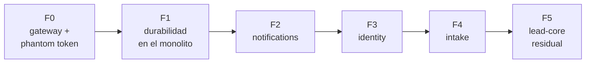
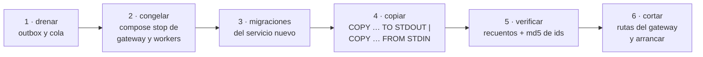
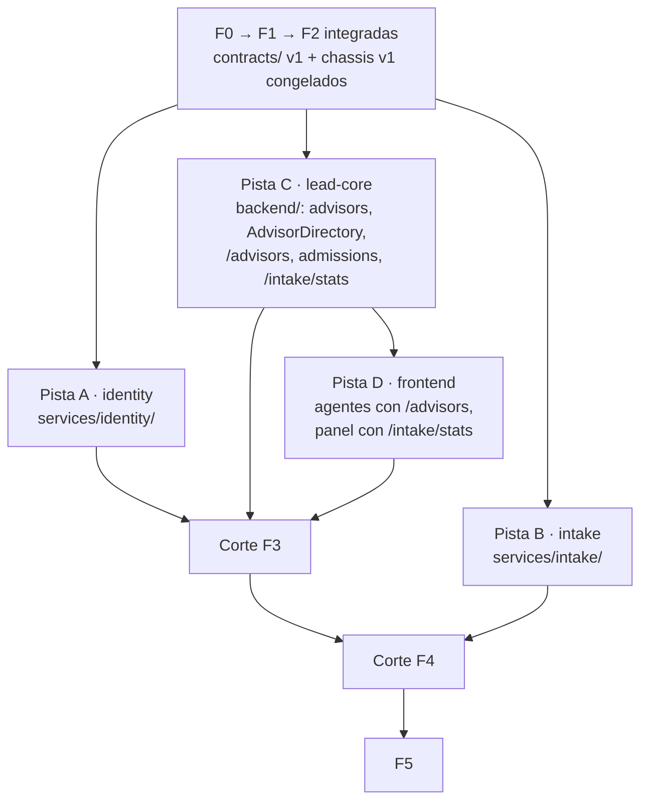

# 06 · Plan de desacople

Seis fases. Cada una cambia **una** cosa, deja el sistema operable y termina con `verify-e2e.sh` en
verde. El orden sigue una regla: **primero se cambia el comportamiento dentro del monolito, después se
mueve el código**. Así, cuando un contexto sale a su propio servicio, la semántica que lleva ya está
probada y lo único nuevo es la red.



| Fase | Por qué en este orden |
|---|---|
| F0 | El mecanismo de identidad que usarán todos los servicios se prueba sin haber separado nada |
| F1 | Elimina las tres piezas que sólo funcionan dentro de un proceso (bus en memoria, relay en la API, *fallback* de encolado) |
| F2 | El servicio más pequeño y downstream: practica plantilla, base propia, consumidor y migración de datos con riesgo mínimo |
| F3 | Identity necesita gateway y eventos ya probados, y es requisito de las proyecciones de F4 |
| F4 | Rompe la transacción más importante (ingesta ↔ decisión) cuando todo lo demás ya está estable |
| F5 | Lo que queda ya *es* lead-core: limpiar, renombrar y documentar |

## Definición de terminado (todas las fases)

1. La suite de cada servicio tocado pasa: `docker compose --profile test run --rm <svc>-test`.
2. `pytest -m unit` de cada servicio tocado pasa **sin base y sin variables de entorno**.
3. Los cuatro tests de guardián pasan en cada servicio.
4. `./scripts/verify-e2e.sh` pasa entero, incluida la `verify_ms_fN` nueva de la fase.
5. La documentación que describe el sistema actual (C4, módulos, eventos) refleja lo que cambió.
6. El ADR de la fase pasa a reflejar su estado real.

## Procedimiento de migración de datos (F2, F3, F4)

Cada extracción copia las tablas del contexto desde `leads_db` a la base nueva **con los mismos
UUID**. Para un MVP local basta una ventana corta sin escrituras; no se usa CDC ni doble escritura.



- El script de cada fase (`scripts/migrate/fN_<svc>.sh`) se puede repetir: trunca el destino antes de
  copiar y no toca el origen.
- Se copian columnas explícitas (`COPY (SELECT …)`), no tablas enteras: algunas cambian de forma al
  moverse (`agents` pierde `group_id`).
- **La vuelta atrás sólo existe hasta el paso 6.** Antes, basta arrancar con la configuración
  anterior. Después, el servicio nuevo acepta escrituras que el monolito no tiene, y volver exigiría
  una migración inversa. Se dice así, sin prometer un interruptor.
- Las tablas copiadas no se borran del monolito en la fase: el código que las usaba sí se elimina. Las
  tablas se borraron en F5 (migración 019), cuando ya no había vuelta atrás que proteger.
- **Tras F5 los scripts no se pueden repetir.** `scripts/migrate/f2_notifications.sh`,
  `f3_identity.sh` y `f4_intake.sh` copian desde tablas de `leads_db` que ya no existen. Se conservan
  como registro de cómo se hizo cada corte y no se adaptan.

---

## F0 · Gateway y *phantom token*

**Estado: implantada** (`43393d1..08bc24a`). Medición de la línea base en
[07](07-evoluciones-y-riesgos.md#mediciones).

**Objetivo.** Todas las peticiones entran por el gateway y cada ruta protegida se autentica con el JWT
interno. Sigue habiendo un único servicio.

**Cambios**

- `libs/chassis` con `auth` (verificación del token y caché de JWKS) y `web` (`X-Request-Id` y logging
  correlacionado). `testing` (helper del guardián) pasa a F2: en F0 sólo hay un guardián y ya existe;
  entra cuando un segundo servicio lo necesita.
- En `backend`:
    - `Principal` en `application/dtos/context.py`; `RequestContext(principal, tenant_id)`.
      `AuthorizationPolicy` opera sobre `Principal`.
    - Router interno con `GET /internal/v1/auth/introspect` (con `?optional=true` para el bootstrap de
      `POST /agents`, que 03 no contemplaba) y `GET /internal/v1/jwks`, que reutiliza
      `resolve_current_agent` (cookie) y `resolve_integration_agent` (`X-Api-Key`). `SIGNING_KEYS` en `Settings`, con
      semillas Ed25519 en base64url, no PEM.
    - `get_request_context` verifica el bearer interno. Las rutas de `/auth/*` siguen leyendo la cookie.
    - Se retiran de `main.py` `CORSMiddleware` y `reject_untrusted_browser_origins`; sus casos de prueba
      (`test_origin_protection.py`) pasan a `verify_ms_f0`, contra el nginx real.
    - La suite emula al gateway: `GatewayClient` (`backend/tests/e2e/gateway_client.py`) introspecciona y
      reenvía el bearer igual que nginx, y los tests e2e lo usan.
- `gateway/nginx.conf` con la tabla de enrutado de [03](03-gateway-y-autenticacion.md): todos los
  prefijos apuntan a `backend`, que vuelve a resolverse por DNS (`resolve`), de modo que el gateway no
  declara `depends_on`. `limit_req` sólo en `/api/v1/auth/`.
- `docker-compose.yml`: servicio `gateway` en `:8001`; `backend` deja de publicar puerto. La imagen del
  backend recibe `libs/chassis` por un contexto de construcción con nombre (`additional_contexts`).
- `frontend/nginx.conf`: `proxy_pass` hacia `gateway`, también con resolución en ejecución.
- Documentación: [01](01-punto-de-partida.md) refleja la identidad por introspección, y las páginas
  de fuera de esta sección que describían JWT/Bearer como sesión se corrigieron.
- Línea base: p50/p95 de `introspect`, `GET /leads` (directo y por el gateway), login y
  `GET /leads` con `X-Api-Key`, y duración de un job de 1.000 registros.

**`verify_ms_f0`** (corre la última: detiene el backend; los nombres `verify_f0_identity`,
`verify_f2a`… ya pertenecen a planes anteriores, así que las fases de este desacople
llevan una `verify_ms_fN` cada una)

- Un `Authorization: Bearer <basura>` sin cookie → 401 con el sobre y el mensaje del gateway.
- Un JWT firmado con otra clave → 401, por el gateway y directo al servicio.
- El `Authorization` del cliente no llega al servicio: manda la cookie.
- `/internal/v1/jwks` y `/internal/v1/auth/introspect` a través del gateway → 404.
- `X-Request-Id`: se conserva, se genera si falta, se sustituye si es hostil o de 129 caracteres, y
  aparece en el access log del gateway.
- CORS: preflight de origen permitido, `localhost:5173.evil.test` → 403, un `Origin` hostil no crea
  sesión, un `Referer` hostil sin `Origin` no cuenta y `X-Api-Key` con `Origin` hostil → 403.
- Una `X-Api-Key` válida en una ruta distinta de `GET /leads` → 401.
- `POST /agents` anónimo con agentes ya creados → 401.
- Un cuerpo de más de 10 MB → 413.
- Con el backend parado → 503 `SERVICE_UNAVAILABLE`, y vuelve a responder al arrancarlo.

**Criterio de salida.** Los checks previos de `verify-e2e.sh` pasan, más `verify_ms_f0`. Ninguna ruta de
negocio (`/api/v1/*` salvo `/api/v1/auth/*`) recibe la cookie: sólo `/auth/*` y la introspección
interna la leen.

---

## F1 · Durabilidad en el monolito

**Estado: implantada** (`8608edb..0982137`). Lo construido sigue el plan salvo las desviaciones de
abajo; las pruebas de fallo de entrega y `verify_ms_f1` se describen en
[Validación](../desarrollo/validacion.md).

**Objetivo.** Todo lo que se publica o se encola pasa por el outbox; nada depende de que un proceso
siga vivo.

**Cambios**

- Migraciones en `leads_db`: `outbox_events.channel` (`DEFAULT 'product'`) y `correlation_id`;
  `processed_events`; `intake_files`; `intake_jobs.correlation_id`; `agents.version` y
  `tenants.version`.
- `chassis.outbox`: relay por canal y despachadores Kafka producto, webhook, Kafka interno y RabbitMQ
  con *publisher confirms*. Sustituye a `OutboxRelay` y `OutboxRelayThread`.
- `chassis.consumer`: bucle con `processed_events`, reintentos, DLQ y `ensure_topics()`.
- Eventos internos:
    - `IngestLeadUseCase` y `AssignLeadUseCase` registran `LeadAssigned`, `LeadReassigned`,
      `LeadLeftUnassigned` e `IntakeRejected` en el outbox `internal`, dentro de su transacción.
    - Las escrituras de agentes y tenants registran `AgentState` y `TenantState` (con `version`).
    - CLI `publish_identity_snapshot`: publica el estado actual de todos los agentes y tenants, para
      sembrar los topics compactados.
    - Se elimina `InMemoryEventPublisher` y `event_wiring.py`. `NotificationHandler` pasa a ser
      consumidor de `internal.lead-core.events` e `internal.intake.events`.
- Trabajo de fondo:
    - El encolado se registra en el outbox `job`; se elimina el *fallback* con `BackgroundTasks` en
      `ingest`, `batch-upload` y `reprocess`.
    - `batch-upload` guarda el fichero en `intake_files`; el worker lo parsea.
    - Un job interrumpido hace `nack`.
- Procesos: `backend` deja de arrancar el relay. Nuevo servicio `backend-worker` (`infrastructure/worker/`: relay +
  consumidores de notificaciones). `intake-worker` sigue igual.

**Desviaciones respecto a lo anterior**

- **`producer`:** `"lead-core"` en todos los sobres de F1, porque el monolito es el único productor.
  Identity e intake publicarán con su nombre al extraerse.
- **Reproceso asíncrono:** `POST /intake/jobs/{id}/reprocess` deja de procesar en línea y responde
  `202` con el trabajo `PENDING`; la orden va por el outbox `job` como cualquier otra.
- **`intake_jobs.correlation_id`:** se fija al insertar el trabajo. El mensaje de `intake.jobs` lleva
  el `correlation_id` de la petición que lo encoló, y en un reproceso es el de la petición de reproceso.
- **Un hilo por canal.** El plan no fija el reparto de hilos: los tres relays corren en hilos propios
  de `backend-worker` para que un destino caído (un Kafka interno que no responde) no retenga a los
  demás canales. El canal `internal` no entrega hasta que `ensure_topics` termina.
- **Los carriles de consumidor se auto-reparan.** Un consumidor cuyo cliente de Kafka falla se
  reconstruye tras una espera de 1 s que se duplica hasta 30 s, en vez de dejar morir su hilo.
- **`intake-worker` reconecta a RabbitMQ** con la misma espera, en vez de salir y depender de
  `restart: on-failure` (el plan lo daba por «sigue igual»).

**`verify_ms_f1`**

- Con `rabbitmq` parado, una ingesta → 202 y el job queda `PENDING`; al arrancar `rabbitmq`, el job
  termina y el lead aparece.
- Tras asignarse un lead, la notificación aparece; reiniciar `backend-worker` no la duplica.
- Una subida de fichero termina con los mismos recuentos que antes del cambio.
- `internal.identity.agents` e `internal.identity.tenants` tienen `cleanup.policy=compact`; las DLQ de
  los dos grupos existen y están vacías.
- El `X-Request-Id` de la ingesta aparece en los logs de `backend-worker` o de `intake-worker`.

**Criterio de salida.** Además de lo anterior, tests de integración que prueban: un relay que muere
tras publicar y antes de marcar produce un duplicado que el consumidor ignora; un evento que falla tres
veces termina en `internal.dlq.<grupo>`; un job con un registro que falla vuelve a la cola y acaba en
`intake.jobs.dlq` a la tercera.

---

## F2 · Notifications

**Estado: implantada** (`1f4fb47..befd63e`, más el commit que registra este rango). Lo construido
sigue el plan salvo las desviaciones de abajo. El corte copió 511 notificaciones, 408 `processed_events`
y 104 miembros, con recuentos y `md5` de ids idénticos en origen y destino.

**Objetivo.** Primer servicio real, construido con la plantilla. Es el **servicio de referencia**: el
más pequeño, nadie depende de él y aun así ejercita todo lo nuevo (esqueleto, base propia, consumidor
con deduplicación, proyección, migración de datos y corte). Lo que salga mal se corrige aquí, una vez,
antes de que identity e intake copien el patrón.

**Solape con F1.** La *construcción* de notifications puede empezar en cuanto F1 haya integrado
`chassis.consumer` y la publicación de los eventos internos, mientras F1 termina sus tareas de
ingesta (`intake_files`, `nack`, encolado por outbox). El *corte* espera a que F1 esté completa.

**Cambios**

- `services/notifications/` con el esqueleto de [02](02-servicios-y-datos.md#patron-de-construccion):
  dominio `Notification`, casos de uso de listar y marcar leídas, repositorio, router,
  `NotificationHandler` como consumidor, proyección `members` desde `internal.identity.agents`.
- `notifications_db` con `notifications`, `members`, `processed_events`.
- Corte de consumidores: el servicio nuevo usa **los mismos nombres de grupo** que tenía
  `backend-worker`, de modo que continúa desde sus offsets sin hueco ni repetición. Se copian también
  las filas de `processed_events` de esos grupos.
- `scripts/migrate/f2_notifications.sh`: `notifications` y `processed_events` correspondientes.
- Gateway: `/api/v1/notifications/` → `notifications`.
- `backend`: se eliminan router, casos de uso, handler y repositorio de notificaciones, y
  `notifications` sale de `PostgresUnitOfWork`.

**Desviaciones respecto a lo anterior**

- **`members` se siembra en el corte desde `agents`**, no con un *snapshot* del topic:
  `f2_notifications.sh` copia las filas de `agents` con `tenant_id` y, desde ahí, el topic compactado
  `internal.identity.agents` mantiene la proyección. La puerta por `version` en SQL hace inocuo que
  reproduzca estados más antiguos.
- **Grupo nuevo `notifications.members`** para `internal.identity.agents`. Los otros dos conservan los
  nombres que usaba el monolito, así que continúan desde sus offsets.
- **Las DLQ las declara el consumidor** (`notifications`), no el backend: `internal.dlq.<grupo>` de
  los tres grupos, con 1 partición y 7 días de retención.
- **Sin *healthcheck* en `notifications-worker`.** Ningún servicio depende de él, los carriles se
  reparan solos y su fallo queda en el log. Se añade cuando un orquestador reinicie por salud (07).
- **`verify_ms_f2` prueba el enrutado con el *access log* del gateway** (`upstream=`), porque el
  servicio no escribe una línea por petición con el `X-Request-Id`.
- **Carrera aceptada.** Un lead que queda sin asignar en un tenant cuyo manager aún no está en
  `members` no genera aviso: el evento de lead puede llegar antes que el estado del agente. Se
  documenta en [Notificaciones](../modulos/notificaciones.md#la-proyeccion-members).
- **El script rechaza ejecutarse con el gateway o los workers en marcha:** con un consumidor vivo,
  `processed_events` quedaría incompleta; tras el corte, el truncado borraría los avisos nuevos.

**`verify_ms_f2`**

- Asignar un lead genera la notificación del asesor, visible a través del gateway.
- Un lead que queda sin asignar notifica a los managers del tenant (proyección `members`).
- Marcar una y todas como leídas; leer la de otro tenant → 404.

**Criterio de salida.** El recuento de notificaciones por destinatario y estado es igual antes y
después del corte. `backend` no contiene ningún módulo de notificaciones. La tabla
`leads_db.notifications` sigue ahí hasta F5 y ya no crece.

---

## F3 · Identity

**Estado: implantada** (`61f697e..16ff566`, más el commit que registra este rango). Lo construido
sigue el plan salvo las desviaciones de abajo. El corte copió 95 tenants, 197 agentes, 262 sesiones
(236 activas), 10 desafíos, 2 MFA, 16 códigos de recuperación y 4 identidades sociales, con recuentos
y `md5` idénticos en origen y destino; `advisors` quedó con 196 filas (todos menos el `ADMIN`) y
`provisioned_tenants` con 95. Al cerrar la fase: `backend-test` 620, `pytest -m unit` del backend 372,
`identity-test` 417 y su `pytest -m unit` 263, `notifications-test` 93, `libs/chassis` 218,
`verify-structure.sh` en verde, `verify-e2e.sh` con 327 checks en verde tanto en frío (`--reset`) como
en caliente, y los flujos de Bruno 98/98.

**Objetivo.** Autenticación, organizaciones y agentes viven en su servicio; nadie más lee sus tablas.

**Cambios**

- `services/identity/`: casos de uso de auth, MFA, OAuth, tenants y agentes; repositorios de `tenants`,
  `agents`, `auth_*`, `agent_mfa`, `mfa_recovery_codes`, `social_identities`;
  `KafkaCredentialProvisioner` y el principal `INTEGRATION`; CLI `sync_tenants` y
  `publish_identity_snapshot`; rutas internas `introspect`, `jwks`, `service-tokens`,
  `agents/{agent_id}`; outbox con `AgentState` y `TenantState`. `identity-worker` releva el canal
  `internal` con `producer="identity"` y declara `internal.identity.agents` e
  `internal.identity.tenants` (compactados).
- `identity_db` (rol `identity_svc`, base de pruebas `identity_test`, las dos de `db/bootstrap.sql`).
  `scripts/migrate/f3_identity.sh` copia las tablas de identidad, **incluidas las sesiones activas**:
  nadie tiene que volver a iniciar sesión. `agents` se copia sin `group_id`. Verifica recuentos y
  `md5`, y se niega a ejecutarse con el stack vivo, con eventos `internal` sin publicar en
  `leads_db` o con filas en el outbox de `identity_db` (el corte ya se hizo y truncar borraría lo que
  identity escribió).
- `libs/chassis` v1: `chassis.auth` gana `ServiceTokenVerifier`, `ServiceTokenClient`,
  `ServiceTokenUnavailable` y `SERVICE_PTYPE`; `chassis.testing.contracts` (`load_fixture`,
  `assert_conforms`, `contracts_root`). `contracts/` v1 con el alcance de
  [Condiciones para abrirla](#condiciones-para-abrirla).
- En `backend`, **antes del corte**:
    - Tabla `advisors` (migración 017), sembrada desde `agents` (con `group_id`), y consumidor
      `lead-core.advisors`.
    - `AdvisorDirectory` con hidratación desde identity; cliente de tokens de servicio
      (`IDENTITY_URL`, `SERVICE_CLIENT_ID`, `SERVICE_CLIENT_SECRET`).
    - `GET /advisors` y `PATCH /advisors/{agent_id}`; los grupos operan sobre `advisors.group_id`.
    - `RawSqlLeadRepository` pasa a `JOIN advisors`; `AssignLeadUseCase` usa `AdvisorDirectory`.
    - Consumidor `intake.tenants` que crea las fuentes por defecto, con `provisioned_tenants` sembrada
      con los tenants existentes. Es código de intake que vive en el monolito hasta F4.
- Gateway: `upstream identity`; `/_introspect*`, `/api/v1/auth/`, `/api/v1/agents` (exacta, con
  introspección opcional) y `/api/v1/agents/`, `/api/v1/tenants` y `/api/v1/tenants/` → `identity`.
  `/openapi.json` y `/docs` siguen siendo los de lead-core; cada servicio extraído publica el suyo en
  `/openapi/identity.json` y `/openapi/notifications.json`.
- `backend`: se eliminan los módulos de identidad, `MFA_ENCRYPTION_KEY`, `SIGNING_KEYS`, OAuth, el
  provisionador de Kafka y sus dependencias. Verifica los tokens contra
  `JWKS_URL=http://identity:8000/internal/v1/jwks`.
- Cambio de contrato 1 ([ADR-0036](../decisiones/0036-cambios-de-contrato-publico.md)).
  `AgentCreate` y `AgentUpdate` declaran `extra="forbid"`: Pydantic ignoraba un campo sobrante, y un
  cliente que siguiera enviando `group_id` creería haber asignado un grupo que nadie guardó.

**Desviaciones respecto a lo anterior**

- **Las FK `*.tenant_id → tenants` de `leads_db` se quitan en F3, no en F5.** Tras el corte los
  tenants nuevos nacen en `identity_db`, y una fuente o un grupo suyo violaría la FK hacia la tabla
  congelada. La migración 017 las busca por tabla de destino en `pg_constraint` (varias se
  declararon en línea, con nombre automático) y las borra. Las FK de tablas que se congelan
  (`agents.group_id`, `notifications.recipient_id`, `auth_*`) no estorban y esperan a F5.
- **Las proyecciones `advisors` y `members` no usan `processed_events`.** El *upsert* condicionado
  por `version` las hace idempotentes por construcción. `intake.tenants` sí la usa, junto con
  `provisioned_tenants`, porque crear fuentes no es un *upsert*. Un `TenantState` sin un id de
  organización válido falla y, al tercer intento, acaba en `internal.dlq.intake.tenants`.
- **La introspección rechaza a los agentes de un tenant suspendido (401)**, también en `/auth/me` y
  en el segundo factor. El monolito no lo comprobaba: sólo desactivaba a los agentes al suspender, y
  uno reactivado después volvía a entrar. Un `tenant_id` sin fila en `tenants` se sigue aceptando,
  como antes: repararlo es trabajo de `sync_tenants`.
- **Configuración por proceso en identity:** `ApiSettings` y `WorkerSettings`, de modo que el worker
  no recibe la clave de firma y la API no exige un broker. El backend conserva un único `Settings`
  hasta F5, y por eso `backend-worker` e `intake-worker` también necesitan `JWKS_URL`.
- **`SERVICE_CLIENTS`** = `client_id:audience[|audience]:sha256hex[,…]`. Sólo se configura el
  SHA-256 del secreto: es un secreto generado de alta entropía, no una contraseña humana.
- **Hidratación.** `AdvisorDirectory` busca primero la fila sin filtrar por organización: un agente
  ajeno ya proyectado responde 404 en local, sin llamar a identity. Sólo una fila ausente pregunta a
  identity, y si identity no responde la petición es `503 SERVICE_UNAVAILABLE`. En
  `POST /leads/{id}/assign` el agente se resuelve antes que el lead: si fallan los dos, responde
  `AGENT_NOT_FOUND`. Un destino `INTEGRATION` o `ADMIN` es `AGENT_NOT_FOUND`.
- **`GET /advisors` lleva `has_more`**, como todos los listados, y sin `is_active` devuelve activos e
  inactivos.
- **Frontend.** El MVP nunca tuvo interfaz de grupo (fila «Asesores» de
  [Frontend](../roadmap/frontend.md)): la pista D sólo quitó `group_id` del contrato de `/agents`, y
  el frontend no llama a `/advisors`. Sus tipos se generan del OpenAPI de cada servicio
  (`schema.d.ts`, `identity-schema.d.ts`, `notifications-schema.d.ts`).
- **`bcrypt` directo** en identity en vez de `passlib`: verifica los mismos hashes `$2b$` con una
  dependencia menos.

**`verify_ms_f3`**

- `GET /auth/me` por el gateway llega a identity (`upstream=` del *access log*) con su
  `X-Request-Id`; el backend ya no sirve `/api/v1/auth/me` (404).
- El backend no tiene clave de firma, MFA ni OAuth; `identity_svc` no puede conectarse a `leads_db`.
- Crear un agente en identity: la respuesta no lleva `group_id`; asignarle grupo al instante → 200
  (hidratación) y `GET /advisors?group_id=` lo devuelve.
- `PATCH /agents/{id}` con `group_id` → 422; el asesor de otra organización → 404.
- La cadena de hidratación en sí: con las credenciales de servicio de `backend`, un token de
  `POST /internal/v1/service-tokens` lee el agente en `GET /internal/v1/agents/{agent_id}` (200).
- Desactivar un agente → su siguiente petición es 401 y queda inactivo en `advisors`.
- Crear un tenant → en pocos segundos tiene sus dos fuentes y acepta una ingesta.
- Suspender un tenant → su gestor recibe 401, en identity y en lead-core.
- `lead-core.advisors`, `intake.tenants` y `notifications.members` sin *lag* y con su DLQ vacía; el
  gestor del tenant nuevo llega a `members`.
- Además, el `bootstrap` del script comprueba que cada organización recibe sus fuentes y cada asesor
  llega a `advisors` (hasta 30 s), y `verify_ms_f0` para identity y lead-core por separado: cada
  caída es un `503 SERVICE_UNAVAILABLE` y el servicio vuelve al arrancarlo.

**Criterio de salida.** Ningún servicio salvo identity tiene credenciales sobre `identity_db` ni
variables de MFA u OAuth.

---

## F4 · Intake

**Estado: implantada** (`d0370a2..160237a`, más el commit que registra este rango). Lo construido sigue el
plan salvo las desviaciones de abajo. El corte copió 76 fuentes, 38 `provisioned_tenants`, 117 jobs,
139 registros, 36 errores, 22 ficheros y 42 filas de `processed_events` (las del grupo
`intake.tenants`), con recuentos y `md5` idénticos en origen y destino. El digest cubre ids, claves
foráneas, estados, contadores y el `md5` del `payload`, del `field_mapping` y del fichero; el texto de
los errores entra a partir de la revisión final de la fase.

Quedó una salvedad del criterio de salida, la misma que en F3: `backend` y `backend-worker` seguían
entrando en `leads_db` como el superusuario `postgres`, que se salta el `REVOKE CONNECT` sobre
`intake_db`. Ningún código de lead-core leía tablas de intake. **Cerrada en F5**: lead-core tiene su rol
`lead_core_svc` y ningún proceso de aplicación entra ya como `postgres`
(ver [F5](#f5-lead-core-residual)).

**Objetivo.** La recepción y la decisión se separan; la idempotencia sustituye a la transacción.

**Cambios**

- En `backend`, **antes de mover nada** (migración 018): `leads.intake_record_id`, rellenada desde
  `intake_records.lead_id`, y `UNIQUE (tenant_id, intake_record_id)`. El flujo de ingesta se partió
  en el propio monolito, con un adaptador en proceso detrás de `LeadAdmissionPort`, y se validó con
  `verify-e2e.sh` antes de mover tablas.
- En `backend`: `POST /internal/v1/admissions` (`AdmitLeadUseCase`, la parte de decisión de
  `IngestLeadUseCase`) y `GET /internal/v1/admissions?intake_record_ids=…` para la reconciliación,
  ambos con token de servicio (`sub=intake`, `aud=lead-core`). Tras el corte se retiraron del
  monolito el dominio, los casos de uso, los repositorios, los routers `/sources` e `/intake`, el
  parser (`pandas`, `openpyxl` y `python-multipart` salen de lead-core), la cola, el `intake_worker/`
  y el consumidor `intake.tenants`. `/leads/stats` pierde `pending_intake`.
- `services/intake/`: recepción, jobs, registros, errores, fuentes, ficheros, parser, cola, consumidor
  `intake.tenants`, `LeadAdmissionPort` con adaptador HTTP (`HttpLeadAdmission`),
  `GET /intake/stats` y borrado de fuente contando registros. `intake-worker` es su worker
  (`infrastructure/worker/`), con el relay de su outbox (`job` a RabbitMQ, `internal` a Kafka;
  `producer="intake"`, topic `internal.intake.events`) y la CLI `infrastructure.cli.reconcile`.
- `intake_db` (rol `intake_svc`, base de pruebas `intake_test`, las dos de `db/bootstrap.sql`).
  `scripts/migrate/f4_intake.sh` copia `lead_sources`, `provisioned_tenants`, `intake_jobs`,
  `intake_records`, `intake_errors`, `intake_files` y los `processed_events` de `intake.tenants`, con
  los mismos ids. Verifica recuentos y `md5`, y se niega a ejecutarse con `gateway`, `backend-worker`
  o `intake-worker` en marcha, con `job` o `IntakeRejected` sin publicar en `leads_db`, con mensajes
  en `intake.jobs` o con filas en el outbox de `intake_db` (el corte ya se hizo y truncar borraría lo
  que intake escribió).
- `contracts/`: `openapi/lead-core-internal.v1.yaml`, los esquemas `lead-core/admission-*` y
  `intake/job-message`, con sus fixtures. `SERVICE_CLIENTS` de identity gana `intake:lead-core:<sha256>`.
- Gateway: `/api/v1/sources` y `/api/v1/intake/` → `intake` (con `client_max_body_size 10m`);
  `/openapi/intake.json` publica su contrato.
- Frontend: cambio de contrato 2 ([ADR-0036](../decisiones/0036-cambios-de-contrato-publico.md)). Los
  tipos de `/sources` e `/intake` se generan de `/openapi/intake.json` (`intake-schema.d.ts`) y
  existen los servicios de estadísticas de los dos lados. El panel del gestor sigue sin existir:
  es un elemento del [roadmap](../roadmap/frontend.md), no de esta fase.

**Desviaciones y decisiones tomadas al construirla**

- **El flujo partido no mantiene una transacción abierta durante la admisión.** Intake lee el
  registro (si ya está `PROMOTED`, responde con su `lead_id` sin llamar), llama a lead-core sin
  unidad de trabajo, y después, en una transacción, reclama el registro y lo promueve o lo rechaza
  (con `IntakeRejected` en su outbox). Tener una conexión retenida mientras lead-core puntúa y asigna
  agotaría el pool; la idempotencia de lead-core cubre la carrera.
- **Sólo se reclama un registro abierto.** `claim_unpromoted` toma `PENDING` o `REJECTED`; un registro
  `DISCARDED` no se reclama. Si el reclamo no devuelve nada, se relee el registro: `PROMOTED` responde
  con el ganador, cualquier otro estado es `INVALID_INTAKE_TRANSITION`. Antes del corte el monolito
  aplicaba la misma regla. Un registro descartado a mitad de un lote se salta, no cuenta como interrupción: reentregar
  no lo cambiaría.
- **La admisión repetida devuelve el estado actual del lead.** `ADMITTED` de un lead que ya existía
  lleva su `status`, `score`, `assigned_agent_id` y `applied_rules_count` reales, y no publica nada.
  Como el lead puede haber cambiado desde la primera admisión, el `status` del resultado cubre todos
  los seis de `LeadStatus` (también `QUALIFIED`, `NEW` y `DISCARDED`), no sólo los que produce una
  admisión nueva. Es un cambio
  aditivo dentro de v1.
- **Un campo de texto obligatorio nulo es `REJECTED`, no un error.** `first_name`, `last_name`,
  `company` e `industry` son `NOT NULL` en `leads`; si faltan, `AdmitLeadUseCase` responde
  `REJECTED` con `error_code=MISSING_REQUIRED_FIELD` y el campo, sin guardar nada. Un 4xx o un 5xx
  sería un fallo transitorio para intake y el mensaje acabaría en la DLQ.
- **Fallo transitorio = `AdmissionUnavailable`.** Cualquier respuesta que no sea 200 con un cuerpo
  válido, un error de transporte, un *timeout* (10 s) o `ServiceTokenUnavailable`. En el worker el
  registro sigue `PENDING` y el job se interrumpe; en la promoción manual, `503 LEAD_CORE_UNAVAILABLE`.
  Ante un 401 el adaptador descarta su token de servicio (`invalidate()`).
- **El worker corta la ejecución en la primera caída de la admisión.** Con lead-core colgado, cada
  llamada agota su *timeout*, y miles de ellas sobrepasan el de consumo del broker. Los registros no
  alcanzados siguen `PENDING` para la redelivery.
- **Un job interrumpido espera 10 s antes del `nack(requeue)`** (interrumpible al parar). Una
  redelivery inmediata gasta las tres entregas del job antes de que lead-core vuelva de un reinicio de
  segundos y lo manda a la DLQ sin necesidad. Coste: hasta 30 s más de latencia ante una caída real
  antes de llegar a la DLQ.
- **Un job largo mantiene vivo el *heartbeat*.** El job corre en su propio hilo mientras el hilo de la
  conexión atiende `process_data_events`, y `ack` y `nack` vuelven por `add_callback_threadsafe`; un
  job de más de 60 s ya no pierde la conexión. El consumidor captura `AMQPError` en general y
  `OSError`, y reconecta con *backoff*. `intake-worker` declara `stop_grace_period: 5m`: al parar
  termina el job en curso en vez de devolverlo a la cola.
- **La FK `leads.source_id → lead_sources` se quita en F4** (migración 018), por la misma razón que las
  de `tenants` en F3: tras el corte las fuentes nuevas nacen en `intake_db` y un lead suyo violaría la
  FK hacia la tabla congelada. Las FK de tablas congeladas (`intake_records.lead_id → leads`,
  `intake_errors`, `intake_files`) esperan a F5. En `intake_db`, `intake_records.lead_id` es un UUID
  sin FK.
- **`SOURCE_IN_USE` cuenta registros o jobs de la fuente.** El monolito se apoyaba en la traducción de
  una FK al borrar; en intake el borrado cuenta `intake_records` e `intake_jobs` de la fuente.
- **Autenticación interna.** Un token ausente, inválido o de otro llamante es el mismo 401 con el
  sobre de error (el verificador no distingue al llamante, igual que identity); `KeysUnavailable` es
  503. El `tenant_id` sale del registro persistido, no de un token.
- **La reconciliación sólo informa.** `python -m infrastructure.cli.reconcile [--since ISO8601]` (por
  defecto, las últimas 24 h; lotes de 200) recorre los registros `PROMOTED` y los compara con
  `GET /internal/v1/admissions`. Nunca escribe. Sale con **0** sin diferencias, **1** si hay alguna
  (`MISSING`, `LEAD_MISMATCH` o `TENANT_MISMATCH`: un lead de otra organización) y **2** si no pudo
  obtener respuesta (configuración incompleta, `intake_db` o lead-core inalcanzables): un silencio no
  es «sin diferencias». Por eso usa su propia `ReconcileSettings`, sin broker.
- **Configuración por proceso.** `ApiSettings`, `WorkerSettings` y `ReconcileSettings`: `intake` exige
  `JWKS_URL` y `intake-worker` no; el backend conserva un único `Settings` hasta F5.
- **Ventana residual aceptada.** Un registro descartado *durante* la llamada de admisión no se puede
  deshacer: lead-core conserva un lead al que ningún registro apunta, y la reconciliación, que recorre
  registros `PROMOTED`, no lo ve. Cerrarla exigiría una llamada compensatoria a lead-core; ver
  [Matriz de fallos](04-comunicacion-y-eventos.md#matriz-de-fallos).
- **Orden del corte.** El frontend se adaptó tras el corte, con los tipos de `/openapi/intake.json` ya
  publicados; la retirada del monolito se fusionó antes de arrancar de nuevo `backend-worker`, porque
  su consumidor `intake.tenants` habría competido en el mismo grupo con el de intake escribiendo en
  `leads_db`. Tras el corte `backend-worker` sólo consume `lead-core.advisors`.
- **Medición.** El job de 1.000 registros se midió con el mismo método de F0; el resultado está en
  [Mediciones](07-evoluciones-y-riesgos.md#mediciones).

**`verify_ms_f4`**

- `GET /sources` por el gateway llega a intake (`upstream=` del *access log*) con su `X-Request-Id`;
  el backend ya no sirve `/api/v1/sources` (404); `/openapi/intake.json` publica las rutas de
  `/api/v1/intake`; `intake_svc` entra en `intake_db` y no puede conectarse a `leads_db` ni a
  `identity_db`.
- Ingesta individual → lead asignado, visible en `GET /leads` una sola vez y con su registro `PROMOTED`.
- Subida de fichero con filas válidas, inválidas y descalificadas → total, correctos y fallidos de
  siempre; la descalificada es un lead `DISQUALIFIED`.
- Reprocesar un job completado no crea leads nuevos.
- Con `lead-core` parado, una ingesta queda `PENDING` en su job; al arrancarlo, termina sin duplicados.
- `GET /leads/stats` ya no lleva `pending_intake`; `GET /intake/stats` cuadra con la bandeja
  (`pending_intake = pending + rejected`).
- La reconciliación sale con 0; `intake.tenants` sin *lag* y con su DLQ vacía.

**Criterio de salida.** Tests de contrato de la admisión en los dos lados (fixtures de `contracts/`
que produce lead-core y lee el adaptador de intake); la reconciliación sale sin diferencias tras una
carga de prueba; ningún servicio salvo intake tiene credenciales sobre `intake_db`.

---

## F5 · Lead Core residual

**Estado: implantada** (`RANGO_F5`, más el commit que registra este rango). Lo construido sigue el
plan salvo las desviaciones de abajo. No hubo copia de datos: `leads_db` ya era la base de lead-core
y lo que cambió es lo que contiene. Antes de aplicar la migración 019 se hizo un `pg_dump -Fc` de las
15 tablas que salen (`backups/f5-leads_db-frozen.dump`, fuera de git); sus datos ya vivían en sus
bases desde F2–F4 y la copia sólo protege de un error de lista. Cierre: `CIERRE_F5`.

**Objetivo.** El monolito ya no existe: lo que queda es lead-core.

**Cambios**

- **Rol propio.** `lead_core_svc` es dueño de `leads_db` y `leads_test` y de todas sus tablas, con
  `REVOKE CONNECT … FROM PUBLIC` y `GRANT CONNECT` sólo para él. `db-bootstrap` crea `leads_test` y
  transfiere la propiedad de las tablas existentes en las dos bases, de forma idempotente
  ([05](05-despliegue-local.md#bases-de-datos)).
- **Migración 019** en `leads_db`: borra `tenants`, `agents`, `auth_sessions`, `auth_challenges`,
  `agent_mfa`, `mfa_recovery_codes`, `social_identities`, `notifications`, `lead_sources`,
  `intake_jobs`, `intake_records`, `intake_errors`, `intake_files`, `provisioned_tenants` y
  `processed_events`. Quita antes, por catálogo, toda FK de una tabla que se queda hacia una que se va
  (en la base actual ninguna: 017 y 018 ya las habían quitado) y borra con un solo `DROP TABLE IF EXISTS`. `leads_db`
  queda con las nueve tablas de lead-core.
- **Configuración por proceso.** `ApiSettings` y `WorkerSettings`, sin variables ajenas; `Container`
  sólo para la API, y el worker construye su base y su unidad de trabajo sin él, como identity.
  `PostgresUnitOfWork` sólo tiene los repositorios de lead-core.
- **Reordenado por contexto** del dominio, la aplicación, la API pública, la persistencia y los tests,
  hasta que `structure_baseline.py` y `tests_structure_baseline.py` quedaron vacías y se borraron. Sin
  reexportaciones de compatibilidad: un único código, los imports se actualizaron.
- **Traslado.** `git mv backend services/lead-core`, con el esqueleto de los demás: `pyproject.toml`
  virtual, el `Dockerfile` de intake con otro nombre, `tests/architecture/` igual. Servicios de Compose
  `lead-core`, `lead-core-worker` y `lead-core-test`; `upstream lead-core` en el gateway;
  `LEAD_CORE_URL=http://lead-core:8000` en `intake` e `intake-worker`. El `client_id` de servicio sigue
  siendo `lead-core`, así que `SERVICE_CLIENTS` no cambia.
- **Estructura.** `scripts/verify-structure.sh` declara `services/lead-core/{src,tests}` sin lista base
  y hace fallar una raíz que no existe. Queda `scripts/structure_baseline.py` para `test-consumer/` y
  `demo/`, que no son de lead-core.
- **Documentación** del sistema actual: C4 de contenedores y componentes, modelo de datos, módulos,
  eventos, diagramas y `CLAUDE.md` (comandos de validación por servicio).

**Desviaciones respecto a lo anterior**

- **El rol va antes del traslado.** El plan listaba el rol sólo como criterio de salida. Se hizo
  primero, sin código, para que el reordenado y el traslado corrieran ya como `lead_core_svc` y cada
  fusión a `main` se validara con `verify-e2e.sh` antes de la siguiente. El orden fue: rol, migración
  019, configuración por proceso, reordenado y, el último, el traslado, que sólo renombra.
- **019 sin `CASCADE` y con `processed_events`.** El plan decía «`DROP TABLE IF EXISTS` y las FK que
  apunten a ellas». Sin `CASCADE`, las FK entre las tablas que se van caen con ellas y cualquier otra
  dependencia inesperada hace fallar la migración en vez de borrarse en silencio. Los nombres se
  resuelven con `to_regclass`, que respeta `search_path` (lo usa el test de esquema limpio).
  `processed_events` sale de lead-core con su puerto y su repositorio: estaba vacía, nada la escribe
  desde F4 y el único consumidor, `lead-core.advisors`, es una proyección idempotente por `version`
  que no la usa ([02](02-servicios-y-datos.md#proyecciones)). Un consumidor futuro que la necesite la
  crea en su migración.
- **Guarda de la migración 005.** `fk_leads_tenant` sólo se crea si no existe y
  `to_regclass('advisors') IS NULL`: `advisors` nace en 017, la misma migración que quitó las FK hacia
  `tenants`, así que un esquema que ya la tiene es posterior al corte de identidad y nunca vuelve a
  ganar esa FK. Con ella, la cadena 001→019 se puede reejecutar sobre una base con leads de tenants
  nacidos en identity: 002 y siguientes recrean vacías las tablas viejas y 019 las vuelve a borrar.
  Reaplicar 005 suelta sobre una base posterior a F5 falla en `REFERENCES tenants` sin cambiar nada
  (cada fichero es atómico). `MigrationRunner` no guarda sumas de comprobación: editar 005 no la
  reaplica en las bases existentes.
- **Se retiran tres tests de migraciones de datos históricas** (la normalización de correos de 011, la
  siembra de `advisors` y `provisioned_tenants` de 017 y el *backfill* de 018), porque operan sobre
  tablas que 019 borra. La idempotencia de la cadena la prueba el test de esquema limpio; la unicidad
  de 018 y la ausencia de FK se conservan donde no necesitan esas tablas. Un test de esquema nuevo
  fija las nueve tablas exactas y que ninguna FK apunta fuera de ellas.
- **La API ya no recibe `KAFKA_BOOTSTRAP_SERVERS`**, porque sólo escribe el outbox; el worker no
  recibe `JWKS_URL`, `IDENTITY_URL` ni el secreto de servicio. El broker del worker es obligatorio,
  como en identity e intake: no arranca sin saber dónde está, aunque sí sin un broker vivo (ADR-0026).
- **Se retira código sin uso** al limpiar el cableado: los puertos y adaptadores de reloj y de
  generador de ids que `Container` ya no usaba, y el mock en memoria del despachador de webhooks.
- **Nombres de Compose.** El plan fijaba `lead-core` y `lead-core-worker`; `backend-test` pasa a
  `lead-core-test`. Conservar `backend` habría dejado el nombre del monolito en el sistema que ya no lo
  es.
- **`verify_ms_f5` sí tiene checks, todos estructurales.** El plan decía «sin checks nuevos» porque la
  fase no cambia comportamiento, pero su criterio de salida (cada base sólo por su rol, guardianes,
  nombres viejos fuera) no lo comprobaba nada. Los añade, y no hay ninguno de negocio.
- **«Cinco servicios con su guardián 4/4» eran cuatro.** El quinto es el gateway, nginx, que no tiene
  guardián.
- **Sin cambio de comportamiento.** El contrato público, los eventos y los flujos de Bruno quedaron
  idénticos: el OpenAPI de lead-core es el mismo byte a byte tras reordenar la API.
- **Corte.** Se congelaron `backend` y `backend-worker`, se fusionó la rama del traslado y la del
  corte, y se borró `backend/` entero con `rm -rf` tras comprobar que `git ls-files backend` estaba
  vacío: `git mv` no mueve los restos sin seguimiento (`.venv`, cachés, carpetas vacías). Compose se
  levantó con `--remove-orphans`, sin la cual los contenedores `backend*` seguirían apareciendo.
- **Arrastres.** Entraron: la configuración por proceso del backend (F2–F4), la trampa de 005 (F3),
  `leads_test` creada por `db-bootstrap` y no por `conftest.py` (F2), `httpx2` en `dev` de lead-core,
  identity y notifications, que quita el aviso de `TestClient` (F2, F4), y que una raíz inexistente
  haga fallar `verify-structure.sh` (F4). Quedaron fuera: el error permanente de base, que cambia
  `chassis` y se anota como riesgo en [07](07-evoluciones-y-riesgos.md#riesgos-que-el-plan-introduce);
  `PATCH` con `null` como «sin cambios» en grupos y reglas, que cambiaría el contrato público; y el
  cálculo de carga de `GET /advisors`, sin medida que lo pida.

**`verify_ms_f5`** (sólo comprobaciones estructurales; el negocio lo recorren las demás)

- `leads_db` tiene exactamente las nueve tablas de lead-core, ninguna de las quince que salieron, y
  todas son de `lead_core_svc`.
- Matriz de roles: cada uno de los cuatro entra en su base (control positivo) y no en las otras tres.
- Ninguna conexión de `postgres` a `leads_db`; `lead-core` y `lead-core-worker` entran como
  `lead_core_svc`; el worker no tiene `JWKS_URL`, `IDENTITY_URL` ni secreto y la API no tiene
  `KAFKA_BOOTSTRAP_SERVERS`.
- `GET /leads` por el gateway llega a `lead-core` (`upstream=` del *access log*) con su `X-Request-Id`;
  `/openapi.json` publica `/api/v1/leads`.
- Guardián 4/4 en lead-core, identity, intake y notifications.
- Lo viejo no está: no existe `backend/`, Compose declara `lead-core` y `lead-core-worker` y ningún
  servicio ni contenedor `backend*`, `nginx -T` tiene `upstream lead-core` y no menciona el nombre
  viejo, y la configuración compartida tampoco.

**Criterio de salida.** Cuatro servicios Python con su guardián 4/4 (el gateway es nginx y no tiene
guardián); cada base accesible sólo por su rol; la sección [Desacople en microservicios](index.md)
deja de llevar el aviso de «no desplegada».

---

## Ejecución en paralelo

Dos subagentes pueden trabajar a la vez cuando **no editan los mismos ficheros ni dependen de algo que
el otro está cambiando**. Aplicado al plan:

| Tramo | Paralelo | Motivo |
|---|---|---|
| F0, F1 | No (salvo `chassis` frente al resto en F1) | Tocan el núcleo que todos copiarán: `dependencies.py`, `RequestContext`, UoW, migraciones de `leads_db` |
| F2 | Sólo el solape con el final de F1 | Es la referencia; tres servicios sobre una plantilla sin probar repetirían el mismo error tres veces |
| **Construcción de F3 y F4** | **Sí: cuatro pistas** | Cada pista vive en su carpeta y trabaja contra contratos congelados |
| Cortes F3 → F4, F5 | No | Comparten `docker-compose.yml`, `gateway/`, `verify-e2e.sh`, `leads_db` y una ventana sin escrituras; un cambio cada vez para saber qué rompió qué |

### Construir frente a cortar

Cada extracción se parte en dos trabajos distintos:

- **Construir:** el servicio en su carpeta, con su base, sus tests y adaptadores falsos para lo
  remoto. No necesita ningún otro servicio arrancado. Es paralelizable.
- **Cortar:** migración de datos, rutas del gateway, Compose, `verify-e2e.sh` y retirada del código
  del monolito. Lo hace quien orquesta, uno cada vez.

Todo cambio de contrato sigue el patrón **expand → migrate → contract**: lo nuevo se añade sin quitar
lo viejo, los clientes migran a su ritmo y lo viejo se retira en el corte. Por eso `/advisors`,
`/intake/stats`, `POST /internal/v1/admissions` y `leads.intake_record_id` se añaden al monolito
antes de que existan identity o intake, y `advisors` se alimenta de los `AgentState` que el propio
monolito publica desde F1.

### La ola paralela



La pista C es la única que toca `backend/` y va en serie dentro de su carril (primero `advisors`,
después `admissions`). La pista D arranca en cuanto C publica los endpoints nuevos, que conviven con
los viejos. En F3 la pista D se quedó en quitar `group_id` del contrato de `/agents`: el frontend
nunca tuvo interfaz de grupo.

### Condiciones para abrirla

1. F0, F1 y F2 integradas en `main`, con `verify-e2e.sh` en verde.
2. **`libs/chassis` v1 congelado.** Durante la ola sólo lo cambia quien orquesta. Una pista que lo
   necesite se detiene y lo reporta como hallazgo.
3. **`contracts/` v1 congelado y versionado:** OpenAPI de las rutas internas de identity
   (`introspect`, `jwks`, `service-tokens`, `agents/{agent_id}`), JSON Schema del sobre y de cada
   evento interno, y un fixture por contrato que usan los tests de los dos lados. Así se construyó en
   F3. `admissions` y el mensaje de `intake.jobs` entran al abrir F4, como ficheros v1 nuevos: nadie
   los consume antes.
4. Notifications cortado: su árbol es el patrón de sólo lectura de las pistas A y B.
5. Asignados de antemano: nombres de Compose, variables, bases y roles ([05](05-despliegue-local.md)),
   y un rango de numeración de migraciones por pista para lo que todavía cae en `leads_db`.
6. Cada pista con lista cerrada de ficheros, su propio worktree y su comando de validación.
7. Los ficheros compartidos tienen un único dueño, quien orquesta: `docker-compose.yml`, `gateway/`,
   `verify-e2e.sh`, `scripts/migrate/`, `libs/chassis`, `contracts/` y la documentación del sistema
   actual.

### Cuando algo no cuadra

| Situación | Respuesta |
|---|---|
| Una pista necesita cambiar `chassis` | Se detiene esa tarea; quien orquesta lo cambia y las demás pistas rebasan |
| Un contrato tiene un hueco | Se sube su versión en `contracts/`; los tests de contrato de las pistas afectadas fallan hasta adaptarse |
| Un servicio diverge de la plantilla | Se detecta al integrar comparando su árbol con el de notifications |

### Tareas y planes

Cada fase o pista se descompone en tareas de un subagente, con su commit, siguiendo las reglas de
reparto de `CLAUDE.md`: encargo autosuficiente, lista cerrada de ficheros (los que modifica y los que
sólo lee como patrón), un comando de aceptación, hallazgos en la respuesta y revalidación con
`verify-e2e.sh` por quien orquesta. Los planes viven en `.plans/microservices/`, fuera de `docs/`, y
cada uno se escribe al empezar su fase: el de la ola paralela depende de lo que F0–F2 enseñen.

### Punto de retorno

El tag `monolith-baseline` marca el último estado del monolito, con esta documentación y sin ningún
cambio de código. Restaura el código; los datos se restauran con el volcado
`backups/monolith-baseline.dump` (fuera de git):

```bash
git switch -c rescue monolith-baseline
docker compose exec -T db pg_restore -U postgres --clean --if-exists -d leads_db < backups/monolith-baseline.dump
```

**Tras F5.** El volcado restaura las tablas del monolito como propiedad de `postgres`, y el código del
tag entra en `leads_db` como `postgres`, así que el rescate funciona con ese rol y no con
`lead_core_svc`. El `docker-compose.yml` del tag no tiene `db-bootstrap`, de modo que nada vuelve a
transferir esas tablas a `lead_core_svc`. Lo que no se recupera es lo que escribieron los servicios
después del tag: sus datos viven en `identity_db`, `intake_db` y `notifications_db`, que el volcado no
contiene. `backups/f5-leads_db-frozen.dump` guarda las quince tablas que borró la migración 019, tal
como estaban en ese momento, por si hiciera falta consultarlas; no sirve para volver atrás por sí solo.
