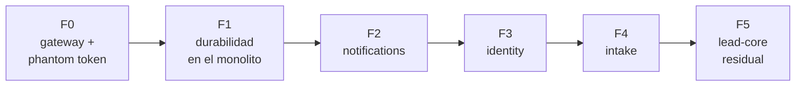
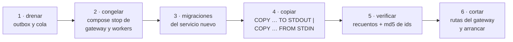
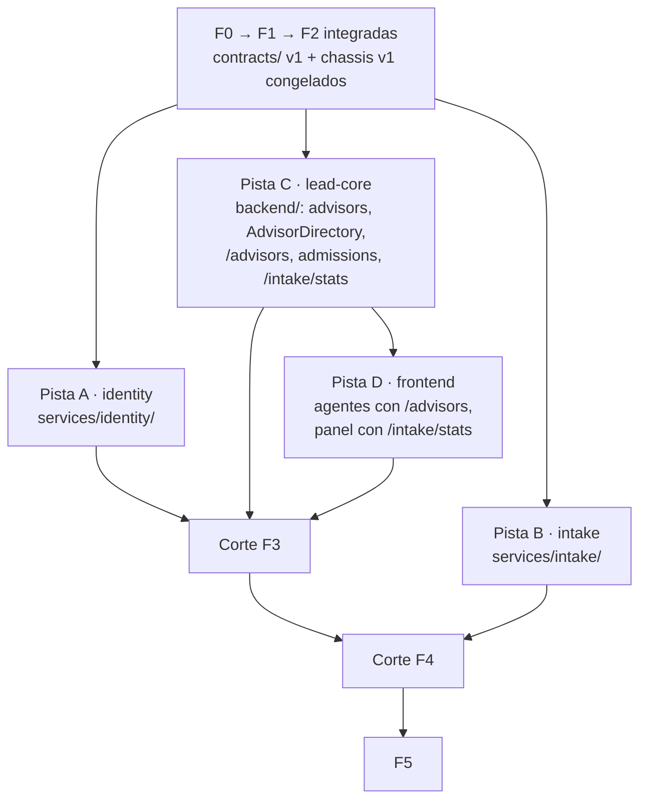

# 06 · Plan de desacople

Seis fases. Cada una cambia **una** cosa, deja el sistema operable y termina con `verify-e2e.sh` en
verde. El orden sigue una regla: **primero se cambia el comportamiento dentro del monolito, después se
mueve el código**. Así, cuando un contexto sale a su propio servicio, la semántica que lleva ya está
probada y lo único nuevo es la red.



| Fase | Por qué en este orden |
|---|---|
| F0 | El mecanismo de identidad que usarán todos los servicios se prueba sin haber separado nada |
| F1 | Elimina las tres piezas que sólo funcionan dentro de un proceso (bus en memoria, relay en la API, *fallback* de encolado) |
| F2 | El servicio más pequeño y downstream: practica plantilla, base propia, consumidor y migración de datos con riesgo mínimo |
| F3 | Identity necesita gateway y eventos ya probados, y es requisito de las proyecciones de F4 |
| F4 | Rompe la transacción más importante (ingesta ↔ decisión) cuando todo lo demás ya está estable |
| F5 | Lo que queda ya *es* lead-core: limpiar, renombrar y documentar |

## Definición de terminado (todas las fases)

1. La suite de cada servicio tocado pasa: `docker compose --profile test run --rm <svc>-test`.
2. `pytest -m unit` de cada servicio tocado pasa **sin base y sin variables de entorno**.
3. Los cuatro tests de guardián pasan en cada servicio.
4. `./scripts/verify-e2e.sh` pasa entero, incluida la `verify_ms_fN` nueva de la fase.
5. La documentación que describe el sistema actual (C4, módulos, eventos) refleja lo que cambió.
6. El ADR de la fase pasa a reflejar su estado real.

## Procedimiento de migración de datos (F2, F3, F4)

Cada extracción copia las tablas del contexto desde `leads_db` a la base nueva **con los mismos
UUID**. Para un MVP local basta una ventana corta sin escrituras; no se usa CDC ni doble escritura.



- El script de cada fase (`scripts/migrate/fN_<svc>.sh`) se puede repetir: trunca el destino antes de
  copiar y no toca el origen.
- Se copian columnas explícitas (`COPY (SELECT …)`), no tablas enteras: algunas cambian de forma al
  moverse (`agents` pierde `group_id`).
- **La vuelta atrás sólo existe hasta el paso 6.** Antes, basta arrancar con la configuración
  anterior. Después, el servicio nuevo acepta escrituras que el monolito no tiene, y volver exigiría
  una migración inversa. Se dice así, sin prometer un interruptor.
- Las tablas copiadas no se borran del monolito en la fase: el código que las usaba sí se elimina. Las
  tablas se borran en F5, cuando ya no hay vuelta atrás que proteger.

---

## F0 · Gateway y *phantom token*

**Estado: implantada** (`43393d1..08bc24a`). Medición de la línea base en
[07](07-evoluciones-y-riesgos.md#mediciones).

**Objetivo.** Todas las peticiones entran por el gateway y cada ruta protegida se autentica con el JWT
interno. Sigue habiendo un único servicio.

**Cambios**

- `libs/chassis` con `auth` (verificación del token y caché de JWKS) y `web` (`X-Request-Id` y logging
  correlacionado). `testing` (helper del guardián) pasa a F2: en F0 sólo hay un guardián y ya existe;
  entra cuando un segundo servicio lo necesita.
- En `backend`:
    - `Principal` en `application/dtos/context.py`; `RequestContext(principal, tenant_id)`.
      `AuthorizationPolicy` opera sobre `Principal`.
    - Router interno con `GET /internal/v1/auth/introspect` (con `?optional=true` para el bootstrap de
      `POST /agents`, que 03 no contemplaba) y `GET /internal/v1/jwks`, que reutiliza
      `resolve_current_agent` (cookie) y `resolve_integration_agent` (`X-Api-Key`). `SIGNING_KEYS` en `Settings`, con
      semillas Ed25519 en base64url, no PEM.
    - `get_request_context` verifica el bearer interno. Las rutas de `/auth/*` siguen leyendo la cookie.
    - Se retiran de `main.py` `CORSMiddleware` y `reject_untrusted_browser_origins`; sus casos de prueba
      (`test_origin_protection.py`) pasan a `verify_ms_f0`, contra el nginx real.
    - La suite emula al gateway: `GatewayClient` (`backend/tests/e2e/gateway_client.py`) introspecciona y
      reenvía el bearer igual que nginx, y los tests e2e lo usan.
- `gateway/nginx.conf` con la tabla de enrutado de [03](03-gateway-y-autenticacion.md): todos los
  prefijos apuntan a `backend`, que vuelve a resolverse por DNS (`resolve`), de modo que el gateway no
  declara `depends_on`. `limit_req` sólo en `/api/v1/auth/`.
- `docker-compose.yml`: servicio `gateway` en `:8001`; `backend` deja de publicar puerto. La imagen del
  backend recibe `libs/chassis` por un contexto de construcción con nombre (`additional_contexts`).
- `frontend/nginx.conf`: `proxy_pass` hacia `gateway`, también con resolución en ejecución.
- Documentación: [01](01-punto-de-partida.md) refleja la identidad por introspección, y las páginas
  de fuera de esta sección que describían JWT/Bearer como sesión se corrigieron.
- Línea base: p50/p95 de `introspect`, `GET /leads` (directo y por el gateway), login y
  `GET /leads` con `X-Api-Key`, y duración de un job de 1.000 registros.

**`verify_ms_f0`** (corre la última: detiene el backend; los nombres `verify_f0_identity`,
`verify_f2a`… ya pertenecen a planes anteriores, así que las fases de este desacople
llevan una `verify_ms_fN` cada una)

- Un `Authorization: Bearer <basura>` sin cookie → 401 con el sobre y el mensaje del gateway.
- Un JWT firmado con otra clave → 401, por el gateway y directo al servicio.
- El `Authorization` del cliente no llega al servicio: manda la cookie.
- `/internal/v1/jwks` y `/internal/v1/auth/introspect` a través del gateway → 404.
- `X-Request-Id`: se conserva, se genera si falta, se sustituye si es hostil o de 129 caracteres, y
  aparece en el access log del gateway.
- CORS: preflight de origen permitido, `localhost:5173.evil.test` → 403, un `Origin` hostil no crea
  sesión, un `Referer` hostil sin `Origin` no cuenta y `X-Api-Key` con `Origin` hostil → 403.
- Una `X-Api-Key` válida en una ruta distinta de `GET /leads` → 401.
- `POST /agents` anónimo con agentes ya creados → 401.
- Un cuerpo de más de 10 MB → 413.
- Con el backend parado → 503 `SERVICE_UNAVAILABLE`, y vuelve a responder al arrancarlo.

**Criterio de salida.** Los checks previos de `verify-e2e.sh` pasan, más `verify_ms_f0`. Ninguna ruta de
negocio (`/api/v1/*` salvo `/api/v1/auth/*`) recibe la cookie: sólo `/auth/*` y la introspección
interna la leen.

---

## F1 · Durabilidad en el monolito

**Estado: implantada** (`8608edb..dbcfb6e`). Lo construido sigue el plan salvo las desviaciones de
abajo; las pruebas de fallo de entrega y `verify_ms_f1` se describen en
[Validación](../desarrollo/validacion.md).

**Objetivo.** Todo lo que se publica o se encola pasa por el outbox; nada depende de que un proceso
siga vivo.

**Cambios**

- Migraciones en `leads_db`: `outbox_events.channel` (`DEFAULT 'product'`) y `correlation_id`;
  `processed_events`; `intake_files`; `intake_jobs.correlation_id`; `agents.version` y
  `tenants.version`.
- `chassis.outbox`: relay por canal y despachadores Kafka producto, webhook, Kafka interno y RabbitMQ
  con *publisher confirms*. Sustituye a `OutboxRelay` y `OutboxRelayThread`.
- `chassis.consumer`: bucle con `processed_events`, reintentos, DLQ y `ensure_topics()`.
- Eventos internos:
    - `IngestLeadUseCase` y `AssignLeadUseCase` registran `LeadAssigned`, `LeadReassigned`,
      `LeadLeftUnassigned` e `IntakeRejected` en el outbox `internal`, dentro de su transacción.
    - Las escrituras de agentes y tenants registran `AgentState` y `TenantState` (con `version`).
    - CLI `publish_identity_snapshot`: publica el estado actual de todos los agentes y tenants, para
      sembrar los topics compactados.
    - Se elimina `InMemoryEventPublisher` y `event_wiring.py`. `NotificationHandler` pasa a ser
      consumidor de `internal.lead-core.events` e `internal.intake.events`.
- Trabajo de fondo:
    - El encolado se registra en el outbox `job`; se elimina el *fallback* con `BackgroundTasks` en
      `ingest`, `batch-upload` y `reprocess`.
    - `batch-upload` guarda el fichero en `intake_files`; el worker lo parsea.
    - Un job interrumpido hace `nack`.
- Procesos: `backend` deja de arrancar el relay. Nuevo servicio `backend-worker` (`infrastructure/worker/`: relay +
  consumidores de notificaciones). `intake-worker` sigue igual.

**Desviaciones respecto a lo anterior**

- **`producer`:** `"lead-core"` en todos los sobres de F1, porque el monolito es el único productor.
  Identity e intake publicarán con su nombre al extraerse.
- **Reproceso asíncrono:** `POST /intake/jobs/{id}/reprocess` deja de procesar en línea y responde
  `202` con el trabajo `PENDING`; la orden va por el outbox `job` como cualquier otra.
- **`intake_jobs.correlation_id`:** se fija al insertar el trabajo. El mensaje de `intake.jobs` lleva
  el `correlation_id` de la petición que lo encoló, y en un reproceso es el de la petición de reproceso.
- **Un hilo por canal.** El plan no fija el reparto de hilos: los tres relays corren en hilos propios
  de `backend-worker` para que un destino caído (un Kafka interno que no responde) no retenga a los
  demás canales. El canal `internal` no entrega hasta que `ensure_topics` termina.
- **Los carriles de consumidor se auto-reparan.** Un consumidor cuyo cliente de Kafka falla se
  reconstruye tras una espera de 1 s que se duplica hasta 30 s, en vez de dejar morir su hilo.
- **`intake-worker` reconecta a RabbitMQ** con la misma espera, en vez de salir y depender de
  `restart: on-failure` (el plan lo daba por «sigue igual»).

**`verify_ms_f1`**

- Con `rabbitmq` parado, una ingesta → 202 y el job queda `PENDING`; al arrancar `rabbitmq`, el job
  termina y el lead aparece.
- Tras asignarse un lead, la notificación aparece; reiniciar `backend-worker` no la duplica.
- Una subida de fichero termina con los mismos recuentos que antes del cambio.
- `internal.identity.agents` e `internal.identity.tenants` tienen `cleanup.policy=compact`; las DLQ de
  los dos grupos existen y están vacías.
- El `X-Request-Id` de la ingesta aparece en los logs de `backend-worker` o de `intake-worker`.

**Criterio de salida.** Además de lo anterior, tests de integración que prueban: un relay que muere
tras publicar y antes de marcar produce un duplicado que el consumidor ignora; un evento que falla tres
veces termina en `internal.dlq.<grupo>`; un job con un registro que falla vuelve a la cola y acaba en
`intake.jobs.dlq` a la tercera.

---

## F2 · Notifications

**Objetivo.** Primer servicio real, construido con la plantilla. Es el **servicio de referencia**: el
más pequeño, nadie depende de él y aun así ejercita todo lo nuevo (esqueleto, base propia, consumidor
con deduplicación, proyección, migración de datos y corte). Lo que salga mal se corrige aquí, una vez,
antes de que identity e intake copien el patrón.

**Solape con F1.** La *construcción* de notifications puede empezar en cuanto F1 haya integrado
`chassis.consumer` y la publicación de los eventos internos, mientras F1 termina sus tareas de
ingesta (`intake_files`, `nack`, encolado por outbox). El *corte* espera a que F1 esté completa.

**Cambios**

- `services/notifications/` con el esqueleto de [02](02-servicios-y-datos.md#patron-de-construccion):
  dominio `Notification`, casos de uso de listar y marcar leídas, repositorio, router,
  `NotificationHandler` como consumidor, proyección `members` desde `internal.identity.agents`.
- `notifications_db` con `notifications`, `members`, `processed_events`.
- Corte de consumidores: el servicio nuevo usa **los mismos nombres de grupo** que tenía
  `backend-worker`, de modo que continúa desde sus offsets sin hueco ni repetición. Se copian también
  las filas de `processed_events` de esos grupos.
- `scripts/migrate/f2_notifications.sh`: `notifications` y `processed_events` correspondientes.
- Gateway: `/api/v1/notifications/` → `notifications`.
- `backend`: se eliminan router, casos de uso, handler y repositorio de notificaciones, y
  `notifications` sale de `PostgresUnitOfWork`.

**`verify_ms_f2`**

- Asignar un lead genera la notificación del asesor, visible a través del gateway.
- Un lead que queda sin asignar notifica a los managers del tenant (proyección `members`).
- Marcar una y todas como leídas; leer la de otro tenant → 404.

**Criterio de salida.** El recuento de notificaciones por destinatario y estado es igual antes y
después del corte. `backend` no contiene ningún módulo de notificaciones.

---

## F3 · Identity

**Objetivo.** Autenticación, organizaciones y agentes viven en su servicio; nadie más lee sus tablas.

**Cambios**

- `services/identity/`: casos de uso de auth, MFA, OAuth, tenants y agentes; repositorios de `tenants`,
  `agents`, `auth_*`, `agent_mfa`, `mfa_recovery_codes`, `social_identities`;
  `KafkaCredentialProvisioner` y el principal `INTEGRATION`; CLI `sync_tenants`; rutas internas
  `introspect`, `jwks`, `service-tokens`, `agents/{id}`; outbox con `AgentState` y `TenantState`.
- `identity_db`. `scripts/migrate/f3_identity.sh` copia las tablas de identidad, **incluidas las
  sesiones activas**: nadie tiene que volver a iniciar sesión. `agents` se copia sin `group_id`.
- En `backend`, **antes del corte**:
    - Tabla `advisors`, sembrada desde `agents` (con `group_id`), y consumidor `lead-core.advisors`.
    - `AdvisorDirectory` con hidratación desde identity; cliente de tokens de servicio.
    - `GET /advisors` y `PATCH /advisors/{agent_id}`; los grupos operan sobre `advisors.group_id`.
    - `RawSqlLeadRepository` pasa a `JOIN advisors`; `AssignLeadUseCase` usa `AdvisorDirectory`.
    - Consumidor `intake.tenants` que crea las fuentes por defecto, con `provisioned_tenants` sembrada
      con los tenants existentes. Es código de intake que vive en el monolito hasta F4.
- Gateway: `/auth`, `/tenants`, `/agents` e `introspect` → `identity`.
- `backend`: se eliminan los módulos de identidad, `MFA_ENCRYPTION_KEY`, OAuth y el provisionador de
  Kafka.
- Frontend: cambio de contrato 1 ([ADR-0036](../decisiones/0036-cambios-de-contrato-publico.md)).
  `AgentCreate` y `AgentUpdate` declaran `extra="forbid"`: hoy Pydantic ignora un campo sobrante, y un
  cliente que siguiera enviando `group_id` creería haber asignado un grupo que nadie guardó.

**`verify_ms_f3`**

- Los checks existentes de login, MFA, OAuth, `/auth/me` y credencial de integración pasan sin
  modificarse.
- Crear un agente y asignarle grupo de inmediato → 200 (hidratación).
- Desactivar un agente → su siguiente petición es 401 y deja de recibir leads.
- Suspender un tenant → sus agentes reciben 401.
- `PATCH /agents/{id}` con `group_id` → 422.
- Crear un tenant → en pocos segundos tiene sus dos fuentes y acepta una ingesta.

**Criterio de salida.** Ningún servicio salvo identity tiene credenciales sobre `identity_db` ni
variables de MFA u OAuth.

---

## F4 · Intake

**Objetivo.** La recepción y la decisión se separan; la idempotencia sustituye a la transacción.

**Cambios**

- En `backend`, **antes de mover nada**: `leads.intake_record_id`, rellenada desde
  `intake_records.lead_id`, y `UNIQUE (tenant_id, intake_record_id)`.
- En `backend`: `POST /internal/v1/admissions` (la parte de decisión de `IngestLeadUseCase`) y
  `GET /internal/v1/admissions?intake_record_ids=…` para la reconciliación. `/leads/stats` pierde
  `pending_intake`.
- `services/intake/`: recepción, jobs, registros, errores, fuentes, ficheros, parser (`pandas` y
  `openpyxl` salen de lead-core), cola, consumidor `intake.tenants`, `LeadAdmissionPort` con adaptador
  HTTP, `GET /intake/stats`, borrado de fuente contando registros. El `intake-worker` pasa a ser su
  worker (`infrastructure/worker/`), con el relay de su outbox (`job` e `internal`).
- `intake_db`. `scripts/migrate/f4_intake.sh` copia `lead_sources`, `intake_jobs`, `intake_records`,
  `intake_errors`, `intake_files` y `provisioned_tenants`. Antes de congelar, se drenan el outbox `job`
  y `intake.jobs`.
- Gateway: `/sources` e `/intake` → `intake`.
- Frontend: cambio de contrato 2.

**`verify_ms_f4`**

- Ingesta individual → lead asignado, visible en `GET /leads` y con su registro `PROMOTED`.
- Subida de fichero con filas válidas, inválidas y descalificadas → los recuentos de siempre.
- Reprocesar un job completado no crea leads nuevos.
- Con `lead-core` parado, una ingesta queda en el job; al arrancarlo, termina sin duplicados.
- `GET /leads/stats` y `GET /intake/stats` suman lo que antes devolvía el primero.

**Criterio de salida.** Tests de contrato de la admisión en los dos lados (fixture capturado de
lead-core, usado por el adaptador de intake); la reconciliación sale sin diferencias tras una carga de
prueba; ningún servicio salvo intake tiene credenciales sobre `intake_db`.

---

## F5 · Lead Core residual

**Objetivo.** El monolito ya no existe: lo que queda es lead-core.

**Cambios**

- Migración en `leads_db` que borra las tablas copiadas en F2–F4 (`DROP TABLE IF EXISTS`, idempotente)
  y las FK que apuntaban a ellas.
- `PostgresUnitOfWork` sólo con los repositorios de lead-core; `Settings` sin variables ajenas;
  `dependencies.py` sin cableado ajeno.
- `git mv backend services/lead-core`; servicios de Compose `lead-core` y `lead-core-worker`;
  `backend-test` → `lead-core-test`.
- Documentación del sistema actual: C4 de contenedores y componentes, modelo de datos, módulos,
  eventos y `CLAUDE.md` (comandos de validación por servicio).

**`verify_ms_f5`.** El recorrido completo de `verify-e2e.sh`, sin checks nuevos: la fase no cambia
comportamiento.

**Criterio de salida.** Cinco servicios con su guardián 4/4; cada base accesible sólo por su rol; la
sección [Desacople en microservicios](index.md) deja de llevar el aviso de «no desplegada».

---

## Ejecución en paralelo

Dos subagentes pueden trabajar a la vez cuando **no editan los mismos ficheros ni dependen de algo que
el otro está cambiando**. Aplicado al plan:

| Tramo | Paralelo | Motivo |
|---|---|---|
| F0, F1 | No (salvo `chassis` frente al resto en F1) | Tocan el núcleo que todos copiarán: `dependencies.py`, `RequestContext`, UoW, migraciones de `leads_db` |
| F2 | Sólo el solape con el final de F1 | Es la referencia; tres servicios sobre una plantilla sin probar repetirían el mismo error tres veces |
| **Construcción de F3 y F4** | **Sí: cuatro pistas** | Cada pista vive en su carpeta y trabaja contra contratos congelados |
| Cortes F3 → F4, F5 | No | Comparten `docker-compose.yml`, `gateway/`, `verify-e2e.sh`, `leads_db` y una ventana sin escrituras; un cambio cada vez para saber qué rompió qué |

### Construir frente a cortar

Cada extracción se parte en dos trabajos distintos:

- **Construir:** el servicio en su carpeta, con su base, sus tests y adaptadores falsos para lo
  remoto. No necesita ningún otro servicio arrancado. Es paralelizable.
- **Cortar:** migración de datos, rutas del gateway, Compose, `verify-e2e.sh` y retirada del código
  del monolito. Lo hace quien orquesta, uno cada vez.

Todo cambio de contrato sigue el patrón **expand → migrate → contract**: lo nuevo se añade sin quitar
lo viejo, los clientes migran a su ritmo y lo viejo se retira en el corte. Por eso `/advisors`,
`/intake/stats`, `POST /internal/v1/admissions` y `leads.intake_record_id` se añaden al monolito
antes de que existan identity o intake, y `advisors` se alimenta de los `AgentState` que el propio
monolito publica desde F1.

### La ola paralela



La pista C es la única que toca `backend/` y va en serie dentro de su carril (primero `advisors`,
después `admissions`). La pista D arranca en cuanto C publica los endpoints nuevos, que conviven con
los viejos.

### Condiciones para abrirla

1. F0, F1 y F2 integradas en `main`, con `verify-e2e.sh` en verde.
2. **`libs/chassis` v1 congelado.** Durante la ola sólo lo cambia quien orquesta. Una pista que lo
   necesite se detiene y lo reporta como hallazgo.
3. **`contracts/` v1 congelado y versionado:** OpenAPI de las rutas internas (`introspect`, `jwks`,
   `service-tokens`, `agents/{id}`, `admissions`), JSON Schema de cada evento interno y del mensaje de
   `intake.jobs`, y un fixture por contrato que usan los tests de los dos lados.
4. Notifications cortado: su árbol es el patrón de sólo lectura de las pistas A y B.
5. Asignados de antemano: nombres de Compose, variables, bases y roles ([05](05-despliegue-local.md)),
   y un rango de numeración de migraciones por pista para lo que todavía cae en `leads_db`.
6. Cada pista con lista cerrada de ficheros, su propio worktree y su comando de validación.
7. Los ficheros compartidos tienen un único dueño, quien orquesta: `docker-compose.yml`, `gateway/`,
   `verify-e2e.sh`, `scripts/migrate/`, `libs/chassis`, `contracts/` y la documentación del sistema
   actual.

### Cuando algo no cuadra

| Situación | Respuesta |
|---|---|
| Una pista necesita cambiar `chassis` | Se detiene esa tarea; quien orquesta lo cambia y las demás pistas rebasan |
| Un contrato tiene un hueco | Se sube su versión en `contracts/`; los tests de contrato de las pistas afectadas fallan hasta adaptarse |
| Un servicio diverge de la plantilla | Se detecta al integrar comparando su árbol con el de notifications |

### Tareas y planes

Cada fase o pista se descompone en tareas de un subagente, con su commit, siguiendo las reglas de
reparto de `CLAUDE.md`: encargo autosuficiente, lista cerrada de ficheros (los que modifica y los que
sólo lee como patrón), un comando de aceptación, hallazgos en la respuesta y revalidación con
`verify-e2e.sh` por quien orquesta. Los planes viven en `.plans/microservices/`, fuera de `docs/`, y
cada uno se escribe al empezar su fase: el de la ola paralela depende de lo que F0–F2 enseñen.

### Punto de retorno

El tag `monolith-baseline` marca el último estado del monolito, con esta documentación y sin ningún
cambio de código. Restaura el código; los datos se restauran con el volcado
`backups/monolith-baseline.dump` (fuera de git):

```bash
git switch -c rescue monolith-baseline
docker compose exec -T db pg_restore -U postgres --clean --if-exists -d leads_db < backups/monolith-baseline.dump
```
