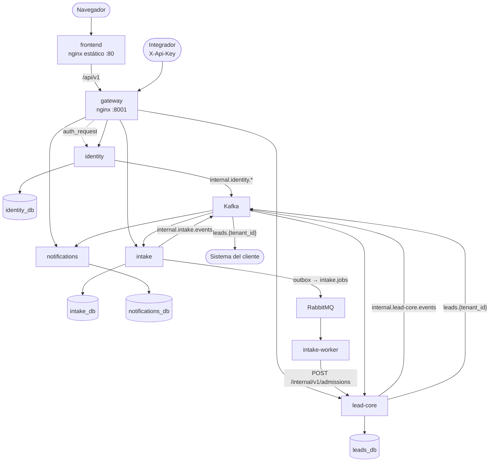

# Desacople en microservicios

!!! warning "Arquitectura objetivo, no desplegada"
    Esta sección define **adónde va** Lead Router y **cómo se llega**. El sistema descrito en el resto
    del sitio sigue siendo el monolito modular hasta que cada fase de
    [el plan](06-plan-de-desacople.md) se complete. Las decisiones están registradas como ADR
    ([0031](../decisiones/0031-microservicios-por-contexto.md)–[0036](../decisiones/0036-cambios-de-contrato-publico.md)).

    **F0 está implantada**: el gateway y el *phantom token* ya sirven la API sobre el monolito. Eso no es
    el desacople: sigue habiendo un único servicio de aplicación.

Lead Router es hoy un monolito modular hexagonal: un proceso API, un `intake-worker` con la misma
imagen y la misma base, RabbitMQ para el trabajo de fondo y Kafka para el canal de producto. Esta
sección lo separa en **cuatro servicios con datos propios detrás de un gateway**, con el menor número
de cambios que no deje deuda: se mueve código que ya tiene puertos, se cambian adaptadores y no se
reescribe dominio.

## Decisiones tomadas

| Tema | Decisión | Dónde |
|---|---|---|
| Servicios | `identity`, `intake`, `lead-core`, `notifications` + `gateway` | [02](02-servicios-y-datos.md) |
| Datos | Una base por servicio en el mismo PostgreSQL, rol propio, sin consultas cruzadas | [02](02-servicios-y-datos.md) |
| Código | Monorepo `services/<svc>/`, mismo esqueleto en todos, `libs/chassis` sólo técnico | [02](02-servicios-y-datos.md) |
| Gateway | nginx con `auth_request`; única entrada en `:8001` | [03](03-gateway-y-autenticacion.md) |
| Autenticación | Cookie opaca en el navegador (ADR-0029 intacto) + *phantom token*: JWT interno Ed25519 de 60 s que cada servicio verifica en local | [03](03-gateway-y-autenticacion.md) |
| Servicio a servicio | HTTP/JSON con token de servicio; gRPC descartado por ahora | [03](03-gateway-y-autenticacion.md), [07](07-evoluciones-y-riesgos.md) |
| Hechos | Kafka: `leads.{tenant_id}` sin cambios + topics `internal.*`; estado en topics compactados | [04](04-comunicacion-y-eventos.md) |
| Trabajo | RabbitMQ `intake.jobs` sin cambios de topología; encolado por outbox | [04](04-comunicacion-y-eventos.md) |
| Ingesta → decisión | `POST /internal/v1/admissions` síncrono e idempotente por `intake_record_id` | [04](04-comunicacion-y-eventos.md) |
| Contrato público | Dos cambios acotados: `/advisors` y `/intake/stats` | [02](02-servicios-y-datos.md) |
| Despliegue | Docker Compose; Kubernetes queda como evolución con criterio | [05](05-despliegue-local.md) |
| Ruta | F0 gateway → F1 durabilidad → F2 Notifications → F3 Identity → F4 Intake → F5 Lead Core | [06](06-plan-de-desacople.md) |

## Vista objetivo

## Cómo leer esta sección

| Página | Responde |
|---|---|
| [01 · Punto de partida](01-punto-de-partida.md) | Qué hay hoy y qué acoplamientos concretos hay que cortar |
| [02 · Servicios y datos](02-servicios-y-datos.md) | Qué servicios, qué posee cada uno, cómo se corta cada acoplamiento, el patrón de construcción |
| [03 · Gateway y autenticación](03-gateway-y-autenticacion.md) | Cómo entra una petición y cómo cada servicio sabe quién la hace |
| [04 · Comunicación y eventos](04-comunicacion-y-eventos.md) | Cuándo HTTP, RabbitMQ o Kafka; topics, outbox, consumidores, contrato de admisión |
| [05 · Despliegue local](05-despliegue-local.md) | Compose, bases, imágenes, puertos y tests |
| [06 · Plan de desacople](06-plan-de-desacople.md) | Las fases, qué cambia en cada una y cuándo se da por terminada |
| [07 · Evoluciones y riesgos](07-evoluciones-y-riesgos.md) | Lo que se descartó por ahora y la señal que lo justificaría |

## Invariantes que la separación no negocia

Todas las del monolito siguen vigentes en **cada** servicio, más tres nuevas:

- **La organización sale del token** (ADR-0004). En el borde, del JWT interno; entre servicios, del
  dato persistido por el servicio que llama, nunca de la entrada del usuario final.
- **404, no 403**, al leer una entidad de otra organización (ADR-0005).
- **SQL crudo**, migraciones idempotentes, guardián 4/4 por servicio.
- **Nuevo · Cada servicio sólo lee y escribe su base.** Lo que necesita de otro llega por API,
  evento o proyección. Nunca un `JOIN` entre bases.
- **Nuevo · Toda publicación sale de un outbox local**, en la transacción del agregado que la
  produce. Todo consumidor deduplica por `event_id`.
- **Nuevo · Ningún servicio importa código de otro.** Sólo `libs/chassis`, y sólo desde
  `infrastructure`.

## Qué queda fuera a propósito

- Un servicio por router o por tabla, y partir scoring, viabilidad y asignación: los tres comparten
  una transacción (bloqueo de `rr_cursor` + lead + outbox) que no compensa distribuir.
- Servicios de Delivery, Reporting u Organizaciones separados de Identity.
- Kubernetes, service mesh, gRPC, CQRS y motores de workflow.
- Cambiar el contrato externo `leads.{tenant_id}`.

Cada exclusión tiene su señal de revisión en [Evoluciones y riesgos](07-evoluciones-y-riesgos.md).
