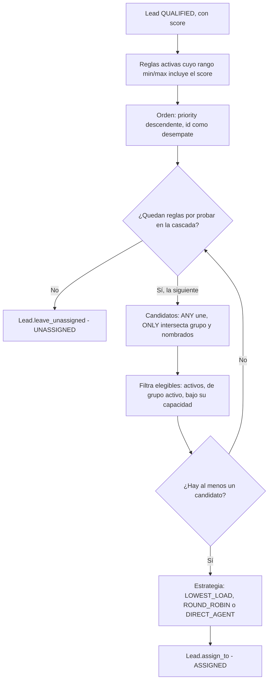

# Asignación

Decide qué asesor recibe un lead calificado: filtra candidatos elegibles, recorre las reglas de
asignación en cascada por prioridad y reparte según la estrategia que corresponda.

## Cómo funciona

`AssignmentEngine.select_agent` recibe el lead, las `AssignmentRule` activas de la organización, los
asesores disponibles, los grupos y la carga actual de cada asesor. No persiste nada por sí mismo:
sólo decide, y quien lo llama (`IngestLeadUseCase`) es quien aplica el resultado sobre el lead.

1. Filtra las reglas cuyo rango `[min_score, max_score]` incluye el score del lead y cuyas
   condiciones (la misma gramática de [Reglas y motores](reglas.md)) se cumplen, y las ordena por
   `priority` descendente, con el `id` como desempate estable.
2. Para cada regla, en ese orden, construye el conjunto de candidatos según `agent_match_mode`:
   `ANY` une los miembros del grupo destino con los asesores nombrados explícitamente; `ONLY` los
   intersecta.
3. Filtra los candidatos elegibles: activos, y si pertenecen a un grupo, que el grupo esté activo y
   que el asesor no haya alcanzado su `capacity_per_agent`. Un asesor sin grupo sólo llega nombrado,
   así que estar activo es la única condición.
4. Si no queda ningún candidato, prueba la siguiente regla de la cascada —una regla vacía ya no
   termina la búsqueda, sólo deja seguir—. Si ninguna regla produce candidatos, el lead pasa a
   `UNASSIGNED` (evento `LeadLeftUnassigned`, ver [Notificaciones](notificaciones.md)).
5. Con candidatos, aplica la estrategia: la de la regla si la define, si no la del grupo, y
   `LOWEST_LOAD` como último recurso.

### Las tres estrategias

| Estrategia | Comportamiento |
|---|---|
| `LOWEST_LOAD` | El candidato con menos leads activos; el `id` desempata |
| `ROUND_ROBIN` | Rota sobre `rr_cursor`, persistido en la propia regla, no en memoria |
| `DIRECT_AGENT` | Recorre `target_agent_ids` en el orden escrito y toma el primero disponible |

`rr_cursor` vive en la regla, no en memoria del proceso: una asignación puede atenderla cualquier
instancia, y un cursor en memoria se reiniciaría en cada petición. `advance_cursor` calcula el
índice sobre el tamaño actual de candidatos en el momento de leer, no de escribir, así que sigue
siendo válido aunque un asesor entre o salga del grupo entre dos repartos.

### Capacidad y carga

`SalesGroup.capacity_per_agent` limita cuántos leads activos puede sostener a la vez cada asesor del
grupo; `None` significa sin límite. La carga no es un contador que se incrementa y nunca baja: se
deriva en cada asignación con una única consulta agregada sobre los leads `ASSIGNED` de la
organización, así que un lead reasignado o descartado deja de contar de inmediato.

!!! note
    `DIRECT_AGENT` no falla mientras queden candidatos: si ninguno de los `target_agent_ids`
    sobrevivió al filtro de elegibilidad, toma el primer candidato que sí lo hizo.

## Piezas

| Pieza | Responsabilidad |
|---|---|
| `AssignmentEngine` | Orquesta la cascada: ordena reglas, arma candidatos, aplica la estrategia |
| `AssignmentRule` | Banda, condiciones, modo de combinación, estrategia propia y cursor rotatorio |
| `SalesGroup` | Política del grupo: estrategia por defecto y capacidad por asesor |
| `AgentMatchMode` | `ANY` (unión) u `ONLY` (intersección) entre grupo y asesores nombrados |
| `AssignmentStrategy` | `LOWEST_LOAD`, `ROUND_ROBIN`, `DIRECT_AGENT` |

## Decisiones que lo explican

- [ADR-0012](../decisiones/0012-y-dentro-o-entre.md): las condiciones de una regla son todas Y.
- [ADR-0014](../decisiones/0014-retirada-del-umbral-fijo.md): la banda es el único corte de score.

## Dónde vive

- `backend/src/domain/services/assignment_engine.py`
- `backend/src/domain/entities/rule.py`
- `backend/src/domain/entities/sales_group.py`
- `backend/src/domain/value_objects/enums.py`
