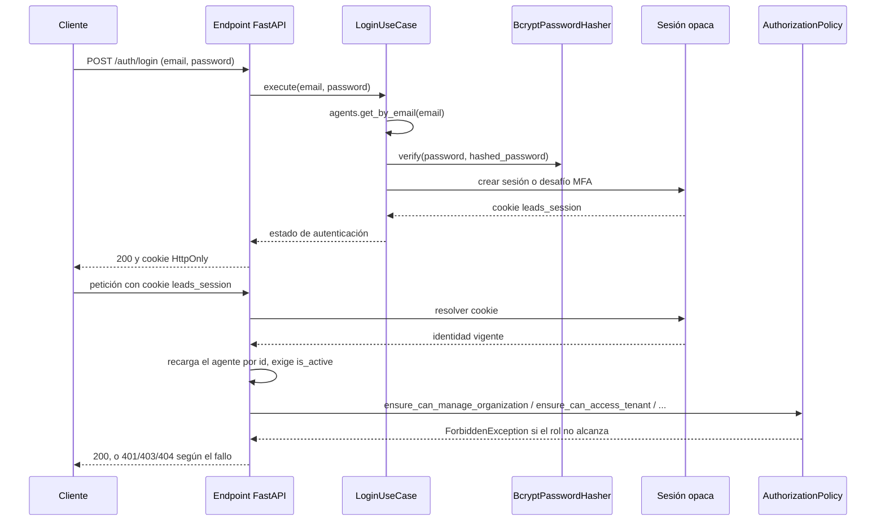

# Identidad y acceso

Autentica cada petición humana con una sesión opaca en cookie, recarga la identidad del actor desde base de datos y decide qué
puede hacer según su rol y su organización.

## Cómo funciona

`POST /auth/login` recibe correo y contraseña, y `LoginUseCase` responde con un único fallo
—`InvalidCredentialsException`— tanto si la cuenta no existe como si la contraseña no coincide: un
llamante no puede distinguir un caso del otro. Si coincide, crea una sesión aleatoria de 256 bits y
guarda únicamente su SHA-256 en PostgreSQL.

Cada petición posterior vuelve a resolver la identidad completa: `get_current_agent` verifica la
firma y la caducidad del token, y **recarga el agente desde base de datos** por su identificador en
lugar de confiar en lo que el token dice. Un asesor desactivado deja de poder operar en su siguiente
petición, aunque su token todavía no haya caducado.

`GET /auth/me` incluye `linked_oauth_providers` para distinguir una identidad social realmente
vinculada de un proveedor meramente disponible en la plataforma. El enlace ocurre durante un login
OAuth cuyo correo verificado coincide con el agente; no existe un flujo separado de conexión desde
una sesión abierta.

La desactivación es reversible: `PATCH /agents/{agent_id}` con `{"is_active": true}` reactiva al
asesor y le devuelve el acceso en el acto, por la misma razón que se lo cortó — la próxima petición
suya vuelve a recargar el agente, que ya aparece activo. `GET /agents` (sin parámetro) sólo lista
activos; `?is_active=false` es la vía para encontrar a quien reactivar.

El correo es único en **toda la plataforma**, no sólo dentro de una organización:
`LoginUseCase.execute` resuelve la cuenta con `agents.get_by_email(email)` sin filtrar por
`tenant_id`, así que dos organizaciones no pueden compartir un correo sin que el login se quede con
«la fila que la base devuelva primero». `CreateAgentUseCase` comprueba lo mismo antes de guardar y
responde `400 EMAIL_ALREADY_EXISTS` si el correo ya existe en cualquier organización.

### Los cuatro roles

| Rol | Plano | Alcance |
|---|---|---|
| `ADMIN` | Plataforma | Da de alta organizaciones. Sin `tenant_id`: no pertenece a ninguna |
| `MANAGER` | Organización | Administra asesores, grupos, reglas y fuentes de su organización |
| `AGENT` | Organización | Sólo sus propios leads asignados y sus notificaciones |
| `INTEGRATION` | Organización | Un principal de máquina, no una persona. Sólo `GET /leads`, vía `X-Api-Key`; nunca `POST /auth/login` ([ADR-0028](../decisiones/0028-autenticacion-de-la-mensajeria.md)) |

### La regla de bootstrap

`POST /agents` no exige autenticación cuando la tabla de asesores está vacía
(`uow.agents.count() == 0`): esa única petición fuerza el rol `ADMIN` y descarta cualquier
`tenant_id`, sea lo que sea que pida el cuerpo de la petición. En cuanto existe un primer asesor, la
misma ruta exige un `MANAGER` autenticado, y `AuthorizationPolicy.ensure_can_create_agent_with_role`
impide crear un segundo `ADMIN` por esa vía: el único que existirá siempre es el de arranque.

!!! warning
    La ventana de bootstrap depende únicamente del recuento de la tabla, no de un flag de entorno.
    Un despliegue que arranca con la base ya poblada no vuelve a abrirla.

### La cabecera `X-Api-Key`

`GET /leads` es el único endpoint que también acepta una credencial de máquina, además de la sesión de
un `MANAGER`. `POST /agents/integration-credential` la emite con el formato `{agent_id}.{secret}` —
el identificador va en claro en la propia clave; sólo el secreto está protegido, con el mismo
`BcryptPasswordHasher` que la
contraseña de un agente humano. `resolve_integration_agent`, invocada por la introspección interna y no por el servicio, divide la clave, recarga el agente por
`agent_id` y exige `role == INTEGRATION`, activo, y que el secreto verifique — cuatro condiciones que
fallan todas con el mismo `401`, sin decir cuál. La introspección da prioridad a `X-Api-Key` sobre la cookie y emite un bearer interno con
`ptype=integration`; el resto de rutas lo rechazan (`get_request_context`) y sólo
`require_manager_or_integration` lo acepta, con `GET /leads`; con `ptype=human` exige el `MANAGER` de siempre. El resto de la API no cambia — `X-Api-Key` no abre ninguna otra
puerta. Detalle completo en [Autenticación de la mensajería](../eventos/autenticacion.md).

### Los dos planos

`AuthorizationPolicy` separa explícitamente el plano de plataforma del de organización:
`can_manage_platform` sólo lo satisface `ADMIN`, y el resto de métodos —`can_access_tenant`,
`can_manage_organization`, `can_view_lead`— operan siempre dentro de la organización del actor. El
aislamiento entre organizaciones no es una comprobación añadida: `RequestContext.tenant_id` se
construye una única vez por petición a partir del agente verificado, así que ningún caso de uso
recibe un `tenant_id` que el cliente pudiera escribir en la URL o en el cuerpo.

Un fallo de rol y un recurso de otra organización no se distinguen igual: pedir una acción que el
rol no cubre responde `403` (`ForbiddenException`); pedir un recurso que pertenece a otra
organización responde `404`, no `403` —confirmar que existe en otro sitio ya sería una fuga—.

## Piezas

| Pieza | Responsabilidad |
|---|---|
| `AuthorizationPolicy` | Único punto que decide quién puede hacer qué, por plano y por rol |
| `get_current_agent` / `resolve_current_agent` | Resuelve la sesión opaca y recarga el agente en BD |
| `require_organization_manager` | Exige rol `MANAGER` sobre la organización del actor |
| `require_platform_admin` | Exige rol `ADMIN` |
| `require_organization_member` | Exige pertenecer a una organización, con cualquier rol |
| `resolve_integration_agent` | Verifica `X-Api-Key` y recarga el agente `INTEGRATION` en BD; la usa la introspección interna |
| `require_manager_or_integration` | Acepta `MANAGER` humano o `ptype=integration`, sólo en `GET /leads` |
| `RequestContext` | Actor y organización, resueltos una vez por petición desde el token |
| `LoginUseCase` | Verifica credenciales y emite sesión o challenge MFA |
| `MfaUseCase` | Enrola, verifica y desactiva TOTP y códigos de recuperación |
| `BcryptPasswordHasher` | Adaptador passlib/bcrypt para el hash de la contraseña |

## Decisiones que lo explican

- [ADR-0003](../decisiones/0003-dos-planos-disjuntos.md): por qué no se mezclan los dos planos.
- [ADR-0004](../decisiones/0004-organizacion-desde-el-token.md): nunca lo manda el cliente.
- [ADR-0005](../decisiones/0005-404-en-vez-de-403.md): por qué un recurso ajeno responde 404.
- [ADR-0028](../decisiones/0028-autenticacion-de-la-mensajeria.md): el rol `INTEGRATION` y `X-Api-Key`.
- [ADR-0029](../decisiones/0029-sesiones-opacas.md): sesiones humanas en cookie.
- [ADR-0030](../decisiones/0030-mfa-totp.md): MFA TOTP opt-in.

## Dónde vive

- `backend/src/domain/policies/authorization_policy.py`
- `backend/src/infrastructure/adapters/input/api/dependencies.py`
- `backend/src/application/use_cases/auth_use_cases.py`
- `backend/src/infrastructure/adapters/input/api/auth_router.py`
- `backend/src/infrastructure/adapters/output/security/totp_mfa_crypto.py`
- `backend/src/infrastructure/adapters/output/security/bcrypt_password_hasher.py`
