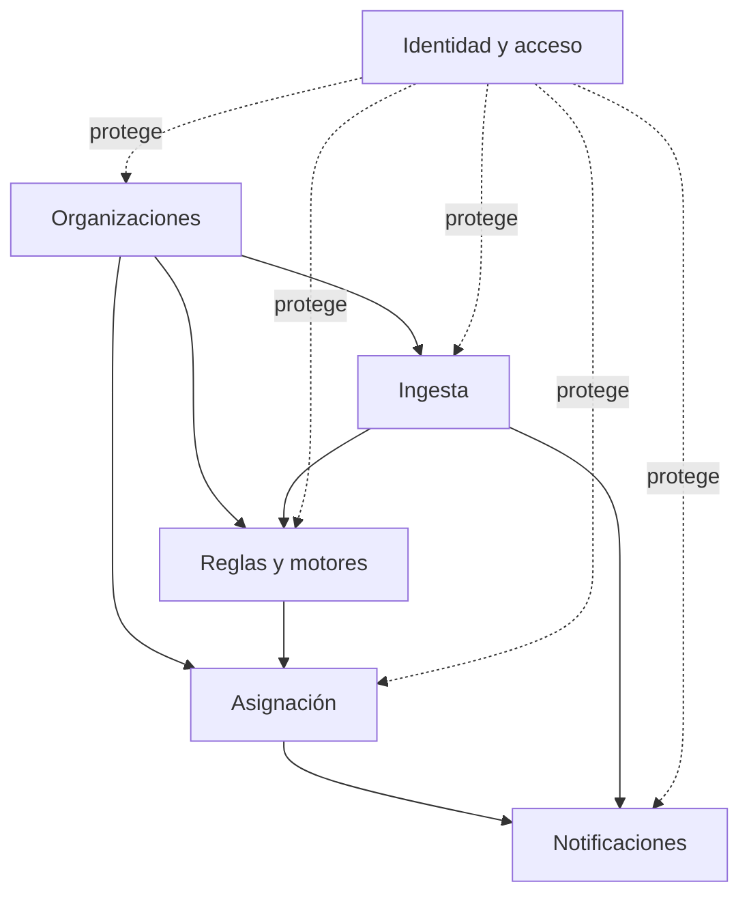

# Módulos

Lead Router se organiza en seis módulos funcionales. El criterio de división no son las capas
hexagonales —dominio, aplicación, infraestructura—, que atraviesan los seis por igual, sino la
responsabilidad de negocio: cada módulo agrupa las entidades, los casos de uso y los adaptadores de
una misma capacidad, de punta a punta.

| Módulo | Qué hace |
|---|---|
| [Ingesta](ingesta.md) | Recibe leads por sus vías de entrada sin perder ninguno |
| [Reglas y motores](reglas.md) | Decide si un lead se puede trabajar y cuánto vale |
| [Asignación](asignacion.md) | Decide qué asesor recibe cada lead calificado |
| [Notificaciones](notificaciones.md) | Avisa a quien debe actuar |
| [Identidad y acceso](identidad-y-acceso.md) | Autentica y autoriza cada petición |
| [Organizaciones](organizaciones.md) | Administra tenants, asesores y grupos de venta |

## Cómo se relacionan

Organizaciones es la base: define el tenant, sus asesores y sus grupos, y los demás módulos operan
siempre dentro de uno. Ingesta entrega el lead interpretado a Reglas, que lo califica; si califica,
Asignación decide el asesor. Tanto un lead sin asesor como un payload que no se pudo interpretar
terminan en Notificaciones. Identidad y acceso no encaja en esa cadena: protege la entrada a todos
los demás, autenticando y autorizando cada petición antes de que llegue a un caso de uso.

## Cómo leer cada página

Las seis páginas de módulo comparten estructura: qué resuelve el módulo, cómo funciona con al menos
un diagrama, sus piezas principales, las decisiones de diseño que lo explican y dónde vive en el
repositorio. El recorrido de un lead a través de varios módulos a la vez está en
[El recorrido de un lead](../arquitectura/recorrido-de-un-lead.md).
