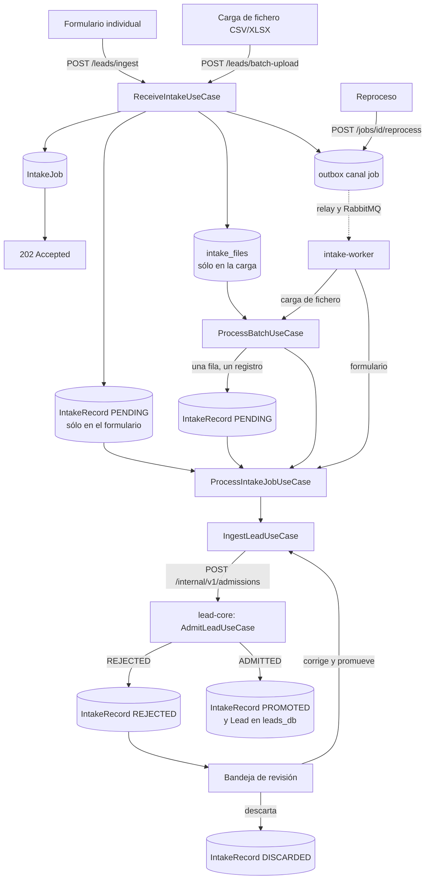

# Ingesta

Recibe los leads por las vías de entrada habilitadas para la organización, garantiza que ningún
payload se pierde —se pueda interpretar o no— y lo convierte en un `Lead` en una fase de
procesamiento independiente de la petición HTTP que lo trajo.

!!! note "Desde F4, un servicio propio"
    La recepción vive en `services/intake/` (API `intake` y `intake-worker`, base `intake_db`). Lo que
    decide qué es un lead —viabilidad, puntuación y asignación— se queda en lead-core, y intake se lo
    pide por `POST /internal/v1/admissions`
    ([Comunicación y eventos](../microservices/04-comunicacion-y-eventos.md#contrato-de-admision)).
    Los dos lados no comparten transacción: la idempotencia de la admisión, por
    `(tenant_id, intake_record_id)`, la sustituye.

## Cómo funciona

La ingesta ocurre en dos fases, en transacciones y procesos distintos. La primera responde rápido y
sin interpretar nada: guarda el payload tal cual llegó y deja constancia de que hay trabajo. La
segunda, en el `intake-worker`, es la que intenta construir un `Lead` a partir de ese payload.

- **Recepción** (`ReceiveIntakeUseCase`): en **una transacción** crea un `IntakeJob`; si la vía es el
  formulario individual, también el `IntakeRecord` con el payload sin tocar; si es una carga de
  fichero, guarda el fichero crudo en `intake_files`; y registra la orden de procesarlo en el outbox
  (canal `job`). Responde `202 Accepted` con el identificador del trabajo antes de interpretar una
  sola línea.
- **Procesamiento** (`ProcessIntakeJobUseCase`): recorre los `IntakeRecord` en estado `PENDING` de
  un trabajo y entrega cada uno a `IngestLeadUseCase`. Éste pide la decisión a lead-core
  (`AdmitLeadUseCase`, que construye el `Lead` y lo hace atravesar viabilidad, puntuación y
  asignación) y marca el registro como `PROMOTED` o `REJECTED`.

El camino entre las dos es [el outbox y RabbitMQ](../eventos/rabbitmq.md): el relay de `intake-worker`
publica la orden en `intake.jobs` con *publisher confirms* y el worker la consume. Si RabbitMQ está caído, el
trabajo espera `PENDING` en el outbox; no hay otra ruta que lo procese dentro de la API.

### Las tres vías de entrada

Cada organización recibe dos fuentes (`LeadSource`) al darse de alta: una `MANUAL_FORM` para el
formulario individual y otra `FILE_UPLOAD` para la carga de fichero. Desde F3 llegan unos segundos
después del alta, cuando el consumidor `intake.tenants` (de intake desde F4) recibe el estado de la organización nueva
que publica identity ([Organizaciones](organizaciones.md#el-alta-una-transaccion-y-un-evento)). `ReceiveIntakeUseCase`
resuelve la fuente activa según el tipo de trabajo, así que ninguna de las dos exige configuración
previa. Una tercera vía, `WEBHOOK`, está declarada en `LeadSourceKind` pero todavía no tiene un
endpoint que la sirva.

La carga de fichero tiene una asimetría respecto al formulario: en la recepción no se crean
registros, sólo el `IntakeJob` y el fichero crudo en `intake_files` (`bytea`, con un límite de 10 MB:
un cuerpo mayor se rechaza con `413 PAYLOAD_TOO_LARGE`, en el gateway y en el propio endpoint).
`ProcessBatchUseCase` lo parsea **en el worker, una sola vez** —lo lee con `FOR UPDATE` y marca
`parsed_at` en la misma transacción que los registros— y sólo entonces materializa un `IntakeRecord`
por fila, antes de entregarlos al mismo `ProcessIntakeJobUseCase` que procesa la vía individual. El
fichero se conserva: lo que sobrevive es el fichero y una fila por registro.

### Reproceso de un trabajo interrumpido

Un trabajo que falla a mitad de proceso —una excepción no prevista al interpretar un registro, o
lead-core sin responder— no se marca `FAILED`: se queda en `PROCESSING`, porque los registros que sí
se resolvieron ya tienen su resultado y sólo faltan los que quedaron `PENDING`. Si es lead-core quien
no responde, el worker corta la ejecución en la primera caída, espera 10 s y hace `nack` con
reencolado: una reentrega inmediata gastaría las tres entregas antes de que lead-core vuelva. RabbitMQ
lo entrega de nuevo, hasta tres veces; a la tercera el mensaje pasa a `intake.jobs.dlq`.
Cada entrega vuelve a leer únicamente los registros todavía `PENDING`. Sólo un fichero ilegible marca
el trabajo `FAILED` de forma directa, porque en ese caso no llegó a generar ni una fila.

`POST /jobs/{job_id}/reprocess` es el camino manual, para un trabajo que llegó a la DLQ o quedó
detenido. **No procesa en la petición**: reinicia los contadores, deja el trabajo `PENDING`, registra
una orden nueva en el outbox y responde `202`. El resultado se consulta después con
`GET /jobs/{job_id}`.

!!! note
    Cada ejecución procesa como máximo 10 000 registros pendientes. Un trabajo más grande que eso
    necesita más de un reproceso para vaciarse: el resto se queda `PENDING` a la espera.

### La bandeja de revisión

`GET /records` lista los `IntakeRecord` de la organización, filtrables por estado. Un registro
`REJECTED` puede corregirse y reintentarse (`POST /records/{record_id}/promote`, que ejecuta el
mismo `IngestLeadUseCase` con un payload corregido, y por tanto pide la admisión a lead-core en la
propia petición: con lead-core caído responde `503 LEAD_CORE_UNAVAILABLE`) o descartarse
(`POST /records/{record_id}/discard`). Ninguna de las dos operaciones borra el registro: la bandeja
es el historial completo de lo que entró, se haya podido trabajar o no. El contrato de cada endpoint
está en la [referencia de la API](../desarrollo/api-referencia.md).

## Piezas

| Pieza | Responsabilidad |
|---|---|
| `IntakeJob` | Agrega una operación de ingesta —una unidad o un fichero— y su progreso |
| `IntakeRecord` | Guarda el payload tal cual llegó, y si se promovió, rechazó o descartó |
| `ReceiveIntakeUseCase` | Persiste el trabajo (y el fichero, si lo hay), registra la orden en el outbox y responde antes de interpretar el payload |
| `ProcessIntakeJobUseCase` | Recorre los registros `PENDING` de un trabajo y los interpreta |
| `IngestLeadUseCase` | La parte de intake de una ingesta: relee el registro, pide la admisión a lead-core sin transacción abierta y cierra el registro (`PROMOTED` o `REJECTED`) |
| `AdmitLeadUseCase` (lead-core) | La decisión: campos obligatorios, `Lead.create`, viabilidad, puntuación y asignación. Idempotente por `(tenant_id, intake_record_id)` |
| `HttpLeadAdmission` | El adaptador de `LeadAdmissionPort`: `POST /internal/v1/admissions` con un token de servicio |
| `ProcessBatchUseCase` | Parsea el fichero guardado, una sola vez, y materializa un `IntakeRecord` por fila |
| `worker/` (`job_consumer.py`, `jobs.py`, `main.py`) | Consumen `intake.jobs` y ejecutan el trabajo; `ack`, `nack` o dead-letter según el resultado |
| `adapters/input/api/intake/` | Endpoints de ingesta, bandeja de revisión, reproceso y `GET /intake/stats` |
| `infrastructure/cli/reconcile.py` | Compara los registros `PROMOTED` con las admisiones de lead-core; sólo informa |

## Decisiones que lo explican

- [ADR-0009](../decisiones/0009-registrar-antes-de-interpretar.md): por qué se guarda antes de leer.
- [ADR-0010](../decisiones/0010-recepcion-y-procesamiento-separados.md): por qué hay dos fases.
- [ADR-0027](../decisiones/0027-cola-para-el-trabajo-de-fondo.md) y [ADR-0034](../decisiones/0034-encolado-por-outbox-y-fichero-durable.md): la cola, el outbox y el fichero guardado.
- [ADR-0008](../decisiones/0008-correo-opcional.md): por qué un lead puede no traer correo.
- [ADR-0035](../decisiones/0035-admision-sincrona-idempotente.md): la admisión entre intake y lead-core.
- [ADR-0031](../decisiones/0031-microservicios-por-contexto.md): por qué intake es un servicio.

## Dónde vive

- `services/intake/src/domain/` — `LeadSource`, `IntakeJob`, `IntakeRecord`, los eventos de intake y `AuthorizationPolicy`
- `services/intake/src/application/use_cases/` — `sources/`, `reception/` (recepción y lote), `jobs/`, `records/` (`IngestLeadUseCase`, bandeja, estadísticas) y `tenants/`
- `services/intake/src/infrastructure/adapters/input/api/` — routers de `/sources` e `/intake`
- `services/intake/src/infrastructure/adapters/output/admissions/` — `HttpLeadAdmission` y su cliente con token de servicio
- `services/intake/src/infrastructure/worker/` — el `intake-worker`: relays, consumidor de `intake.jobs` y de `intake.tenants`
- `services/intake/src/infrastructure/cli/reconcile.py` — la reconciliación
- `backend/src/application/use_cases/admissions/admit_lead.py` — `AdmitLeadUseCase`, la decisión de lead-core
- `backend/src/infrastructure/adapters/input/internal/admissions_router.py` — `POST` y `GET /internal/v1/admissions`
