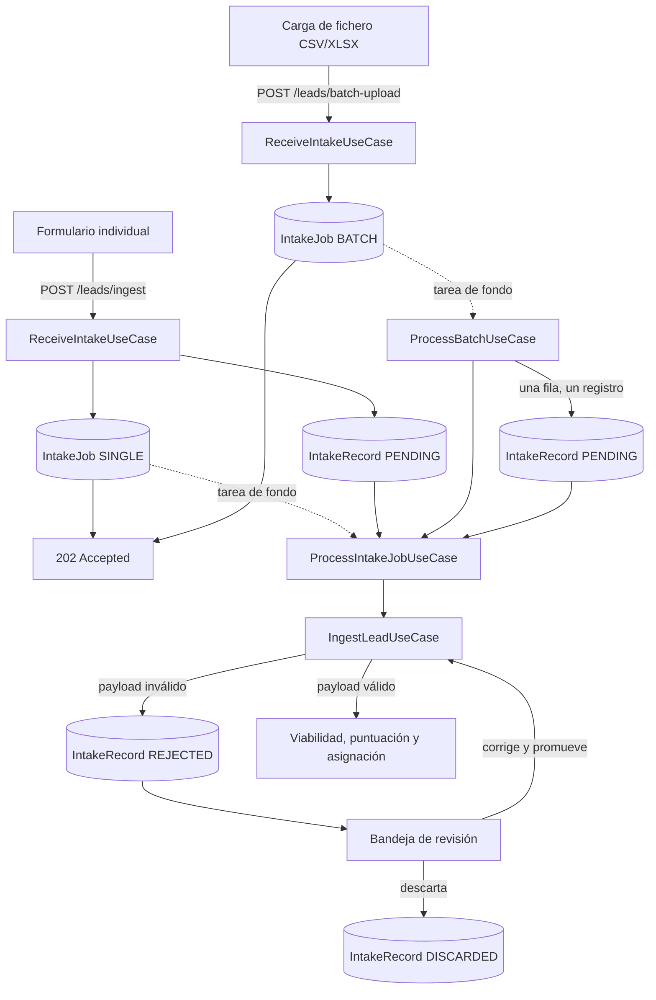
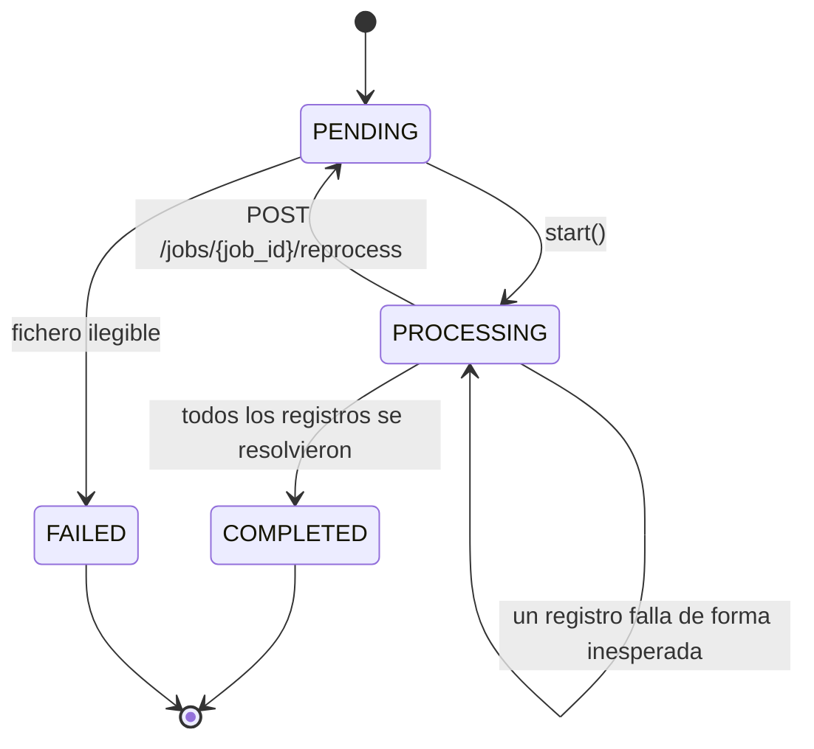

# Ingesta

Recibe los leads por las vías de entrada habilitadas para la organización, garantiza que ningún
payload se pierde —se pueda interpretar o no— y lo convierte en un `Lead` en una fase de
procesamiento independiente de la petición HTTP que lo trajo.

## Cómo funciona

La ingesta ocurre en dos fases, en transacciones distintas. La primera responde rápido y sin
interpretar nada: guarda el payload tal cual llegó. La segunda, en segundo plano, es la que intenta
construir un `Lead` a partir de ese payload.

- **Recepción** (`ReceiveIntakeUseCase`): crea un `IntakeJob` y, si la vía es el formulario
  individual, también el `IntakeRecord` con el payload sin tocar. Responde `202 Accepted` con el
  identificador del trabajo antes de intentar interpretar una sola línea.
- **Procesamiento** (`ProcessIntakeJobUseCase`): recorre los `IntakeRecord` en estado `PENDING` de
  un trabajo y entrega cada uno a `IngestLeadUseCase`, que construye el `Lead`, lo hace atravesar
  viabilidad, puntuación y asignación, y marca el registro como `PROMOTED` o `REJECTED`.

### Las tres vías de entrada

Cada organización recibe dos fuentes (`LeadSource`) al darse de alta: una `MANUAL_FORM` para el
formulario individual y otra `FILE_UPLOAD` para la carga de fichero. `ReceiveIntakeUseCase`
resuelve la fuente activa según el tipo de trabajo, así que ninguna de las dos exige configuración
previa. Una tercera vía, `WEBHOOK`, está declarada en `LeadSourceKind` pero todavía no tiene un
endpoint que la sirva.

La carga de fichero tiene una asimetría respecto al formulario: en la recepción sólo se crea el
`IntakeJob`, sin registros. `ProcessBatchUseCase` parsea el fichero en segundo plano y sólo entonces
materializa un `IntakeRecord` por fila, antes de entregarlos al mismo `ProcessIntakeJobUseCase` que
procesa la vía individual. El fichero en sí no se persiste: lo que sobrevive es una fila por
registro.

### Reproceso de un trabajo interrumpido

Un trabajo que falla a mitad de proceso —una excepción no prevista al interpretar un registro— no se
marca `FAILED`: se queda en `PROCESSING`, porque los registros que sí se resolvieron ya tienen su
resultado y sólo faltan los que quedaron `PENDING`. `POST /jobs/{job_id}/reprocess` reinicia los
contadores y relanza el procesamiento, que vuelve a leer únicamente los registros todavía `PENDING`.
Sólo un fichero ilegible marca el trabajo `FAILED` de forma directa, porque en ese caso no llegó a
generar ni una fila.

!!! note
    Cada ejecución procesa como máximo 10 000 registros pendientes. Un trabajo más grande que eso
    necesita más de un reproceso para vaciarse: el resto se queda `PENDING` a la espera.

### La bandeja de revisión

`GET /records` lista los `IntakeRecord` de la organización, filtrables por estado. Un registro
`REJECTED` puede corregirse y reintentarse (`POST /records/{record_id}/promote`, que ejecuta el
mismo `IngestLeadUseCase` con un payload corregido) o descartarse
(`POST /records/{record_id}/discard`). Ninguna de las dos operaciones borra el registro: la bandeja
es el historial completo de lo que entró, se haya podido trabajar o no. El contrato de cada endpoint
está en la [referencia de la API](../desarrollo/api-referencia.md).

## Piezas

| Pieza | Responsabilidad |
|---|---|
| `IntakeJob` | Agrega una operación de ingesta —una unidad o un fichero— y su progreso |
| `IntakeRecord` | Guarda el payload tal cual llegó, y si se promovió, rechazó o descartó |
| `ReceiveIntakeUseCase` | Persiste el trabajo y responde antes de interpretar el payload |
| `ProcessIntakeJobUseCase` | Recorre los registros `PENDING` de un trabajo y los interpreta |
| `IngestLeadUseCase` | Interpreta el payload: viabilidad, puntuación y asignación |
| `ProcessBatchUseCase` | Parsea el fichero subido y materializa un `IntakeRecord` por fila |
| `intake_router.py` | Endpoints de ingesta, bandeja de revisión y reproceso |

## Decisiones que lo explican

- [ADR-0009](../decisiones/0009-registrar-antes-de-interpretar.md): por qué se guarda antes de leer.
- [ADR-0010](../decisiones/0010-recepcion-y-procesamiento-separados.md): por qué hay dos fases.
- [ADR-0008](../decisiones/0008-correo-opcional.md): por qué un lead puede no traer correo.

## Dónde vive

- `backend/src/domain/entities/intake_job.py`
- `backend/src/domain/entities/intake_record.py`
- `backend/src/application/use_cases/receive_intake_use_case.py`
- `backend/src/application/use_cases/process_intake_job_use_case.py`
- `backend/src/application/use_cases/ingest_lead_use_case.py`
- `backend/src/application/use_cases/process_batch_use_case.py`
- `backend/src/application/use_cases/intake_job_use_cases.py`
- `backend/src/application/use_cases/intake_record_use_cases.py`
- `backend/src/infrastructure/adapters/input/api/intake_router.py`
