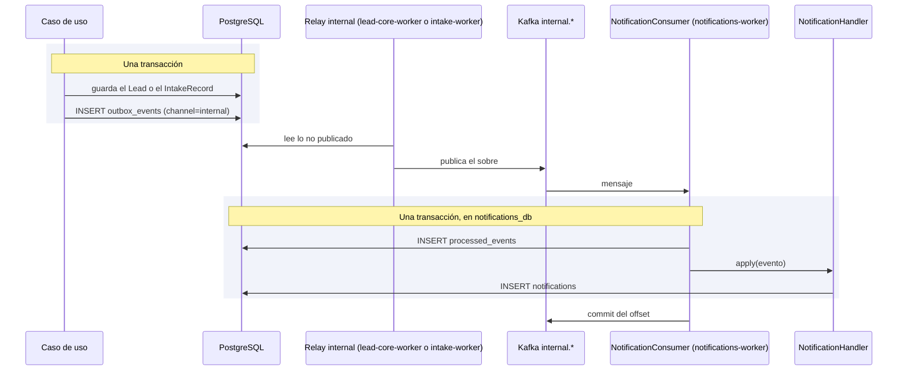

# Notificaciones

Convierte los eventos que publican los casos de uso en avisos internos para quien debe actuar, y
expone su listado y el contador de no leídas de cada usuario.

Es un **servicio propio**, `services/notifications/`, con su base `notifications_db` y su rol
`notifications_svc`: ningún otro servicio lee ni escribe sus tablas. lead-core sólo
*publica* los eventos; no los consume ni sirve `/notifications`. Corre en dos procesos de la misma
imagen: `notifications` (API, aplica sus migraciones al arrancar) y `notifications-worker` (los tres
consumidores).

## Cómo funciona

Un caso de uso —`AdmitLeadUseCase` de lead-core, `IngestLeadUseCase` de intake, `AssignLeadUseCase`— registra el evento en el outbox, canal
`internal`, **dentro de su propia transacción** ([ADR-0033](../decisiones/0033-eventos-internos-en-kafka.md)):
si el lead se guarda, el aviso existe, y si se deshace, el aviso se deshace con él. Ya no hay un
paso posterior que pueda perderse si el proceso cae entre el commit y el aviso.

`lead-core-worker` entrega las filas de lead-core a `internal.lead-core.events` e `intake-worker` las de
intake (`IntakeRejected`) a `internal.intake.events`, y
`notifications-worker` la lee con dos consumidores, uno por grupo. `NotificationConsumer` abre **una** unidad de trabajo por
mensaje: marca el evento en `processed_events` y, sólo si es nuevo, deja que `NotificationHandler`
escriba las notificaciones en esa misma transacción. Un fallo deshace ambas cosas; un duplicado
encuentra la marca y no hace nada. El aviso es **eventualmente consistente**: aparece tras el
relay y el consumidor, no en el mismo instante que la acción que lo origina.

Los grupos son tres:

| Grupo | Topic | Qué hace |
|---|---|---|
| `notifications.lead-events` | `internal.lead-core.events` | Avisos de asignación, reasignación y lead sin asignar |
| `notifications.intake-events` | `internal.intake.events` | Avisos de registros rechazados |
| `notifications.members` | `internal.identity.agents` | Mantiene la proyección `members` |

Cada grupo tiene su DLQ `internal.dlq.<grupo>` (1 partición, 7 días), que **declara el propio
servicio**, no el que produce. Un mensaje que falla tres veces se aparca en ella y el offset avanza; el
detalle del consumidor está en
[Kafka](../eventos/kafka.md#el-consumidor-de-notificaciones) y cómo recuperarlo en
[Operar la mensajería](../eventos/operacion.md#las-colas-muertas-y-como-reinyectar-un-mensaje).

### Qué evento avisa a quién

| Evento | Se registra cuando | Destinatario |
|---|---|---|
| `LeadAssigned` | Un lead se asigna, automática o manualmente | El asesor asignado |
| `LeadReassigned` | Un gestor reasigna un lead ya asignado | El nuevo asesor |
| `LeadLeftUnassigned` | Ninguna regla de asignación produjo un asesor | Los gestores activos |
| `IntakeRejected` | Un payload no se pudo interpretar | Los gestores activos |

Cuando el destinatario son "los gestores", `NotificationHandler` los pide a la proyección `members`
(`active_manager_ids`: rol `MANAGER` activo del tenant): no hay una tabla de suscripciones, la regla
vive en el manejador. En lead-core, `domain/events/lead_events.py` define además los dos eventos del canal
de salida —`LeadProcessedEvent` y `LeadDisqualified`, ver [ADR-0023](../decisiones/0023-eventos-del-canal-de-salida.md)—,
que no pasan por `NotificationHandler`: describen lo que se publica hacia fuera, por el canal
`product` del outbox.

### La proyección `members`

Notifications no consulta a identity al avisar. Guarda en `members` una copia mínima de cada agente con
organización (`agent_id`, `tenant_id`, `role`, `is_active`, `version`), alimentada por el grupo
`notifications.members` desde el topic compactado `internal.identity.agents` (evento `AgentState`).

- El *upsert* se condiciona por `version` **en SQL** (`WHERE members.version < EXCLUDED.version`):
  un estado repetido, desordenado o escrito por dos consumidores a la vez no deshace un cambio más
  reciente. Por eso este consumidor no usa `processed_events`.
- El administrador de plataforma no tiene tenant y no entra en la proyección.
- La mantiene sólo el topic `internal.identity.agents`.

**Carrera aceptada.** `members` y los eventos de lead viajan por grupos distintos, sin orden entre
ellos. Si un lead queda sin asignar en un tenant cuyo manager todavía no está en `members` (un tenant
recién creado, por ejemplo), `LeadLeftUnassigned` no encuentra destinatarios y no genera aviso; el
evento se marca como procesado y no se reintenta. Se acepta por ser una ventana de segundos tras
crear el tenant; `verify_ms_f2` espera a que el manager llegue a `members` antes de provocarlo.

### El contador de no leídas

`GetNotificationsUseCase` devuelve, junto a la página pedida, el total de no leídas del destinatario
completo (`unread_count`), calculado aparte de la página. La campana de la interfaz muestra siempre
ese número, que no cambia si el usuario pagina el listado.

Los eventos que alimentan este módulo se registran desde [Ingesta](ingesta.md) —cuando un payload se
rechaza o un lead queda sin asignar automáticamente— y desde la asignación manual que hace un
gestor sobre un lead ya existente.

## Piezas

| Pieza | Responsabilidad |
|---|---|
| `NotificationConsumer` | Un mensaje de un grupo de avisos, como mucho una vez: la marca en `processed_events` y las notificaciones comparten transacción |
| `MemberConsumer` | Aplica cada `AgentState` a `members` sin `processed_events`: la puerta por `version` lo hace idempotente |
| `NotificationHandler` | Traduce cada evento en una `Notification` para el destinatario correcto, en la unidad de trabajo que recibe |
| `Notification`, `Member` | Aviso persistido (destinatario, tipo, mensaje y marca de lectura) y fila de la proyección |
| `groups.py` | Qué topic lee cada grupo y las DLQ que el servicio declara |
| `notifications/router.py` | Listado, marcado individual y marcado masivo de avisos propios; el principal sale del JWT interno |

Los eventos (`LeadAssigned`, `LeadReassigned`, `LeadLeftUnassigned`, `IntakeRejected`, `AgentState`) los
publican lead-core (`lead-core-worker`), identity (`identity-worker`) e intake (`intake-worker`); el servicio sólo conoce su sobre y su `payload`.

## Decisiones que lo explican

- [ADR-0015](../decisiones/0015-notificaciones-por-sondeo.md): por qué no hay push en tiempo real.
- [ADR-0016](../decisiones/0016-solo-eventos-con-consumidor.md): por qué sólo existen estos eventos.
- [ADR-0017](../decisiones/0017-retirada-de-webhook-dispatched.md): el evento que se retiró.
- [ADR-0033](../decisiones/0033-eventos-internos-en-kafka.md): por qué los avisos viajan por Kafka y no en memoria.

## Dónde vive

- `services/notifications/src/domain/` — `Notification`, `Member`, `NotificationKind` y la política de autorización
- `services/notifications/src/application/use_cases/` — listar, marcar leídas, `NotificationHandler` y la proyección
- `services/notifications/src/infrastructure/adapters/input/api/notifications/` — router y esquemas
- `services/notifications/src/infrastructure/adapters/input/consumers/` — consumidores y `groups.py`
- `services/notifications/src/infrastructure/adapters/output/persistence/` — repositorios y unidad de trabajo
- `services/notifications/src/infrastructure/worker/` — el proceso de `notifications-worker`
- `services/notifications/migrations/` — `notifications`, `members` y `processed_events`
- `services/lead-core/src/domain/events/` y `services/lead-core/src/infrastructure/adapters/output/events/internal_topics.py` — los eventos que produce lead-core
- `services/intake/src/domain/events/` y `services/intake/src/infrastructure/adapters/output/events/internal_topics.py` — `IntakeRejected`
