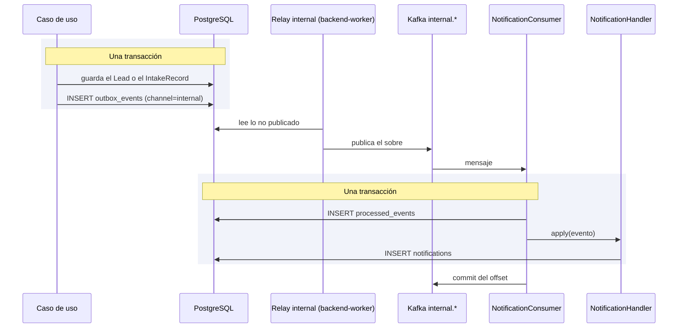

# Notificaciones

Convierte los eventos que publican los casos de uso en avisos internos para quien debe actuar, y
expone su listado y el contador de no leídas de cada usuario.

## Cómo funciona

Un caso de uso —`IngestLeadUseCase`, `AssignLeadUseCase`— registra el evento en el outbox, canal
`internal`, **dentro de su propia transacción** ([ADR-0033](../decisiones/0033-eventos-internos-en-kafka.md)):
si el lead se guarda, el aviso existe, y si se deshace, el aviso se deshace con él. Ya no hay un
paso posterior que pueda perderse si el proceso cae entre el commit y el aviso.

`backend-worker` entrega esa fila a Kafka (`internal.lead-core.events` o `internal.intake.events`) y
dos consumidores —uno por grupo— la leen. `NotificationConsumer` abre **una** unidad de trabajo por
mensaje: marca el evento en `processed_events` y, sólo si es nuevo, deja que `NotificationHandler`
escriba las notificaciones en esa misma transacción. Un fallo deshace ambas cosas; un duplicado
encuentra la marca y no hace nada. El aviso es **eventualmente consistente**: aparece tras el
relay y el consumidor, no en el mismo instante que la acción que lo origina.

Los dos grupos son `notifications.lead-events` (sobre `internal.lead-core.events`) y
`notifications.intake-events` (sobre `internal.intake.events`). Un mensaje que falla tres veces se
aparca en `internal.dlq.<grupo>` y el offset avanza; el detalle del consumidor está en
[Kafka](../eventos/kafka.md#el-consumidor-de-notificaciones) y cómo recuperarlo en
[Operar la mensajería](../eventos/operacion.md#las-colas-muertas-y-como-reinyectar-un-mensaje).

### Qué evento avisa a quién

| Evento | Se registra cuando | Destinatario |
|---|---|---|
| `LeadAssigned` | Un lead se asigna, automática o manualmente | El asesor asignado |
| `LeadReassigned` | Un gestor reasigna un lead ya asignado | El nuevo asesor |
| `LeadLeftUnassigned` | Ninguna regla de asignación produjo un asesor | Los gestores activos |
| `IntakeRejected` | Un payload no se pudo interpretar | Los gestores activos |

Cuando el destinatario son "los gestores", `NotificationHandler` resuelve la lista con
`agents.list_by_tenant` y filtra por rol `MANAGER` activo: no hay una tabla de suscripciones, la
regla vive en el manejador. `domain/events/lead_events.py` define además los dos eventos del canal
de salida —`LeadProcessedEvent` y `LeadDisqualified`, ver [ADR-0023](../decisiones/0023-eventos-del-canal-de-salida.md)—,
que no pasan por `NotificationHandler`: describen lo que se publica hacia fuera, por el canal
`product` del outbox.

### El contador de no leídas

`GetNotificationsUseCase` devuelve, junto a la página pedida, el total de no leídas del destinatario
completo (`unread_count`), calculado aparte de la página. La campana de la interfaz muestra siempre
ese número, que no cambia si el usuario pagina el listado.

Los eventos que alimentan este módulo se registran desde [Ingesta](ingesta.md) —cuando un payload se
rechaza o un lead queda sin asignar automáticamente— y desde la asignación manual que hace un
gestor sobre un lead ya existente.

## Piezas

| Pieza | Responsabilidad |
|---|---|
| `DomainEvent`, `InternalEvent` | Clases base: identificador, momento y, en `InternalEvent`, la clave de partición |
| `notification_events.py` | Los cuatro eventos que consume `NotificationHandler` |
| `NotificationConsumer` | Un mensaje de un grupo, como mucho una vez: la marca en `processed_events` y las notificaciones comparten transacción |
| `NotificationHandler` | Traduce cada evento en una `Notification` para el destinatario correcto, en la unidad de trabajo que recibe |
| `Notification` | Aviso persistido: destinatario, tipo, mensaje y marca de lectura |
| `notification_router.py` | Listado, marcado individual y marcado masivo de avisos propios |

## Decisiones que lo explican

- [ADR-0015](../decisiones/0015-notificaciones-por-sondeo.md): por qué no hay push en tiempo real.
- [ADR-0016](../decisiones/0016-solo-eventos-con-consumidor.md): por qué sólo existen estos eventos.
- [ADR-0017](../decisiones/0017-retirada-de-webhook-dispatched.md): el evento que se retiró.
- [ADR-0033](../decisiones/0033-eventos-internos-en-kafka.md): por qué los avisos viajan por Kafka y no en memoria.

## Dónde vive

- `backend/src/domain/events/domain_event.py`
- `backend/src/domain/events/internal_event.py`
- `backend/src/domain/events/notification_events.py`
- `backend/src/application/handlers/notification_handler.py`
- `backend/src/infrastructure/adapters/input/events/notification_consumer.py`
- `backend/src/infrastructure/adapters/output/events/internal_topics.py`
- `backend/src/infrastructure/worker.py`
- `backend/src/infrastructure/adapters/input/api/notification_router.py`
