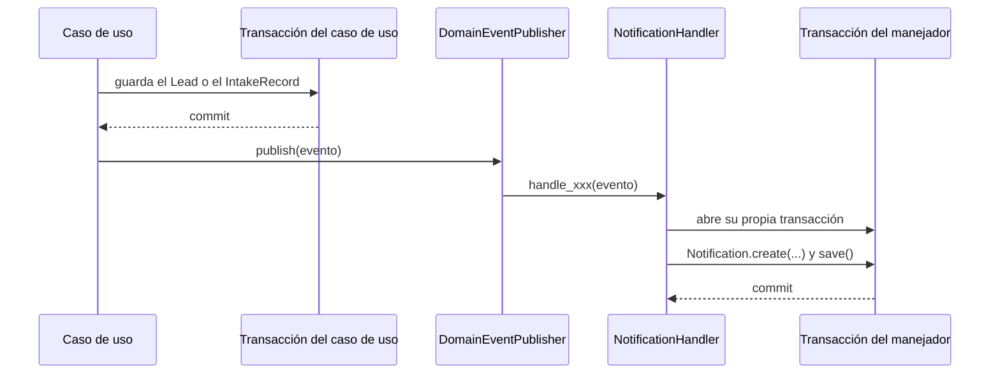

# Notificaciones

Convierte los eventos que publican los casos de uso en avisos internos para quien debe actuar, y
expone su listado y el contador de no leídas de cada usuario.

## Cómo funciona

Un caso de uso —`IngestLeadUseCase`, `AssignLeadUseCase`— construye y publica un evento de dominio
después de que su propia transacción confirma, nunca dentro de ella: un aviso que falle no puede
deshacer un lead que ya se guardó. `InMemoryEventPublisher` entrega el evento a cada manejador
suscrito y aísla sus fallos: si un manejador lanza una excepción, el resto se ejecuta igual y el
fallo sólo queda en el log.

`NotificationHandler` es uno de esos manejadores. Abre su **propia** unidad de trabajo por evento,
distinta de la que acaba de confirmar: es la misma razón otra vez, un aviso no debe compartir
transacción con el hecho que lo origina.

### Qué evento avisa a quién

| Evento | Se publica cuando | Destinatario |
|---|---|---|
| `LeadAssigned` | Un lead se asigna, automática o manualmente | El asesor asignado |
| `LeadReassigned` | Un gestor reasigna un lead ya asignado | El nuevo asesor |
| `LeadLeftUnassigned` | Ninguna regla de asignación produjo un asesor | Los gestores activos |
| `IntakeRejected` | Un payload no se pudo interpretar | Los gestores activos |

Cuando el destinatario son "los gestores", `NotificationHandler` resuelve la lista con
`agents.list_by_tenant` y filtra por rol `MANAGER` activo: no hay una tabla de suscripciones, la
regla vive en el manejador. `domain/events/lead_events.py` define además los dos eventos del canal
de salida —`LeadProcessedEvent` y `LeadDisqualified`, ver [ADR-0023](../decisiones/0023-eventos-del-canal-de-salida.md)—,
que no pasan por `NotificationHandler`: describen lo que se publica hacia fuera, y de ellos hoy sólo
`LeadProcessedEvent` tiene consumidor, `WebhookEventHandler`.

### El contador de no leídas

`GetNotificationsUseCase` devuelve, junto a la página pedida, el total de no leídas del destinatario
completo (`unread_count`), calculado aparte de la página. La campana de la interfaz muestra siempre
ese número, que no cambia si el usuario pagina el listado.

Los eventos que alimentan este módulo se publican desde [Ingesta](ingesta.md) —cuando un payload se
rechaza o un lead queda sin asignar automáticamente— y desde la asignación manual que hace un
gestor sobre un lead ya existente.

## Piezas

| Pieza | Responsabilidad |
|---|---|
| `DomainEvent` | Clase base: identificador y momento en que ocurrió cada evento |
| `notification_events.py` | Los cuatro eventos que consume `NotificationHandler` |
| `NotificationHandler` | Traduce cada evento en una `Notification` para el destinatario correcto |
| `Notification` | Aviso persistido: destinatario, tipo, mensaje y marca de lectura |
| `notification_router.py` | Listado, marcado individual y marcado masivo de avisos propios |

## Decisiones que lo explican

- [ADR-0015](../decisiones/0015-notificaciones-por-sondeo.md): por qué no hay push en tiempo real.
- [ADR-0016](../decisiones/0016-solo-eventos-con-consumidor.md): por qué sólo existen estos eventos.
- [ADR-0017](../decisiones/0017-retirada-de-webhook-dispatched.md): el evento que se retiró.

## Dónde vive

- `backend/src/domain/events/domain_event.py`
- `backend/src/domain/events/lead_events.py`
- `backend/src/domain/events/notification_events.py`
- `backend/src/application/handlers/notification_handler.py`
- `backend/src/infrastructure/adapters/input/api/notification_router.py`
