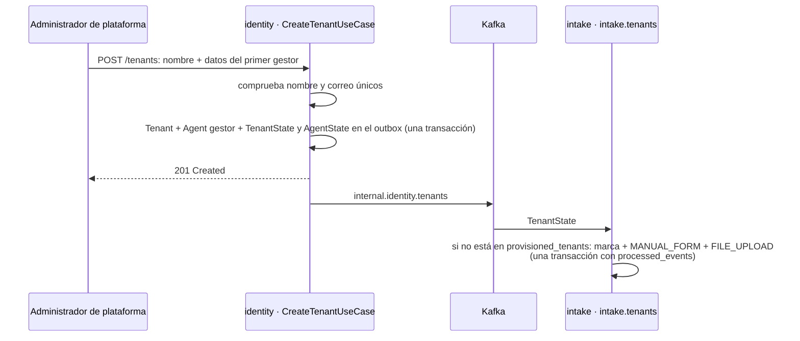

# Organizaciones

Administra las organizaciones clientes, su alta con el primer gestor, y el catálogo de asesores y
grupos de venta sobre el que operan las reglas y la asignación.

Desde F3 vive repartido entre dos servicios, cada uno con lo suyo
([06](../microservices/06-plan-de-desacople.md#f3-identity)): **identity** es dueño de las
organizaciones y de las cuentas de los agentes; **lead-core** (el backend), de los grupos de venta y
de su copia de los asesores, `advisors`, que es lo que enruta.

## Cómo funciona

`Tenant` es la organización cliente: nombre, un `slug` derivado del nombre (`slugify`, que pliega
acentos para que "Solución" y "Solucion" no produzcan dos organizaciones distintas) y un estado
activo. Sólo el rol `ADMIN` —el plano de plataforma— puede crear o listar organizaciones; todo lo
demás en este módulo pertenece al plano de organización y exige un `MANAGER` de esa organización.

### El alta: una transacción y un evento

`CreateTenantUseCase` (identity) guarda dos cosas o ninguna: el `Tenant` y el primer `Agent` con rol
`MANAGER`, junto con el `TenantState` y el `AgentState` que los anuncian, en el outbox de la misma
transacción. Antes de escribir comprueba que el nombre —por su `slug`— y el correo del gestor sean
únicos. Una organización sin gestor no es un estado intermedio útil: nadie podría entrar a
administrarla.

Las dos `LeadSource` por defecto (`MANUAL_FORM` y `FILE_UPLOAD`, ver [Ingesta](ingesta.md)) ya no
nacen en esa transacción, porque son de otro servicio. Las crea intake al recibir el primer
`TenantState` de la organización, con el consumidor `intake.tenants` de `intake-worker` (hasta F4,
código de intake dentro del monolito). `provisioned_tenants` marca que ya se crearon una vez: releer el topic
compactado no vuelve a crear una fuente que el gestor borró después.

Consecuencia aceptada: durante esos segundos la organización existe pero no tiene fuentes, y una
ingesta recibiría `SOURCE_NOT_FOUND`.

`UpdateTenantUseCase` permite renombrar y activar o desactivar. Desactivar una organización no borra
nada, pero apaga a todos sus asesores (`deactivate_all_by_tenant`) y publica el estado de cada uno:
una organización suspendida no puede volver a autenticarse hasta que un `ADMIN` la reactive, y la
introspección lo comprueba aunque se reactive a un asesor suelto.

### Asesores y grupos

Dentro de su propia organización, un `MANAGER` da de alta, actualiza y desactiva `Agent` en
identity. Nunca se borran: un lead ya asignado necesita seguir apuntando a un asesor válido, así que
la baja sólo apaga `is_active`. Cambiar el `role` al crear está sujeto a
`AuthorizationPolicy.can_create_agent_with_role`, que nunca permite crear un segundo `ADMIN`. El
agente de identity **no tiene grupo**.

lead-core guarda su propia copia de cada agente con organización en la tabla `advisors`: nombre,
rol, estado y `version`, que escribe sólo el consumidor `lead-core.advisors` a partir de
`AgentState`, más `group_id`, que es suyo y sólo cambia `PATCH /advisors/{agent_id}`
([La carrera de proyección](../microservices/02-servicios-y-datos.md#la-carrera-de-proyeccion)). Un
asesor desactivado deja de estar entre los candidatos (`advisors.list_available`) en cuanto su estado
llega a lead-core, en segundos.

`SalesGroup` agrupa asesores bajo una misma política de reparto: `default_strategy` para cuando la
regla de asignación no impone la suya, y `capacity_per_agent` como techo opcional por asesor. El
nombre es único dentro de la organización. Borrar un grupo no borra a sus asesores: la clave foránea
`advisors.group_id → sales_groups` (`ON DELETE SET NULL`) los deja sin grupo, así que ninguno queda
apuntando a un grupo inexistente.

El esquema completo de estas tablas está en [Modelo de datos](../arquitectura/modelo-de-datos.md).

## Piezas

| Pieza | Servicio | Responsabilidad |
|---|---|---|
| `Tenant` | identity | Organización cliente: nombre, `slug` estable, estado activo |
| `CreateTenantUseCase` | identity | Alta de la organización y su primer gestor |
| `UpdateTenantUseCase` | identity | Renombrar o activar/desactivar; desactivar apaga también a sus asesores |
| `api/tenants/router.py` | identity | Endpoints de plataforma, protegidos por `require_platform_admin` |
| `Agent` | identity | Cuenta del sistema: rol, organización, credencial |
| `api/agents/router.py` | identity | Alta y gestión de agentes, con la regla de bootstrap del primer `ADMIN` |
| `ProvisionTenantSourcesUseCase` | lead-core | Las dos fuentes por defecto, una vez por organización |
| `Advisor`, `advisors` | lead-core | Copia del agente para enrutar, más su `group_id` |
| `AdvisorDirectory` | lead-core | Resuelve un asesor, pidiéndolo a identity si la copia aún no lo tiene |
| `api/advisors/advisors_router.py` | lead-core | `GET /advisors` y `PATCH /advisors/{agent_id}` |
| `SalesGroup` | lead-core | Grupo de asesores: estrategia por defecto y capacidad por asesor |
| `sales_group_router.py` | lead-core | CRUD de grupos de venta dentro de la propia organización |

## Decisiones que lo explican

- [ADR-0003](../decisiones/0003-dos-planos-disjuntos.md): plataforma y organización, separadas.
- [ADR-0004](../decisiones/0004-organizacion-desde-el-token.md): nunca lo manda el cliente.
- [ADR-0036](../decisiones/0036-cambios-de-contrato-publico.md): por qué el grupo pasó a lead-core.

## Dónde vive

- `services/identity/src/domain/tenants/` y `services/identity/src/domain/agents/`
- `services/identity/src/application/use_cases/tenants/` y `services/identity/src/application/use_cases/agents/`
- `services/identity/src/infrastructure/adapters/input/api/tenants/` y `.../api/agents/`
- `backend/src/domain/advisors/advisor.py` y `backend/src/application/use_cases/advisors/`
- `backend/src/infrastructure/adapters/input/consumers/advisor_consumer.py`
- `services/intake/src/infrastructure/adapters/input/consumers/tenant_consumer.py` y `services/intake/src/application/use_cases/tenants/provision_tenant_sources.py` — las fuentes por defecto
- `backend/src/infrastructure/adapters/output/persistence/advisors/` — repositorio y `HydratingAdvisorDirectory`
- `backend/src/domain/entities/sales_group.py`
- `backend/src/application/use_cases/sales_group_use_cases.py`
- `backend/src/infrastructure/adapters/input/api/sales_group_router.py`
