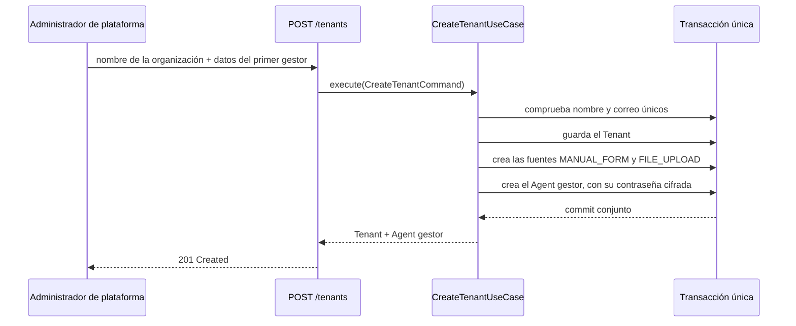

# Organizaciones

Administra las organizaciones clientes, su alta con el primer gestor, y el catálogo de asesores y
grupos de venta sobre el que operan las reglas y la asignación.

## Cómo funciona

`Tenant` es la organización cliente: nombre, un `slug` derivado del nombre (`slugify`, que pliega
acentos para que "Solución" y "Solucion" no produzcan dos organizaciones distintas) y un estado
activo. Sólo el rol `ADMIN` —el plano de plataforma— puede crear o listar organizaciones; todo lo
demás en este módulo pertenece al plano de organización y exige un `MANAGER` de esa organización.

### El alta, en una transacción

`CreateTenantUseCase` guarda tres cosas o ninguna: el `Tenant`, sus dos `LeadSource` por defecto
(`MANUAL_FORM` y `FILE_UPLOAD`, ver [Ingesta](ingesta.md)) y el primer `Agent` con rol `MANAGER`.
Antes de escribir comprueba que el nombre —por su `slug`— y el correo del gestor sean únicos. Una
organización sin gestor no es un estado intermedio útil: nadie podría entrar a administrarla.

`UpdateTenantUseCase` permite renombrar y activar o desactivar. Desactivar una organización no borra
nada, pero apaga a todos sus asesores (`deactivate_all_by_tenant`): una organización suspendida no
puede volver a autenticarse hasta que un `ADMIN` la reactive.

### Asesores y grupos

Dentro de su propia organización, un `MANAGER` da de alta, actualiza y desactiva `Agent`. Nunca se
borran: un lead ya asignado necesita seguir apuntando a un asesor válido, así que la baja sólo apaga
`is_active`, y `get_available_agents` deja de devolverlo. Cambiar el `role` al crear está sujeto a
`AuthorizationPolicy.can_create_agent_with_role`, que nunca permite crear un segundo `ADMIN`.

`SalesGroup` agrupa asesores bajo una misma política de reparto: `default_strategy` para cuando la
regla de asignación no impone la suya, y `capacity_per_agent` como techo opcional por asesor. El
nombre es único dentro de la organización. Borrar un grupo no borra a sus asesores: primero les
quita el `group_id` y sólo entonces borra el grupo, así que ninguno queda apuntando a un grupo
inexistente.

El esquema completo de estas tablas está en [Modelo de datos](../arquitectura/modelo-de-datos.md).

## Piezas

| Pieza | Responsabilidad |
|---|---|
| `Tenant` | Organización cliente: nombre, `slug` estable, estado activo |
| `CreateTenantUseCase` | Alta de la organización, sus fuentes por defecto y su primer gestor |
| `UpdateTenantUseCase` | Renombrar o activar/desactivar; desactivar apaga también a sus asesores |
| `tenant_router.py` | Endpoints de plataforma, protegidos por `require_platform_admin` |
| `Agent` | Usuario del sistema: rol, organización, grupo, credencial |
| `agent_router.py` | Alta y gestión de asesores, con la regla de bootstrap del primer `ADMIN` |
| `SalesGroup` | Grupo de asesores: estrategia por defecto y capacidad por asesor |
| `sales_group_router.py` | CRUD de grupos de venta dentro de la propia organización |

## Decisiones que lo explican

- [ADR-0003](../decisiones/0003-dos-planos-disjuntos.md): plataforma y organización, separadas.
- [ADR-0004](../decisiones/0004-organizacion-desde-el-token.md): nunca lo manda el cliente.

## Dónde vive

- `backend/src/domain/entities/tenant.py`
- `backend/src/application/use_cases/tenant_use_cases.py`
- `backend/src/infrastructure/adapters/input/api/tenant_router.py`
- `backend/src/domain/entities/agent.py`
- `backend/src/application/use_cases/agent_use_cases.py`
- `backend/src/infrastructure/adapters/input/api/agent_router.py`
- `backend/src/domain/entities/sales_group.py`
- `backend/src/application/use_cases/sales_group_use_cases.py`
- `backend/src/infrastructure/adapters/input/api/sales_group_router.py`
