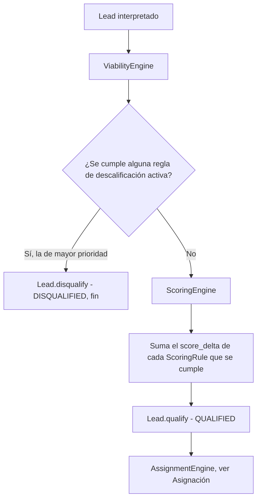

# Reglas y motores

Decide si un lead se puede trabajar y cuánto vale, evaluando las reglas configurables de la
organización sobre una gramática de condiciones común a las tres familias de reglas del sistema.

## Cómo funciona

### `Criterion`, la unidad compartida

Una condición es siempre la misma forma: un campo, un operador y un valor de referencia.

```
Criterion(field: str, operator: Operator, value: Any).matches(lead) -> bool
```

La regla de descalificación, la de puntuación y la de asignación construyen sus condiciones con
esta misma pieza. `all_match(conditions, lead)` exige que se cumplan **todas** las condiciones de
una regla (Y); no existe un operador OR. Una alternativa —"esto o aquello"— se escribe como dos
reglas separadas, cada una con sus propias condiciones.

### Operadores disponibles

| Operador | Semántica |
|---|---|
| `EQUALS` | Igualdad; compara por `Decimal` si ambos lados son numéricos |
| `NOT_EQUALS` | Negación de `EQUALS`, con la misma coerción numérica |
| `GREATER_THAN` / `LESS_THAN` | Comparación numérica; si algún lado no lo es, no se cumple |
| `CONTAINS` | Subcadena si el campo es texto; pertenencia si es lista, tupla o diccionario |
| `IN` | Pertenencia a una lista; el valor de la regla debe ser lista o tupla |
| `IS_EMPTY` | El campo falta, es nulo, cadena vacía o sólo espacios |
| `IS_NOT_EMPTY` | Negación de `IS_EMPTY` |

`IS_EMPTY` e `IS_NOT_EMPTY` se resuelven antes que el resto: un campo ausente cuenta como vacío. El
resto de operadores trata la ausencia como un caso aparte —ni verdadero ni el resultado normal de
comparar contra `None`—, así que un campo que falta sólo satisface `NOT_EQUALS`. Contar los
espacios en blanco como vacío no es un detalle técnico: una columna de CSV sin rellenar llega como
espacios, y una regla que a ojo debería cumplirse y no lo hace es indistinguible de una regla rota.

### La lista blanca de campos evaluables

`Criterion.create` rechaza cualquier campo que no esté en `EVALUABLE_FIELDS` —`first_name`,
`last_name`, `email`, `company`, `industry`, `budget`, `phone`, `score`— o que no empiece por
`custom_attributes.`. Es una frontera de seguridad, no una comodidad: por dentro, `Criterion` lee el
campo con `getattr(lead, field)`, así que sin la lista blanca una regla podría apuntar a cualquier
atributo del agregado —el identificador, el asesor asignado, el motivo de descarte— en lugar de
limitarse al vocabulario de negocio que un gestor puede razonar.

### Las tres familias

| Familia | Pregunta | Motor | Si se cumple |
|---|---|---|---|
| `DisqualificationRule` | ¿Se puede trabajar? | `ViabilityEngine` | `DISQUALIFIED`, fin |
| `ScoringRule` | ¿Cuánto vale? | `ScoringEngine` | Suma `score_delta` al total |
| `AssignmentRule` | ¿Quién lo atiende? | `AssignmentEngine` | Ver [Asignación](asignacion.md) |

`DisqualificationRule` exige al menos una condición: una regla sin condiciones se cumpliría
siempre y descalificaría a la organización entera. `ViabilityEngine` evalúa las reglas activas
ordenadas por prioridad descendente y devuelve la primera que se cumple; el lead se queda con el
nombre de esa regla como motivo. `ScoringEngine` no se detiene en la primera: acumula el
`score_delta` de cada `ScoringRule` que se cumple y devuelve el desglose completo
(`ScoreBreakdown`), que el lead conserva para poder explicarse aunque las reglas que lo produjeron
cambien después.



## Piezas

| Pieza | Responsabilidad |
|---|---|
| `Criterion` | Condición atómica: campo, operador, valor. Unidad compartida por las tres familias |
| `EVALUABLE_FIELDS` | Lista blanca de campos del lead accesibles desde una regla |
| `DisqualificationRule` | Regla de viabilidad: todas sus condiciones deben cumplirse |
| `ScoringRule` | Regla de puntuación: suma o resta `score_delta` si sus condiciones se cumplen |
| `AssignmentRule` | Regla de asignación: banda de puntuación más condiciones. Ver Asignación |
| `ViabilityEngine` | Evalúa las reglas activas y devuelve la primera que se cumple |
| `ScoringEngine` | Acumula el `score_delta` de las reglas que se cumplen y arma el desglose |

## Decisiones que lo explican

- [ADR-0011](../decisiones/0011-gramatica-de-condiciones.md): por qué existe `Criterion`.
- [ADR-0012](../decisiones/0012-y-dentro-o-entre.md): por qué no hay operador OR.
- [ADR-0013](../decisiones/0013-condiciones-en-jsonb.md): cómo se guardan las condiciones.
- [ADR-0014](../decisiones/0014-retirada-del-umbral-fijo.md): por qué `qualify()` no tiene umbral.

## Dónde vive

- `backend/src/domain/value_objects/criterion.py`
- `backend/src/domain/entities/rule.py`
- `backend/src/domain/entities/disqualification_rule.py`
- `backend/src/domain/services/viability_engine.py`
- `backend/src/domain/services/scoring_engine.py`
