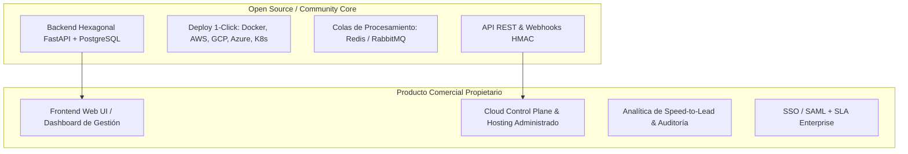

# Estrategia Open-Core (COSS) y Análisis de Viabilidad

---

## 1. Evaluación de Viabilidad de la Visión Planteada

Convertir **Lead Router** en una plataforma **Open-Core** (Backend Open Source / Source-Available + Frontend / Control Plane Propietario Administrado) es una estrategia de gran tendencia en la industria del software B2B, conocida internacionalmente como **Commercial Open Source Software (COSS)**.

Es la estrategia exacta con la que han triunfado empresas como **PostHog** (Analítica), **Cal.com** (Agendamiento), **Supabase** (Bases de datos), **Novu** (Notificaciones), **Strapi** (CMS) y **GitLab**.

### ¿Por qué esta visión es superior a un SaaS cerrado tradicional?

1. **Adopción Orgánica por Desarrolladores (*Dev-Led Growth / PLG*):**
   Competidores como LeanData o Chili Piper gastan millones de dólares en ventas de campo y marketing. Con el backend abierto, los desarrolladores y arquitectos prueban Lead Router localmente en minutos con `docker compose`, lo despliegan en su infraestructura y lo adoptan sin fricción.
2. **Solución a las Barreras de Privacidad y Cumplimiento (GDPR / HIPAA / Regulación Financiera):**
   Muchas empresas (bancos, aseguradoras, salud) se niegan a enviar datos personales de leads a nubes SaaS de terceros. Permitirles ejecutar el backend *on-premise* o en su propia nube (AWS/GCP/Azure) desbloquea clientes a los que la competencia SaaS cerrada no puede acceder.
3. **El Frontend Administrado es la Barrera de Monetización Natural:**
   El 80% de los compradores reales (Directores de Ventas, Equipos de RevOps, Directores de Marketing) **no quieren ni saben gestionar infraestructura**. Quieren una pantalla limpia, lista para usar, con dashboards, gestión de usuarios, asignación gráfica y alertas. Esos usuarios pagarán con gusto la suscripción administrada.

---

## 2. Estrategia de Licenciamiento del Backend: BSL 1.1

Para cumplir la restricción clave: *"Lo pueden integrar para su propio uso, pero NO pueden vender una plataforma de gestión de leads a terceros usando nuestro motor"*, el proyecto adopta la licencia **Business Source License 1.1 (BSL 1.1)**:

### Comparativa de Licencias de Código

| Licencia | ¿Permite uso interno gratis en empresas? | ¿Permite modificar el código? | ¿Impide que un tercero revenda tu backend como un SaaS competitivo? | Ejemplos de uso en la industria |
|---|---|---|---|---|
| **MIT / Apache 2.0** | ✅ Sí | ✅ Sí | ❌ **No** (Cualquiera puede envolverlo y vender un SaaS) | React, FastAPI, Docker |
| **AGPLv3** | ✅ Sí | ✅ Sí | ⚠️ **Parcial** (Obliga a liberar todo el código fuente del sistema que lo envuelva si se ofrece por red) | Grafana, Mastodon |
| **BSL 1.1 (Business Source License)** | ✅ Sí | ✅ Sí | ✅ **SÍ (Protección Total)**. Prohíbe explícitamente la prestación de servicios administrados competitivos a terceros. | **HashiCorp (Terraform)**, **CockroachDB**, **Sentry**, **Redis** |
| **Elastic License 2.0 (ELv2)** | ✅ Sí | ✅ Sí | ✅ **SÍ (Protección Total)**. Prohíbe ofrecer el software como servicio administrado. | **Elasticsearch**, **Kibana** |

### Términos Adoptados en BSL 1.1
* **Lo que permite:** Cualquier persona, startup o corporación puede descargar, autohospedar (*on-premise*, AWS, Azure, GCP), modificar y usar el backend para procesar los leads de su propia empresa de forma **100% gratuita**.
* **Lo que prohíbe:** Ningún competidor o agencia puede tomar el repositorio backend, ponerle una API/UI encima y revenderlo como un "SaaS de Lead Routing" comercial a terceros.
* **Convertible a Open Source:** BSL garantiza que después de un periodo determinado (4 años), esa versión del código pasa automáticamente a ser GPLv3 u Open Source puro.

---

## 3. Detalle Exhaustivo de las Opciones Comerciales

A partir de la arquitectura Open-Core, se estructuran **3 Vías de Monetización Complementarias**:

### Opción 1: Managed Cloud Platform (SaaS Hosted)
* **Cómo Funciona:** Alojas la infraestructura del backend y del frontend en tu propia nube (AWS/GCP). El cliente no instala nada; crea una cuenta en tu web, obtiene su API Key y usa la interfaz web para configurar sus reglas.
* **Público Objetivo:** Startups B2B, Equipos de Ventas, Empresas Mid-Market que prefieren un SaaS listo.
* **Modelo de Facturación:**
  * **Tier Gratis / Developer:** Ingestión de hasta 1,000 leads/mes con retención de 30 días de historial.
  * **Tier Pro ($49 – $99 USD/mes):** Hasta 25,000 leads/mes, webhooks salientes con firma HMAC, alertas por Slack/Email y usuarios ilimitados en el Frontend.
  * **Tier Business ($299 – $499 USD/mes):** Hasta 100,000 leads/mes, soporte multi-equipo, métricas avanzadas de *Speed-to-lead* y SLA de procesamiento < 200ms.

---

### Opción 2: Agencia & Multi-Tenant Management Edition
* **Cómo Funciona:** Las agencias de marketing digital gestionan decenas de clientes (organizaciones). El backend maneja el aislamiento multi-tenant nativo. Les vendes el **Frontend Propietario** configurado en modo **Whitelabel** (con el logo y dominio de la agencia).
* **Público Objetivo:** Agencias de Lead Generation, Consultoras de Performance Marketing, Franquicias.
* **Modelo de Facturación:**
  * **Licencia Agencia Starter ($199 USD/mes):** Permite administrar hasta 5 Organizaciones distintas desde el Frontend.
  * **Licencia Agencia Scale ($499 USD/mes):** Administra hasta 25 Organizaciones con dominio propio (ej. `leads.miagencia.com`) y marca blanca.

---

### Opción 3: Enterprise On-Premise Frontend & Support License
* **Cómo Funciona:** Grandes corporaciones (Bancos, Inmobiliarias, Aseguradoras) despliegan el backend Open Source en sus propios servidores u Orchestradores Kubernetes por políticas de cumplimiento. Sin embargo, necesitan el **Frontend Web avanzado** para sus gerentes comerciales y **SLA de Soporte**.
* **Público Objetivo:** Empresas Enterprise con departamentos de IT exigentes.
* **Modelo de Facturación:**
  * **Licencia Self-Hosted Enterprise ($500 – $2,000+ USD/mes):** Da acceso al paquete compilado del Frontend Propietario para instalación en sus servidores locales, parches de seguridad prioritarios y conectores empresariales (SSO / SAML con Okta/Azure AD).
