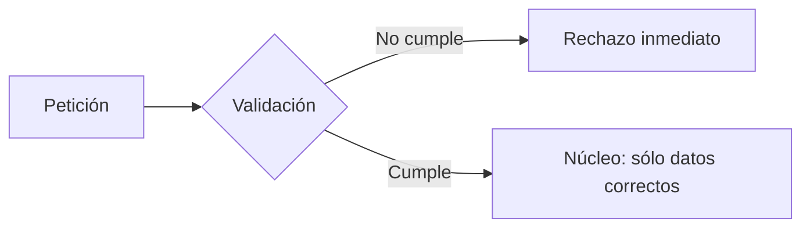
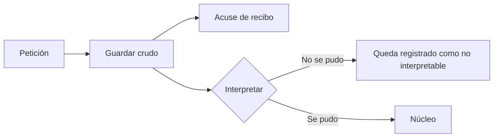
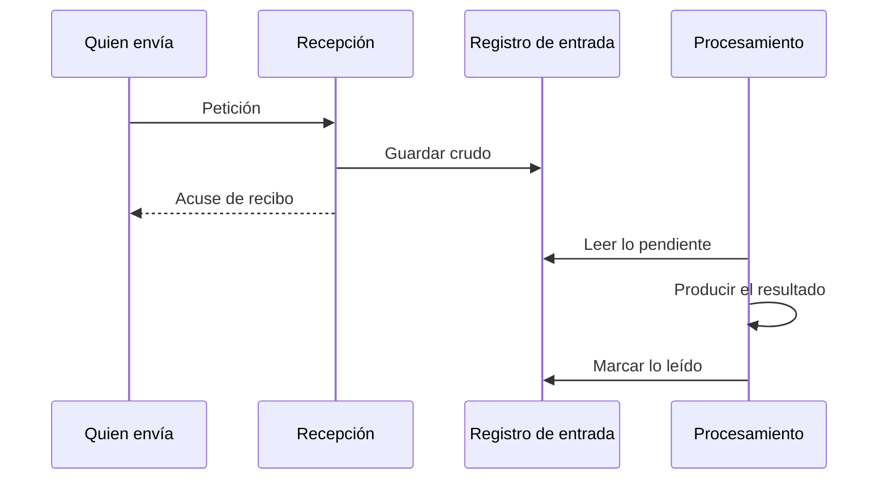

# Dónde se valida lo que entra

Fail-fast en la frontera contra tolerant reader, con un caso real de esta plataforma. Material de
arquitectura: se nombran capas, transacciones y códigos HTTP.

## 1. El dilema en una frase

Cuando llega una petición que no se puede interpretar, hay dos respuestas razonables y opuestas:

- **Rechazarla cuanto antes**, para que la basura no entre al sistema.
- **Aceptarla y decidir después**, para que nada de lo que llegó se pierda.

Las dos son buenas prácticas documentadas. Las dos tienen nombre. Y no se pueden aplicar a la vez
en el mismo punto, porque una exige cortar pronto y la otra exige no cortar.

Elegir mal no produce un error visible. Produce datos que desaparecen sin dejar rastro, que es la
peor clase de defecto: el que no se manifiesta hasta que alguien pregunta por algo que ya no está.

## 2. Fail-fast en la frontera

### Qué es

Validar en el borde del sistema y rechazar de inmediato lo que no cumpla el contrato. La petición
mal formada nunca llega al núcleo.



### De dónde viene

De la observación de que un error es más barato cuanto antes se detecta. Un dato corrupto que
entra al núcleo se propaga: se guarda, se copia, alimenta cálculos, y para cuando alguien nota el
problema hay que rastrear todo lo que tocó. Cortarlo en la puerta cuesta una comprobación.

En arquitectura hexagonal encaja de forma natural: el adaptador de entrada traduce el mundo
exterior al lenguaje del dominio, y traducir incluye rechazar lo intraducible. El dominio no
debería tener que defenderse de entradas absurdas si alguien ya las filtró.

### Qué promete

- **El núcleo se simplifica.** No hay que comprobar en cada método si el dato tiene sentido.
- **El error es preciso.** Se sabe exactamente qué campo falló, porque falló al comprobarlo.
- **La respuesta es inmediata.** Quien envía se entera al momento, no media hora después.

### Qué cuesta

Lo que se rechaza, se pierde. El rechazo ocurre antes de que el sistema haya escrito nada, así que
no queda constancia de qué llegó ni de quién lo mandó. Si el emisor no reintenta, ese dato no
existió nunca.

Y en la práctica el emisor rara vez reintenta: no siempre sabe que falló, y cuando lo sabe, el
error que recibió describe el síntoma técnico, no cómo arreglarlo.

## 3. Tolerant reader

### Qué es

Aceptar lo que llega, guardarlo tal cual, e interpretarlo después. La validación no desaparece: se
mueve más adentro y más tarde.



### De dónde viene

Del principio de robustez de Jon Postel, formulado para TCP en 1980: *"sé conservador en lo que
envías, liberal en lo que aceptas"*. La idea era que un sistema demasiado estricto se rompe cada
vez que el otro extremo cambia un detalle.

Su reformulación moderna es más matizada, y es la que importa aquí: aceptar en silencio es malo,
pero rechazar sin registrar es peor. Aceptar liberalmente no significa fingir que todo está bien,
sino no destruir la evidencia antes de haberla examinado.

### Qué promete

- **Nada se pierde.** Lo que llegó está guardado, aunque no se entienda.
- **Se puede reinterpretar.** Si el problema era la configuración y no el dato, se corrige la
  configuración y se vuelve a leer lo mismo.
- **Se puede diagnosticar.** "Esta fuente lleva tres días mandando basura" es una pregunta
  contestable sólo si la basura se guardó.

### Qué cuesta

- **El núcleo debe defenderse.** Ya no tiene garantía de recibir datos correctos.
- **Aparece un estado intermedio.** Cosas recibidas y no procesadas, que alguien tiene que mirar.
- **La respuesta pierde precisión.** Si se acusa recibo antes de interpretar, no se puede decir en
  la misma respuesta si el dato era bueno.

## 4. Por qué no se pueden tener los dos

Porque la información y el tiempo van en direcciones opuestas:

| | Antes: el momento seguro para guardar | Después: el momento informado para juzgar |
|---|---|---|
| Qué se sabe | Poco: bytes y cabeceras | Mucho: quién es, qué pide, si es válido |
| Qué ha podido fallar | Nada todavía | Cualquier cosa, ya |

Cuanto antes escribes, menos sabes de lo que estás escribiendo. Cuanto más esperas para saber, más
oportunidades ha tenido el sistema de romperse antes de escribir nada.

Todo el diseño consiste en decidir dónde poner esa línea.

## 5. El caso real: el mismo campo, dos comportamientos distintos

Esta plataforma promete, en su documento de diseño, que todo payload que llega se persiste antes
de intentar interpretarlo. Comprobarlo con tres peticiones, cada una rota de una forma distinta,
contra el sistema real, da un resultado que no es uniforme:

| Petición | Respuesta | Registro creado |
|---|---|---|
| `email` sin arroba | `202`, con el registro en la bandeja como rechazado y el motivo por campo | Sí |
| `budget` como texto no numérico | `422` | No |
| Falta un campo obligatorio (`company`, por ejemplo) | `422` | No |

El correo se conserva. El presupuesto mal escrito y el campo ausente, no. La promesa de no perder
nada se cumple para un campo y no para los otros, dentro del mismo endpoint.

### Por qué

Porque conviven dos estrategias distintas para el mismo problema, una por campo:

```python
# infrastructure/adapters/input/api/schemas.py — el esquema de entrada HTTP
# V1: no format validation here on purpose. It used to duplicate EmailAddress
# with a looser rule and produce a 422 that discarded the payload before
# anything was persisted — a malformed email now reaches the domain, which
# rejects it while keeping the record in the tray.
email: Optional[str] = None
...
budget: float
company: str
```

El correo llega al borde sin ningún tipo que lo pueda rechazar: cualquier cadena de texto, o
ninguna, pasa el esquema. Quien lo rechaza es el dominio, ya dentro del servicio que tiene la
instrucción de guardar el payload primero. El presupuesto y el resto de campos obligatorios siguen
declarados con un tipo estricto en ese mismo esquema, así que el framework los valida **antes** de
llamar a la función del endpoint: si no encajan, la petición muere ahí, con un `422`, y el
servicio —que es quien guarda el payload— ni siquiera llega a ejecutarse.

### El detalle que lo hace peor

Un presupuesto negativo, como `-50`, es un número perfectamente válido para el tipo del esquema:
**atraviesa el borde** y muere en el dominio, que rechaza un presupuesto negativo por su cuenta.
Ese sí deja registro. Un presupuesto que ni siquiera es un número, como `"abc"`, muere en el borde
sin dejar ninguno.

O sea: para el campo `budget`, el sistema conserva el dato cuando el error es sutil y lo pierde
cuando es evidente. El comportamiento no sólo es incompleto, es contraintuitivo — y es exactamente
el mismo patrón que tenía el correo antes de que se le quitara la validación de forma en el borde.

La diferencia entre los dos campos no es casualidad ni descuido puntual: es que el correo tiene un
único campo con una única forma de estar mal, y se pudo soltar su comprobación de tipo sin
consecuencias. Presupuesto, nombre, apellidos, empresa y sector no admiten ese mismo truco sin
más, porque dejar de tipar el esquema entero significaría que ya no hay ningún esquema fijo contra
el que validar — que es precisamente lo que discute
[La definición del lead](../roadmap/definicion-del-lead.md).

## 6. Cómo se manifiesta la tensión: los tres cabos

Mover el guardado hacia fuera —a la capa de transporte, para que ocurra antes de que nada pueda
fallar— parece la solución obvia. Intentarlo tropieza con tres obstáculos, y ninguno es un
problema de implementación: los tres son la misma tensión vista desde tres sitios.

### 6.1 El diagnóstico por campo

Para que alguien corrija un dato, hay que decirle qué campo está mal. Pero el dominio no habla de
campos de formulario: habla de objetos de valor. Lanza un código de error, no un nombre de campo.

Alguien tiene que traducir uno en otro, y ese alguien necesita conocer las dos cosas. Si el
guardado se hace en el transporte, el transporte ya no tiene esa traducción a mano.

> Cuanto más fuera escribes, menos entiendes lo que escribes.

### 6.2 La identidad de quien envía

Un registro pertenece a una organización. La organización se deduce de la credencial, y la
credencial se comprueba dentro del ciclo que se quería envolver.

En el instante más seguro para escribir —antes de que nada haya corrido— todavía no se sabe de
quién es lo que se escribe.

> Cuanto antes escribes, menos sabes de quién es.

### 6.3 La procedencia

Un registro apunta a la fuente por la que entró, y esa fuente es una fila en la base de datos que
hay que buscar. Consultarla desde el transporte significa que el transporte deja de ser
transporte: empieza a conocer el modelo de negocio.

> Escribir pronto obliga a saber de negocio pronto.

### Lo que los tres comparten

Los tres dicen lo mismo: empujar el guardado hacia fuera lo hace más seguro y más ignorante. Cada
metro que gana en robustez lo pierde en contexto.

Y ahí es donde conviene sospechar del planteamiento. Cuando tres obstáculos distintos resultan ser
el mismo obstáculo, normalmente la pregunta está mal formulada.

## 7. La inversión que disuelve el dilema

El planteamiento que genera los tres cabos es éste:

```
petición  ──►  el servicio procesa  ──►  el servicio escribe qué pasó
```

Con esa forma no hay salida buena. Si escribe el servicio, el registro depende de que el servicio
llegue a ejecutarse. Si escribe el transporte, el transporte necesita saber de negocio.

Esta plataforma resuelve el dilema cambiando la forma, no afinándola:



El cambio parece cosmético y lo cambia todo: **el servicio deja de escribir en el registro y pasa
a leer de él.** El registro deja de ser la bitácora de lo que hizo el servicio y pasa a ser la
cola de trabajo que el servicio consume. Recepción y procesamiento son, por construcción, dos
transacciones distintas: la segunda puede fallar sin deshacer la primera.

### Por qué los tres cabos desaparecen

| Cabo | Por qué deja de existir |
|---|---|
| **Diagnóstico por campo** | Lo escribe el procesamiento, que ya tiene el resultado estructurado. No hay que reconstruirlo desde una respuesta HTTP |
| **Identidad** | La recepción responde después de autenticar, no antes |
| **Procedencia** | La resuelve el procesamiento, que es donde vive el conocimiento de negocio |

No se resuelven mediante un truco: desaparecen porque la pregunta que los generaba ya no se hace.

### La señal que lo confirma

Un registro que sólo se escribe y nunca se consulta no está participando en el proceso: es un
efecto colateral. En esta plataforma, el servicio de procesamiento lee los registros pendientes
para resolverlos —leerlo es precisamente su función—, que es la comprobación de que el modelo
quedó del lado correcto de la inversión.

## 8. Cómo lo resuelve la industria

Ninguno de estos patrones es nuevo, y todos separan "llegó" de "se entendió":

| Patrón | Dónde vive | Qué garantiza |
|---|---|---|
| **Transactional Inbox** | Microservicios, mensajería | Lo entrante se persiste en su propia transacción; se procesa después. Si el procesador cae, el mensaje sigue ahí |
| **Dead Letter Queue** | Kafka, SQS, RabbitMQ | Lo que no se pudo procesar se aparta con el original intacto, para reintentarlo |
| **Medallion** (bronze/silver/gold) | Ingeniería de datos | Lo crudo aterriza sin validar. Validar y normalizar ocurre al pasar de nivel. Reprocesar es releer el nivel de abajo |
| **Staging table** | ETL clásico, el más antiguo | Cargar sin restricciones, transformar después |
| **Event Sourcing** | Diseño dirigido por el dominio | El evento crudo es inmutable y es la verdad; el estado es una proyección derivada |

Ninguno valida en el punto de recepción. Todos guardan lo crudo primero.

Y una práctica reveladora: las plataformas que envían notificaciones automáticas suelen exigir a
quien las recibe que acuse recibo rápido y procese después. Están imponiendo tolerant reader por
contrato, precisamente para que la recepción no pueda fallar.

### Por qué la industria llegó ahí

No por elegancia. Los patrones de reproceso existen porque se perdieron datos primero. El
principio de robustez de Postel se reformuló porque aceptar en silencio causaba problemas, y las
colas de mensajes muertos se inventaron porque descartar lo que no encajaba salía caro.

## 9. La raíz: dos transacciones, no una

Hay una propiedad por debajo de todo lo anterior, y conviene nombrarla porque explica por qué el
conflicto era real y no aparente.

Si quien envía un dato esperase, en la misma petición, a que se guarde, se puntúe, se enrute y se
asigne, recepción y procesamiento compartirían transacción. Y compartir transacción significa que
el rollback de uno se lleva al otro: aunque el guardado fuera la primera línea del servicio,
cualquier fallo posterior dentro del mismo bloque lo desharía. El dato se escribiría y se borraría
sin que nadie lo pidiera.

Por eso separar recepción de procesamiento no es, ante todo, una optimización de rendimiento:

> Es la frontera que hace imposible que un fallo al procesar destruya la constancia de haber
> recibido, porque son dos transacciones distintas por construcción.

Esta plataforma consigue esa propiedad sin un proceso separado ni una cola de mensajes real: el
procesamiento corre en la misma petición HTTP, justo después de confirmar la recepción, pero en su
propio bloque transaccional. La propiedad que importa —que un fallo de una fase no borre la otra—
no depende de que el procesamiento sea asíncrono, depende de que sea **otra transacción**. Un
trabajador de fondo separado seguiría siendo una mejora real, pero de capacidad, no de esta
garantía: está recogido en la [hoja de ruta](../roadmap/index.md).

## 10. Qué llevarse

**El dilema no se resuelve eligiendo bando.** Fail-fast y tolerant reader no son opciones rivales
en el mismo punto: son la misma función colocada en momentos distintos. La pregunta no es cuál
aplicar, sino dónde está la línea entre recibir y juzgar.

**Validar dos veces lo mismo en capas distintas es peor que validar una.** No suma seguridad: la
comprobación de fuera decide el destino y la de dentro nunca opina. Y si la de fuera es más laxa
para un campo que para otro, el sistema se comporta de forma contraintuitiva —conserva lo
sutilmente roto en un campo y pierde lo evidente en otro—.

**Un registro que sólo se escribe y nunca se lee es una señal.** Significa que no participa en el
proceso, y casi siempre que está en la capa equivocada.

**Cuando varios obstáculos distintos resultan ser el mismo, la pregunta está mal formulada.** Los
tres cabos parecían problemas independientes y eran una sola tensión. Rediseñar la pregunta fue
más barato que resolver los tres.

**Guardar el dato crudo, sin normalizar, es lo que hace posible todo lo demás.** Reinterpretar,
reprocesar, diagnosticar una fuente que cambió de formato: nada de eso es posible si al guardar ya
se transformó. La forma cruda no es pereza, es la única versión que no asume que la interpretación
de hoy es correcta.

## Para discutir en clase

1. El correo y el presupuesto resuelven el mismo problema de dos formas opuestas dentro del mismo
   endpoint. **¿Es un estado de transición razonable, o una inconsistencia que hay que resolver ya?**
   ¿Qué pasaría si se aplicara a todos los campos el mismo tratamiento que hoy tiene el correo?

2. Un correo o un presupuesto rotos de forma evidente pasan varias pruebas automáticas sobre
   entrada y almacenamiento. Ninguna verifica qué le llega a quien envió el dato. **¿Qué dice eso
   sobre medir la calidad de unas pruebas por su cantidad?**

3. Si validar en el borde destruye información, **¿por qué los frameworks web lo hacen por
   defecto?** ¿En qué clase de sistema es la decisión correcta?

4. La inversión —que el servicio lea del registro en vez de escribir en él— no cambia ninguna
   funcionalidad visible desde la interfaz. **¿Cómo se justifica un cambio así ante alguien que
   sólo mira la pantalla?**

5. Todos los patrones del apartado 8 nacieron después de que alguien perdiera datos. **¿Qué tienen
   en común los problemas que sólo se aprenden pagándolos?**
